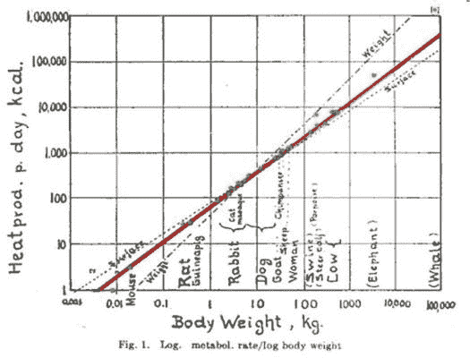
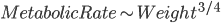
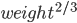
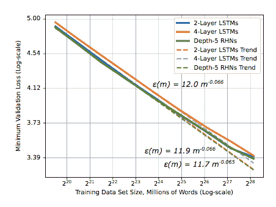
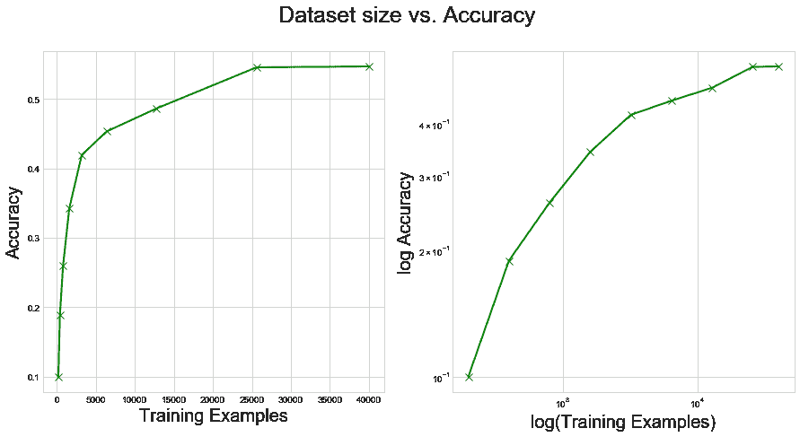
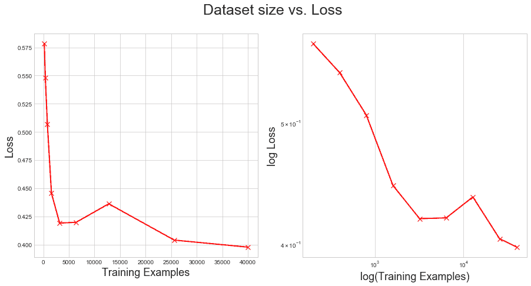
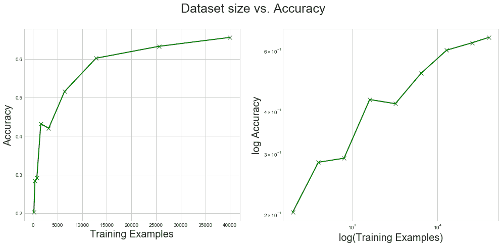
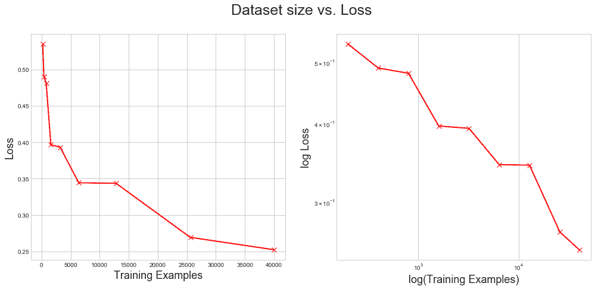

# 预测深度学习模型的性能

> 原文：<https://towardsdatascience.com/predicting-the-performance-of-deep-learning-models-9cb50cf0b62a?source=collection_archive---------12----------------------->

## 幂律标度解释了模型的性能如何随着我们输入更多的数据而改变

众所周知，深度学习最近的成功在很大程度上依赖于大量数据的可用性。视觉是第一个实现数字图书馆承诺的领域，这可能是因为大型数据集的可用性，如 [ImageNet](http://www.image-net.org) 。最近 RL 的[模拟器的激增进一步说明，随着我们进一步将这些技术应用于现实世界的问题，数据稀缺很快成为瓶颈。](https://blogs.unity3d.com/en/2017/09/19/introducing-unity-machine-learning-agents/)

## 但是多少数据才够呢？

在商业环境中，这个问题经常出现。当时间和金钱岌岌可危时，能够对模型架构的改进如何与简单地收集更多数据相权衡做出一些具体的陈述将是有用的。我们应该付钱给一个工程师团队 6 个月来完善我们的模型，还是应该付钱给一个众包助手团队 6 个月来整理我们需要的数据？

我们无法轻松回答这个问题的事实反映了深度学习作为一个领域的不成熟，这一缺点导致阿里·拉希米在[他的 2018 年 NIPS talk](https://www.youtube.com/watch?v=ORHFOnaEzPc) 中宣布‘机器学习已经成为炼金术’(他至少在某种意义上是错的；炼金术从未让任何人赚到钱，而深度学习却让一些人变得非常富有。Yann LeCunn 广为宣传的《脸书邮报》的回应发出了挑战:“如果你不满意我们对你日常使用的方法的理解，那就改正它”。

Ali Rahimi putting the cat amongst the pigeons by suggesting that deep learning is ‘alchemy’

来自百度的一篇名为[“深度学习规模是可预测的，从经验上来看”](https://arxiv.org/abs/1712.00409)的论文在一定程度上回答了这一挑战。如题所示，他们对这个问题的答案是经验的，而不是理论的。这篇论文附有一篇[精彩的博文](http://research.baidu.com/deep-learning-scaling-predictable-empirically/)，我想让你参考这篇博文，以获得关于这些发现的更详细的讨论，我将在这里总结一下。

在我们深入研究之前，有一个小小的题外话:对标度律的研究已经让生物学家着迷了很长时间。这张图来自 Max Kleiber 于 1947 年绘制的图，显示了动物的新陈代谢率(每天产生的热量)与该动物的体重成对数比例关系(更多细节见下文)。

事实上，它似乎可以扩展为

这就是为什么红线比标有*表面的线更陡的原因*

但是比标有*重量*的要浅。有趣的是，没有人真正知道为什么这个定律成立，尽管它看起来非常强大。

回到百度和人工智能的世界，70 年后我们正在制作类似的情节:

从本质上来说，论文记录了数据的增加导致测试集损失的减少，具有相同的**幂律**关系，当在双对数标度上绘制时，最终为一条直线。有趣的是，这种关系的指数——线性标度上直线的斜率——对于你手头的任何一个架构来说都差不多。因此*数据集本身*定义了这个指数:模型仅仅改变了截距。为了强调这一点:**在给定数据集**的情况下，添加更多数据的效果对于*任何模型*本质上都是一样的。这太不寻常了。

他们没有为这篇论文提供任何代码，所以我在 PyTorch 中拼凑了一些实验来探索他们的结论。

# **代码**

你可以在这里下载完整的 Jupyter 笔记本[或者继续阅读一些要点。](https://github.com/archydeberker/predictable-ml/blob/master/Predicting_CIFAR_PyTorch.ipynb)

我在 PyTorch 教程中提供的代码基础上构建了一个简单的 CNN 来测试 CIFAR 数据集(一个包含 10 个类的小型图像分类任务)。我用超参数字典配置它，因为最佳超参数对数据集大小非常敏感——正如我们将看到的，这对复制百度结果非常重要。

我将训练数据分为训练集和验证集，并按照论文中的建议对训练集进行子采样。

然后，我训练了 9 个模型，每个数据集大小一个，停止条件是通过连续 3 个时期增加验证误差来定义的(原始论文在验证的细节上有点模糊)。然后，我根据测试集对它们进行了评估。

如您所料，测试集的准确性随着训练集大小的增加而增加。此外，它看起来有点像权力法则。

损耗以类似的方式减少。

然而，无论是准确度还是损失的对数图看起来都不如百度论文中的那张可爱。实际上，它们各自都表现出某种模糊的对数形式，暗示着我们之间存在着次幂律关系。

原因很明显:我没有像他们那样在每个训练集上进行详尽的超参数搜索。因此，我们没有找到每个数据集大小的最佳模型。最有可能的是，我们的模型缺乏完全捕捉更大数据集的能力，因此我们没有充分利用数据。

## **添加超参数调谐**

你会记得，在模型定义中，我们使用一个超参数字典来设置层的大小，这样就可以很容易地通过超参数调整来改变网络的形状。因此，对我们来说，实现一些随机搜索相对简单:

我们现在可以针对每个数据集大小重复训练循环，随机采样参数:

并使用它为每个数据集大小训练一组网络，保留在验证集上表现最好的网络。我是在没有 GPU 的 MacBook 上执行这一调优的，所以我限制自己对每个数据集大小进行 10 次搜索，希望我可以证明这一点，而无需请求 AWS 实例。

然后，我们可以再次寻找我们的幂律，果然，它们看起来更整洁了:

没有克莱伯的好，但也不错。

## 结论

原始论文在各种任务中测试了各种模型——这里执行的最接近的一个是带有 ResNets 的 ImageNet。令人高兴的是，这些结果很容易在不同的网络、不同的数据集上复制。

在他们的讨论中，作者指出:

> 我们还没有找到影响幂律指数的因素。随着数据集规模的增加，为了打破幂定律，模型需要用越来越少的数据学习更多的概念。

这正是你在人类身上看到的那种伸缩；你知道的越多，就越容易获得新知识。

我之前写过关于量化超智能进程的[困难](http://deberker.com/archy/how-intelligent-are-our-machines/)。似乎超越幂律指数的模型的出现——随着它们的学习，使**的数据效率更高——**可能是这条道路上一个重要的经验主义里程碑。

*原载于 2019 年 4 月 14 日*[*deberker.com*](http://deberker.com/archy/predicting-the-performance-of-deep-learning-models/?preview=true)*。*