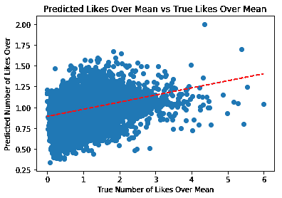

# 预测 Instagram 帖子的受欢迎程度

> 原文：<https://towardsdatascience.com/predicting-the-popularity-of-instagram-posts-deeb7dc27a8f?source=collection_archive---------5----------------------->

## 使用混合输入神经网络实现对 Instagram 受欢迎程度的巨大预测。

在本文中，我们将讨论我们试图预测 Instagram 帖子受欢迎程度的方法和结果。首先，我们将描述我们的数据收集方法以及数据本身。然后，我们将描述我们用于图像和自然语言处理的技术。在这一步之后，我们使用一个 XGBoost 回归模型来获得一个基准均方根误差分数，我们将努力提高这个分数。最后一步，将使用混合输入神经网络，接受分类/数字数据和图像数据。

本文讨论的主题的所有代码都可以在这里找到:[https://github.com/GuiZamorano/Instagram_Like_Predictor](https://github.com/GuiZamorano/Instagram_Like_Predictor)

# **动机**

在现代，趋势和流行很大程度上是由社交媒体驱动的。如今 Instagram 上有超过 10 亿用户。这是一个大规模的市场，有潜力进行优化，以增加知名度，收视率，甚至收入。我们希望通过创建一个项目来利用这个市场，该项目可以确定关键变量，以增加一个帖子的点赞数与用户在一个帖子上获得的平均点赞数的比率。使用这些功能，我们希望能够对这一比率进行估计，以便优化帖子，为高知名度影响者和日常用户收集最多的曝光率。

# **收集数据**

## **收集 Instagram 用户名:**

为了预测 Instagram 帖子的受欢迎程度，我们首先需要大量数据来训练我们的模型。我们的第一项工作是收集 Instagram 用户名，我们可以使用这些用户名来收集帖子数据。幸运的是，我们找到了一个网站，上面列出了 Instagram 影响者的前 1000 名(不一定是拥有最多粉丝的人)。网站可以在这里找到:[https://hypeauditor.com/en/top-instagram/.](https://hypeauditor.com/en/top-instagram/.)

使用 urllib 和 BeautifulSoup Python 包，我们浏览了该网站的页面，收集了 1000 个 Instagram 用户名。然而，我们仍然需要更多的数据，所以通过查看涉及 Instagram 用户的其他项目，我们能够将我们的列表增加到总共 1897 个用户名。所有这些用户都有各种各样的人气和追随者。

## **刮 Instagram 帖子:**

现在我们已经有了一个很长的用户名列表，我们的下一个挑战是从他们的帖子中收集数据。我们的第一个想法是使用脸书的 Instagram Graph API。通过向这个 API 发出请求，您可以从一个概要文件和一篇文章中收集大部分信息。不幸的是，Instagram 的 Graph API 限制一年比一年严格。目前的限制是每小时 200 个请求。这种限制使得利用 Instagram Graph API 变得非常困难和乏味。因此，通过研究，我们创造了自己的铲运机，其工作原理如下:

1.  向[https://www.instagram.com/](https://www.instagram.com/)+{用户名}发出 URL 请求。
2.  通过将响应转换成 JSON 对象，从响应中提取 Javascript 元数据。
3.  使用 urllib 下载用户的个人资料图像和每个帖子图像。

使用这个直接调用用户 Instagram 页面的 scraper，可以为您提供每个用户的 12 个最新帖子。我们试图使用 Selenium 来加载整个页面，但是这样做只是将可视信息附加到页面的 HTML 中，而不是我们需要的元数据。因此，我们决定坚持每个用户(最多)发 12 篇帖子，并从我们的数据集中删除了最近的帖子，因为我们认为这可能是一个不准确的流行度显示，因为它是最近的。现在我们有了 1897 个 JSON 对象和一个包含所有图片的文件夹，我们准备构建一个数据集。

Figure 1: JSON of user profile data

Figure 2: Last key-value pair of JSON is array of posts

# **数据探索与可视化**

在搜集现成可用的特性后，我们的第一个目标是看看我们是否能找到它们之间的任何关系。这包括寻找预期或假设以及意外的关系。除了原始刮刀数据之外，这种探索还包括我们自己生成的一些基本特征，稍后将更详细地讨论。我们首先探索了每个功能与我们最终试图预测的功能的相关性:帖子的点赞数除以帖子帐户的平均点赞数(number_of_likes_over_mean)。我们专注于与 number_of_likes_over_mean 最相关(或反向相关)的特征，以便进一步研究。下面描述了这些特征之间的相互关系。

**Figure 3:** Top features correlated with number_of_likes_over_mean

出于可解释的原因，一些特性与其他特性有相当大的相关性，例如 hr_of_day 或 hour buckets(例如(16，20)，这意味着下午 4 点到 8 点)和 hr_sin，因为它们都处理小时间隔。下面列出了最重要的相关性，尽管相关性非常小。

**Figure 4:** Some of the most significant feature correlations

我们发现的一些关系是，在较晚清醒时间的帖子比深夜或清晨的帖子做得好一点。如图 5 所示，周中(周二、周三、周四)的帖子比一般的帖子稍差，我们发现视频帖子和带有禁用评论的帖子也是如此。

**Figure 5:** Each day, one-hot-encoded vs. number_of_likes_over_mean

我们还将我们的点赞数除以用户的平均点赞数可视化为分布图和散点图。散点图具有大约 1.6 的偏斜度和大约 6 的峰度。它有一个比正态曲线更大的倾向于分布右侧的尾部。

Figure 6: Distribution of likes divided by mean

Figure 6: Scatter plot of likes divided by mean

# **特征生成**

在熟悉了我们的数据集之后，我们决定生成一些我们认为在预测给定帖子的表现时有用的特征。这些特征包括从帖子图像本身提取的特征，以更有用的方式描述原始文本数据(如标题)的 NLP 特征，以及可能有助于帖子成功的更一般的特征，如一天中的时间和一周中的日期。生成这些特征后，我们希望在开始训练最终模型时利用它们，并通过比较具有和不具有这些特征的基本回归模型的性能来确定它们的重要性。

## **一般特征:**

从 Instagram 抓取数据后，我们有了大量的元数据，包括帐户关注者和关注，企业/类别信息，以及时间和日期信息。虽然有些元数据与账户相关，而不仅仅是帖子，但我们认为包含它将有助于为帖子提供上下文信息，并帮助我们获得更多特定于帖子本身的功能。

因此，除了从 Instagram 收集数据，我们还执行了一些基本的特征工程，以在进行更复杂的特征生成之前扩充数据集。我们认为用下面的一些内容来补充搜集到的数据可能是有用的。衡量一个账户的“活跃程度”可能代表一篇帖子的受欢迎程度，因此我们计算了两次帖子之间的时间，并将其作为一个特征添加到数据集。此外，我们计算了时间正弦和余弦特征，以编码时间的循环性质(即 11:55pm 应该接近 12:05am，但 23 小时离 00 小时非常远)。我们还将帖子分成时间段，例如从午夜到凌晨 4 点，凌晨 4 点到 8 点，等等，因为我们认为特定的每日时间段(不仅仅是时间)将有助于帖子的受欢迎程度。最后，因为在不了解用户的情况下很难衡量一篇帖子的点赞数，所以我们计算了相关账户的平均评论数和平均点赞数，为预测一篇帖子的相对受欢迎程度做准备。接下来，我们来看看更复杂的特征，比如图像和文本中的特征。

## **图像特征:**

我们有很多关于图像以及如何对待它们的想法。我们最初的想法是，有人类主题的帖子比没有人类主题的帖子表现得更好。此外，我们假设有许多人在其中的图像，如团体照片，不会像只有一个清晰主题的图像那样获得很多喜欢。我们还想测试图片中的微笑是否会影响帖子的赞数。因此，我们决定创建一个模型来确定给定图像中的脸的数量和微笑的数量。该模型将应用于我们的数据集以生成这些特征。

经过一些初步的研究，我们决定利用 OpenCV 现有的面部识别分类器来完成这项任务。使用我们下载的图像，我们能够从 OpenCV 的文档中找到的 XML 文件中加载预先存在的面部和微笑检测器，这些文件是我们用来生成的。包含要添加到现有数据集中的新生成要素的 csv 文件。

## **自然语言处理功能:**

数据集中有许多利用文本的不同要素，包括传记、标签、位置和标题。出于我们项目的目的，我们选择关注标题，因为我们正在分析独立的帖子，并希望尽可能多地使用关于帖子的信息，而不是海报。

NLP 的第一步是清理数据集。我们专注于单词本身，因此必须删除数字、标点符号、表情符号和空值。因为我们的数据集包括来自世界各地的热门 Instagram 用户，我们面临着处理的挑战，因为有太多不同的语言。我们决定使用谷歌翻译功能调用，以便将所有的文本翻译成英语，因为为了处理这似乎是最好的。将字幕翻译成英语后，我们删除了停用词，以消除诸如“the”或“is”之类的词，从而给其他词更多的权重。

在我们清理数据集之后，第一次分析是在文本情感上进行的。使用 TextBlob API，我们传递每个标题并接收一个情感分数。高达+1 的正分数表示正面单词，高达-1 的负分数表示负面单词。除了这个数字特征，我们把原始语言变成了一个分类变量，以观察不同的语言在喜欢率上是否有不同的波动。

我们尝试的另一种 NLP 方法利用了词袋。在这种方法中，我们创建了一个给定标题中所有单词的计数向量，并在所有标题中找到了 100 个最常用的单词。这些单词然后被转换成二元特征，1 表示它在字幕中，0 表示它不在字幕中。这种方法在很大程度上依赖于标题完全是英文的，因为拥有多种语言会产生不同的热门词，这些词在所有标题中并不常见。

现在我们已经生成了所有的特性，我们准备开始制作一个初始模型。

# **回归分析**

我们建立模型的第一步是尝试各种回归模型，包括喜欢和评论的数量。显然，这些信息是我们试图预测的，但看看回归模型对这些数据的处理效果会给我们一个基准分数。我们最好的模型是 XGBoost 和梯度推进，所以我们决定坚持使用这些回归模型。他们获得了大约 0.032–0.034 的测试均方误差，即大约 0.18 的均方根误差。

Figure 7: Mean squared error scores for models already including the information we are attempting to predict

这给了我们一个目标，那就是获得比 0.18 均方根测试误差更好的分数。

现在，我们删除了图片发布前不可用的功能，如赞数和评论数，以继续测试我们的实际预测模型。均方误差急剧上升到大约 0.26–0.27，这是大约 0.52 的均方根误差。

Figure 8: Mean squared error scores for true model

我们的下一步是看看哪些生成的特性在 XGBoost 上工作得最好。我们决定在模型上尝试的生成特征是脸的数量、微笑的数量和自然语言特征。XGBoost 在添加了面数特征的原始特征下表现最佳。均方根误差为 0.51。

通过这种回归分析，我们能够确定使用具有多个面的原始特征通过 XGBoost 和梯度增强产生最佳预测。然而，即使在校准了我们的 XGBoost 回归器之后，这些新特性还是略微改进了模型。因此，我们的最后一步是用神经网络测试新功能。

Figure 9: Mean squared error scores after adding image and natural language features.

# 神经网络

因为 XGBoost 的表现远不如我们的目标 RMSE 分数 0.18 左右，所以我们决定尝试使用神经网络来解决我们的问题。这将允许我们直接使用我们最初下载的个人资料和帖子图片，并确定它们是否能在帖子的受欢迎程度中发挥作用。有趣的是，我们发现大多数神经网络都是用于分类问题，而不是回归。尽管如此，我们决定继续使用神经网络进行回归，即预测连续值。

我们的第一步是在神经网络中只使用分类数据和数值数据，看看它与 XGBoost 结果相比如何。接下来，我们在图像上使用卷积神经网络，包括侧面图像和背面图像。最后，我们将两者结合成一个双分支神经网络。所有的训练都是使用支持免费 GPU 的 Google Colab 完成的。

## **1。多层感知器(MLP):**

多层感知器是一种深度的人工神经网络，由输入层、输出层和至少一个执行计算的隐藏层组成。与线性回归相比，隐藏层和激活函数为我们提供了一个更强大的模型。我们做的第一件事是使用 scikit-learn 的 MinMaxScaler 将我们的特征缩放到范围[0，1]。我们还将产出目标调整为[0，1]，以缩小我们的产出预测范围。这大大改善了神经网络的结果。这是因为神经网络通过添加乘以学习速率的梯度向量来学习，并且如果特征的分布范围都不同，则该学习速率可能过度补偿(或补偿不足)其校正。我们使用的简单 MLP 架构如下所示，并为最终的密集层使用了线性激活函数。

Figure 10: MLP architecture

**结果**:这种 MLP 架构比以前的任何方法都要好得多！RMSE 比 XGBoost 低得多，我们能够达到并远远超过我们的基准分数 0.18。使用 Adam 优化器训练 30 个时期后的结果如下所述。

**平均绝对百分比差异:55.40%**

**均方根误差:0.0807**

Figure 11: Line of best fit by MLP model

## 2.卷积神经网络(CNN):

## 处理图像:

现在使用 CNN 让我们有能力把所有这些千兆字节的下载图像好好利用起来。然而，这确实带来了一些问题。

**图像大小**:下载的图像在大小上没有标准化，大多数对于理想的计算时间来说太大了。通过分析我们的图像形状，似乎大多数都在 960 像素 x 1200px 像素左右。理想情况下，我们会调整图像的大小以保持它们的纵横比，但这样它们的大小就会不同。我们的解决方案是将图像尺寸调整为 100 像素 x 128px 像素。这似乎比正方形图像更好地保持了图像特征，因为大多数图像都包含人脸或身体。此外，它不需要 CNN 学习不必要的信息，就像填充的情况一样。

两幅图像:我们处理的下一个问题是决定如何在 CNN 中处理我们的图像。每个数据条目由两张图片组成，一张个人资料图片和一张帖子图片。我们考虑了处理这个问题的两种选择。

1.  使用两个 CNN，一个用于帖子图片，一个用于个人资料图片，并使用帖子的受欢迎程度作为每个图片的标签
2.  创建一个并排的个人资料图像和文章图像的新图像。

第一个选择似乎是个糟糕的选择。首先，我们将有一个帖子图像和一个个人资料图像，它们共享同一个标签。第二，我们将有一个不同的标签为每一个单一的个人资料图片，因为受欢迎程度只有不同的职位。因此，这种选择可能会让 CNN 更难通过图片了解受欢迎程度。

出于许多原因，选项二似乎是理想的。人气的一大指标是发帖的人。想象一下在一家高级餐厅里的一盘食物的完全相同的图像。一个是我贴的，一个是金·卡戴珊贴的。你觉得哪个会得到更多的喜欢？因此，并排组合个人资料图像和帖子图像可以是帖子受欢迎程度的重要指标。此外，这允许 CNN 同时从个人资料和发布图像中学习特征。

Figure 12: Final image example input into CNN

## CNN 架构:

构建 CNN 架构来自经验和数小时的修改。考虑到您试图解决的问题，没有黑盒方法可以为您的数据获得最佳架构。因此，我们花了很长时间测试不同的架构，包括不同数量的卷积层、最大池层和全连接层。我们还试验了批量标准化和退出。最后，我们决定了回归问题的最佳架构，如下所示。

Figure 13: CNN architecture

该架构是一个深度网络，由四个卷积层、四个最大池层和五个全连接层组成。使用这个架构，我们尝试了两种预测流行度的方法。

**梯度增强 CNN** :

最初，我们试图在输出之前获取 CNN 的最终特征层，并使用这些特征来训练我们的 XGBoost 模型。我们推断，由于这将包括图像特征以及我们的分类和数字数据，这将显著改善我们的结果。我们在“4”节点层和“25”节点层都尝试了这种方法，但没有发现任何明显的改进。RMSE 仍然在 0.52 左右，比我们在 MLP 的结果差得多。

**影像回归**:

回想一下，CNN 主要用于分类。为了使用 CNN 进行回归，只需用单个节点(具有线性激活函数)替换完全连接的 softmax 层。此外，确保您的误差度量是针对连续值的。例如，我们使用均方根误差。我们这样做了，并传递了并排的图像，以获得每个帖子的预测流行度值。结果优于 XGBoost，但次于 MLP。结果总结如下。正如你可以告诉线的最佳拟合恶化了很多相比，MLP。

**平均绝对百分比差异:66.78%**

**均方根误差:0.0850**

Figure 14: CNN results

## **3。二分支神经网络:混合数据:**

我们最终的想法是将这两个神经网络结合在一起。这是一个混合数据的机器学习问题，我们的模型必须能够使用我们所有的数据(图像、分类、数字)来进行预测。混合数据仍然是机器学习研究的一个非常开放的领域，所以我们非常渴望尝试一下。我们一直将 Keras 用于我们的神经网络，Keras 模型可以处理多种输入。我们已经有了上面显示的两个模型，所以下一步是将它们组合成一个双分支神经网络。每个分支机构将接受每种类型数据的培训。在此之后，分支将被连接起来以进行最终预测。

Figure 15: How to combine mixed inputs

为了创建一个多输入神经网络，我们首先需要创建两个分支。每个分支将是我们在前两部分描述的神经网络:MLP 和 CNN。但是有一个变化，因为这两个模型将被连接，我们删除了每个模型的最终输出层。我们希望实际的回归最终由多分支神经网络计算，而不是由单个分支计算。最终的架构如下所示:

Figure 16: Mixed Input NN architecture

如您所见，两个分支(每个分支四个神经元)的组合输出是混合数据网络各层的输入。我们添加了另一个由四个神经元组成的密集层，最后在最后一个神经元上进行线性激活，这就是预测的流行度。这产生了误差最小的最佳模型。结果如下所述。

**平均绝对百分比差异:55.22%**

**均方根误差:0.08021**

该模型为我们提供了超过 60%的数据的实际流行度的 0.25 以内的流行度预测。最佳拟合线也显著改善。我们对最终的 RMSE 值 0.08021 非常满意。平均而言，我们的受欢迎度指标下降了 0.08，这是一个非常好的估计值。

Figure 17: Line of best fit of our mixed input model

下面是我们的一些预测。

Figure 18: Predictions of our mixed input model

# **总结与未来工作**

对于这个项目，MLP 和两层神经网络提供了最好的结果。由此产生的 RMSE 明显好于 XGBoost 给出的基准分数，即使它知道一篇帖子上的赞数。通过结合上述所有方法，我们能够实现一个非常好的预测模型。尽管如此，仍有一些途径我们可以进一步探索，但由于时间限制，我们未能这样做。例如，将文本从各种其他语言翻译成英语会产生噪音。通过将我们对帖子的搜索限制在英语帖子，这种噪音可能会减少。我们可以采取的另一个减少数据可变性的措施是排除某些类型的账户，比如最受欢迎的账户。由于数据和特征的这种自然可变性，任何模型都很难准确地学习和预测帖子的受欢迎程度。最后，通过考虑帖子上的标签和提及，我们可以为 NLP 任务生成进一步的功能组合，以查看它们是否增加了帖子收到的赞数的可变性。

*作者:迪伦·布雷、哈桑·楚格泰、努曼·吉拉尼、西蒙·谢、查理·杨和桂·萨莫拉诺*