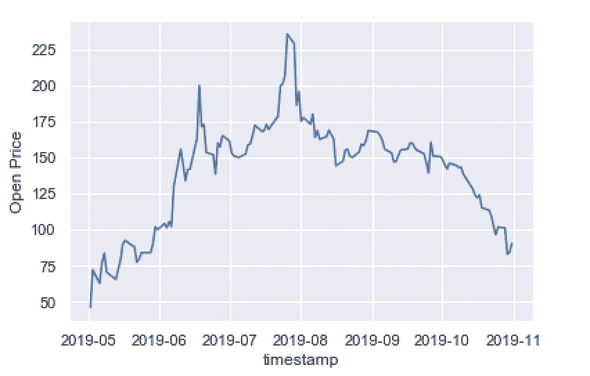

# 用 Python 中的随机森林预测肉类库存价格

> 原文：<https://towardsdatascience.com/predicting-the-price-of-the-beyond-meat-stock-using-random-forest-in-python-ebeae6aa9d49?source=collection_archive---------18----------------------->


Photo by [Pixabay](https://www.pexels.com/@pixabay) on [Pexels](https://www.pexels.com/photo/stock-exchange-board-210607/)

在本帖中，我们将使用随机森林来预测 Beyond Meat 股票的价格。Beyond Meat 是一家植物性肉类替代品生产商，由伊森·布朗于 2009 年在洛杉矶创立。

我们可以做的第一件事是导入必要的库。我们将使用 yahoo finance API、seaborn、matplotlib、pandas、numpy 和 sklearn:

```
import yfinance as yf
import seaborn as sns
import numpy as np
import pandas as pd 
from sklearn.ensemble import RandomForestRegressor
from sklearn.model_selection import train_test_split
import matplotlib.pyplot as plt
```

如果您没有安装用于 yahoo finance API 的 python 包装器，您可以在命令行中键入以下内容:

```
pip install yfinance
```

我们可以从 Yahoo finance 获取过去五个月的“BYND”股票数据，并打印前五行。我们将拉取 2019 年 5 月 5 日至 2019 年 11 月 2 日的数据:

```
data = yf.Ticker('BYND')
df = data.history(period="max",  start="2019-05-01", end="2019-11-02")
print(df.head())
```


我们可以使用 seaborn 来绘制开盘价。我们还使用 matpltlib 来修改 seaborn 图。为了绘制时间序列，我们需要将日期字符串转换为日期时间对象:

```
sns.set()
df[‘timestamp’] = df.index
df[‘timestamp’] = pd.to_datetime(df[‘timestamp’])
sns.lineplot(df[‘timestamp’], df['Open'])
plt.ylabel("Open Price")
```



接下来，我们可以使用每日开盘价和收盘价计算每日回报率，并绘制结果图:

```
df[‘returns’] = (df[‘Close’]-df[‘Open’])/df[‘Open’]
sns.lineplot(df[‘timestamp’], df['returns'])
plt.ylabel("Returns")
```


接下来，我们定义一个变量来指定我们想要预测多远。让我们预测 3 天以后。我们还创建了一个新的预测列，它是向上移动了 3 天的目标变量。这里我们的目标变量是收盘价:

```
forecast_out = 3
df[‘prediction’] = df[[‘Close’]].shift(-forecast_out)
X = np.array(df['Close']).reshape(-1,1)
X = X[:-forecast_out]
y = np.array(df['prediction'])
y = y[:-forecast_out]
```

接下来，我们拆分用于训练和测试的数据，定义一个随机森林对象并训练我们的模型:

```
reg = RandomForestRegressor(n_estimators = 300, max_depth =300, random_state = 42)
X_train, X_test, y_train, y_test = train_test_split(X, y, test_size=0.2, random_state = 7)
reg.fit(X_train, y_train)
print("Performance (R^2): ", reg.score(X_test, y_test))
```


我们的模型 R = 0.84，还不算太差。感谢阅读，机器学习快乐！这篇文章的代码可以在 GitHub 上找到。