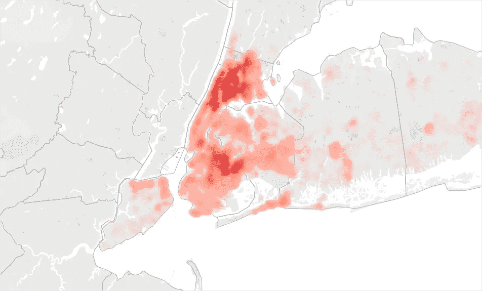

# 预测健康的社会决定因素

> 原文：<https://towardsdatascience.com/predicting-the-social-determinants-of-health-6e1fade435cc?source=collection_archive---------17----------------------->

*数据科学@HF*

[健康的社会决定因素](https://www.healthypeople.gov/2020/about/foundation-health-measures/Determinants-of-Health)——一个人的直接健康状况之外的因素，如就业、居住地和教育水平——至少决定了[20%的健康结果](https://www.kff.org/disparities-policy/issue-brief/beyond-health-care-the-role-of-social-determinants-in-promoting-health-and-health-equity/)。在第一保健，面临与这些决定因素相关的挑战的会员去医院的次数增加了 30%，住院时间延长了 2 天，医疗费用增加了 33%。问题是我们缺乏系统测量它们的数据。如果这些数据随时可用，我们将能够实现将人们与社会和环境服务联系起来的新方法，以帮助治疗、预防和治愈疾病，提高生活质量，并降低总体医疗成本。

作为一家拥有 140 万纽约人的保险公司(八分之一！)，我们的数据科学和人口健康战略围绕着分析临床数据和预测健康行为和结果。会不会是我们遗漏了一些对理解我们的成员至关重要的东西？是的，肯定的。在一个十分之三的家庭生活在联邦贫困线以下的城市(FPL ),只有 1%的会员医疗索赔包含财务压力的指标，这似乎从表面上看是错误的。这就是为什么在你分析性地做任何事情之前，有[先验](https://link.medium.com/9VWgFcznWT)是有好处的。

好消息是机器学习可以有所帮助。人们已经做了大量无人监管的工作来对社区进行分类，并创建风险指数。但是我们有标签数据！真正积极的标签来自那 1%的所谓的 [Z 代码](https://healthitanalytics.com/news/icd-10-allows-non-physician-documentation-of-social-determinants)的声明，并且我们*合理地*确定我们真正的零(基于我们的先验，可能十分之一到三分之一会被误标)。统计学家会退缩，但深度学习对标签噪音是鲁棒的。[单侧标签噪声](https://projecteuclid.org/download/pdfview_1/euclid.ejs/1474373835)略有不同，因为估计真实的类条件分布需要更严格的理论假设(我们将有一个关于这方面的博客！).利用我们对某个成员的所有了解(人口统计、邻里关系、疾病负担、利用率、药物)，我们可以合理地预测哪些成员可能正在与标签集中的这些相同的社会因素进行斗争。我们建立了 10 个模型([每个模型对应一组诊断代码](https://healthitanalytics.com/news/icd-10-allows-non-physician-documentation-of-social-determinants))，并用它对我们的全体会员进行评分。有了这些新知识，我们的人口健康团队、照护管理师和提供者合作伙伴可以更容易地接触到那些可能正在与一个或多个社会因素作斗争的成员，并为他们提供有用的资源，如用于住房的 [PATH](http://www.coalitionforthehomeless.org/resources/prevention-assistance-and-temporary-housing-office-path/) 和用于食品不安全的 [SNAP](https://www.fns.usda.gov/snap/supplemental-nutrition-assistance-program-snap) 。

这些风险评分本身就很有价值，也为进一步分析提供了丰富的新特征集。医疗保险行业还没有想出如何将它们纳入[风险模型](https://www.modernhealthcare.com/article/20180825/NEWS/180829956)中，但这并不能阻止他们使用它们来影响临床结果。在我们的[计划全因再入院](https://www.ncqa.org/hedis/measures/plan-all-cause-readmissions/)模型中，财务和住房压力风险得分是第二重要的变量，仅次于“您过去是否被再入院？”事实上，所有 10 个评分的第一个主成分本身就像一个不错的再入院模型:AUC 为 0.68，Brier 评分为 0.19。我们的目标是将它们用作任何分析中的标准描述性特征，就像您对待年龄或种族一样。

*这是我们已知社会决定地位成员的密度图*

*这里有根据我们的车型分类的所有会员，增加了 10 倍！*

**验证和影响**

作为医疗服务提供者赞助的健康计划，我们很幸运拥有最终的验证数据集:在模型培训期间，数据科学家根本无法获得这些数据。我们有来自[赞助医院](https://healthfirst.org/about/sponsor-hospitals/)的调查数据，试图捕捉挣扎于社会负担中的成员。他们在不知道我们正在建模的情况下进行调查，而我们在不知道他们将进行调查的情况下建立模型。结果:c 统计值为 0.71，Brier 评分为 0.16，这意味着我们是[方向正确的](https://medium.com/lessons-from-mckinsey/making-decisions-under-uncertainty-c1d1dfbb02b2)(你几乎可以听到数据科学家的合唱，“所有的模型都是错误的，有些是有用的”)。

我们与成员进行的每一次临床互动都需要了解社会决定因素。如果我们注意到会员在艰难地支付食物费用(或者即使我们有很好的猜测)，我们可以将他们与他们可能不知道的重要服务联系起来。

随着我们[在更好地理解会员需求这一愿景上取得](https://medium.com/@jrao128/data-driven-decision-making-in-health-care-41baef41cc18)的进展，我们将提高供应商对这些情况的认识，并与更多的赞助商合作；这两者都给了我们更好的标签，从而产生更好的模型。我们一定要这么做。但是，我们也可以利用这里提出的想法立即影响我们的成员。这就是我去上班的原因。