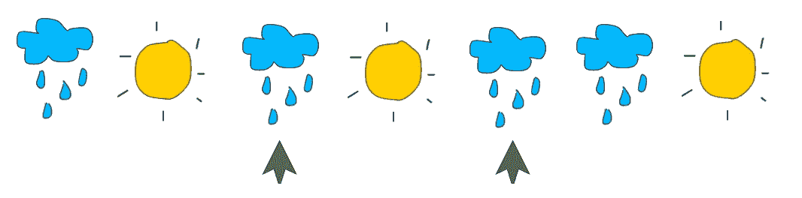
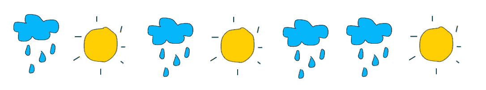
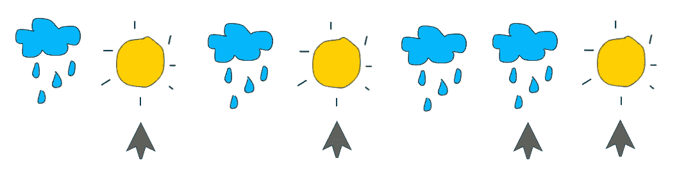
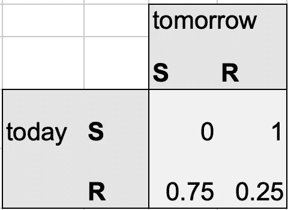
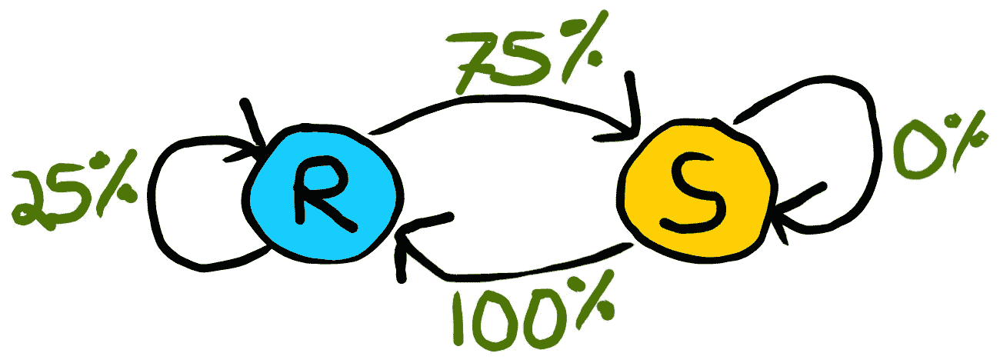
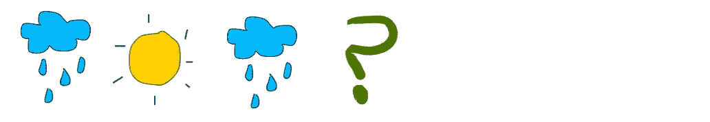
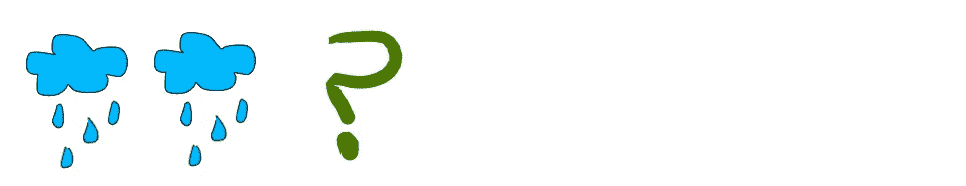
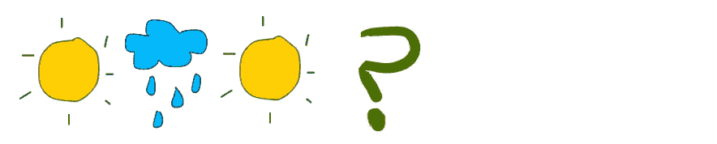

# 用马尔可夫链预测天气

> 原文：<https://towardsdatascience.com/predicting-the-weather-with-markov-chains-a34735f0c4df?source=collection_archive---------10----------------------->

## 基于历史天气数据构建马尔可夫链

在我们的机器学习工具箱中，有从简单到复杂的各种工具。马尔可夫链处于光谱的简单一端。

我们将通过使用马尔可夫链来学习预测明天的天气。

根据[维基百科](https://en.wikipedia.org/wiki/Markov_chain)，

> 马尔可夫链是描述一系列可能事件的随机模型，其中每个事件的概率仅取决于前一个事件达到的状态。

**翻译:**马尔可夫链有有限个可能的状态。每个时间段，它从一个状态跳到另一个状态(或同一个状态)。跳到特定状态的概率只取决于与我们当前状态相关的概率。

当我们在示例的上下文中查看它时，它会更有意义。

# 天气

在我们简化的宇宙中，天气只能有两种可能的状态，“晴天”或“雨天”。

(在马尔可夫链的背景下)问题是，明天**是晴天还是雨天**，取决于今天**是晴天还是雨天**。

我们将从过去的数据中推导出这些概率，并构建一个**转移矩阵**。

我已经生成了 7 天的历史数据来“训练”我们的马尔可夫链。日子是:[雨，太阳，雨，太阳，雨，雨，太阳]

R S R S R R S

现在计算紧接着雨天的晴天的百分比。

3/4 所以 75%。

现在计算紧接着晴天的雨天的百分比。

那是 2/2 所以 100%。

我们将利用这些信息构建我们的转换矩阵，从我们已经获得的信息中推断缺失百分比(雨后= 25%和太阳后= 0%)。

# 跃迁矩阵

我们也可以用图表显示上述信息。

**马尔可夫链**

R = rainy, S = sunny

这张图表说明了一个事实，即概率完全取决于当前状态，而不是昨天或前天的天气。

让我们做一些预测

**例一:**
前 3 天为【雨天、晴天、雨天】。明天下雨的概率有多大？

R, S, R

基于我们之前训练的模型。明天有 75%的机会出太阳，25%的机会下雨。

**例二:**
前 2 天是【雨天，雨天】。

R R

同样，明天有 75%的机会出太阳，25%的机会下雨。

**例三:**
前 3 天都是【晴、雨、晴】。

S R S

明天有 100%的可能下雨。太阳落山后的日子总是下雨…我知道这很悲伤…

记住，我们只考虑当天的天气，然后在转移矩阵中查找天气状态的转移概率。

太简单了？很有可能。

但有时最好的起点是一个简单的模型，它比随机猜测表现得更好。