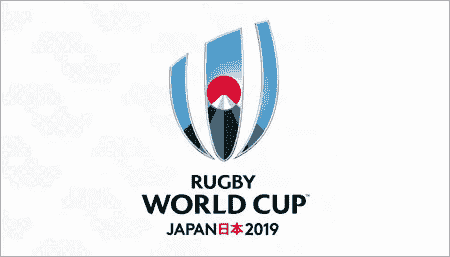
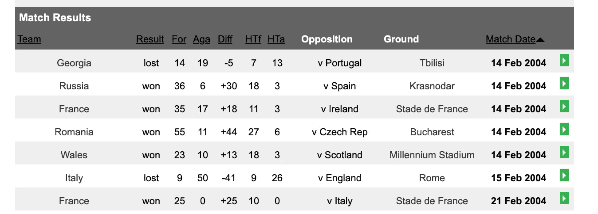
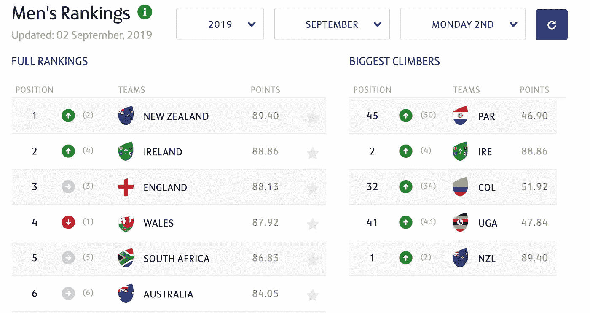
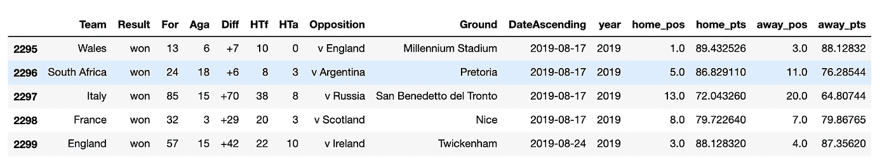
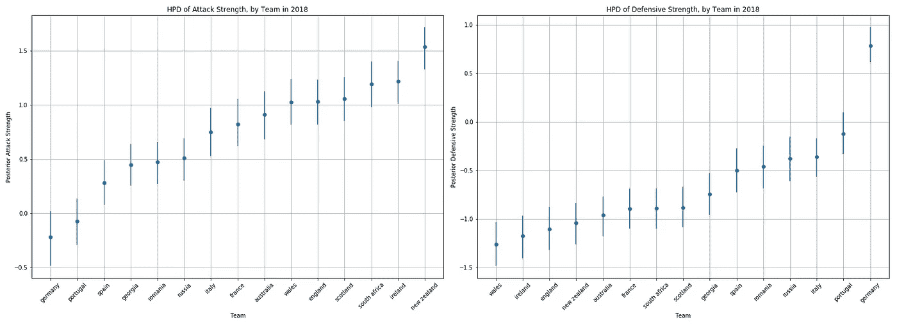
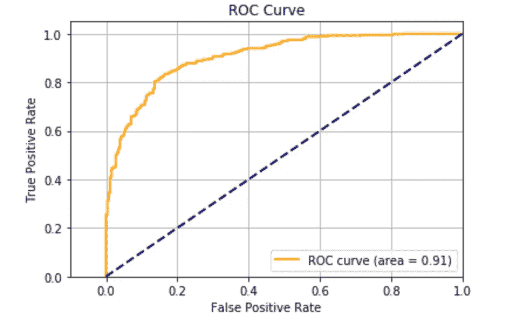
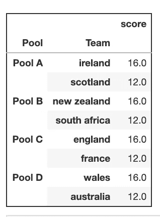
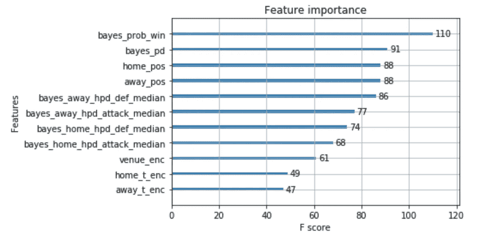
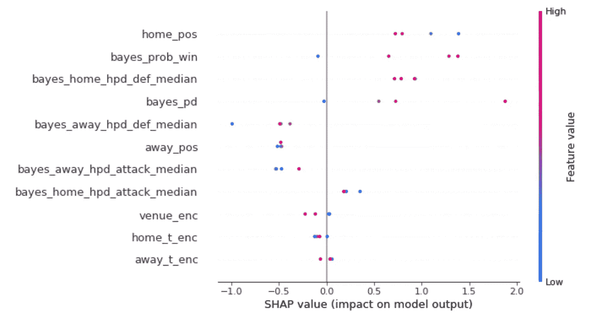

# 预测 2019 年橄榄球世界杯的冠军

> 原文：<https://towardsdatascience.com/predicting-the-winner-of-the-rugby-world-cup-2019-89a27d3f5b8e?source=collection_archive---------23----------------------->

## 根据机器学习。



我喜欢橄榄球，也喜欢跳羚队。当我们看到我们最喜欢的球队在 6 周的时间里展示他们的技能，争夺威廉·韦伯-埃利斯奖杯时，这是一种特殊的感觉。心会破碎，心会愈合，心会飞翔，只是为了再次破碎。眼泪(主要是我的)会流下来，啤酒会被喝光，球迷和球员会以真正的橄榄球方式分享祝贺和和解的拥抱。

但我也喜欢编码。务实地说。过去，我曾试图用我所知道的统计学和机器学习来模拟各种每周橄榄球比赛的结果。所以我决定拂去目录上的灰尘，更新数据和模型，看看哪支队伍会在今年的比赛中获胜。

> 数据

首先，我需要数据。ESPN 有可爱的历史数据库，但我似乎找不到下载按钮。我需要刮它。他们每页只显示 50 个结果。



检查页面，更重要的是检查`next page`按钮，我注意到有一个 href *“转到结果的第 2 页”*和一个 url。所以我可以使用这个和`BeautifulSoup`来解析页面上的`html`匹配数据，获得一个新的 url 并加载下一个页面。冲洗并重复。



此外，我想得到官方团队世界橄榄球排名，因为它应该是一个有用的功能。前往 [World Ruby 的网站](https://www.world.rugby/rankings/mru?lang=en)我们有可按年份配置的排名。我们再次在页面上添加了一个`html`解析器，但是我需要每年的数据(我很懒)。

使用基本相同的技巧，我可以通过检查小部件 url `[rankings/mru?date=2019-08-26&client=pulse](https://cmsapi.pulselive.com/rugby/rankings/mru?date=%s-11-05&client=pulse)`并简单地在字符串中递减年份来获得橄榄球排名的历史记录(*对于每场比赛，您可以获得比赛每天的排名，但目前我没有)。合并这些数据我得到以下基本结构:



Initial data used for analysis. `home / away_pos & home / away_pts` are the world ranking positions and points respectively

将一个团队称为`home`或`away`团队在 WC 环境中并不适用，因为除了日本，所有团队都在外地，但是数据是这样组织的。所以我采用了命名约定(它击败了`left_team`和`right_team)`)。

当我在谷歌上搜索试图看看是否有其他人做过类似的事情时，我在 PYMC 文档中偶然发现了一个[神奇的笔记本，作者是 Peadar Coyle，它使用层次贝叶斯模型来量化每个团队的进攻和防守实力。通过一点点*复制意大利面和摆弄*，我们可以*扩展*所有 WC 团队的 PYMC 模型以及估计每个赛季的参数。下面可以看到 2018**赛季的优势和劣势。](https://docs.pymc.io/notebooks/rugby_analytics.html)



Team attacking (left) and defensive (right) statistics from Bayesian analysis

这些似乎都有道理。根据 PYMC 的文章:*“我们期望我们的强队在进攻中有强烈的正面效应，在防守中有强烈的负面效应。”*

结果也符合 2018 年的统计数据。[威尔士被评为 2018 年最佳防守球队](https://www.walesonline.co.uk/sport/rugby/rugby-news/wales-officially-ranked-best-rugby-15477823)，紧随其后的是爱尔兰、新西兰和英格兰。在进攻方面，从我在 ESPNs stats 网站上看到的情况来看，这里最强的进攻球队和 2018 年得分最高的球队之间有着密切的一致(**请注意，上面情节中包括的比赛只适用于 2018 年，但是在最终的 PYMC 模型中，我们将 2019 年分为*延长的* 2018 赛季。据观察，来自缩短的 2019 年世界杯前赛季的小样本具有有偏差的参数)。

PYMC 是一个漂亮的分析工具。我们可以通过对每场比赛进行几(百)次模拟来进一步分析，并计算每场历史比赛的获胜概率以及对积分差异的估计([参见这篇精彩的博客了解更多](https://medium.com/the-artificial-impostor/march-madness-predictions-using-pymc3-e64574497f47))。

我们现在有了每场比赛的主要功能集——主队和客场队的贝叶斯进攻和防守实力、主队和客场队的世界橄榄球排名、主场获胜的贝叶斯概率以及 PYMC 预测的分差。

> 模型

最终数据包括自 2004 年以来所有国际橄榄球比赛的 2613 场比赛——我们对我们的球队、场地(为什么不)进行标记编码，并继续在数据集上运行分类器。为了让事情变得更简单，我把这个问题框定为一个二元问题，把主场胜利归类为 1(即`home_score — away_score > 0`)，否则归类为 0。



将数据放入我最喜欢的分类器 XGBoost 分类器——进行随机训练测试分割，并用 [Hyperopt](https://github.com/hyperopt/hyperopt) 进行超优化，得到以下结果:

```
Bayes Only F1: 0.82
XGB Train F1: 0.90
XGB Test F1: 0.87
```

> 结果和预测

最后，我们需要厕所设备。我们可以在这里下载完整的 csv 列表[。**我再次对结果进行假设以简化并忽略绘图**。如果是主场胜利，分配`home_team 4`分，否则`away_team`得分。](https://fixturedownload.com/download/csv/rugby-world-cup-2019)

小组赛的结果多少是可以预测的。新西兰预计将击败南非和 B 组头名，而威尔士预计将在 d 组排名第一。不出所料，英格兰和爱尔兰将在各自的小组中排名第一。这里没有预测到大的混乱。



Top 2 from each pool

下面最后阶段的结果用`graphviz`和`Networkx`绘制，颜色按获胜概率编码。爱尔兰 vs 南非 QF 看起来不那么决定性，预计南非获胜的概率为 51%。同样，在新西兰对威尔士的决赛中，我们没有观察到任何一个队有很大的可能性(55%对 45%支持威尔士)。


Wales is going to win the World Cup

> 模型诊断

我们可以探索模型，找出哪些是最重要的特征，以及为什么它会做出某些预测。下面的全球功能重要性图表明，贝叶斯数据(获胜概率和预测分差)是最重要的功能，其次是相关团队的世界排名。



Global Feature Importance

类似地，我们可以局部地理解每个单独游戏的预测。在大莱姆和 SHAP 的辩论中，我选择了 SHAP。没有真正的原因，我只是喜欢匀称的价值观的“去除效应”背后的想法。下面我们可以观察到哪些特征对每个四分之一决赛都很重要。



我们看到，主队的排名在所有 QF 预测以及贝叶斯概率数据中起着重要作用。强大的防守得分在决定谁将获胜时也有很大的影响。

没有一种模式是完美的。这是作为周末的一点乐趣来完成的。我希望你喜欢这个分析。

最后，加油博克！

感谢[马克·拉莫托斯基](https://medium.com/u/77f178710653?source=post_page-----89a27d3f5b8e--------------------------------)、[理查德·菲茨杰拉德](https://medium.com/u/75d60115fbcb?source=post_page-----89a27d3f5b8e--------------------------------)和[丹妮尔·费舍尔](https://medium.com/u/11514ad6479a?source=post_page-----89a27d3f5b8e--------------------------------)对我的纵容。