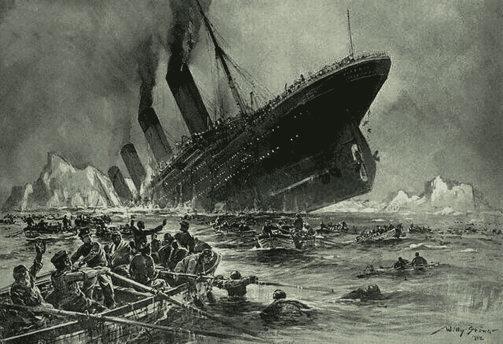
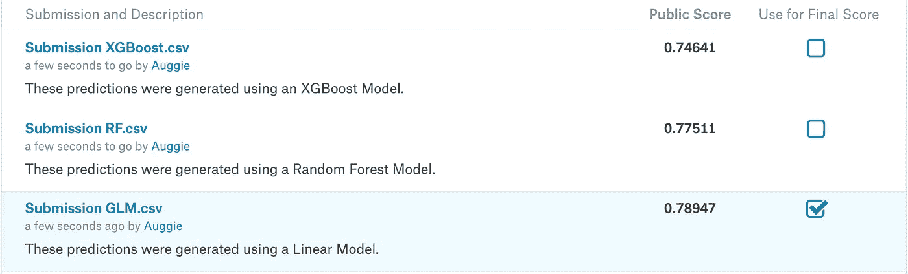

# 预测泰坦尼克号幸存者(卡格尔竞赛)

> 原文：<https://towardsdatascience.com/predicting-titanic-survivors-a-kaggle-competition-625405f5031e?source=collection_archive---------15----------------------->

本案例研究的目的是记录我在第一次 Kaggle 竞赛中创建预测的过程，该竞赛名为 **Titanic:机器从灾难中学习**。对于外行人来说，Kaggle 是一个受欢迎的数据科学网站，拥有数千个公共数据集，提供课程，通常作为具有分析思维的社区中心。他们还举办各种目标的机器学习竞赛。这个特殊比赛的目标是建立一个分类模型，可以成功地确定泰坦尼克号乘客的生死。



Could our data science efforts have helped? We’ll find out!

我们开始吧！

# 1.0 导入数据

这个过程的第一步总是加载数据和必要的包。在我使用的编程语言 R 中，包是允许用户执行特定任务的算法集合。有创造美丽的情节，建立股票投资组合和几乎任何你能想象的东西的软件包。在这里，我加载了许多包，允许我利用一些强大的机器学习(ML)模型。

```
lapply(c(“caret”,
 “h2o”,
 “pROC”,
 “randomForest”,
 “readr”,
 “tidyverse”,
 “xgboost”),
 library,
 character.only = TRUE)
 h2o.init()
 h2o.no_progress()
 set.seed(123)

 train <- read_csv(“~/Downloads/train.csv”)
 test <- read_csv(“~/Downloads/test.csv”)
```

竞争数据集来自两个文件:训练和测试。正如您可能猜到的，前者用于训练 ML 模型，而测试用于做出最终提交的预测。

# 2.0 探索数据

将我的数据放入 R 后，是时候探索数据的形状了。

```
train %>% glimpse()## Observations: 891
 ## Variables: 12
 ## $ PassengerId <dbl> 1, 2, 3, 4, 5, 6, 7, 8, 9, 10, 11, 12, 13, 14, 15, 1…
 ## $ Survived <dbl> 0, 1, 1, 1, 0, 0, 0, 0, 1, 1, 1, 1, 0, 0, 0, 1, 0, 1…
 ## $ Pclass <dbl> 3, 1, 3, 1, 3, 3, 1, 3, 3, 2, 3, 1, 3, 3, 3, 2, 3, 2…
 ## $ Name <chr> “Braund, Mr. Owen Harris”, “Cumings, Mrs. John Bradl…
 ## $ Sex <chr> “male”, “female”, “female”, “female”, “male”, “male”…
 ## $ Age <dbl> 22, 38, 26, 35, 35, NA, 54, 2, 27, 14, 4, 58, 20, 39…
 ## $ SibSp <dbl> 1, 1, 0, 1, 0, 0, 0, 3, 0, 1, 1, 0, 0, 1, 0, 0, 4, 0…
 ## $ Parch <dbl> 0, 0, 0, 0, 0, 0, 0, 1, 2, 0, 1, 0, 0, 5, 0, 0, 1, 0…
 ## $ Ticket <chr> “A/5 21171”, “PC 17599”, “STON/O2\. 3101282”, “113803…
 ## $ Fare <dbl> 7.2500, 71.2833, 7.9250, 53.1000, 8.0500, 8.4583, 51…
 ## $ Cabin <chr> NA, “C85”, NA, “C123”, NA, NA, “E46”, NA, NA, NA, “G…
 ## $ Embarked <chr> “S”, “C”, “S”, “S”, “S”, “Q”, “S”, “S”, “S”, “C”, “S…test %>% glimpse()## Observations: 418
 ## Variables: 11
 ## $ PassengerId <dbl> 892, 893, 894, 895, 896, 897, 898, 899, 900, 901, 90…
 ## $ Pclass <dbl> 3, 3, 2, 3, 3, 3, 3, 2, 3, 3, 3, 1, 1, 2, 1, 2, 2, 3…
 ## $ Name <chr> “Kelly, Mr. James”, “Wilkes, Mrs. James (Ellen Needs…
 ## $ Sex <chr> “male”, “female”, “male”, “male”, “female”, “male”, …
 ## $ Age <dbl> 34.5, 47.0, 62.0, 27.0, 22.0, 14.0, 30.0, 26.0, 18.0…
 ## $ SibSp <dbl> 0, 1, 0, 0, 1, 0, 0, 1, 0, 2, 0, 0, 1, 1, 1, 1, 0, 0…
 ## $ Parch <dbl> 0, 0, 0, 0, 1, 0, 0, 1, 0, 0, 0, 0, 0, 0, 0, 0, 0, 0…
 ## $ Ticket <chr> “330911”, “363272”, “240276”, “315154”, “3101298”, “…
 ## $ Fare <dbl> 7.8292, 7.0000, 9.6875, 8.6625, 12.2875, 9.2250, 7.6…
 ## $ Cabin <chr> NA, NA, NA, NA, NA, NA, NA, NA, NA, NA, NA, NA, “B45…
 ## $ Embarked <chr> “Q”, “S”, “Q”, “S”, “S”, “S”, “Q”, “S”, “C”, “S”, “S…
```

上面的代码说的是，训练数据有 891 行，包含 12 个不同的变量。这些变量包括乘客的姓名、性别和年龄、票价和上车地点等。这里最重要的变量是名为“Survived”的变量，这是一个由 1 和 0 组成的列表，分别表示乘客是死是活。测试数据包含 418 行，缺少“幸存”变量，因为这是竞争对手要求我们预测的。

虽然现在的数据中包含了大量信息，但并不是所有的信息都可以以当前的形式使用。为了提取尽可能多的有用信息，我必须转换其中的一些变量。

# 3.0 转换数据

我要查看的第一个变量是“名称”据我所知，击沉泰坦尼克号的冰山与任何乘客都没有私人恩怨，所以简单地使用乘客的全名不会提供任何有用的信息。然而，可能是乘客的头衔。像“先生”、“夫人”或“伯爵夫人”这样的头衔可以帮助我们确定乘客的社会地位(例如，他们是平民还是贵族？)对他们的生存有任何影响。

为了获得这些标题，我必须从“Name”中提取它们，下面的代码就是这样做的。

```
titles <- c(unique(str_extract(str_extract(train$Name, “\\,\\s[A-Za-z]+”), “[A-Za-z]+”)))
 titles <- replace(titles, titles == “the”, “Countess”)
 titles## [1] “Mr” “Mrs” “Miss” “Master” “Don” “Rev” 
 ## [7] “Dr” “Mme” “Ms” “Major” “Lady” “Sir” 
 ## [13] “Mlle” “Col” “Capt” “Countess” “Jonkheer”
```

如果你想知道，“Jonkheer”是荷兰贵族使用的尊称。泰坦尼克号上有一个叫约翰·乔治·罗克林的人，剧透一下，他死了。\_(ツ)_/

除了使用这个标题列表来创建一个新变量之外，我还将从“Cabin”中提取 Deck 并创建一个名为“Family_Size”的变量，它只是“SibSp”和“Parch”的组合，前者是船上兄弟姐妹和配偶的计数，后者是船上父母和子女的计数。我还将清理一些其他变量，使它们更容易为 ML 模型所理解。

```
train <- train %>% mutate(Survived = factor(Survived), Sex = factor(recode(Sex, 
 male = 1, female = 0)), Pclass = factor(Pclass), Embarked = factor(Embarked), 
 Deck = factor(replace_na(substr(train$Cabin, 1, 1), “Unknown”)), Title = factor(str_extract(train$Name, 
 paste(titles, collapse = “|”))), Family_Size = SibSp + Parch) %>% select(-c(Cabin, 
 Name, Ticket))

 test <- test %>% mutate(Sex = factor(recode(Sex, male = 1, female = 0)), Pclass = factor(Pclass), 
 Embarked = factor(Embarked), Deck = factor(replace_na(substr(test$Cabin, 
 1, 1), “Unknown”)), Title = factor(str_extract(test$Name, paste(titles, 
 collapse = “|”))), Family_Size = SibSp + Parch, Fare = ifelse(is.na(Fare), 
 mean(Fare, na.rm = TRUE), Fare)) %>% select(-c(Cabin, Name, Ticket))
```

# 3.1 预测乘客年龄

我之前检查数据时没有指出的一点是，有多少乘客的年龄没有被记录下来。在我们拥有数据的 1309 名乘客中，有 266 名没有年龄。丢失的信息以后会有问题，所以我觉得有必要用猜测来代替那些空值。

简而言之，下面的代码将训练和测试数据结合起来，提取出有年龄的记录，并拟合一个随机森林(RF)模型，该模型确定乘客年龄和其他变量之间的关系。最后，它会用对他们年龄的最佳猜测来填充所有缺失的年龄。

旁注:深入描述什么是 RF 模型将完全偏离本案例研究。如果你有兴趣了解更多关于射频模型及其工作原理的信息，[请访问这个网站](https://en.wikipedia.org/wiki/Random_forest)。

```
*# Combining the training and test data and selecting only the rows with ages*
 age <- train %>% select(-Survived) %>% rbind(test) %>% filter(!is.na(Age)) %>% 
 filter(!is.na(Embarked))

 *# Building a prediction model*
 age_rf_model <- randomForest(Age ~ . — PassengerId, age, ntree = 5000, mtry = 9, 
 na.action = na.exclude)

 *# Determining the accuracy of the model*
 age %>% select(Age) %>% add_column(Pred = predict(age_rf_model, age)) %>% na.omit() %>% 
 mutate(Error = Age — Pred, Error_Pct = Error/Age) %>% summarize(RMSE = sqrt(mean(Error²)), 
 MAPE = mean(abs(Error_Pct)))## # A tibble: 1 x 2
 ## RMSE MAPE
 ## <dbl> <dbl>
 ## 1 7.30 0.302*# Using the model to predict passenger age*
 train <- train %>% mutate(Age = ifelse(is.na(Age), round(predict(age_rf_model, 
 train)), Age))
 test <- rbind(train[1, c(1, 3:12)], test)
 test <- test[-1, ]
 test <- test %>% mutate(Age = ifelse(is.na(Age), round(predict(age_rf_model, 
 test)), Age))
```

为了检查 RF 模型的预测有多准确，我计算了预测的均方根误差(RMSE)和平均绝对百分比误差(MAPE ),以衡量这些预测的质量。[关于这两个指标的简要描述，请参阅我之前的文章。](https://medium.com/@auggieheschmeyer/forecasting-walmart-sales-using-machine-learning-models-3bf38f6c533)

长话短说:两种误差指标都很低。MAPE 告诉我，平均预测只有 0.3%的误差，所以虽然不完美，但我觉得对于我预测生存的最终目标来说，这是可以接受的。

# 4.0 训练模型

既然数据是干净的，是我开始用数据训练 ML 模型的时候了。因为我想确保我的模型在看不见的数据上表现良好，所以我将把我的训练数据分成一个较小的训练和测试数据集。这样，我可以在将模型带到 Kaggle 提供的实际测试数据之前评估模型的准确性(记住，我不能评估准确性，因为数据缺少“存活”变量)。

```
train_1 <- stratified(train, c(“Survived”, “Deck”, “Title”), size = 0.7, replace = FALSE)
 train_2 <- setdiff(train, train_1)
```

我将使用四种不同的模型，每种模型都有自己的预测方式:[线性模型](https://en.wikipedia.org/wiki/Logistic_regression)，随机森林模型， [XGBoost](https://en.wikipedia.org/wiki/XGBoost) (极端梯度推进)模型和 [H2O 的 AutoML](https://en.wikipedia.org/wiki/H2O_(software)#Iterative_methods_for_real-time_problems) 。同样，您可以随意点击超链接来了解这些模型是什么以及它们在做什么。

为了让下面发生的事情更容易理解，想象一下，我们想要赢得一场综合武术比赛，而不是预测泰坦尼克号的幸存者。在比赛开始前，我们只有足够的时间掌握一种武术，所以我们需要弄清楚我们应该学习哪一种才能最有机会获胜。我们知道竞争对手是谁(即我们的测试数据)，但我们不确定哪种武术最适合我们。下面是我们正在进行的模拟，我们学习四种不同的武术(比如拳击、柔术、太极拳和跆拳道)，看看我们如何应对与锦标赛中类似的竞争对手(即我们的训练数据)。

```
*# Linear Model — —* 
 glm_model <- glm(Survived ~ . — PassengerId, family = “binomial”, train_1)

 *# Random Forest — —* 
 rf_model <- randomForest(Survived ~ . — PassengerId, train_1, ntree = 10000, mtry = 3, na.action = na.exclude)

 *# XGBoost — —* 
 dummy_1 <- dummyVars(Survived ~ ., train_1[,2:12])
 train_1_dummy <- predict(dummy_1, train_1)
 dummy_2 <- dummyVars(Survived ~ ., train_2[,2:12])
 train_2_dummy <- predict(dummy_2, train_2)
 dtrain <- xgb.DMatrix(data = train_1_dummy, label = as.vector(train_1$Survived))
 dtest <- xgb.DMatrix(data = train_2_dummy, label = as.vector(train_2$Survived))

 watchlist <- list(train = dtrain, test = dtest)

 xgb_model <- xgb.train(
 data = dtrain,
 watchlist = watchlist,
 booster = “gbtree”,
 max.depth = 3,
 nthread = 2,
 nrounds = 5000,
 objective = “binary:logistic”,
 early_stopping_rounds = 500,
 print_every_n = 500
 )

 *# H2O — —* 
 train_1_h2o <- train_1 %>%
 select(-PassengerId) %>%
 mutate(Pclass = factor(Pclass, ordered = FALSE)) %>%
 as.h2o
 train_2_h2o <- train_2 %>%
 select(-PassengerId) %>%
 mutate(Pclass = factor(Pclass, ordered = FALSE)) %>%
 as.h2o

 y <- “Survived”
 x <- setdiff(colnames(train_1_h2o), y)

 split <- h2o.splitFrame(train_1_h2o, ratios = c(.70, .15))

 t1 <- split[[1]]
 t2 <- split[[2]]
 t3 <- split[[3]]

 h2o_model <- h2o.automl(
 x = x,
 y = y,
 train = t1,
 validation_frame = t2,
 leaderboard_frame = t3,
 nfolds = 5,
 stopping_metric = “AUC”,
 max_runtime_secs = 120
 )
 h2o_leader <- h2o_model@leader
```

# 5.0 模型比较

继续上面的比喻，没有一种武术能胜过所有的对手，所以我们要试着找到表现最好的一种。对于武术来说，衡量的标准可能是获胜的次数。对于《泰坦尼克号》的预测，我将精确地衡量它(主要是因为这是 Kaggle 用来给这场比赛打分的)。

为了确定这种准确性，我将生成一个所谓的置信矩阵。简单地说，这是一个 2x2 的盒子，沿着 x 轴显示实际值(在输出中称为“参考值”)，沿着 y 轴显示预测值。这使您可以看到四个变量:

真阳性:预测= 1，实际= 1

真负数:预测= 0，实际= 0

误报:预测= 1，实际= 0

假阴性:预测= 0，实际= 1

准确性是对所有预测中有多少真阳性和真阴性的一种衡量。

```
compare_set <- train_2 %>% add_column(GLM_Pred = predict(glm_model, train_2, 
 type = “response”)) %>% add_column(RF_Pred = predict(rf_model, train_2)) %>% 
 add_column(XGB_Pred = predict(xgb_model, train_2_dummy)) %>% add_column(H2O_Pred = h2o.predict(h2o_leader, 
 newdata = train_2_h2o) %>% as_tibble() %>% pull(predict)) %>% mutate_at(vars(GLM_Pred, 
 XGB_Pred), list(~factor(as.numeric(. > 0.5))))

 for (i in 13:16) {
 conmat <- confusionMatrix(compare_set$Survived, compare_set[[i]], positive = “1”)
 print(colnames(compare_set[, i]))
 print(conmat$table)
 print(conmat$overall[1])
 }## [1] “GLM_Pred”
 ##            Reference
 ## Prediction 0   1
 ##          0 141 21
 ##          1 23  75
 ## Accuracy 
 ## 0.8307692 
 ## [1] “RF_Pred”
 ##            Reference
 ## Prediction 0   1
 ##          0 149 13
 ##          1 26  72
 ## Accuracy 
 ## 0.85 
 ## [1] “XGB_Pred”
 ##            Reference
 ## Prediction 0   1
 ##          0 147 15
 ##          1 20  79
 ## Accuracy 
 ## 0.8659004 
 ## [1] “H2O_Pred”
 ##            Reference
 ## Prediction 0   1
 ##          0 151 11
 ##          1 38  61
 ## Accuracy 
 ## 0.8122605
```

正如你所看到的，就纯粹的准确性而言，XGBoost 模型的表现最好，它正确预测了训练数据中所有幸存者的 86.6%。然而，准确性并不总是最好的衡量标准。如果您查看 XGBoost 的置信度矩阵，您会看到有 15 个假阴性。RF 模型虽然在准确性方面表现不佳，但只有 13 个假阴性。为什么这可能很重要取决于具体情况。

假设你是一名医生，负责确定病人是否患有某种疾病。假设对没有患病的人进行治疗是无害的，但如果不进行治疗，患病的人肯定会死亡。鉴于上述数字，RF 模型比 XGBoost 模型多拯救了两条生命。这里的要点是，永远不要简单地看准确性，并在此基础上做出最终判断。

所以我不会在这里！

相反，我将使用 RF 和 XGBoost 模型进行预测。由于第三次提交参赛作品不花我一分钱，我也将使用线性模型进行预测，因为它的准确性不会远远落后于其他两个模型。

# 6.0 做出最终预测

既然我已经有了训练有素的模型(或者说战士，如果你喜欢这个比喻的话)，是时候让它们发挥作用了。我将把它们用在测试数据上，这些数据是模型从未见过的。

```
*# XGBoost*
 dummy_test <- dummyVars(PassengerId ~ ., test)
 test_dummy <- predict(dummy_test, test)

 submission_xgboost <- test %>% add_column(Survived = predict(xgb_model, test_dummy)) %>% 
 mutate(Survived = as.numeric(Survived > 0.5)) %>% select(PassengerId, Survived)

 *# Random Forest*
 submission_rf <- test %>% add_column(Survived = predict(rf_model, test)) %>% 
 select(PassengerId, Survived)

 *# Linear Model*
 submission_glm <- test %>% add_column(Survived = predict(glm_model, test)) %>% 
 mutate(Survived = as.numeric(Survived > 0.5)) %>% select(PassengerId, Survived)
```

让我们看看每个模型是如何预测测试数据中前 10 名乘客的存活率的。

```
submission_xgboost %>% left_join(submission_rf, by = “PassengerId”) %>% left_join(submission_glm, 
 by = “PassengerId”) %>% rename(XGBoost = Survived.x, RF = Survived.y, Linear = Survived) %>% 
 head(10)## # A tibble: 10 x 4
 ##   PassengerId XGBoost RF    Linear
 ##   <dbl>       <dbl>   <fct> <dbl>
 ## 1 892         0       0     0
 ## 2 893         0       0     0
 ## 3 894         0       0     0
 ## 4 895         0       0     0
 ## 5 896         0       0     1
 ## 6 897         0       0     0
 ## 7 898         0       0     1
 ## 8 899         0       0     0
 ## 9 900         1       1     1
 ## 10 901        0       0     0
```

如你所见，三个模型都预测乘客 900 幸存。线性模型还预测乘客 896 和 898 幸存。

# 7.0 提交预测

现在我有了我的预测，是时候把它们提交给 Kaggle，看看它们做得如何。首先，我必须将这些预测导出到一个 CSV 文件中，这样我就可以上传它们。

```
write_csv(submission_xgboost, “~/Downloads/Submission XGBoost.csv”)
 write_csv(submission_rf, “~/Downloads/Submission RF.csv”)
 write_csv(submission_glm, “~/Downloads/Submission GLM.csv”)
```

上传 CSV 后，Kaggle 会生成我每次提交的最终分数。所以，让我们看看我做得怎么样。



哇！看那黑马胜利！完全出乎意料！尽管对训练数据执行了三个模型中的第三个，但线性模型实际上对测试数据执行了所有模型中最好的。我真的没想到会这样。这只是表明你可以做世界上所有的训练，有时胜利只是靠运气。

客观地说，78.9%的分数并不令人印象深刻，因为还有其他提交的作品获得了满分。但鉴于这是我的第一次比赛，我在 11098 名参赛者中名列第 3149 名(比其他参赛者的 71.6%要好)，我觉得这是一次令人满意的努力。

感谢您的阅读。我希望在下一个案例研究中见到您。