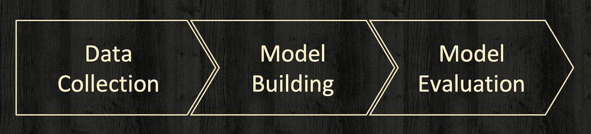
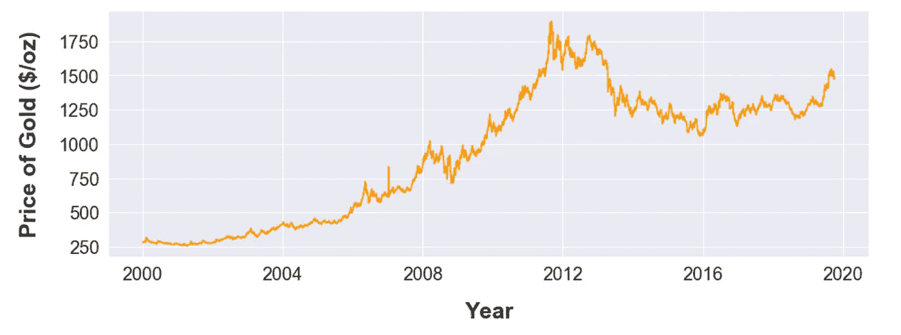
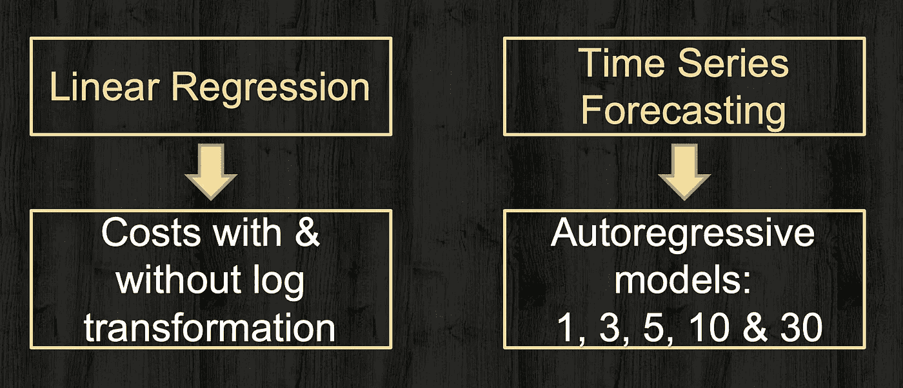
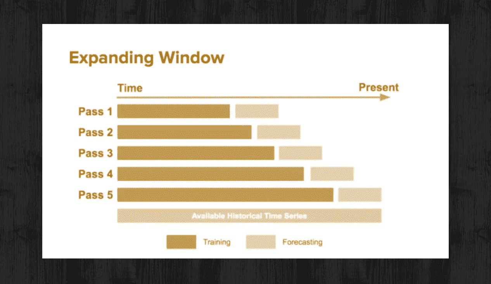
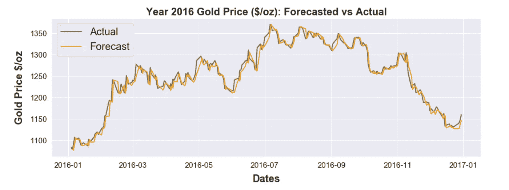
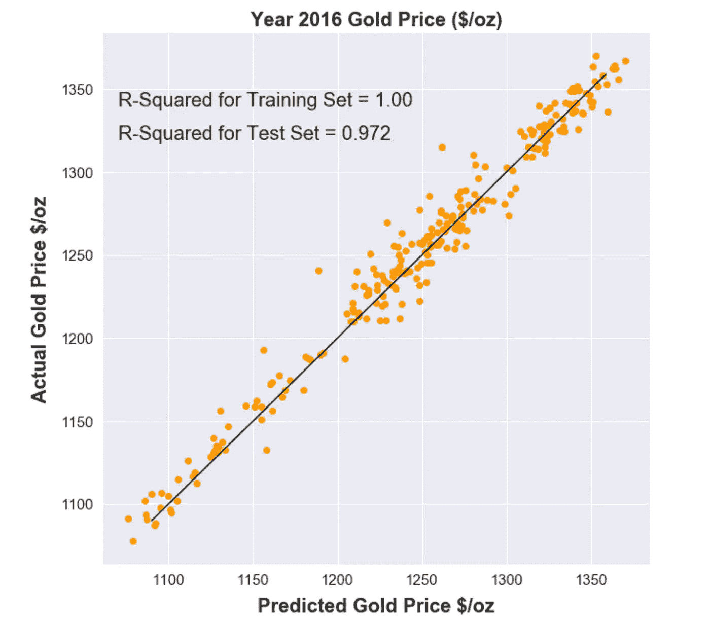
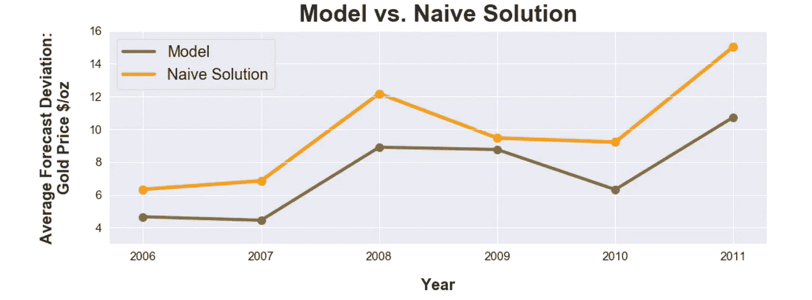
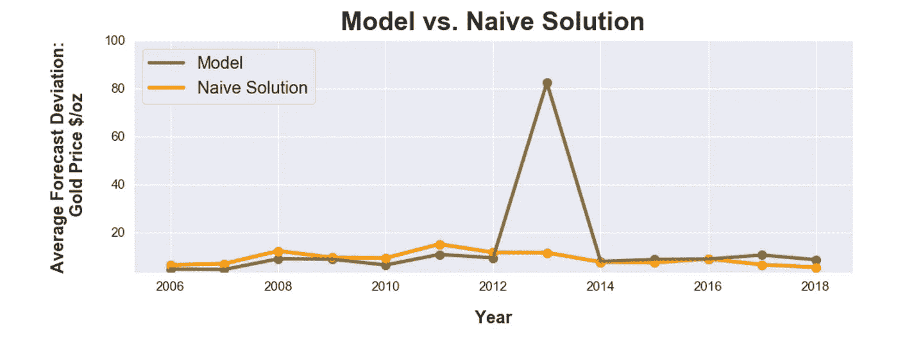

# 预测明天的黄金价格

> 原文：<https://towardsdatascience.com/predicting-tomorrows-gold-price-25f914521f86?source=collection_archive---------18----------------------->

## 我们有市场优势吗？

# 介绍

世界各地的央行都持有黄金储备，以保证储户、外债债权人和货币持有者的资金安全。各国央行也将黄金储备作为控制通胀和增强本国金融地位的一种手段。此外，金融公司、全球机构、基金经理和个人投资者也使用黄金来对冲通胀风险，并使其投资组合多样化。作为一种贵金属，黄金是流行的首饰和装饰品。

鉴于黄金在当代世界的受欢迎程度，预测其价格是一个广泛探索的话题，也是多个全球机构和大小规模投资者感兴趣的话题。这也是一个复杂的问题，因为黄金的价格波动并不完全取决于供求关系，还取决于许多地缘政治和金融因素。

# 方法学

用于此分析的方法有三个步骤:数据收集/组装步骤、模型构建步骤和评估步骤。

## 数据收集和汇编

本分析考虑的独立变量包括*经济和市场因素*，如 S & P 500、道琼斯工业平均指数、富时 100 指数、国债利率、银行利率、美元指数；以及其他*商品指标*如银、铂、钯和原油价格。此外，*黄金期货*也被认为反映了市场对未来黄金价格的预期。作为这项工作的一部分，许多研究都考虑了类似的变量，但黄金期货除外。

为了控制本项目的范围，本分析未考虑黄金供应国和消费国的国际经济和市场指标，以及表明黄金买卖季节性的变量，尤其是与一些亚洲消费市场相关的变量。该项目收集的数据是 2000 年至 2018 年这些变量的每日收盘价。其他每日市场指标*如开盘价、最高价、最低价和交易量*没有在本次分析中使用，但可能对未来的工作有价值。

因变量，黄金价格，是从 kitco.com 网站上收集的，并基于*伦敦黄金定价*基准。顾名思义，这一黄金基准价格由一组参与的国际银行在伦敦每个工作日制定两次，用于为全球市场的大多数黄金衍生品和产品定价。每天设定的两个比率中的最高者用于该分析。本项目使用的黄金价格如下所示:

该数据库由多个市场数据源组装而成，并使用日期作为合并属性。一旦数据被“缝合”在一起，美国假期就从分析中删除了。此外，在探索性数据分析步骤中标记的任何缺失或不合理的数据都使用前一天的价格进行估算(向前填充)。

## 建模

作为模型构建练习的一部分，使用了线性回归和时间序列方法，如下所示。

模型构建过程经历了以下步骤，其中每个步骤根据需要经历多次迭代:

1.  使用 2000 年到 2015 年的每日价格来训练线性回归模型。作为该步骤的一部分，测试的因变量包括:第二天的价格、下周的价格、下个月的价格和第二天价格的百分比变化。然后使用 2016 年至 2018 年的每日价格对这些模型进行了测试。这一步的结果是使用次日价格作为因变量，并且只使用一年而不是三年进行模型测试。在此步骤中，我们注意到，随着测试数据与训练数据之间的距离越来越远，模型的性能越来越差。
2.  使用 2000 年到 2015 年的每日价格来训练线性回归模型，其中成本经过对数转换并缩放到零以上的中心。使用 2016 年的每日价格进行测试。
3.  使用 2000 年到 2015 年的每日价格来训练单变量时间序列模型，该模型使用经过和没有经过对数变换的黄金价格。使用 2016 年的每日价格进行测试。

对于时间序列模型，只使用了自回归(AR)模型。对于研究的两种时间序列函数形式，在有和没有对数转换黄金价格的情况下，根据阿凯克信息标准(AIC)，最佳顺序被确定为前 3 天。

## 模型评估

评估时间序列(如黄金价格)的模型性能的关键步骤是将结果与简单的解决方案进行比较。在像黄金价格这样的非季节性变量的情况下(与棉花价格或交通流量这样的季节性变量相反)，天真的预测是*明天的黄金价格与今天的*相同。Naive solution 作为投资策略或决策工具的效用有限，但它为模型评估提供了一个基准解决方案。对于上一节中提到的模型构建步骤 1 到 3，在模型选择和与原始解决方案的比较中使用的度量是 R 平方值。

一旦选择了一个模型，该函数形式就被用于使用如下所示的扩展窗口概念来执行按时间顺序的训练/测试。从 2006 年到 2018 年，使用从 2000 年开始的前几年的数据训练的模型，对每一年的每日价格进行了时序训练/测试。对于这个时序测试，平均绝对误差(MAE)用于与原始解决方案进行比较。

# 结果

简单线性回归模型构建步骤的 2016 年测试结果如下所示。该模型使用 2000 年至 2015 年的每日黄金价格进行训练，并产生了与原始预测相比最佳的 R 平方值(0.9719 比 0.9715)。该模型很好地跟踪了 2016 年的实际黄金价格，如下所示:

预测的 2016 年金价与实际金价的散点图如下所示。

2006 年至 2012 年使用线性回归模型进行的按时间顺序的培训/测试评估如下所示。对于这一时间段内的每一年，预测都比天真的预测更接近实际。平均预测偏差使用平均绝对误差(MAE)来衡量。

2006 年至 2018 年按时间顺序排列的培训/测试结果如下所示。请注意，该模型未能捕捉到 2013 年黄金市场的变化趋势。

**2013 年发生了什么？**
从贵金属到股票的投资热潮导致 2013 年黄金价格下跌近 30%，结束了长达 12 年的牛市。这一下降主要与投资者猜测美联储削减债券购买量，消除了购买黄金以对冲美元和通货膨胀的需求有关。

使用 2000 年至 2012 年训练数据估计的模型无法完全捕捉股票、国债、美元、联邦货币政策和商品市场之间不断变化的市场条件。

# 结论

使用线性回归和时间序列对黄金价格建模的上述历史分析得出以下结论:

1.  对于时间序列变量，无论有没有可能战胜它，都要和一个简单的解决方案进行比较。
2.  检查你的模型能在多大程度上保持和扩展趋势。不是所有的模型都能完全概括一个像股票和商品市场这样高度复杂的系统。设定一个更小的时间框架，并经常更新你的模型。
3.  拥有多种型号。即使时间序列不会比 2012 年之前的天真预测表现得更好，它也会比线性回归更好地捕捉到 2013 年的金价下跌，线性回归在对抗天真预测方面表现得相当好。

# 参考

1.  优步天气预报简介
2.  [Sami 等，*利用机器学习方法预测未来黄金利率*《国际高级计算机科学与应用杂志》第 8 卷第 12 期，2017](http://thesai.org/Downloads/Volume8No12/Paper_13-Predicting_Future_Gold_Rates.pdf)
3.  [黄金在 2013 年下跌 28%，结束了 12 年的牛市](https://www.wsj.com/articles/no-headline-available-1388504140)

*原载于*[*https://mlbhanuyerra . github . io*](https://mlbhanuyerra.github.io/2019-10-12-Predicting-Tomorrows-Gold-Price/)*。*