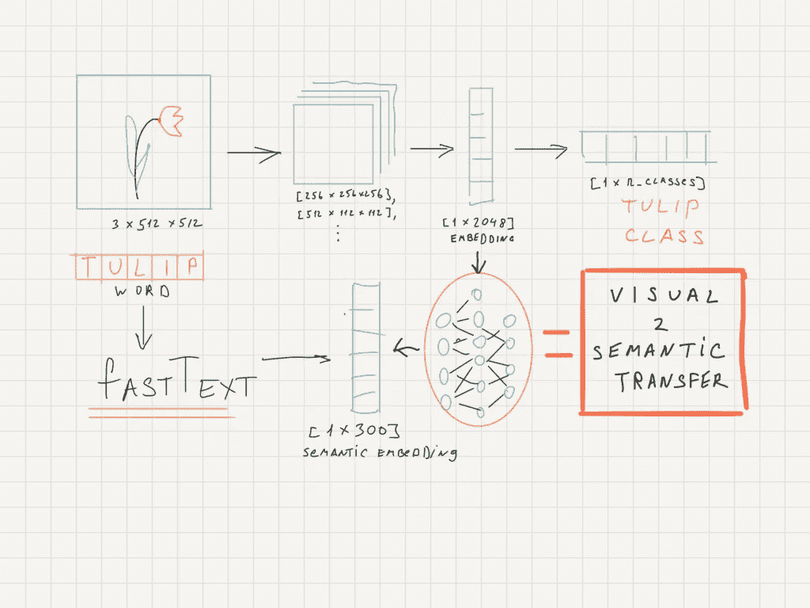
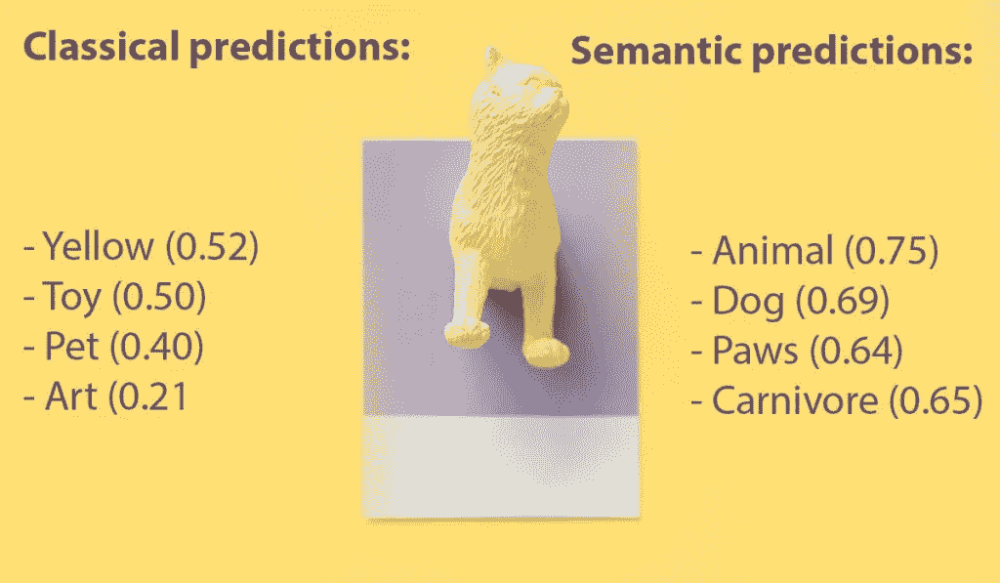
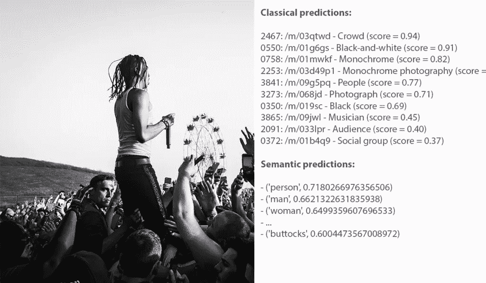
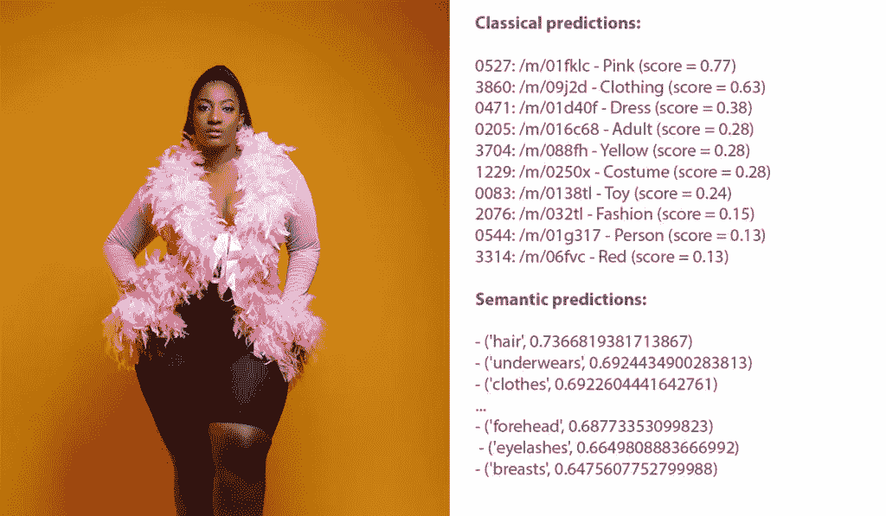

# 零射击学习:用“视觉到语义”的迁移预测未知类。

> 原文：<https://towardsdatascience.com/predicting-unknown-classes-with-visual-to-semantic-transfer-applications-for-general-ai-82717496147c?source=collection_archive---------18----------------------->

## 融合各种感官输入如何帮助您在图像分类任务中做出更好的预测并掌握更多信息。

机器学习喜欢大数据，尤其是当它被贴上标签的时候。Google 和腾讯发布了由数百万和数千万训练样本组成的图像任务数据集。OpenAI 表明，只需将数据集和网络参数提高 10 倍，网络就能在新的水平上运行。

人脑不是这样工作的。我们不仅能够从几个例子中学习，还能够进行跨领域学习。如果有人向你解释什么是老虎，老虎长什么样，你会认出它，即使你以前从未见过它。我们甚至可以通过语言描述来辨别气味。

# 我如何预测以前未见过和未知的类？

生物大脑中存在跨领域的可解释性。这个抽象层次比每个感官通道都要深。

基于这种逻辑，我想出了一个制作神经网络的主意，这个网络将在一个跨感官的基础上运行。经过一些研究，我发现(显然)这不是一个新方法，它被用于所谓的 ZSL(零射击学习)。这允许在预测中有(几乎)无限数量的类。

# 建筑。

这个想法很简单——将图像分类网络中的图像嵌入映射到单词嵌入，在视觉和语义表示之间架起一座桥梁。

该桥理论上允许在训练期间解决有限类别数量的问题，因为现代单词嵌入(fastText 作为第一种)不限于词汇，而是能够在英语语言的完整字母数字空间上操作。



# 技术细节

为了测试这个想法，我遵循了以下协议:

*   使用 ResNet101 处理来自开放图像 V2 验证数据集的 42620 幅图像，在开放图像数据集中进行预训练，并为每幅图像提取嵌入向量(在 pool5 之后)。
*   每个图像对应的类名小写，用 fastText.wiki.en 模型得到嵌入向量[1x300d]。
*   使用 4 层全连接网络将图像嵌入映射到单词嵌入。以余弦距离作为损失函数对网络进行 2000 个历元的训练，并基于验证子集选择最佳检查点。

# 结果

为了让你对结果有一个大致的了解，让我给你几个精选的结果。每个图像用 ResNet101 和图像到语义的转换进行分类。为了使事情更加公平，我还提供了与类名最相似的向量的结果。



我试图得到的主要结果是，使用这种方法可以提取出关于图像的更丰富、更多样的“标签云”。因此，显示类名到相似词的映射和图像到语义的转换之间的本质区别是很重要的。



# 进一步的想法

这个简单的实验引发了许多进一步的想法和观点。一个逆字到图像转移怎么样？使用键入的文本通过 GAN 生成图像？这些很难训练，但是很容易理解。

但是我们可以在这里更进一步。思考这个架构如何与简洁的本质相关联。人类的认知功能大量处理跨领域的转移，通过比较“抽象嵌入”不断地双重检查现实的性质，以找到基础真理。我认为小说特斯拉的 FSD 以同样的方式工作——所有的神经网络合并成一个单一的地面真实向量，描述汽车周围的环境。

# 神经网络架构

```
class ImgToWordModel(nn.Module): def __init__(self): super(ImgToWordModel, self).__init__() def fc_block(in_filters, out_filters): block = [nn.Linear(in_filters, out_filters), nn.LeakyReLU(0.2, inplace=True), nn.Dropout(0.1)] return block self.model = nn.Sequential( *fc_block(2048, 2048*3), *fc_block(2048*3, 2048*2), *fc_block(2048*2, 1024), ) self.last_layer = nn.Sequential(nn.Linear(1024, 300)) def forward(self, img): out = self.model(img) word = self.last_layer(out) return word
```

其他一切都很明显。ResNet101 的推理代码取自开放图像，训练细节如下(2000 个纪元)

```
loss_fn = torch.nn.CosineEmbeddingLoss().to(device) optimizer = torch.optim.Adam(model.parameters(),1e-3) flags = Variable(torch.ones(256)).to(device)
```

我肯定会写另一个关于这个想法的哲学方面的出版物，保持联系！

*原载于 2019 年 4 月 29 日*[*【https://fridayexperiment.com】*](https://fridayexperiment.com/predicting-unknown-classes-with-visual-to-semantic-transfer-applications-for-general-ai/)*。*