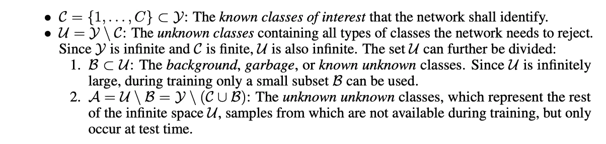
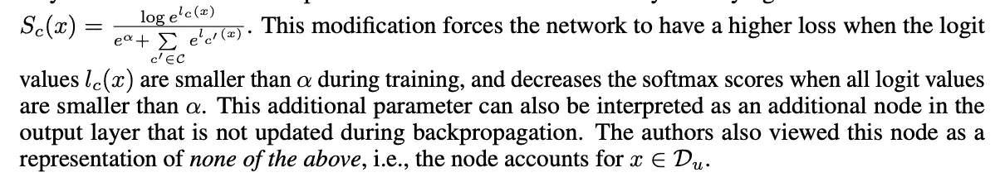
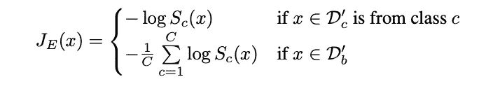
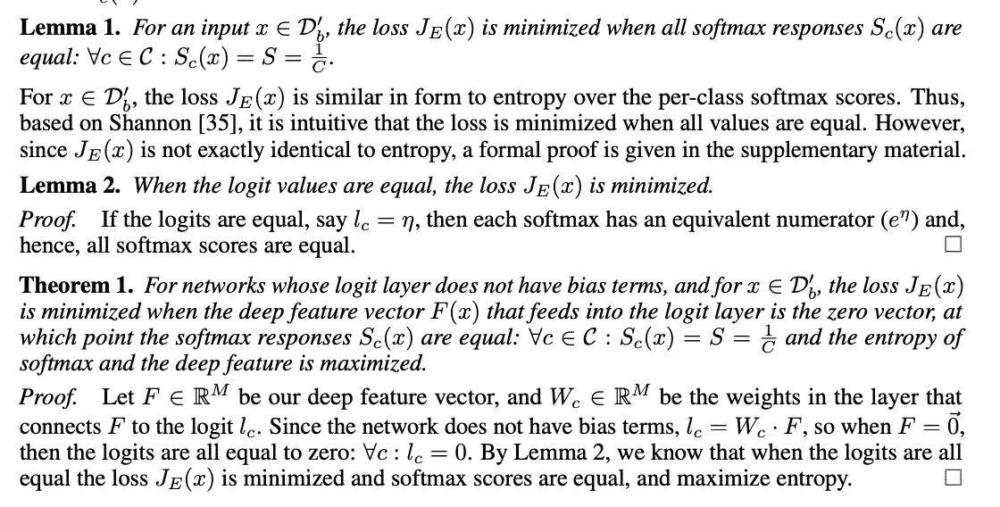
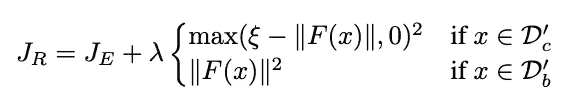

# 预测未知的未知

> 原文：<https://towardsdatascience.com/predicting-unknown-unknowns-fa4d7de975fb?source=collection_archive---------29----------------------->

参考论文:减少网络恐惧症:[https://arxiv.org/pdf/1811.04110.pd](https://arxiv.org/pdf/1811.04110.pdf)


对于许多领域和场景的分类模型，重要的是预测何时给予模型的输入不属于它被训练的类别。

对于计算机视觉/物体检测器模型，作者提供以下理由:

```
Object detectors have evolved over time from using feature-based detectors to sliding windows [34], region proposals [32], and, finally, to anchor boxes [31]. The majority of these approaches can be seen as having two parts, the proposal network and the classification network. During training, the classification network includes a background class to identify a proposal as not having an object of interest. However, even for the state-of-the-art systems it has been reported that the object proposals to the classifier “still contain a large proportion of background regions” and “the existence of many background samples makes the feature representation capture less intra-category variance and more inter-category variance (...) causing many false positives between ambiguous object categories” [41]. In a system that both detects and recognizes objects, the ability to handle unknown samples is crucial. Our goal is to improve the ability to classify correct classes while reducing the impact of unknown inputs.
```

这也是许多领域中需要解决的一个重要问题，包括医疗保健、机器人(不考虑视觉或 NLP)。

术语:



过去处理这一问题的方法依赖于两种基本方法:

1.  给定一个输入，根据该输入与培训中看到的输入的接近程度提供不确定性得分。==> P (U | x)
2.  给定输入 x，预测该输入属于训练该模型所有类别 Ci (i=1 到 n)的概率。然后，我们以最小概率为阈值，以最大概率拒绝集合外或未知的输入。

以下是一些相关方法的总结:

1.  设定 Softmax 分数的阈值:这种方法假设来自未对网络进行训练的类别的样本将具有分布在所有已知类别中的概率分数，因此使得任何已知类别的最大 softmax 分数较低。因此，如果系统设定最高分数的阈值，它可以避免将这样的样本分类为已知类别之一。这是迄今为止最常见和最简单的技术，不需要任何模型再训练或额外的分布数据来应用它。然而，它很少工作得很好。主要是因为 softmax 已知会使概率偏向某个类，即使胜出类与其相邻类的 logit 值之间的差异很小。对此的一个解决方法是:



2.不确定性估计:2017 年，Lakshminarayanan 等人[20]介绍了一种使用 MNIST 数字训练的 MLP 系综及其对立示例来预测不确定性估计的方法。他们的方法不是逼近 P(u | x)，而是专注于在 x ∈ Du 时减少 max(P(c | x))，他们使用网络系综解决了这个问题

3.开放集方法 OpenMax:在训练过程中不使用背景样本。OpenMax 旨在直接估计 P(U | x)。使用来自训练样本的深度特征，它建立不属于已知类的输入的每类概率模型，并在每个类概率的 OpenMax 估计中组合这些模型，包括 P(U | x)。虽然这种方法提供了正式解决深度网络的开集问题的第一步，但它是在网络已经被训练之后的离线解决方案。它没有改进特征表示来更好地检测未知类。

4.背景类:用背景类训练的系统使用来自 Db 的样本，希望这些样本足以代表 Du，以便在训练后系统正确地标记未知。它类似于 1 末尾所示的 soft max-alpha 修改方法。阈值 Softmax 以上，除了它使用背景类的例子在训练。

在此背景下，本文的主要贡献如下:

```
Our Contributions: In this paper, we make four major contributions: a) we derive a novel loss function, the Entropic Open-Set loss, which increases the entropy of the softmax scores for background training samples and improves the handling of background and unknown inputs, b) we extend that loss into the Objectosphere loss, which further increases softmax entropy and performance by minimizing the Euclidean length of deep representations of unknown samples, c) we propose a new evaluation metric for comparing the performance of different approaches under the presence of unknown samples, and d) we show that the new loss functions advance the state of the art for open-set image classification. Our code is publicly available
[http://github.com/Vastlab/Reducing-Network-Agnostophobia](http://github.com/Vastlab/Reducing-Network-Agnostophobia)
```

**熵开集损失:**

如果有 C 个已知类别，这里的想法是当给定属于背景(已知未知)的输入时，训练网络为每个已知类别生成 1/C 的概率。如果背景有足够的变化，希望这能转化为对未知的类似预测。请注意，这只是对典型交叉熵损失的一个微小修改。

设 Sc 为上述 softmax 分数，我们的熵开集损失 JE 定义为:



基于上述熵开集损失(EOS ),我们有以下直观推导:



引理 1 和引理 2 相当直观。

为了解释定理 1:直觉是如果我们想要 softmax 概率对于背景类是相等的，一种方法是馈送到网络最后一层的特征向量 F(x)为零。这是因为 logits = Wl * F(x)。对于背景类示例，如果 F(x)是 zeors，则 logits 将为零，因此 softmax 概率将相等。

**目标大气损失:**

这种损失的目的是迫使背景样本的 F(x)为低值，并将已知样本推入我们称之为对象圈的地方，在那里它们具有大的特征量。



**总结:**object sphere loss 易于实现，在未知的未知预测中帮助很大。