# 车辆碰撞和机器学习

> 原文：<https://towardsdatascience.com/predicting-vehicle-accidents-with-machine-learning-ce956467fa74?source=collection_archive---------4----------------------->

## 用机器学习预测车祸死亡率。Python 中的演练。

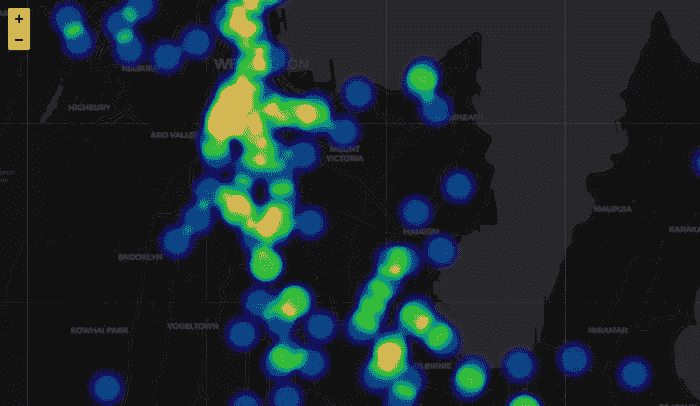

Heatmap Wellington Vehicle Crashes

道路事故是我们世界各地社会的一个主要问题。世界卫生组织(世卫组织)估计，2010 年有 125 万人死于道路交通伤害。2016 年，仅美国就记录了 37，461 起与机动车碰撞相关的死亡，平均每天约 102 人。在欧洲，统计数据还表明，2017 年每分钟就有 50 人死于道路交通事故。机器学习能帮助我们理解车祸的原因和影响车祸严重程度的因素吗？

在本文中，我们将通过 API 获取数据，执行探索性数据分析，并将现实世界的问题公式化为机器学习模型，从而完成一个完整的机器学习管道。完整的代码和 Jupyter 笔记本可以在这个 [Github Gist](https://gist.github.com/shakasom/382a5cc0c59e24fdae29679de6d7e88a) 中找到。整个过程是在 Google Colab 中使用免费的 GPU/TPU 环境进行的，所以你可以直接从 Github 打开笔记本，并在 Google Colab 中进行实验。

## 获取数据

碰撞分析系统(CAS)数据有不同的格式和 API。很容易通过 API 接口获取它们，而不是下载到您的本地机器。这是有益的，因为我们将在每次运行 Jupyter 笔记本时访问最新更新的数据。我发现车辆事故这一特殊问题与位置(地理)密切相关，因此我们将获取 Geojson 文件，而不是通常的 CSV 文件，以便我们可以执行地理数据分析，而无需根据纬度和经度创建几何图形，并处理坐标参考系统和投影。

我们将使用 Geopandas 库来读取数据。如果你熟悉熊猫图书馆，那么你应该有家的感觉，因为地质公园是建立在顶级熊猫之上的。Geopandas 是一个高级库，它使使用 Python 处理地理数据变得更加容易，因为它允许 pandas 功能和数据类型允许对地理几何进行空间操作。它与 Python 生态系统很好地集成在一起，并且非常依赖 pandas、Matplotlib 和 shapely 库进行几何运算。

```
# Get the data from url and request it as json file
url = '[https://opendata.arcgis.com/datasets/a163c5addf2c4b7f9079f08751bd2e1a_0.geojson'](https://opendata.arcgis.com/datasets/a163c5addf2c4b7f9079f08751bd2e1a_0.geojson')
geojson = requests.get(url).json()# Read the data as GeodataFrame in Geopandas
crs = {'init': 'epsg:3851'} # Coordinate reference system (CRS) for Newzealand
gdf = gpd.GeoDataFrame.from_features(geojson['features'], crs=crs)
```

# 探索性数据分析

在新西兰，自 2000 年至 2018 年，车祸死亡总人数为 6922 人。而车祸中重伤和轻伤的总数分别达到 45044 人、205895 人。尽管该数据集记录了所有向新西兰警方报告的车祸，但我们必须考虑到并非所有车祸都向新西兰警方报告，尤其是非致命车祸。大多数撞车事故是非伤害性的，而致命性的撞车事故最少。就死亡人数而言，大多数车祸的死亡率为零。

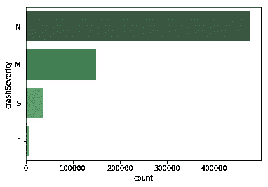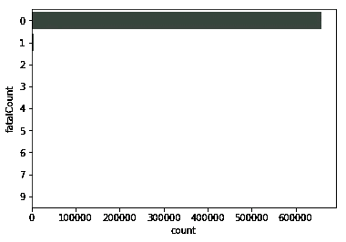

Left — Crash severity categories. Right — Fatality count in crash accidents

这些年来，总体统计数据显示，碰撞严重程度和死亡人数有所下降，但正如您从线图中看到的那样，从 2016 年开始，死亡人数似乎有所上升。另一方面，2017 年出现了重伤和轻伤的高峰。

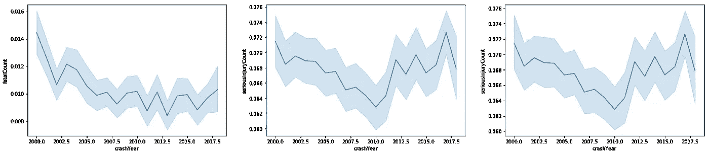

The crash casualty from 2000 to 2018.

道路和其他相关属性也表明了碰撞的严重程度和死亡水平。那么让我们来探讨一下它们之间的关系。就死亡人数和道路上的车道数而言，双车道似乎比其他任何数字都要高。直路似乎与死亡事故不太相关，而大多数死亡事故与某种道路弯曲有关(容易、中等和严重)。

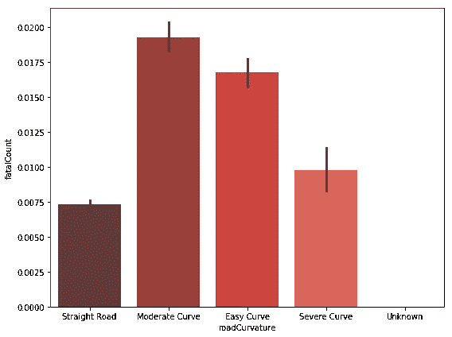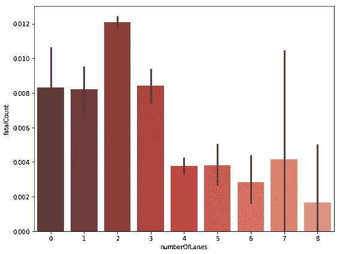

Right: Road curvature and crash fatality. Left: Number of lanes and crash fatality

让我们看看交通法规及其与车祸严重程度和死亡率的关系。限速是探索这种关系的一个很好的措施。时速 90 公里是最致命的限速，其次是 100 公里。

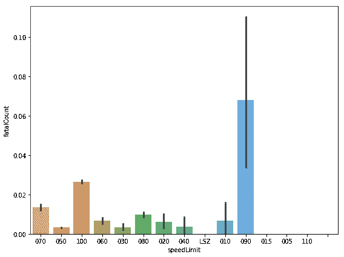

Speed limit and crash fatality count

探索天气还表明，雾和强风在死亡人数方面的百分比最高。雨、雪和霜的影响也很大。

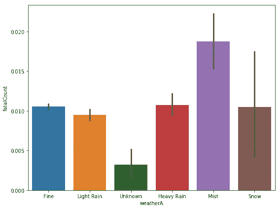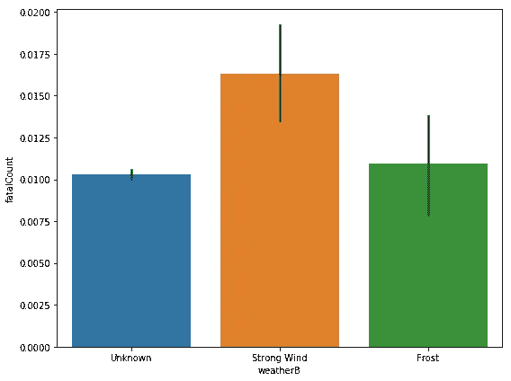

Impact of weather in crash fatalities

## 地理数据探索

地理数据可视化清楚地显示了冲突发生的位置。正如你可能已经预料到的，大多数车祸发生在道路上，而且大多发生在城市里。

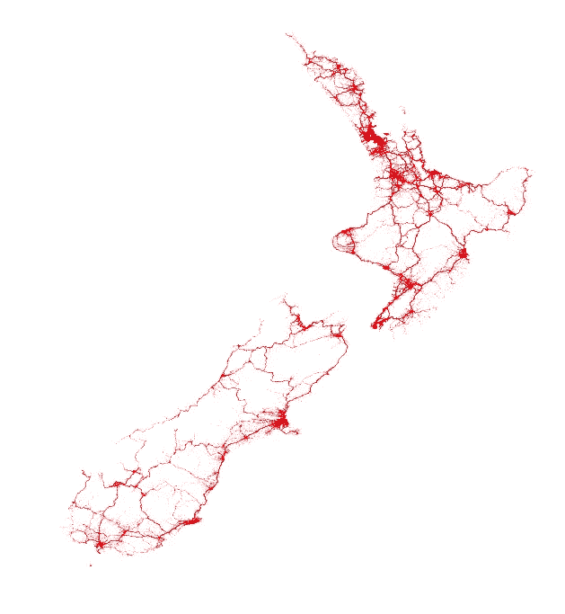

All vehicle crash points

让我们来看看奥克兰聚集在一起的车祸。

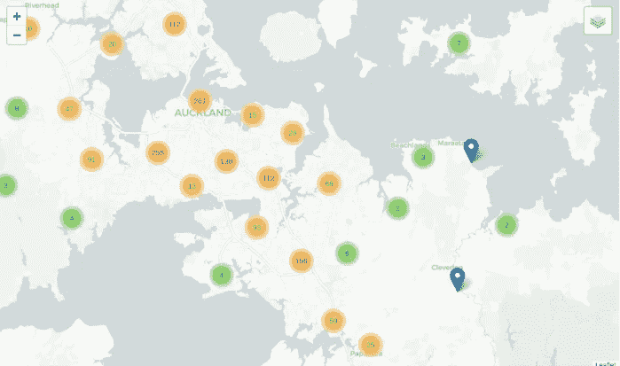

Some Clustered crash Points in Auckland, New Zealand.

## 机器学习

我们可以用不同的方式处理这个问题的建模部分。我们可以将其视为一个回归问题，并根据碰撞数据集的属性预测死亡人数。我们也可以把它作为一个分类问题来处理，并根据碰撞数据集来预测碰撞的严重程度。在这个例子中，我将把它作为一个回归问题来处理。如果您想尝试一下，可以随意构建一个分类模型。基本上是同样的方法。在这种情况下，我不会进行任何特征工程，我认为我们拥有的属性足以建立一个基线，我们可以随时重新访问它，并在以后进行特征工程，以提高我们的模型准确性。

我们首先需要将分类特征转换成数值。我们可以像这样使用 Sklearn 库:

```
# Label encoder
from sklearn.preprocessing import LabelEncoder
lblE = LabelEncoder()
for i in df:
    if df[i].dtype == 'object':
        lblE.fit(df[i])
        df[i] = lblE.transform(df[i])
```

然后，我们将数据分为因变量和自变量以及训练和验证集，以便稍后评估我们的模型结果。

```
# Let us split our data into training and validation sets
X_train, X_test, y_train, y_test = train_test_split(df.drop('fatalCount', axis=1), df.fatalCount, test_size=0.33, random_state=42)
```

现在，我们准备将机器学习模型应用于我们的数据。我通常从随机森林开始，这是一种基于树的算法，在许多数据集上表现良好。

```
m = RandomForestRegressor(n_estimators=50)
m.fit(X_train, y_train)
print_score(m)Output:
RMSE Train:0.017368616661096157, 
RMSE Valid:0.042981327685985046, 
Accuracy Train: 0.977901052706869, 
Accuracy Valid: 0.8636075084646185
```

正如您所看到的，简单随机森林模型在验证集上为我们提供了 86%的准确性，经过一些初始微调和使用特征重要性选择，该模型可以提高到 87%。我们可以更进一步，在我们的模型中做一些改进，创建新的特性或者使用一些其他算法来提高模型性能，但是现在，这对于本文的目的来说已经足够了。以下是我们的随机森林模型的一些最重要的特征。

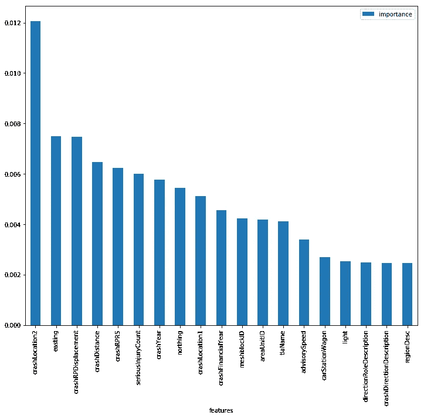

Feature Importance

## 结论

我希望你喜欢阅读这篇文章。如果你想尝试和试验代码，它可以作为 GitHub Gist 获得，你可以直接在 Google Colab 中打开笔记本。

你可以在推特@shakasom 上找到我。