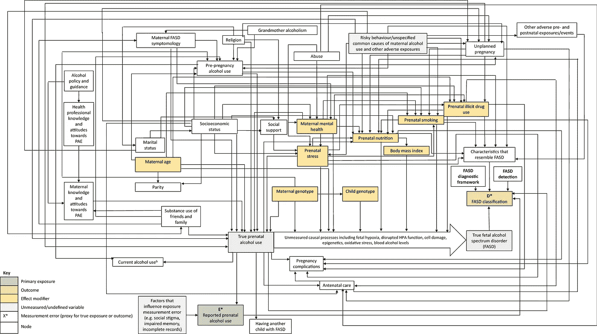
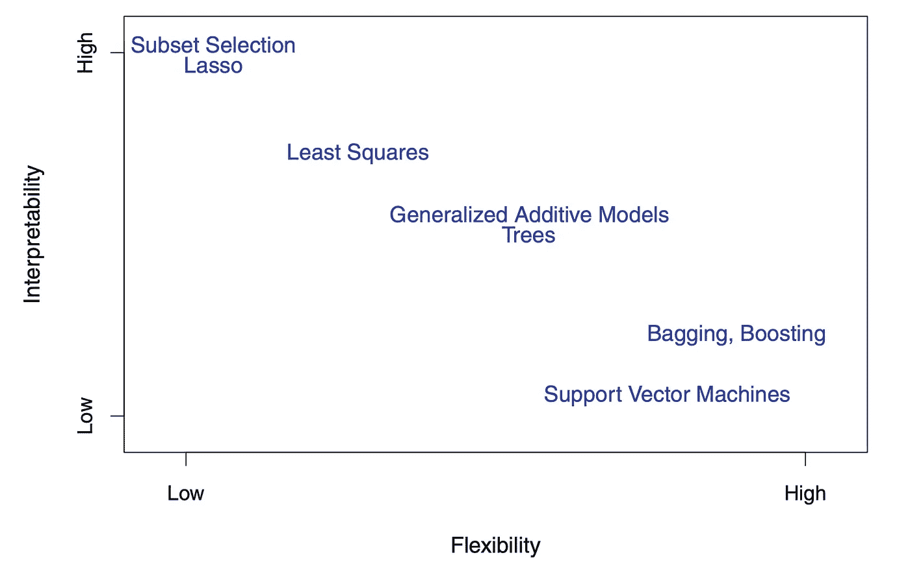
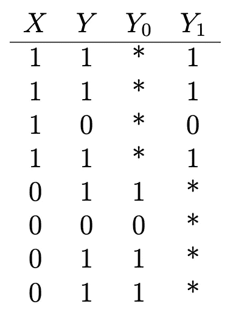
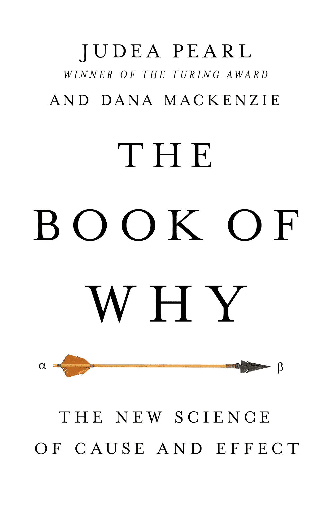

# 预测与解释

> 原文：<https://towardsdatascience.com/predicting-vs-explaining-69b516f90796?source=collection_archive---------5----------------------->

## 以及为什么数据科学需要更多的“半贝叶斯人”

A directed acyclic graph depicting the causal pathways to [foetal alcohol spectrum disorders](https://link.springer.com/article/10.1007/s00787-018-1264-3)

# 认知科学中的文化战争

我最近无意中发现了这场关于自然语言处理的非常有趣的辩论，这场辩论发生在几年前，辩论双方是该领域的老守卫者，被认为是现代语言学之父的诺姆·乔姆斯基和新守卫者，谷歌研究总监的彼得·诺维格。当评论这个领域的走向时，乔姆斯基[说了下面的话](https://www.theatlantic.com/technology/archive/2012/11/noam-chomsky-on-where-artificial-intelligence-went-wrong/261637/?source=post_page---------------------------):

> “假设有人说他想取消物理系，并以正确的方式去做。“正确的”方法是将视频之外发生的事情的无数录像带，输入最大、最快的计算机，数十亿字节的数据，进行复杂的统计分析——你知道，贝叶斯这个和那个——你会得到某种关于窗外接下来会发生什么的预测。事实上，你得到的预测比物理系给出的要好得多。好吧，如果成功被定义为得到大量混乱的未分析数据的合理近似值，那么这样做比物理学家做的方法好得多，你知道，没有关于无摩擦平面的思想实验等等。但你不会得到科学一直致力于的那种理解——你得到的只是正在发生的事情的近似值。”

乔姆斯基在其他地方反复强调了这种观点:当前对自然语言处理成功的定义——即预测准确性——并不科学。将“一些巨大的文本语料库”扔进“复杂的机器”仅仅是“近似未分析的数据”，或者“蝴蝶收集”，这不会导致对语言的“真正理解”。他认为，科学的主要目标是“发现一个系统实际上如何工作的解释原则”，而实现这一目标的“正确方法”是“让理论指导数据”:通过精心设计的实验，抽象出“不相关的干扰”，研究系统的基本性质——这是自伽利略以来现代科学一直采用的方法。用他自己简洁的话来说:“只是试图处理未经分析的混乱数据不太可能让你有所作为，就像它不会让伽利略有所作为一样。”

Norvig 随后在一篇长文[中回应了乔姆斯基的观点，这篇长文挑战了乔姆斯基关于科学成功的概念，并证明了使用概率模型来代表人类语言处理的合理性。Norvig 指出，事实上，语言处理的所有主要应用领域——搜索引擎、语音识别、机器翻译和问题回答——都由经过训练的概率模型主导，因为它们比基于理论/逻辑规则的旧工具表现得更好。他认为，乔姆斯基对科学成功的衡量——强调通过回答*为什么*来提供见解，而淡化描述*如何*的重要性——被引用理查德·费曼的话误导了:“没有证据，物理学可以进步，但没有事实，我们无法继续。”此外，也许有点打击，Norvig 将乔姆斯基对“深刻的*为什么*”的关注比作比尔·奥雷利的宗教狂热，并提到概率模型“每年创造几万亿美元的收入，而乔姆斯基理论的后代产生的收入远低于 10 亿美元，”引用了乔姆斯基在亚马逊上销售的书籍。](http://norvig.com/chomsky.html)

Norvig 推测乔姆斯基对“贝叶斯这个和那个”的蔑视实际上来自于 Leo Breiman 描述的统计建模中两种文化之间的分裂:1)T2 数据建模文化，它假设自然是一个变量随机关联的黑盒子，建模者的工作是识别最适合这些潜在关联的模型；2)*算法建模文化*假设黑盒中的关联太复杂，无法用简单的模型来描述，建模者的工作是使用能够最好地估计输入变量输出的算法，而不期望能够理解黑盒内变量的真正潜在关联。诺维格怀疑乔姆斯基并不讨厌概率模型(数据建模文化)*本身*，而是讨厌带有“千万亿个参数”的算法模型，这些模型不容易解释，因此对解决“为什么”的问题没有用处。Norvig 和 Breiman 属于阵营#2，他们认为像语言这样的系统太复杂，太随机，太偶然，不能用一小组参数来表示；抽象掉复杂性类似于“制造一个精确调谐到永恒领域的神秘设备”，这是不存在的，因此“忽略了语言是什么以及它是如何工作的要点。”在另一篇论文中，Norvig 在这一点上加倍努力，他认为“我们应该停止行动，好像我们的目标是创作极其优雅的理论，而是拥抱复杂性，并利用我们最好的盟友:数据的不合理的有效性。”他指出，在语音识别、机器翻译以及机器学习对网络数据的几乎所有应用中，像“n 元模型或基于数百万特定特征的线性分类器”这样的简单模型比试图发现一般规则的复杂模型表现得更好。

这场辩论最让我着迷的不是乔姆斯基和诺维格的分歧，而是他们的共识:他们都同意，在不了解变量的情况下，用统计学习方法分析大量数据，往往会比试图模拟变量之间相互关系的理论方法产生更好的预测。我不是唯一一个被这个问题难倒的人:我与之交谈过的许多具有数学和科学背景的人也发现这相当违反直觉:最擅长建模底层结构关系的方法难道不应该也具有最强的预测能力吗？或者，如果我们不知道事物是如何运作的，我们怎么能准确地预测任何事情呢？

# 预测与因果推理

即使在像经济学和其他社会科学这样的学术领域，预测能力和解释能力的概念也经常被混为一谈——表现出高解释能力的模型通常被认为是高度预测的。但是构建最佳预测模型的方法与构建最佳解释模型的方法完全不同，建模决策通常会导致两个目标之间的权衡。为了说明方法上的差异，下面是“[统计学习介绍](http://faculty.marshall.usc.edu/gareth-james/ISL/ISLR%20Seventh%20Printing.pdf)”中对预测和推理建模的简短总结(ISL)

## 预测建模

预测模型的基本原理相对简单:使用一组容易获得的输入 X 来估计 Y。如果 X 的误差项平均为零，则可以使用以下公式来预测 Y:

其中，是 x 提供的关于 y 的系统信息，在给定 x 的情况下，这将导致ŷ(y 的预测)。只要能准确预测 y，则的精确函数形式通常无关紧要，并且被视为“黑盒”

这类模型的精度可以分解为两部分:可约误差和不可约误差:

为了提高模型的预测精度，主要目标是通过使用最合适的统计学习技术来估计，从而最小化可约误差。

## 推理建模

当我们的目标是了解 X 和 Y 之间的关系，即 Y 如何作为 X 的函数而变化时，就不能将ф视为“黑箱”,因为在不知道ф的函数形式的情况下，我们无法确定 X 对 Y 的影响。

几乎总是这样，参数方法被用来估计建模推理时。*参数*指的是这种方法如何通过假设参数形式来简化估计，并通过假设的参数来估计。这种方法有两个一般步骤:

1.对的函数形式做一个假设。最常见的假设是，在 X 中是线性的:

2.使用数据来拟合模型，即找到β₀、β₁,…,βp 的参数值，使得:

拟合模型最常用的方法是普通最小二乘法(OLS)。

## 灵活性/可解释性权衡

你可能已经在想:我们如何知道是否有线性形式？因为不知道真实的形式，我们实际上不知道，如果我们选择的模型离真实的太远，我们的估计就会有偏差。那么我们为什么要首先做出如此强有力的假设呢？这是因为在模型的灵活性和可解释性之间有一种内在的平衡。灵活性是指模型可以产生的形状范围，以适应许多不同的可能函数形式，因此模型越灵活，它可以产生越好的拟合，从而提高其预测准确性。但是一个更灵活的模型通常更复杂，需要更多的参数来拟合，并且对的估计经常变得太复杂，以至于任何单个预测因子的关联都是不可解释的。另一方面，线性模型中的参数相对简单且可解释，尽管它在准确预测方面做得不是很好。这里是 ISL 中的一个很好的图表，它说明了不同统计学习模型中的这种权衡:

如你所见，支持向量机和 Boosting 方法等预测精度更好的更灵活的机器学习模型在可解释性上也很低。并且通过对函数形式作出强假设以使模型更易解释，推理建模在此过程中也放弃了预测准确性。

## 因果识别/反事实推理

但是等等！即使你使用一个高度可解释的非常适合的模型，你仍然不能使用这些统计数据作为因果关系的独立证据。这是因为老生常谈的“相关性不是因果关系”，这里有一个[简洁的例子](http://web.cse.ohio-state.edu/~stiff.4/cse3521/norvig-chomsky.html):假设你有 100 根旗杆的长度、它们阴影的长度和太阳位置的数据。您知道阴影的长度是由极点的长度和太阳的位置引起的，但是即使您将极点的长度设置为因变量，将阴影的长度设置为自变量，您的模型仍然会得到非常好的拟合，具有统计上显著的系数，等等。这就是为什么因果推断不能仅由统计模型做出，而需要背景知识——推断的因果关系必须由一些先前对关系的理论理解来证明。因此，因果推论的数据分析和统计建模通常在很大程度上受理论模型的指导。

…即使你有坚实的理论依据来证明 X 导致 Y，确定因果关系通常仍然非常棘手。这是因为估计因果效应涉及到识别在 X 没有发生的反事实世界中会发生什么，根据定义这是不可观察的。这里有另一个简洁的例子:假设你想确定维生素 C 对健康的影响。你有关于某人是否服用维生素的数据(如果服用，X = 1；否则为 0)，以及一些二元健康结果(如果健康，Y = 1；否则为 0)，看起来像这样:

Y₁代表服用维生素 c 的人的健康结果，Y₀代表不服用的人的健康结果。为了确定维生素 C 对健康的影响，我们将估计平均治疗效果:

𝛉 = E(Y₁)- E(Y₀)

但是为了做到这一点，我们需要知道服用维生素 c 的人如果没有服用任何维生素 c 会有什么样的健康结果，反之亦然(或者 E(Y₀|X = 1，E(Y₁|X = 0)，这在表中用星号表示，代表不可观察的反事实结果。如果没有这些输入，平均治疗效果(𝛉)无法得到一致的估计。

更糟糕的是，现在想象已经健康的人倾向于服用维生素 C，而已经不健康的人倾向于不服用。在这种情况下，即使维生素 C 实际上对健康没有任何影响，估计也会显示出强烈的治疗效果。在这里，既往健康被称为影响维生素 c 摄入和健康(x 和 y)的混杂因素，这导致对𝛉.的有偏估计

对𝛉进行一致估计的最安全方法是通过实验对治疗进行随机化，使 x 独立于 y。当随机分配治疗时，平均而言，未治疗组的结果可作为治疗组反事实结果的无偏替代，并确保没有混杂因素。A/B 测试就是在这种洞察力的指导下进行的。但是随机实验并不总是可行的(或者说是合乎伦理的，比如说，如果我们想研究吸烟或吃太多巧克力饼干的健康影响)，在这些情况下，因果关系必须通过通常非随机治疗的观察数据来估计。有许多统计技术通过构建反事实结果或模拟观察数据中的随机治疗分配来识别非实验环境中的因果关系，但正如您可以想象的那样，这些类型的分析结果通常不是非常稳健或可重复的。更重要的是，这些方法障碍不是为了提高模型的预测准确性，而是通过逻辑和统计推理的结合来提供因果关系的证据。

衡量预测模型的成功也比因果模型容易得多——虽然预测模型有标准的性能指标，但评估因果模型的相对成功更具挑战性，这可能会使它们在情感上更不令人满意。但是即使因果推论很难做出，这并不意味着我们应该停止尝试。这里的要点是，预测模型和因果模型服务于非常不同的目的，需要非常不同的数据和统计建模过程，通常我们需要两者都做。这个关于电影行业的[例子](https://hdsr.mitpress.mit.edu/pub/a7gxkn0a)说明了这一点:电影工作室使用预测模型来预测票房收入，以便预测影院上映的财务结果，评估其电影投资组合的财务风险/回报等。，但预测模型对于理解电影市场的结构和动态并为投资决策提供信息不是很有用；这是因为在电影制作过程的早期阶段(通常在发行日期之前数年)，当做出投资决策时，可能结果的方差非常高，因此基于早期阶段输入的预测模型的准确性大大降低。预测模型在接近影院上映日期时是最准确的，此时大多数制作决策已经做出，即当预测不再特别可行时。另一方面，因果推理模型允许工作室了解不同的生产特征如何影响生产过程早期阶段的潜在收入，因此对通知他们的生产策略至关重要。

# 当前对预测的过分强调——乔姆斯基有道理吗？

从定量研究文献的现状来看，不难理解为什么乔姆斯基感到不安——预测模型现在正主导着学术界和工业界。这份[对学术预印本](https://hdsr.mitpress.mit.edu/pub/a7gxkn0a)的文本分析发现，在这十年中，发展最快的定量研究领域越来越关注预测。例如，在人工智能领域，提及“预测”相关术语的论文增长了>的 2 倍，而提及“推理”相关术语的论文自 2013 年以来下降了一半。今天的数据科学课程在很大程度上忽略了因果推理方法，数据科学行业大多希望从业者专注于预测模型。即使是像 Kaggle 和网飞奖这样备受瞩目的数据科学竞赛，也总是基于提高预测性能指标。

另一方面，仍有许多领域没有对经验预测给予足够的重视，并且可以受益于机器学习和预测建模的进步。但是，将目前的事态框定为“乔姆斯基团队”和“诺维格团队”之间的文化战争似乎是一个错误的选择——我们没有理由只能选择一个，而且两种文化之间有很多相互交流的机会。有许多[的工作](/interpretable-machine-learning-with-xgboost-9ec80d148d27)正在进行，以使机器学习模型更具可解释性，我个人尤其对斯坦福大学的[苏珊·艾希](https://athey.people.stanford.edu/research)所做的工作感到兴奋，他们将机器学习技术应用于因果推理方法论(我将在接下来的几周内撰写相关文章——敬请关注！).

[http://bayes.cs.ucla.edu/WHY/](http://bayes.cs.ucla.edu/WHY/)

除了宣传朱迪亚·珀尔的作品，我想不出更好的方式来结束这篇博客，让它更完整。珀尔在 20 世纪 80 年代领导了人工智能的研究工作，允许机器使用贝叶斯网络进行概率推理，但此后成为了人工智能对概率关联的唯一关注如何阻碍进步的最大批评者。与乔姆斯基的观点相呼应， [Pearl 认为](https://www.quantamagazine.org/to-build-truly-intelligent-machines-teach-them-cause-and-effect-20180515/)“深度学习的所有令人印象深刻的成就只不过是拟合数据的曲线，”而今天的人工智能却被困在做完全相同的事情(预测和诊断/分类)，这些事情机器在 30 年前就已经知道如何做了——只是稍微好一点而已——然而预测和诊断“仅仅是人类智能的尖端。”他认为，制造像人类一样思考的真正智能的机器的关键是教会机器思考因果关系，这样机器就可以提出反事实的问题，规划实验，并找到科学问题的新答案。他在过去三十年的工作重点是为机器建立一种形式语言，以使因果推理成为可能，类似于他在贝叶斯网络上的工作，使机器能够进行概率关联。在他的一篇论文中，他声称:

> “人类的大部分知识是围绕因果关系而不是概率关系组织的，概率演算的语法不足以捕捉这些关系……正是因为这个原因，我认为自己只是半个贝叶斯。”

看起来数据科学会因为有更多的半贝叶斯人而受益。