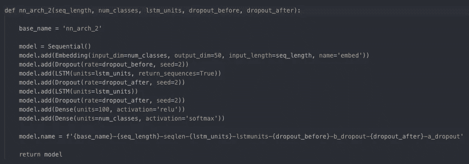
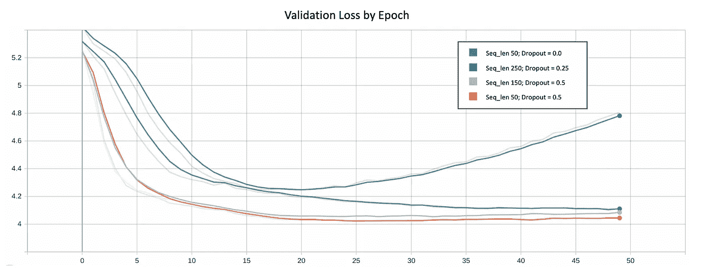
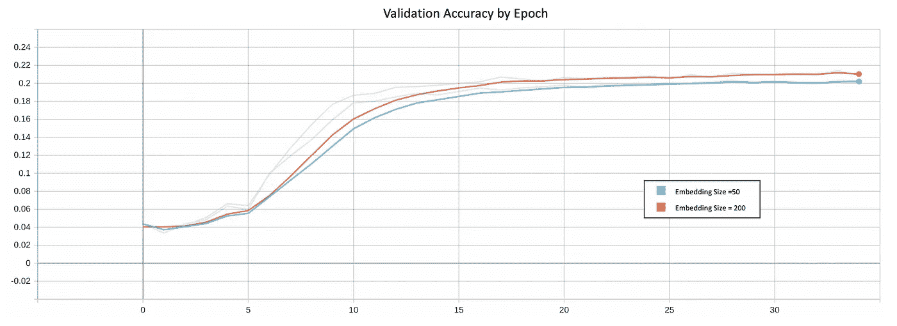
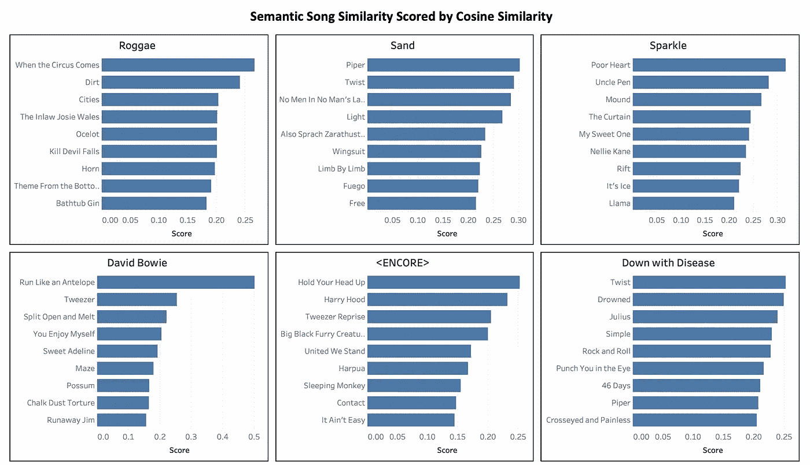
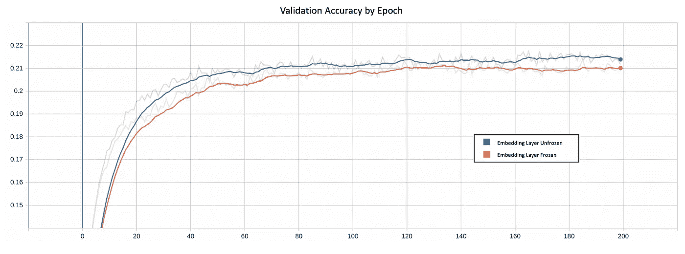
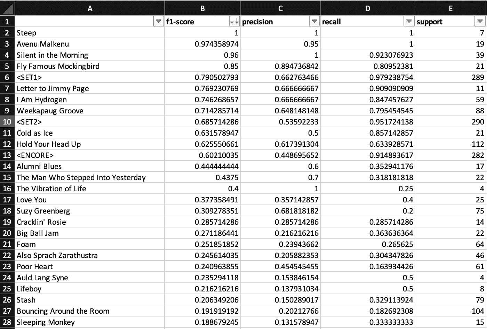
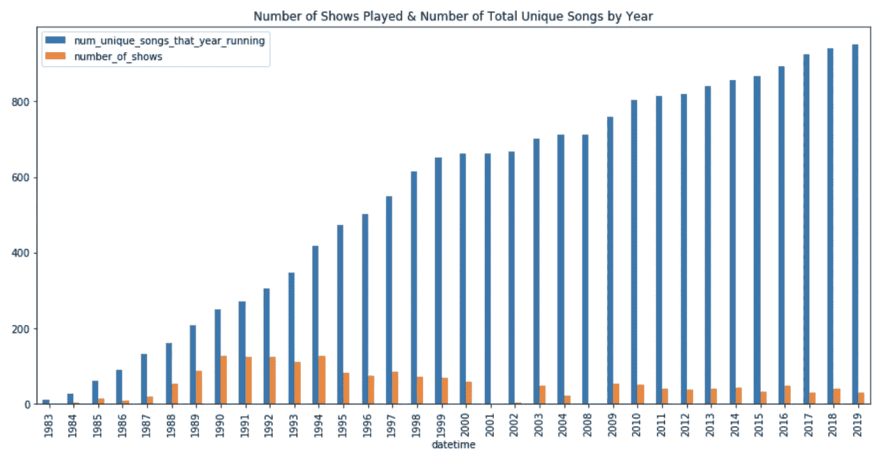
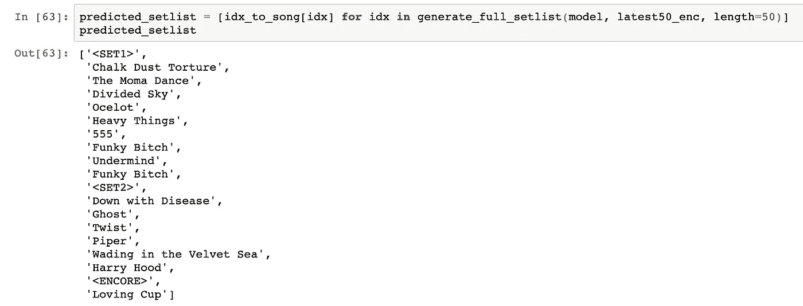

# 用深度学习预测费西合唱团接下来会放什么歌

> 原文：<https://towardsdatascience.com/predicting-what-song-phish-will-play-next-with-deep-learning-947ccce3824d?source=collection_archive---------16----------------------->

Phish, Hampton 2018

> 费西合唱团——一个标志性的现场摇滚乐队，和机器学习的世界……他们可能有什么共同点？

像绝大多数音乐艺术家的现场表演一样，对费西合唱团来说，大多数活动都是没有计划的。从乐队踏上舞台的前几天到前几个小时，没有预先确定的节目单、歌曲选择或演出持续时间。每场演出，乐队和观众都开始了一个全新的旅程，由集体能量和精湛的即兴表演推动。

我和我的朋友们多年来一直在观看费西合唱团的演出，像社区中的许多人一样，我们经常在每场演出前玩一个游戏，看谁能猜出费西合唱团的 876 首歌曲中的哪一首将在某个晚上播放。我们的游戏版本包括每个人猜演出开场，演出期间播放三首歌，以及一首安可歌曲。考虑到你(在技术上)有大约 0.11%的成功机会，如果你预测中有一个是正确的，那通常是一个*非常*美好的夜晚。

在工业界做了几年数据科学家后，我开始揭示隐藏在费西合唱团歌曲选择中的统计模式，并建立了一个模型来预测接下来会有什么歌曲。

# 方法。

我决定将这个问题设计成一个连续的多类分类任务，类似于*神经语言模型*——即:

> "给定一系列歌曲，我能准确预测下一首将播放的歌曲吗？"

在本文接下来的部分中，我将详细介绍我的数据收集/准备过程、建模练习、结果和改进计划——让我们来看看本质。

# 数据。

对我来说幸运的是，在 Phish.net 有一个很棒的团队，他们积极地维护和更新一个全面的数据库和费西合唱团的公共 API，包括:表演，节目列表，场地，歌曲等等。在编写了一个 [Python API 包装器](https://github.com/areed1242/pyphishnet)(与[迈克·阿兰戈](https://medium.com/u/3228d196577?source=post_page-----947ccce3824d--------------------------------)合作)之后，我能够检索自 1983 年以来所有 1752 场费西合唱团秀的历史数据。

Most recent 5 shows from Phish.net API with setlist data parsed and pipe delimited

## 创建训练数据集

有了语言建模方法，我通过首先丢弃不完整的集列表，然后将每个集列表按时间顺序连接到一个长列表中，并对数据进行编码(876 首独特歌曲中每首歌曲的歌曲到整数，加上所有集列表标识符)来生成训练数据。维护集合列表标识符(集合 1、集合 2、Encore 等。)提供了上下文，并且将允许模型学习到某些歌曲更有可能出现在第二集的开始部分与中间部分与再唱部分。

接下来，我创建了训练样本对，即与序列中的下一首歌曲(Y)配对的歌曲列表(X)。我将单个的连接列表分割成长度为 *L、*的 *N* 个样本，其中 *L* 成为建模的超参数。模型需要多长的序列才能准确预测下一首歌？我测试了长度为 25、50、100、150 和 250 的序列，稍后会有更多的测试。然后，我在大约 37，000 个样本上创建了一个 80/20 的训练/验证分割，以评估我的模型。

Example of one sample training pair

# 建模。

虽然有许多机器学习模型可以应用于这种情况，但我选择实现一种深度学习方法，因为它在我的语言建模隐喻任务中具有最先进的性能。具体来说，我选择测试了一个具有嵌入层和 LSTM(长短期记忆)细胞的序列 RNN(递归神经网络)的几种不同配置。RNN 氏症的循环性质使得跨时间步骤的信息共享成为可能，这使得所学的知识能够以“记忆”状态在网络中持续存在。出于这个原因，这个架构非常适合学习我们的集合列表建模问题的顺序性质。我的模型的其他组件是:

*   **歌曲嵌入层** — 类似于 NLP 世界中的单词嵌入…我选择为 876 个类别中的每一个类别嵌入一个 *N* 维向量，希望该模型将学习关于每首歌曲的潜在因素，以提供用于后续预测层的更丰富的特征集。这里的嵌入大小成为另一个可探索的超参数。稍后将对此进行更多分析。
*   **LSTM 细胞**——香草 RNN 细胞非常擅长学习和联想短期依赖性。如果我们的输入序列只有一个集合列表(~ 10–20 首歌曲)，这是没问题的，但是因为我们需要监视和跟踪许多节目的长期依赖性，所以我们的输入序列有 50–250 首歌曲长。LSTM 单元引入了一个被称为“单元状态”的学习参数，该参数为网络提供了随时间选择性地“记住”或“忘记”重要或不重要的长期依赖性的选项。
*   **退出** —在【相对】小数据集上应用神经网络的一个常见问题是过度拟合的诅咒。我在这里提出的深度学习架构有> 300，000 个学习参数，这意味着模型很容易从它看到的训练数据中“学习太多”，而不能很好地推广到新数据。为了防止这种情况发生，我实现了退出正则化，在训练期间随机“关闭”一些神经元的激活。这种有意阻碍模型学习的方法在防止过度拟合方面非常有效。
*   **学习率探测器** —选择最佳学习率对于及时有效地训练神经网络至关重要。学习率太高，你的模型会发散；太低，你的模型将永远训练，损失很少改善。我加入了这个令人敬畏的 [LR Finder Keras callback](https://gist.github.com/jeremyjordan/ac0229abd4b2b7000aca1643e88e0f02) ，它绘制了几个小批量运行的学习率与损失的关系，以帮助您可视化最佳学习率。我还添加了一个平滑特性，采用指数移动平均来帮助清理视觉效果，以便于解释。最佳学习率对应于损失下降最大的*——如下图绿色所示。*

**

*Example learning rate finder with smoothed plot (right)*

*   ***Adam 优化器** —Adam 通过结合每参数学习率(来自 AdaGrad)和动量(来自 RMSProp)的概念，改进了基本随机梯度下降(SGD)。简而言之，这种增强的优化器使您的模型能够更快地学习，并且已经成为该领域的一种“首选”技术。*

*有了这些模型和优化器组件，下面是用于实验的两种体系结构变体:*

## *模型架构 1*

**

*Sequential model with Embedding Layer, Dropout Layer, LSTM Layer, Dropout Layer, and a Dense Layer*

## *模型架构 2*

**

*Same model as above, but two stacked LSTM Layers for additional learned parameters*

# *实验。*

## ***迭代 1 — *“广撒网”****

*锁定模型组件后，我通过网格搜索以下超参数的各种设置，撒下一张大网:*

*   ***架构:**一层与两层 LSTM*
*   ***序列长度:**模型需要多长的序列来正确学习下一首歌曲？初始设置为 25、50、100、150 和 250 首歌曲。但是请记住，这里的权衡是序列越长，可用的训练示例数量越少…*
*   ***LSTM 单位数:**我在 50 和 100 之间切换。*
*   ***LSTM 之前辍学:** 0%-70%(增量)*
*   ***LSTM 之后的退学率:** 0%-70%(递增)*

**

*Validation Loss vs. Epoch from four trained models (The ~100 other trained models have been hidden for interpretability)*

***调查结果***

1.  *辍学是至关重要的，但不要太多。看起来大约 50%的辍学允许适当的学习而不会过度适应。*
2.  *正确的学习率确实能加快收敛。*
3.  *用一个更大的模型来解决问题并不一定有帮助。更多的参数(即层、LSTM 单位)并不一定等同于更大的学习潜力，并使模型更容易过度拟合。*
4.  *大约 50 的输入序列长度对于这个问题的建模是理想的。任何更短的时间，模型都无法学习某些依赖关系，任何更长的时间，模型都会失去焦点，并强调学习不太重要的长期依赖关系。*
5.  *许多不同的超参数设置和模型尺寸似乎集中在相同的损失水平附近，对应于大约 18%到 20% 的 ***。****

## ***迭代 2 — *“嵌入深潜”****

*有了这些知识，我开始理解嵌入表示对我的模型的影响，看看是否有改进的空间。首先，我将嵌入向量的大小从固定长度 50 切换到 100、150、200 和 250。很明显，较大的嵌入大小对整体分类准确度有轻微的改善(约 21%)，因为它允许模型为每首歌曲学习更多细微的特征。*

**

***解读***

> *这些习得的嵌入实际上代表了什么？*

*为了更好地理解模型所学到的东西，我提取了嵌入，执行了主成分分析(PCA)以将它们折叠成三维，并以 3D 形式绘制它们。*

**

*3D visualization of principle components from song embeddings — contextually similar songs to “Ghost” are highlighted in yellow*

*正如所料，该模型已经学会了将出现在相似背景下的歌曲联系起来。上图展示了 20 首与《人鬼情未了》最相似的歌曲——费西合唱团的粉丝们可以在这里找到明显的联系。请注意它们在 PCA 向量空间中出现得有多近…*

*看到这些学习向量*确实有改进的空间，我通过单独创建自己的歌曲嵌入扩展了这个想法。通过训练一个名为 CBOW(连续词袋)的 Word2Vec 算法，我创建了包含双向上下文和神经网络只进上下文的向量。使用这些大大改进的歌曲向量之间的余弦相似性揭示了一些真正有趣的模式。**

**

*Six Phish songs with most similar songs (sorted by descending cosine similarity)*

*上图显示了一首给定的歌曲，以及 Word2Vec 模型学习到的 9 首最相似的歌曲。在这个意义上，相似性意味着歌曲出现在相同的上下文中或者在集合列表中的位置。对于知道这些歌曲的潘，你会立即认同:*

*   *与大卫·鲍依有关的乐观、高能的“谷仓燃烧者”*
*   *像*这样短小、快节奏的蓝调小曲闪耀着*的光芒，在更突出的歌曲之间起到连接的作用*
*   *节奏较慢、旋律不连贯的音乐*
*   *老套而当之无愧的流行歌曲*

*在迁移学习的尝试中，我然后利用这些上下文丰富的嵌入作为我的神经网络嵌入层的初始化参数(而不是随机的)。在嵌入层冻结和不冻结的情况下训练网络；后者被证明更有效，允许我将 ***的准确度略微提高到 21.8%*** 。*

**

# *把它包起来。*

## *21.8%的准确率有多好？*

*首先，这比随机机遇好得多。非常令人惊讶的是，一个统计模型可以理解和解释我多年来内在化的一些微妙关系——特别是考虑到它对这些歌曲实际上听起来是什么样子一无所知。然而，现实情况是，模型(像我们人类一样)非常擅长学习出现在一些特定模式中的歌曲，而在其他模式中则相当糟糕。这些特殊的模式发生在歌曲出现的时候:*

1.  *费西合唱团有几首歌曲几乎总是一首接一首地并排出现。我们的模型在很大程度上正确地处理了后续的歌曲。(例如。《麦克的歌》>《我是氢》>《weeka paug Groove》**或**《马》>《清晨无声》**或**《一扫而光》>《险峻》)*
2.  *作为集合开启器/闭合器*
3.  *作为安可*
4.  *当猜测是休息/再来一次的时候*

**

*Songs that the model performs best on (sorted by F1 Score)*

## *改进的余地*

*这种建模方法的一个巨大问题是，它只*关注顺序数据……这意味着它没有围绕费西合唱团的分类和抽象知识的概念。例如，该模型不识别什么是[较新的] 3.0 歌曲，因此，不理解这些歌曲与[较旧/现在较罕见的] 1.0 歌曲相比更可能现在播放。一个巨大的改进将是纳入分类数据(时代，地点，年份，专辑等)。)与集合列表序列一起输入到神经网络中。**

*另一种改进方法(或至少改进相关性)是排除前 10-15 年的数据。如下所示，费西合唱团在 90 年代早期表演了他们的大部分节目(1994 年有 128 场演出！)当他们播放的独特歌曲相对较少时(今天的 850 多首中的约 375 首)，这意味着大多数我们的训练数据严重偏向于学习与这 375 首歌曲相关的模式(在费西合唱团 1.0 期间)。一个很好的例子就是《冷若冰霜》>《脆皮罗茜》>《冷若冰霜》；该剧在 1992-1995 年间上演了 46 次，此后只上演了 4 次。*

**

*让事情变得更复杂的是，费西合唱团当时定期播放某些歌曲，现在很少播放了。更不用说，自费西合唱团 1.0 以来推出的新歌[并继续出现]总体上播放频率更低，因此可供学习的模式也更少。因此，这是一个很难建模的问题。*

## *集合列表生成*

*使用新训练的神经网络[巧妙地命名为 TrAI]，我们可以递归地进行预测，根据最近播放的 50 首歌曲的输入，生成费西合唱团的下一个曲目列表。不再赘述，以下是 TrAI 对 2019 年 11 月 29 日在罗德岛普罗维登斯举行的秋季巡回赛揭幕战的预测:*

**

*TrAI’s predicted setlist for next show in Providence, RI on November 29th 2019*

*这个项目使用的工具有:Python、Keras、Tensorflow、Gensim、Jupyter、Anaconda、Tableau 和 Tensorboard。所有支持代码都可以在我的 Github repo [这里](https://github.com/areed1242/phish-setlist-modeling)找到。*

***感谢阅读——拿骚见！***