# 使用大数据分析预测漫威人物是善是恶。

> 原文：<https://towardsdatascience.com/predicting-whether-a-marvel-character-is-good-or-evil-using-big-data-analytics-fb2ed78c3610?source=collection_archive---------19----------------------->

Marvel Universe

# 摘要

本文利用统计方法、数据挖掘技术和 Python 来创建超级英雄角色对齐的预测模型。

首先，我们选择要利用的数据集，然后对其进行准备、处理和分析。然后，将清洗后的数据导入数据挖掘工具；Weka，创建一个可行的预测模型，可以根据字符的描述来预测排列。然后对这个结果进行测试和讨论，以描述不同的结果。

**本文假设您对 Python 和 Pandas 有一定的了解，因此不会对这些主题进行过多的讨论。如果你有任何问题，请发邮件给我，地址:**[**【vfrantzvaag@gmail.com】**](mailto:vfrantzvaag@gmail.com)**。**

**关键词**:数据挖掘、python、统计学、分析学、超级英雄

# 数据采集

本项目中使用的数据集是在 kaggle.com 从用户 FiveThirtyEight 处获得的，由 Kaggle 维护，增强了其可信度。([https://www . ka ggle . com/fivethirtyeight/fivethirtyeight-comic-characters-dataset](https://www.kaggle.com/fivethirtyeight/fivethirtyeight-comic-characters-dataset))。数据集包含两个 CSV 文件和一个描述数据文件中内容的自述文件，并于 2019 年 1 月 31 日下载。尽管数据集包含 DC 和漫威的数据，但我决定只使用漫威的数据，因为它们是最受欢迎的(Statista、Finder、Boxofficemojo ),而漫威数据集包含的行数是它的 2.3 倍。此外，这些宇宙是由不同的团队创建的，这意味着我们从一个宇宙中推断出的东西可能与另一个宇宙不相关。

# 数据集描述

漫威数据集包含了漫威维基百科中所有记录的字符的信息，更具体地说，大约有 16400 个不同的字符。下载数据集并使用 Pandas package for Python，我可以请求列表顶部的五个元素并检查 CSV 文件的格式，还可以请求行数和列数。

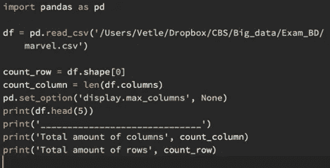

Checking out the dataset using the framework Pandas for Python. (The set_option method is just for printing all the columns in the terminal)

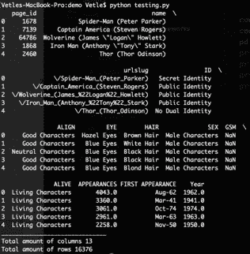

What is outputted in the terminal after the previously written Python code.

表中的列有:page_id、name、urlslug、id、align、eye、hair、sex、GSM、alive、appearances、first appearance 和 year，它们在数据集附带的自述文件中有所描述。

# 数据准备

准备数据集以供使用是确保质量的关键步骤，包括减少数据中的异常和冗余。此过程的第一步是删除对最终案例没有帮助的列；*基于特征预测字符对齐*。这可以用正常的逻辑来完成；删除不表达特征的列。与最终案例不相关的列是:

- **page_id:** 维基百科页面的唯一标识符

- **Urlslug** :角色的维基站点的 URL

**GSM:** 如果角色是性别或者性少数。会提供信息，但是只有 90 行的值可以用以下 python 代码进行验证:

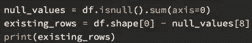

Checking how many valid entries there are in the GSM column.

- **出场次数**:漫画中的出场次数

——**第一次出场:**漫画中的第一次出场

- **年**:漫画中的人物第一次出现

考虑到我发现这些列对我的目的来说无关紧要，我用 Python 将它们从数据集中删除。

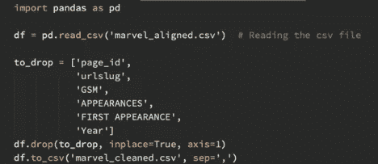

Removing the insignificant values from the dataset.

由于这将是我的模型的训练集，因此“Align”列中必须有一个值，以便它能够使用数据进行训练，因此我删除了“Align”列中包含 *NULL* 的所有列，因为这不会提供任何信息。“Align”列当前有三个可能的值；好的，中立的，坏的。在这个项目中，我主要感兴趣的是弄清楚一个角色是否邪恶，并考虑到一些心理学家将“好”定义为“*有移情和同情的能力”*(史蒂夫·泰勒，2013)，我将把“中性”和“好”列组合在一起。为了能够执行计算，为了简单起见，我还将列转换为数字；1 表示他们是邪恶的，0 表示他们是善良/中立的。

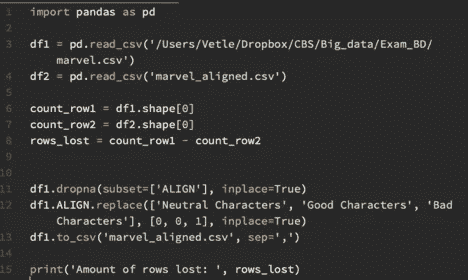

Python code for joining the neutral and good characters, as well as converting all columns to numeric values. Also calculating the amount of rows lost when dropping the null values.

现在，我可以从原始文件中减去新创建的文件中的行数，并看到通过删除“Align”列中的空值，总共丢失了 2812 行。

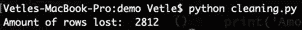

The outputted code for displaying how many rows we lost with the previous Python code.

现在对齐列已经准备好了，不重要的列已经被删除，我可以导入清理过的。CSV 文件导入统计工具；JMP 要做“模型检查”。我将目标变量设置为 Align，并选择其余的列作为模型效果，除了“name ”,因为它更像是一个标识列。这给了我一个整体模型测试的概述和一个效果总结。结果反映了显著性值为 0.95 的无效假设的总结，这意味着低于 0.05 的 p 值提供了足够的理由来抛弃无效假设，从而推断出另一个假设；这些属性有助于对齐。无效假设和替代假设如下所示:

H0 : β1 = β2 =… βg = 0

哈:βi ≠ 0

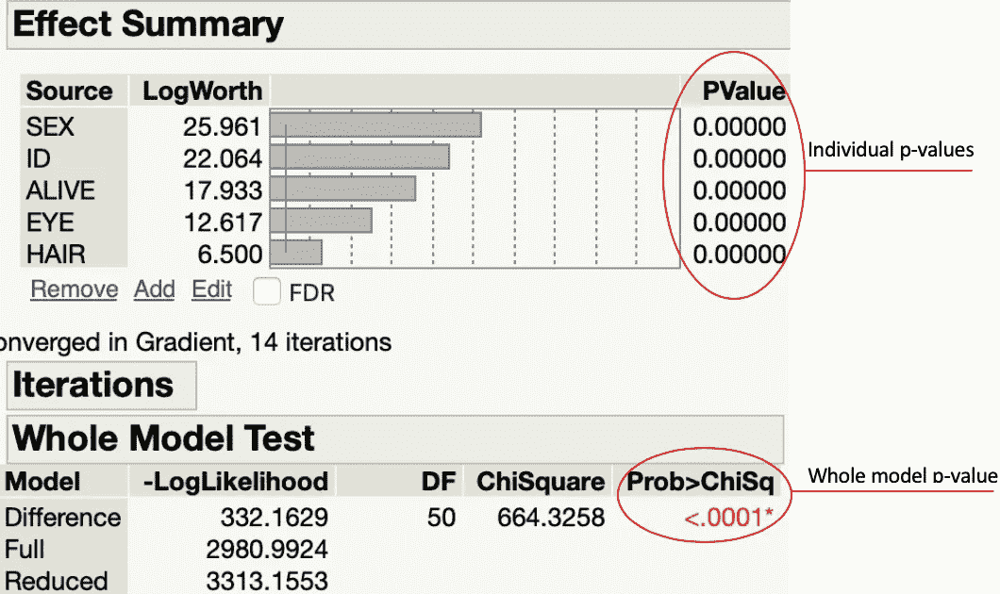

Here we are looking for P-values that stick out (being over 0.05). If we for example would’ve kept the attribute for the URL to the wiki site of the character, this probably would’ve given us a p-value higher than 0.05, signifying that we probably could remove that attribute.

查看汇总统计数据，可以注意到没有一个个体或整体模型的 p 值峰值超过 0.05；强调另一种假设，即有属性给出关于排列的信息，并且所有的单个属性都有贡献。

最后，我必须为我的数据挖掘工具准备文件；WEKA——一个。arff 文件是最合适的格式。由于 Weka 在解析 CSV 文件时遇到了问题，我无法使用内置转换器，只能选择外部转换器；伊利亚·库佐夫金[【1】](#_ftn1)做的一个。然而，我在导入新创建的时仍然遇到了问题。arff 文件，因为在一些列中有特殊字符——我在 Sublime Text 中使用 find-all 搜索功能手动删除了这些字符。

【https://ikuz.eu/csv2arff/】

# 数据分析

# 形象化

为了进一步了解不同的列如何影响字符的对齐，我将清理后的数据集导入到一个数据可视化工具:Tableau 中。我的主要兴趣点是比较字符特征如何影响对齐列。

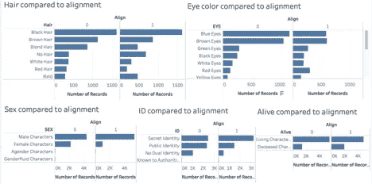

Tableau dashboard comparing the characteristics to alignment. (Remember that Align = 1 is evil and Align = 0 is good/neutral.

从对齐方面来看特征之间的差异，可以看到有许多共同的元素，但在某些方面有所不同。如果我要根据这些信息构建一个“刻板印象”的角色，一个邪恶的角色将没有头发，红眼睛，是一个男性角色，有一个秘密的身份，并且已经去世——而一个好的角色将有金发，蓝眼睛，是一个女性角色，有一个公共身份并且活着。这些角色在你看来是恶是善？对我来说是的。

# 数据挖掘技术

现在，数据已经准备好、清理和分析完毕，我可以将它导入数据挖掘工具“Weka”来创建预测模型。我们现在进入分类领域，目的是识别一个物体属于哪一类。分类是监督学习的一种形式，我们创建一个模型，将目标变量的值设置为特征的函数(Provost & Fawcett)，监督意味着我们为算法提供一个带标签的数据集进行训练。

目的是通过使用分类来预测作为特征结果的比对列，但是有大量不同的分类算法，这意味着我必须找到最适合的一个。使用 Weka 中的“分类器”栏，我可以检查不同的预设选项:

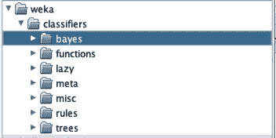

Looking into what classification algorithms Weka offers us by default.

选择正确的算法至关重要，这样才能获得最佳结果，并确保尽可能高的模型精度。通过利用由 [SciKit](https://scikit-learn.org/stable/tutorial/machine_learning_map/index.html) 创建的“算法备忘单”，一个显示算法的不同前提的流程图(标有绿色)，我从下面他们的网站绘制了图中的路径:

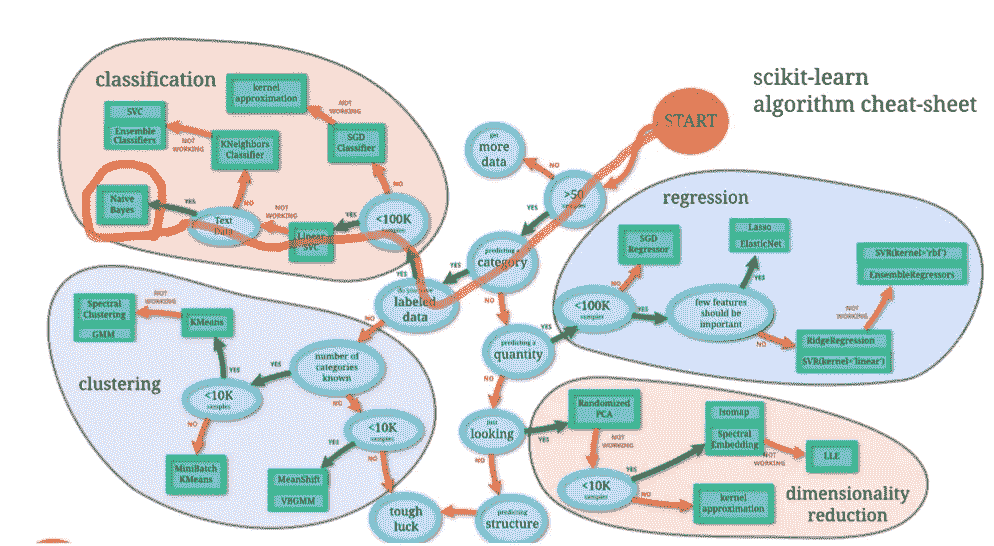

Choosing our path from the SciKit-learn algorithm cheat-sheet (marked in red).

考虑到 SVC(支持向量机)在 Weka 中试用过，但没有在训练集上运行，合理的选择是使用“朴素贝叶斯”算法。

朴素贝叶斯模型的一个明显优势是它可以很好地处理缺失值，这对于包含一些空列行的漫威数据集非常有用。(Witten 等人)朴素贝叶斯的前提之一，或者更确切地说，为什么它是“朴素的”，是因为它在变量独立的假设下运行。使用模型时必须考虑到这一点；这些列之间没有相关性，或者它们互不影响。尽管这有点无效，但考虑到这是例如头发和眼睛颜色之间已证实的相关性(Lin 等人)，这只是用于模型计算，我们可以使用当前的假设来建立有效的模型。

导入被净化的。arff 文件到 Weka 中，我首先在我的训练数据集上运行朴素贝叶斯模型，不改变任何参数，并且在所有模型测试中将交叉验证设置为标准值 10，其中数据被分成 10 份；一些用于测试，一些用于训练。(Witten 等人)我主要感兴趣的 KPI 是整体模型精度(正确分类的实例)，目前是 65.7%。

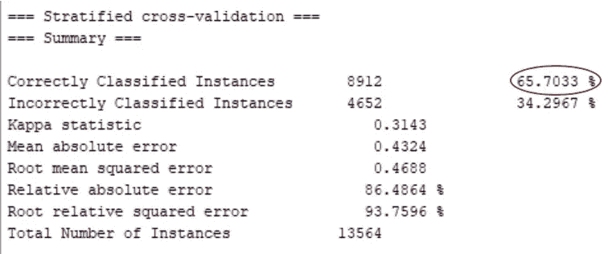

Summary of running a standard Naïve Bayes algorithm on my training set.

以 65.7%作为我的基准利率，我寻求提高模型的准确性。经过反复试验，我发现使用核密度估计(KDE)可以将准确率提高近 2%至 67.03 %。KDE 没有假设模型的任何特定分布，这适合于这种情况，例如，具有这种数据的标准分布可能难以实现。在我看来，追求明显更高的比例是有问题的，因为不可能根据每个角色的特征对他们进行正确的分类——一个人即使没有头发和红眼睛也可以很好。

现在我已经找到了一个成功率可以接受的合适模型，我想在我自己的一些训练数据上测试这个模型的表现如何。从原始数据集中提取 10 个字符；其中五个是“好的/中性的”，五个是“坏的”，并用“？”替换对齐列。

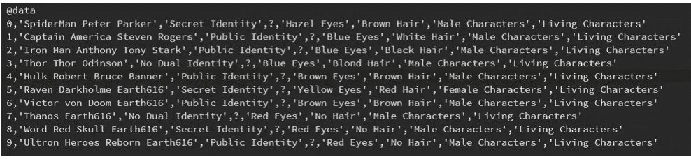

Taking some famous characters and labeling the alignment column ‘?’, in order to test out how well our model does in practice.

使用这个作为训练集，我在我创建的模型上重新评估它，并得到以下输出:

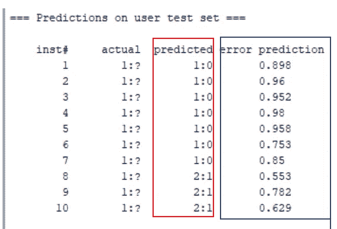

Summary of running our model on the ten aforementioned characters. In the predicted column (red), 1:0 tells us that the character is good and 2:1 tells us that the character is bad. The blue column tells us how certain the model is about its prediction.

在“预测”列下，所有前五个实例都被正确分类(比对为零是好的/中性的)，而在后五个实例中，五个实例中有三个(60%)被正确分类，在这个*小*训练集中总共有 80%的实例被正确分类。还可以注意到，在“错误预测”栏下，该模型在分类“好的/中性的”字符方面比“坏的”字符更确定。其原因可能是许多“坏角色”有多重身份/人格，在做邪恶的行为时会改变形态或外表——正如下面可以看到的，两个错误分类的例子；毁灭博士和瑞雯·达克霍姆有一种“变化的眼光”:

The shifting look of the incorrectly classified instances.

# 讨论

根据一个人的特征来预测他的婚姻有很多伦理问题。陆荣兴等人认为，保护隐私并以道德和匿名的方式处理数据对于捍卫我们的自由是必要的。在这篇论文中，我没有预测真实的人的排列，因此没有暴露于这些法律和伦理问题。然而，如果这个模型要应用到其他地方，也就是说，如果有人要用它来预测他们刚刚遇到的人是好是坏，就必须考虑这些问题。

你可以有很多种可能性来描述一个角色，数据集中有描述超级英雄更详细的信息(力量，起源等等)。).然而，一个人必须将自己限制在一个特定的阈值，一个模型才是可行的。即使更多的信息可以导致更准确的模型，这个模型背后的主要思想是基于短暂的一瞥或谣言来预测角色的排列。过多的信息或复杂性也会导致模型从数据中捕获过多的噪声，从而导致所谓的“过度拟合”(Witten 等人)。

# 参考

## 文章

1.《票房魔咒》创下全球票房纪录，更新于 2019 年 2 月 8 日

可在[https://www . box office mojo . com/all time/world/world wide openings . htm](https://www.boxofficemojo.com/alltime/world/worldwideopenings.htm)找到

2.截至 2017 年 8 月，美国公众对漫威电影和 DC 漫画电影的偏好，Statista，15.08.2017

可在:[https://www . statista . com/statistics/754142/marvel-DC-movie-preference/](https://www.statista.com/statistics/754142/marvel-dc-movie-preference/)找到

3.超级英雄统计；DC 对漫威，发现者，2017 年 11 月 16 日

可在:[https://www.finder.com/superhero-statistics](https://www.finder.com/superhero-statistics)找到

4.预测恐怖行为的准确率超过 90%，宾厄姆顿大学，2017 年 3 月 2 日

可在:[https://www . science daily . com/releases/2017/03/170302115740 . htm](https://www.sciencedaily.com/releases/2017/03/170302115740.htm)找到

5.预测恐怖行为的准确率超过 90%，宾厄姆顿大学，2017 年 3 月 2 日

可登陆:[https://www . science daily . com/releases/2017/03/170302115740 . htm](https://www.sciencedaily.com/releases/2017/03/170302115740.htm)

6.中国已经开始用令人毛骨悚然的“社会信用”系统对公民进行排名，亚历山德拉·马，2018 年 4 月 8 日

可在:[https://nordic . business insider . com/China-social-credit-system-penalty-and-rewards-explained-2018-4？r=US & IR=T](https://nordic.businessinsider.com/china-social-credit-system-punishments-and-rewards-explained-2018-4?r=US&IR=T)

7.“善”和“恶”的真正含义，史蒂夫·泰勒，2013 年 8 月 26 日

可在以下网址找到:[https://www . psychologytoday . com/us/blog/out-the-darkness/2013 08/the-real-meaning-good-and-evil](https://www.psychologytoday.com/us/blog/out-the-darkness/201308/the-real-meaning-good-and-evil)

## 文学

8.关于超级英雄的起源:从生活大爆炸到动作漫画，克里斯·加瓦勒，2015

9.对恐怖主义有效预测市场的道德分析，Dan Weijers & Jennifer Richardson，2014 年

10.业务数据科学，Provost & Fawcett，2013 年

11.头发和眼睛颜色的遗传重叠；威廉森 G；阿卜德拉维 A；巴特尔斯 M；Ehli EA 戴维斯·葛；布姆斯马·迪和霍滕加·JJ，2016 年 12 月 19 日

12.数据挖掘；实用机器学习工具和技术，Ian WittenEibe Frank & Mark Hall，2011 年

13.走向大数据时代的高效和隐私保护计算——卢荣兴；朱晖；西盟刘；刘和，2016。