# 在泰坦尼克号数据集上预测谁将幸存

> 原文：<https://towardsdatascience.com/predicting-whos-going-to-survive-on-titanic-dataset-7400cc67b8d9?source=collection_archive---------6----------------------->

## 有志和初学者数据科学家的权威指南

## 您的首次数据科学之旅、探索性数据分析(EDA)和 Kaggle 提交的全面指南


Source: KWMP

> 上船啦！与泰坦尼克号一起开始您的数据之旅
> 
> 欢迎来到数据科学 SS。我叫 Vincent，希望您会喜欢我们的数据科学首次旅程。今天，我们将和逝去的战友泰坦尼克号一起在大西洋中航行。我们要去仔细探索数据冰山，航行机器学习大海，准备有见地的下船。希望你和我以及数据科学 SS 一路顺风。

欢迎光临！！本文的目的是通过著名的 [Kaggle Challenge](https://www.kaggle.com/c/titanic) 新手挑战赛——“泰坦尼克号:灾难中的机器学习”，来激起你对数据科学的兴趣

在这篇文章中，你将开始你的第一次探索性数据分析(EDA)和机器学习，以预测泰坦尼克号乘客的存活率。对于大多数入职数据科学家来说，这是一个创世纪的挑战，它将帮助你走向成功。希望这篇文章对你有所启发。上船啦！！

# 技术先决条件

我们将使用 Jupyter Notebook 和几个数据科学 Python 库。如果你还没有安装 [Anaconda](https://www.anaconda.com/distribution/) 在你的 [Windows](https://medium.com/@GalarnykMichael/install-python-on-windows-anaconda-c63c7c3d1444) 或者 [Mac](https://medium.com/@GalarnykMichael/install-python-on-mac-anaconda-ccd9f2014072) 上。或者，您可以关注[我的笔记本](https://github.com/VincentTatan/PythonAnalytics/blob/master/Youtube/Python%20Pandas%20Tutorial%20(Titanic%20Data).ipynb)并享受这个指南！

# 台阶

对于大多数初学者来说。不要担心，我将指导您完成这篇文章，进行端到端的数据分析。以下是今天要探索的几个里程碑:

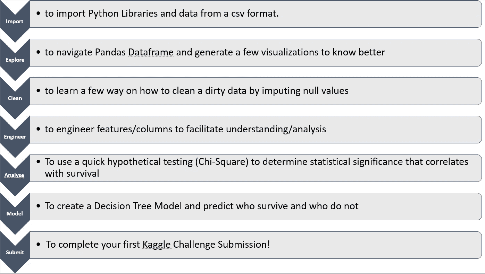

What we are going to learn

> 咻，离我们到达第一个目的地还有很长的一段路。我们开船吧，好吗？

# 导入


Importing Library. Source: unsplash

## 导入库

**Python 库**是一个函数和方法的集合，允许你在不写代码的情况下执行许多动作(Quora)。这将有助于您轻松运行几个数据科学功能。如果没有这个库，可以在命令提示符下运行`pip install <library name>`来安装。

**这是我们正在使用的库列表:**

1.  [Numpy](https://docs.scipy.org/doc/numpy-1.13.0/user/whatisnumpy.html) :多维数组和矩阵表示库
2.  [熊猫](/a-quick-introduction-to-the-pandas-python-library-f1b678f34673):数据帧的 Python 数据分析库，CSV 文件 I/O
3.  [Matplotlib](https://matplotlib.org/3.1.0/index.html) :数据可视化库
4.  [Seaborn](https://seaborn.pydata.org/) :构建在 Matplotlib 之上的数据可视化库。这给了你一个更清晰的可视化和更容易调用的界面。

```
**import** **numpy** **as** **np** 
**import** **pandas** **as** **pd** 
**import** **seaborn** **as** **sns**
**import** **matplotlib.pyplot** **as** **plt**
```

## 导入数据

我们可以用熊猫从[泰坦尼克号数据页](https://www.kaggle.com/c/titanic/data)读取 train.csv。这段代码将创建一个 DataFrame 对象，它是一个二维数组，用于优化数据浏览过程。可以把它想象成 Python 中包含行和列的 Excelsheet。

```
maindf = pd.read_csv(‘dataset/Titanic/train.csv’)
```

# 探索数据

## 头部()或尾部()

我们将从查看数据中的前几行开始。这是为了先睹为快，确保正确提取数据。

```
maindf.head()
```

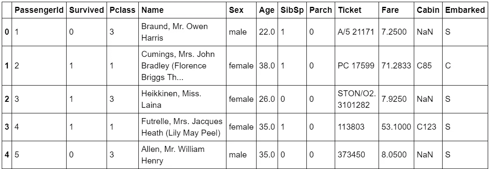

Data Frame Head

## 描述()

describe 将帮助你得到所有统计数字列的描述。如果将`include` 参数写成 object，它将描述非数字列。这是一种非常有用的方法，可以快速了解统计数据。

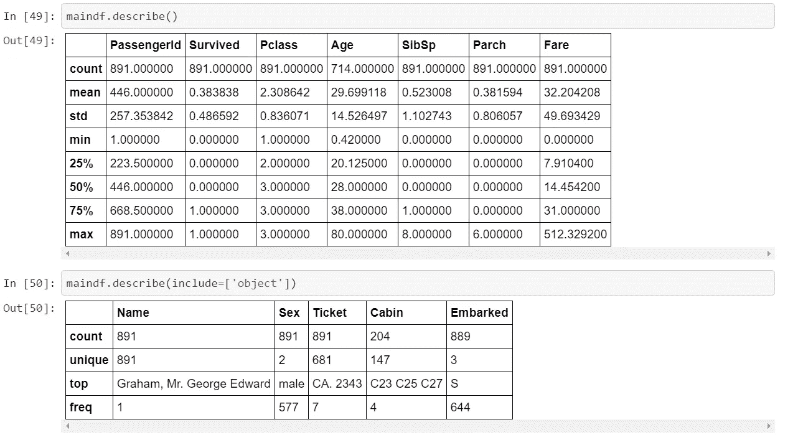

Describe() to explore Titanic Data

**从这段描述中，我们可以找到以下思路:**

1.  变量的均值和分布。
2.  大多数乘客以相对较低的价格买了票。但是，有一些是高价购买的，这表明可能是贵宾。
3.  由于四分位数表示 0，最大值表示 6，因此帕奇分布高度偏斜。这意味着大多数人不带父母或孩子上船，少数父母带多达 6 个孩子和父母上船。

## 信息()

这些信息帮助您确定数据类型和空值的存在。这里我们发现*年龄、*舱位、*上船*栏目有缺失值。

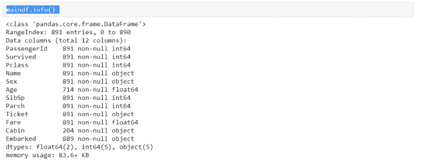

> 这很好，我们已经确定了一些探索的途径。但首先，让我们清理数据。

# 干净的


Source: Unsplash

## 处理年龄中缺失的值

**有几种方法可以替换*年龄*列中缺失的值:**

1.  **不推荐:用年龄平均值代替**。这不是一个好方法，因为你可以看到大多数乘客年龄在 20-30 岁之间，其中最大的 80 岁，最小的 0.42 岁(婴儿)。
2.  **推荐:替换为年龄中位数**。这将是一个更好的方法，因为这将安全地将我们缺失的值分配到 20-30 岁，这是四分位数范围内的舒适值。
3.  **最推荐:根据每个称呼的中位数替换年龄。**这将是最好的方法，因为称呼将暗示估算数据中的共同年龄(例如:Sir、Mdm 等)。

**结论:**让我们采取第三种方法。如果你不知道`lambda` 是什么，你可以把它想成一个内联函数。这使得代码更容易阅读。

```
maindf['Salutation'] = maindf.Name.apply(lambda name: group = maindf.groupby(['Salutation', 'Pclass'])
group.Age.apply(lambda x: x.fillna(x.median()))
maindf.Age.fillna(maindf.Age.median, inplace = True)
```

## 删除不相关的列

为了简化分析，让我们删除一些可能与生存无关的列，比如乘客 id 和姓名。

**但是，删除这些列时应该非常小心，因为这会限制您的假设。例如，名字为“约翰”的乘客生还的概率可能会高得惊人。仔细观察，这是因为“约翰”这个名字通常是为那些社会经济地位高的英国人保留的。因此，如果我们没有 SES 列，我们可能需要在分析中包含名称。**

```
cleandf = maindf.loc[:,['Survived','Pclass','Sex','Age','SibSp','Parch','Embarked']]
```

# 设计功能

在这一部分，我们将对一些特征(列)进行处理，以进行合理且更有意义的数据分析。

## 社会经济状况

我们将根据 Pclass 中的数值对 SES 特征进行分类。我们只编码 1——上，2——中，3——下。

```
cleandf['socioeconomicstatus']=cleandf.Pclass.map({1:'upper',2:'middle',3:'lower'})
```

## 启航港口

我们将把字母值(' C '，' Q '和' S ')映射到它们各自的端口。然后，我们可以根据乘客的出发港口和生存状况来划分乘客的数量。我们将使用饼图来比较基于启运港和生存状态的百分比。

```
cleandf['embarkedport']=cleandf.Embarked.map({'C':'Cherbourg','Q':'Queenstown','S':'Southampton'})
```

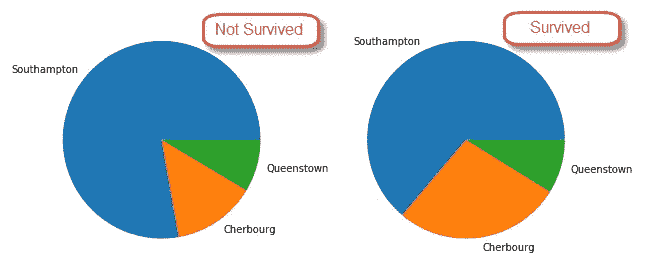

Ratios of survivals based on Port of Embarkation

## 年龄

我们将生成年龄直方图，并得出以下宁滨。宁滨是一种将连续数据的偏斜分布量化为离散类别的好方法。每个条柱代表分组数值的范围和强度程度。

```
agesplit = [0,10,18,25,40,90]
agestatus = ['Adolescent','Teenager','Young Adult','Adult','Elder']

cleandf['agegroup']=pd.cut(cleandf.Age,agesplit,labels=agestatus)
```

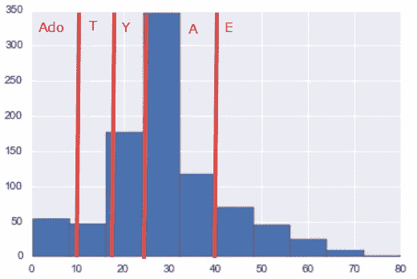

binned Age based on Age Split and Age Status Group

## 家庭关系

> 然而，救生艇仍然漂浮着，因此“伯肯黑德演习”的传说诞生了——这是一项在海上灾难中优先考虑妇女和儿童的协议。—历史

伯肯黑德演习引发了一些思考，你的孩子或妻子的存在是否会提高你的存活率。因此，我们希望将船上的兄弟姐妹/配偶(SibSp)和父母/子女(Parch)的数量设计成每个人是否都有家庭成员— `hasfamily`。

```
cleandf['familymembers']=cleandf.SibSp+cleandf.Parch
hasfamily = (cleandf.familymembers>0)*1
cleandf['hasfamily'] = hasfamily
```

## 结果呢

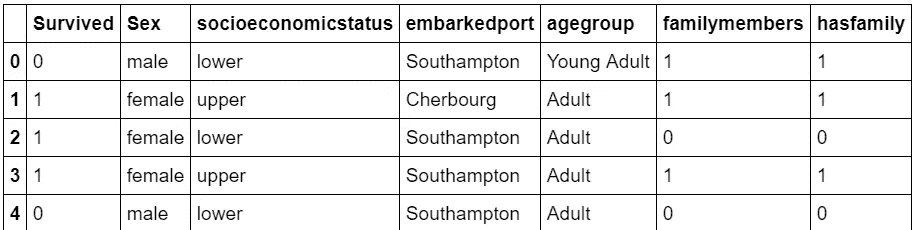

The result of feature engineering

> 恭喜你。你已经完成了你的特征工程。现在我们可以用这些新的特征来分析

# 分析

有如此多的分析，我们可以使用新的清理数据集。现在，让我们回答几个问题。请随意访问[我的 Python 笔记本](https://github.com/VincentTatan/PythonAnalytics/blob/master/Youtube/Python%20Pandas%20Tutorial%20(Titanic%20Data).ipynb)获取更多分析。

1.  存活率会因性别而异吗？
2.  生存率会因 SES 而不同吗？
3.  存活率会因性别和社会经济地位而不同吗？

给数据科学家一个小提示，你的角色是不断提问并以统计学的方式回答问题。这不会是一个一次性的瀑布过程，而是一个持续的迭代过程。正如我要说的…

*这只是冰山一角！*

## 存活率会因性别而异吗？

```
maindf.groupby(['Survived','Sex']).count().Name
maindf.groupby(['Survived','Sex']).count().Name.plot(kind='bar')
```

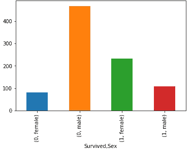

总共有 342 人幸存，549 人死亡。幸存者中(233 名女性，109 名男性)，而非幸存者中(81 名女性，468 名男性)。似乎雌性比雄性更有可能存活。

## 生存率会因 SES 而不同吗？

我们可以使用交叉选项卡清楚地生成两个分类特征(SES，survival)的计数

```
survived = pd.crosstab(index=cleandf.Survived, columns = cleandf.socioeconomicstatus,margins=True)
survived.columns = ['lower','middle','upper','rowtotal']
survived.index = ['died','survived','coltotal']
```

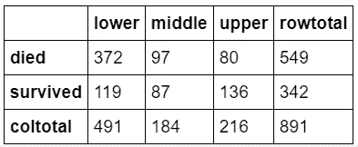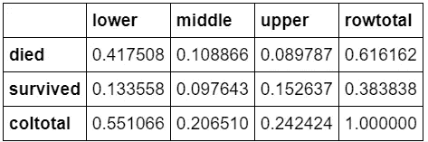

The Counts and Percentage of Survived and Died Passengers

快速浏览一下，似乎社会经济地位对幸存者非常重要——上层阶级比下层阶级生存得更久。然而，让我们用[卡方](https://en.wikipedia.org/wiki/Chi-squared_test)方法进一步检验这个假设。

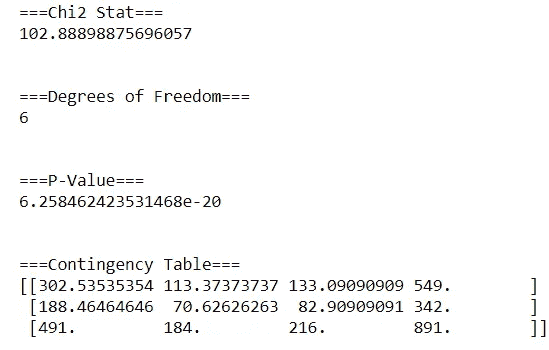

Chi square run on the cross tab

让我们试着理解这意味着什么。Chi2 统计量是卡方统计量，自由度是列*行。这意味着你有 6 个自由度，包括 3 个 SES 事件(下、中、上)和 2 个生存事件(死亡、幸存)。自由度越大，差异的统计意义就越大。

p 值将决定 SES 对生存的重要性。如果我们的 p 值低于α(0.01)，我们将拒绝我们的零假设。因为我们的 p 值是 6.25，远远高于我们的 alpha 值，所以我们可以说这个结果没有统计学意义。

也许我们可以把性包括进来，观察是否有显著的差异？

## 存活率会因社会经济地位和性别而不同吗？

这个交叉表允许我们为总共 6 个可能的事件生成一个特征(SES，Sex)。与男性低社会经济地位者相比，女性高社会经济地位者的存活率似乎有很大差异。

```
survivedcrosstabsex = pd.crosstab(index=cleandf.Survived, columns = [cleandf[‘socioeconomicstatus’],cleandf[‘Sex’]],margins=True)
```

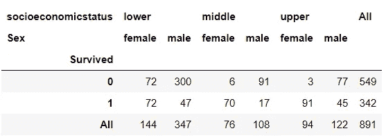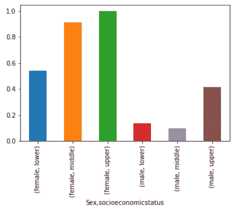

让我们做和以前一样的事情，在 Chi2 测试中插入这个值的交叉表

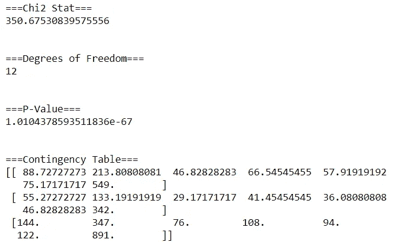

Chi square run on the cross tab (SES and Sex)

p 值更低，这表明它比我们仅使用 SES 进行分析具有更大的统计学意义。但是，p 值仍然高于我们的 alpha (0.01)。因此我们仍然认为 SES 和性别对推断生存状态没有统计学意义。但是我们可以看到它接近统计意义，这是一个好现象！

现在，我们可以用我们的机器学习模型来探索这些功能:)。

# 模型

## 训练决策树模型

让我们用[决策树](https://www.geeksforgeeks.org/decision-tree-implementation-python/)来模拟我们的发现。决策树是一种机器学习模型，它根据信息增益提供基于规则的分类。这提供了一种选择关键特征和规则来最好地辨别我们的数据因变量的好的和圆滑的方法。

我们将使用我们的训练数据，然后修剪树木，以避免过度拟合。最后，我们将使用 GraphViz 库将我们的树可视化如下。由于代码很长，请随意浏览我的 Python 笔记本。

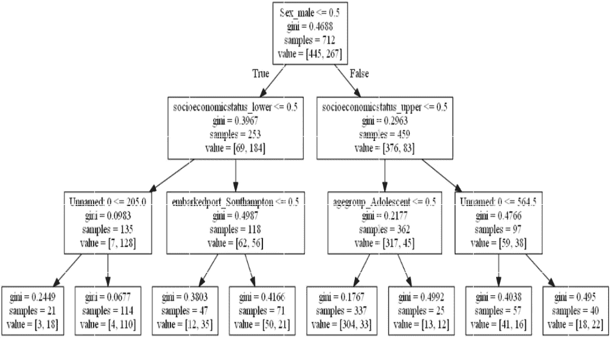

Decision Tree for Titanic Kaggle Challenge

**从这个图中，我们可以发现决策树的美妙之处如下:**

1.  **了解幸存者分布及概况:**数组表示【死亡人数，存活人数】。在每个节点中，我们可以看到阵列和规则分类的不同拆分，以便分支到更低级别的节点。我们可以发现，如果性别=女性(≤0.5)，数组表示更多的幸存者[69，184]。我们也可以跟踪叶级节点。
2.  **了解关键特征可以区分幸存者:**在顶级特征中，我们将性别和社会经济地位视为主要特征。然而，正如我们之前所发现的，这些特征本身不足以具有统计学意义。因此，也许第三级的起运港和年龄组可能给我们更好的意义。

> 恭喜你，你刚刚创建了你的第一个机器学习模型！

## 决策树的评估

```
**from** **sklearn.metrics** **import** accuracy_score, log_loss

train_predictions = clftree.predict(X_test)
acc = accuracy_score(y_test, train_predictions)
```

从这里我们将检索到我们的准确率是 77.65%。这意味着在 100 名乘客中，该模型可以正确回答 77 名乘客的生存状态。

为了进一步评估这个模型，我们可以将混淆矩阵和 ROC 曲线添加到我们的评估中，我将在随后的文章中详细介绍。

## 使服从

您将使用以下方法和命令生成预测的 csv。我们将其命名为*“titanic _ submission _ tree . CSV”*并保存在您的本地目录中。

```
def titanic_kaggle_submission(filename, predictions):
 submission = pd.DataFrame({‘PassengerId’:testdf[‘PassengerId’],’Survived’:predictions})
 submission.to_csv(filename,index=False)titanic_kaggle_submission("titanic_submission_tree.csv",predictions_tree)
```

一旦你提交了*titanic _ submission _ tree . CSV .*你会收到如下结果。在这里，我得到了所有相关条目中的排名 6535。


## 我们如何改进我们的分析？

1.  **超参数调谐和模型选择**。使用梯度下降增加提交分析。还有其他提交的大量利用集合模型，如[随机森林](https://github.com/sumitmukhija/Titanic/blob/master/Tip%20of%20the%20Iceberg.ipynb)和 [XG Boost](https://machinelearningmastery.com/gentle-introduction-xgboost-applied-machine-learning/) 。
2.  **特征工程**:找出可能产生的其他特征。例如，也许有孩子的父母被拯救的可能性更小。或者，拥有早期字母的人可能会首先被保存，因为他们的房间分配是根据机票类型和字母顺序排序的？基于问题创建我们的特征将进一步提高我们分析的准确性。
3.  **实验，实验，实验**:享受乐趣，不断调整你的发现。在这个挑战中，没有什么想法是荒谬的！

> 恭喜你。您已经提交了您的第一份数据分析和 Kaggle 提交。现在，开始您自己的数据科学之旅吧！！

## 结论

在本文中，我们学习了一种在著名的泰坦尼克号数据上设计探索性数据分析(EDA)的方法。我们学习了如何导入、探索、清理、设计、分析、建模和提交。

除此之外，我们还学到了有用的技术:

1.  **探索** →描述、绘图、直方图
2.  **清除** →插入缺失的数值，删除不相关的列
3.  工程师**→宁滨，贴标签**
4.  **分析** →存活图、交叉表、Chi2 检验
5.  **模型** →决策树可视化、预测和评估

# 最后…


Source : Unsplash

我真的希望这是一本很棒的读物，是你发展和创新的灵感来源。

请在下面**评论**出来建议和反馈。就像你一样，我也在学习如何成为一名更好的数据科学家和工程师。请帮助我改进，以便我可以在后续的文章发布中更好地帮助您。

谢谢大家，编码快乐:)

# 关于作者

Vincent Tatan 是一名数据和技术爱好者，拥有在 Visa Inc .和 Lazada 实施微服务架构、商业智能和分析管道项目的相关工作经验[。](https://bit.ly/2I8jkWV.)

Vincent 是土生土长的印度尼西亚人，在解决问题方面成绩斐然，擅长全栈开发、数据分析和战略规划。

他一直积极咨询 SMU BI & Analytics Club，指导来自不同背景的有抱负的数据科学家和工程师，并为企业开发他们的产品开放他的专业知识。

请通过[**LinkedIn**](http://www.linkedin.com/in/vincenttatan/)**、**[**Medium**](https://medium.com/@vincentkernn)**或** [**Youtube 频道**](https://www.youtube.com/user/vincelance1/videos) 联系文森特