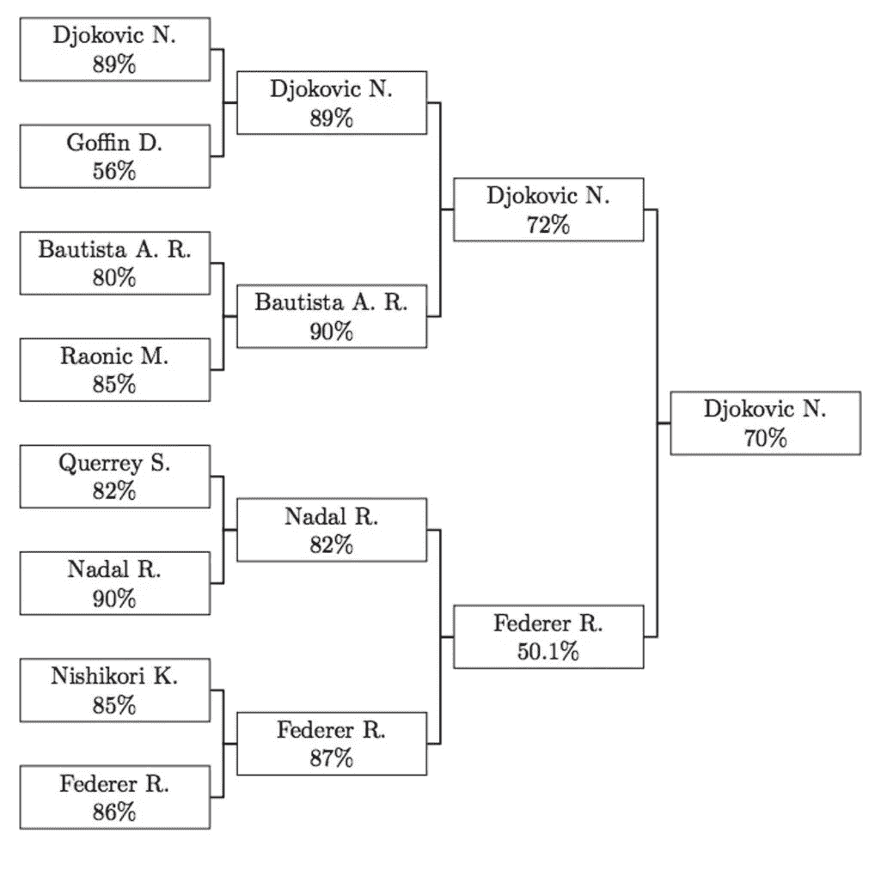
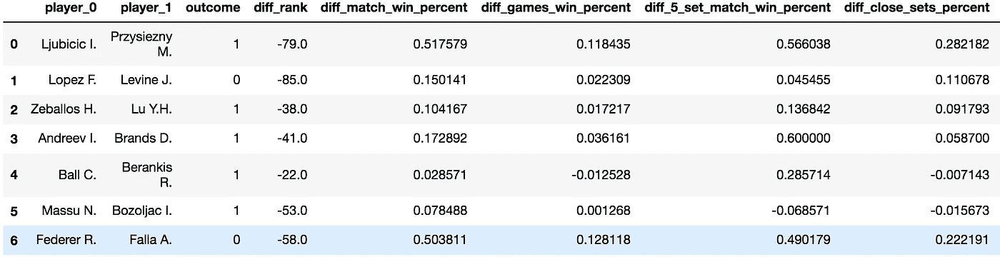
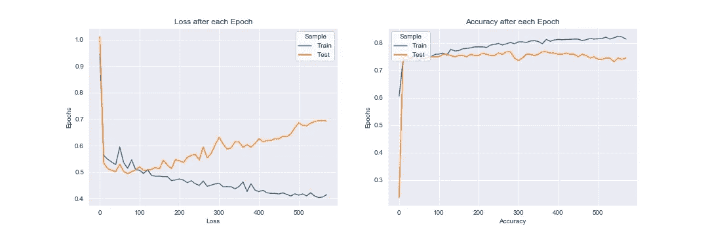
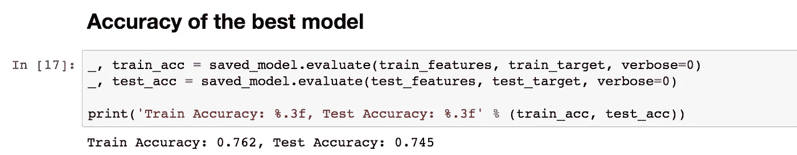
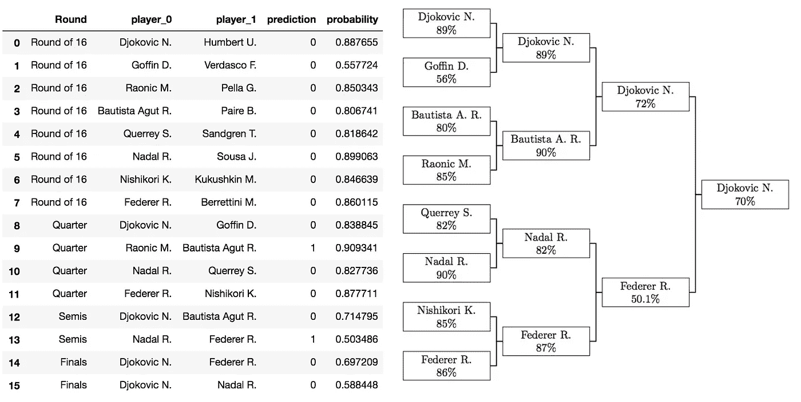

# 用神经网络预测温布尔登。

> 原文：<https://towardsdatascience.com/predicting-wimbledon-matches-using-neural-network-e2ee4d3dead2?source=collection_archive---------25----------------------->

## 神经网络预测**诺瓦克·德约科维奇**将在决赛中击败**罗杰·费德勒**成为最终的冠军。

随着第二周的 [**温布尔登**](https://www.wimbledon.com/) 即将来临，有许多激动人心的比赛值得期待。温布尔登网球公开赛第二周的周一可以说是全年最激动人心的一天。周一，16 名最优秀的男女网球运动员将在温布尔登网球公开赛四分之一决赛中争夺一席之地。将会有很多体育评论员和分析家预测谁会进入 8 强，4 强，并最终成为冠军。

然而，我还没有遇到任何使用**机器学习/人工智能**做出的预测。因此，我认为这将是一个很好的机会，让我实施我一直在学习的一些机器学习技能，以预测温布尔登第二周的比赛。更具体地说，我将实现一个简单的**2-隐层神经网络**来预测比赛的结果。

# **我如何得出我的预测:**

*   **第一步:创建可以帮助预测比赛获胜者的特征**。
*   **步骤 2:使用 [Keras](https://keras.io/) 建立、验证和微调模型神经网络**，并检查过拟合/损失函数/测试精度。
*   第三步:做预测

# 步骤 1:创建特征:

神经网络或任何预测模型最重要的部分之一是创建能够解释结果变量的特征。像**选手排名、整体胜率、草地胜率**这样的特征将在很大程度上帮助解释一场网球比赛的结果。此外，根据**过去 52 周的胜率**和单挑记录捕捉到的玩家状态可以进一步帮助预测结果。总的来说，我创建了 21 个特征作为神经网络的输入层，下面是我认为最重要的 5 个特征。

1.  排名。
2.  匹配胜率。
3.  在草地上头对头。
4.  过去 60 周在草地上的比赛胜率。
5.  五局三胜的百分比。

注意:对于每个特征，我计算两个玩家之间的差异。例如排名=(玩家 0 的排名)——(玩家 1 的排名)。

# 第二步:建立并微调神经网络。

在我描述神经网络的实现之前，下面是带有特征的数据的一个片段。

Training Sample Snippet

我的[数据](http://www.tennis-data.co.uk/alldata.php)由 2010 年到 2018 年的所有温网比赛组成。为了使事情更简单，可读性更强，我总是把排名较高的玩家作为 0 号玩家，排名较低的玩家作为 1 号玩家。因此，结果 0 表示玩家 0 赢了(不是一次翻盘)，结果 1 表示玩家 1 赢了(一次翻盘)。

接下来，我将我的数据分为训练和测试(dev)数据，以便根据训练数据优化神经网络，并在样本测试数据上验证它。下面的代码构建了神经网络。

下面是神经网络的一些细节。

> `- Number of Layers: 3\. (2 Hidden Layers)
> - Number of Neuros in each layer: 64->32->1
> - Activation relu->relu->sigmoid
> - Stop if validation loss does not improve for 500 epochs
> - Save the best model which gives the minimum validation set loss`

这里需要注意的一件重要事情是，经过下图所示的几轮时期后，神经网络开始过度拟合训练样本。即，它在训练样本上获得了准确性，同时对于测试样本失去了准确性。因此，为了做出好的预测，避免使用过度拟合的神经网络是很重要的。因此，我使用给出最小验证集损失的模型。

Loss and accuracy level after each Epoch

在测试和训练集上，最好的模型具有下面的准确度水平，作为预测网球比赛的基准，这似乎是相当合理的。

# 第三步:预测结果。

一旦我有了一个训练好的神经网络并保存了最佳模型。我可以使用最佳模型来预测即将到来的比赛。以下是从第 16 轮开始以表格和括号格式对预定和潜在比赛的预测片段。

Final prediction table and bracket.

# **总决赛感想:**

神经网络预测**诺瓦克·德约科维奇**将在决赛中击败**罗杰·费德勒**成为最终的冠军。根据模式，最接近的比赛将是费德勒和纳达尔在半决赛中的对决。考虑到这一点，根据模型，如果德约科维奇在决赛中对阵费德勒，他有 70%的胜算，而如果他在决赛中对阵纳达尔，他有 59%的胜算。

我会在所有比赛结束后更新这篇文章，看看这个模型的表现如何。然而，这篇文章的重点是**而不是**建立一个给出最准确预测的神经网络，而是这篇文章的重点是探索神经网络和其他机器学习技术可以帮助使用数据回答简单问题的方法。这篇文章的问题是“今年谁会赢得温布尔登网球赛？”

本文使用的代码和数据可以在下面的 github 资源库中找到。包含模型和结果的最终笔记本可通过 [**链接**](https://nbviewer.jupyter.org/github/jugalm/predicting-wimbledon-matches/blob/master/nn_model.ipynb) 查看。如果你有任何建议，请随时联系我。(github.com/jugalm)

 [## 朱加尔姆/预测-温布尔登-比赛

### 预测温布尔登比赛:。通过在…上创建一个帐户，为 jugalm/predicting-Wimbledon-matches 的发展做出贡献

github.com](https://github.com/jugalm/predicting-wimbledon-matches) 

# **参考文献:**

*   数据:[http://www.tennis-data.co.uk/alldata.php](http://www.tennis-data.co.uk/alldata.php)
*   康曼、安德烈、格兰特·斯佩尔曼和丹尼尔·赖特。"用于职业网球比赛预测和投注的机器学习."