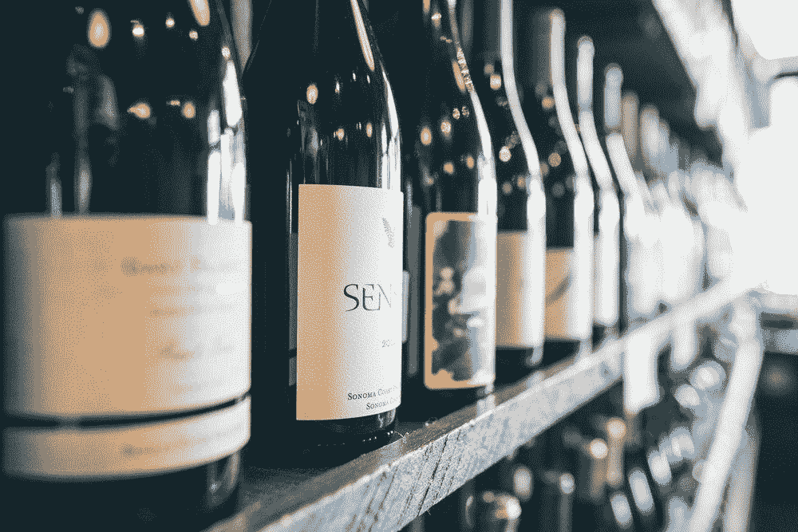
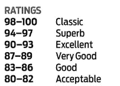
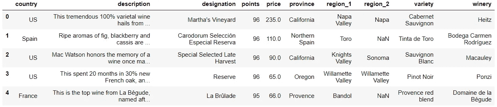
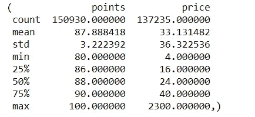
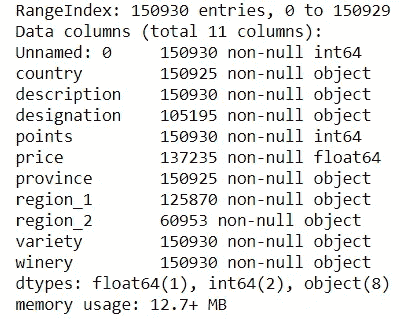
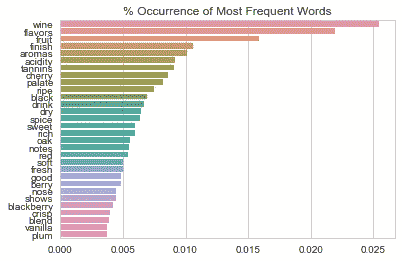
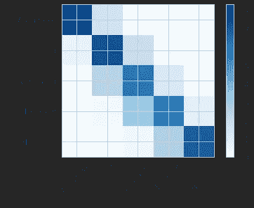

# 使用文本评论预测葡萄酒质量

> 原文：<https://towardsdatascience.com/predicting-wine-quality-using-text-reviews-8bddaeb5285d?source=collection_archive---------10----------------------->



As someone who doesn’t drink a lot of wine, I usually rely on the 100 point Wine Scale and the purple “Staff Recommended” sticker to pick something off the shelf

## 我将使用这个 Kaggle [数据集](https://www.kaggle.com/zynicide/wine-reviews/home)，其中包含葡萄酒评论、葡萄酒评级(以分数衡量)以及从[葡萄酒爱好者](https://www.winemag.com/?s=&drink_type=wine)那里收集的其他相关信息。

数据集包含两个在不同日期抓取的文件。我将使用文件**wine mag-data _ first 150k . CSV**作为训练集，使用 **winemag-data-130k-v2.csv** (从稍后的日期抓取)作为测试集。

这里是代码的[库](https://github.com/happilyeverafter95/wine-recommender)。

# 目的:训练一个基于文本评论预测葡萄酒质量的机器学习模型

葡萄酒爱好者使用从 1 到 100 的评分标准来给他们的葡萄酒打分(1 代表最差，100 代表最好)。不幸的是，该网站只发布积极的评论，这就是为什么数据集中的分数范围只有 80 到 100。

这意味着我们的数据集不能代表我们试图解决的问题。*使用这些数据建立的任何模型只适用于广受好评的葡萄酒。*

# 收集一些领域知识

在我们开始分析之前，我们应该尝试收集一些领域知识。在浏览了网站和阅读了其他一些与葡萄酒相关的资源后，我发现了一个基于积分系统的漂亮的分类系统。



对于最终用户(即葡萄酒购买者)，积分的重要性只取决于它们传达的信息。如果我们把这个问题作为一个分类问题，我们可以保留葡萄酒质量的必要信息，同时减少问题的维度。

## 决策:我将把这个问题框定为一个情绪分析问题，在这个问题中，评论将被用来确定葡萄酒是经典、卓越、优秀、非常好、好还是可以接受

# 探索性数据分析

下一步是更好地了解我们的数据。这可以给我们更好地解决问题提供重要的见解。除了评论和评级，还有其他相关信息，如葡萄酒价格、品种(葡萄类型)和葡萄酒产地。



Preview of our data

如果我们想建立一个更全面的模型，我们也可以将这些特征作为预测因素来确定葡萄酒的质量。要将文本描述与其他预测特征相结合，我们可以创建一个集成模型(文本分类器是其中之一)或一个分层模型，其中文本分类器的结果将用作一个预测变量。

## 出于这里的目的，我们将只探讨评论和葡萄酒评分之间的关系。

## 从高层次检查数据完整性

“点和描述”列中没有缺失条目。正如我们之前已经注意到的，葡萄酒点向右移动。从我个人的经验来看，价格也是向右偏移的。



Output from data.describe()



Output from data.info()

## 检查文本数据

评论看起来很“干净”。似乎没有任何语法或拼写错误，所有的评论都是用非常简洁的语言写的。

样本审查:

```
This tremendous 100% varietal wine hails from Oakville and was aged over three years in oak. Juicy red-cherry fruit and a compelling hint of caramel greet the palate, framed by elegant, fine tannins and a subtle minty tone in the background. Balanced and rewarding from start to finish, it has years ahead of it to develop further nuance. Enjoy 2022–2030.
```

有些评论需要葡萄酒知识才能完全理解。在上面的例子中，*单宁*是一个文本元素，使葡萄酒尝起来很干。

我们还可以看看最常见的词汇出现的频率。



the most commonly occurring word is “wine” which occurs just over 0.025% of the time

## 准备分类

以前，我们将我们的类标识如下:

我们可以通过分数将评论映射到我们的一个类。

不幸的是，我们的数据不是很平衡。

第 4 类没有评论(94-97 分—极好),大多数评论集中在第 1、2 和 3 类。不平衡的类是有问题的，但是可以通过对较大的类进行采样或设置类权重来解决。然而，一门课的完全缺席更令人担忧。

## 决定:我将把 4 班和 5 班合并成新的 4 班。任何在 94-100 分范围内的评论都属于这个类别。

## 应该清理文本数据吗？

我们也可以选择清理/规范我们的葡萄酒评论。影响这个决定的最大因素是我们想要使用的学习算法的类型。如果我们选择将每个评论作为自己的向量嵌入，并将输入传递给一对一的分类器，那么我们应该花更多的时间来规范化文本。另一方面，将文本作为许多向量的表示进行顺序处理使得规范化变得不那么重要。

顺序处理文本(通常每个单词由其自己的向量表示，并学习单词关系)也有助于解决*(同一单词拥有多个含义)和识别 ***同义词*** *。*由于这些评论使用非常具体的行话分享非常相似的上下文，我不太关心词义歧义或同义词。但考虑到评论的总体积极情绪，我担心一对一的分类器可能无法找出相邻类别之间的细微差异。*

## *决定:我将使用一个递归神经网络，通过将每次复习作为一个向量序列来预测课程。我还将保持文本描述的原始形式。*

*很难说这种选择是否比使用诸如 TF-IDF 这样的嵌入技术并将其传递给一对一的分类器更好。也许将来我也会尝试这样做，并比较结果。*

## *嵌入文本*

*将每个单词作为其自己的向量嵌入的自然选择是使用基于神经的嵌入技术，如 word2vec、GloVe 或 fastText。我们也可以选择训练我们自己的嵌入模型或者使用预先训练的向量。由于我们正在处理的文本没有什么特别之处，使用预先训练的单词向量可能会帮助我们更好地理解语言。*

## ***决定:我们将使用预先训练的单词嵌入。***

*但是我们应该使用哪一类嵌入呢？我将立即消除 fastText，因为它通过对字符 n-gram 级别的向量求和来构建单词向量。因为我们正在处理的文本类型不太可能包含词汇以外的单词(没有拼写错误、不常见的俚语或缩写)，所以它不会受益于这种粒度。*

*即便如此，通常也很难确定哪种技术效果最好。由于我发现一些葡萄酒的描述在本质上是相似的，我将选择 GloVe，希望从共现结构中学习将有助于更好地理解语义比较。*

## ***决策:我们将使用预先训练的手套向量***

*几个预先训练好的手套词向量可以在[这里](https://nlp.stanford.edu/projects/glove/)下载。我将使用带有 840B 令牌的普通爬网，因为它包含最大的词汇表，并且区分大小写。glove.840B.300d 中的每个单词向量有 300 个坐标。*

*在加载预训练的嵌入之前，我们应该定义一些固定的参数。*

*Num_classes: 自我说明——这是我们正在处理的类的数量*

**嵌入 _ 尺寸:*这是单词向量的尺寸*

**时期:*通过所有训练示例的向前和向后次数*

**batch_size:* 每一遍的训练样本数*

**max_len:* 文本描述中考虑的最大长度(以字为单位)。任何超过 100 字的描述都将被截断。任何少于 100 字的描述都将被填充以满足该长度。*

**class_weights:* 我们之前观察到我们的类不是很平衡。具有较高权重的类(类 0 和类 4)将对学习算法产生较大影响。类别 0 的每个实例被视为 7 个实例。*

***关于选择 max_len 的注意:**捕获太少的单词会导致信息丢失，但是捕获太多会导致数据稀疏的问题。理想情况下，我们希望选择一个值，该值能够捕获大多数文本描述的整体，而不会引入太多的零序列。*

*加载所需的库:*

*我们还必须对目标类进行一次性编码。*

## *训练-验证分割*

*即使我们已经有了一个指定的测试集，出于参数调整的目的，将训练集分为训练集和验证集仍然是一个好主意。*

## *标记输入并准备嵌入矩阵*

*我将使用 Keras 的 text_to_sequences 方法来保存文本的单词序列。每个单词将被映射到其来自预训练单词向量的向量。任何小于 100 (max_len)字的描述都将被填充，任何超过 100 (max_len)字的描述都将被截断，以便输入具有相同的长度。*

*在文本中找到的没有出现在预训练单词向量的词汇表中的单词被初始化为零向量。*

*注意:如果有很多单词在词汇表之外，那么设计一种更智能的方法来初始化这些单词可能是值得的*

## *训练分类器*

*由于文字描述通常很短，我将使用 GRU 单位，而不是 LSTM 单位。有了更短的描述，我们对记忆单元的需求就更少了，并且可以从 GRU 更高效的学习算法中受益。*

*我还将利用早期停止，它(在这种情况下)使用验证准确性来确定我们是否应该继续训练网络。当验证准确性在几个时期内持续下降时，提前停止将会启动并结束训练过程。它还会将最佳权重保存为“检查点”(在本例中为 model.h5)，并在准确度提高时重写权重。通过早期停止，我们可以让网络训练许多个纪元，而不必太担心过度适应。*

*耐心参数是用于确定是否/何时提前结束训练的阈值。耐心= 3 表示如果 3 个时期后验证损失没有改善，将开始提前停止。*

*递归神经网络的结构非常简单。该网络有一个具有 50 个单元的双向 GRU 层，其后是一个汇集、密集和丢弃层。双向意味着网络将学习文本序列的原始顺序以及单词出现的相反顺序。*

*分类器也在精确度上进行优化。准确性不会像人类那样区分不正确的预测。对一个人来说，预测 0 级为 4 级比预测 0 级为 1 级更糟糕。对网络来说，没什么区别。对于未来的实现，设计一个反映这种关系的度量可能是值得的。*

## *是时候评估我们的模型了——让我们拿出测试集吧！*

## *测试集的准确率:64%*

*让我们来看看混淆矩阵。在这个矩阵中，值以百分比的形式来衡量，以反映我们数据的不平衡性质。*

**

*不错的开始！*

*我们应该记住，由于所有的葡萄酒评论都非常正面，这个分类器将只适用于*广受好评的葡萄酒。*将来尝试使用不同的数据集会很有意思。*

## *干杯！*

**

*Let’s end with a wine picture*

# *感谢您的阅读！*

*如果你喜欢这篇文章，可以看看我关于数据科学、数学和编程的其他文章。[通过 Medium](https://medium.com/@mandygu) 关注我的最新动态。😃*

*作为一个业余爱好项目，我还在 www.dscrashcourse.com[建立了一套全面的**免费**数据科学课程和练习题。](http://www.dscrashcourse.com/)*

*如果你想支持我的写作，下次你报名参加 Coursera 课程时，可以考虑使用我的[会员链接](https://click.linksynergy.com/fs-bin/click?id=J2RDo*Rlzkk&offerid=759505.198&type=3&subid=0)。完全公开—我从每一次注册中获得佣金，但不会对您产生额外费用。*

*再次感谢您的阅读！📕*