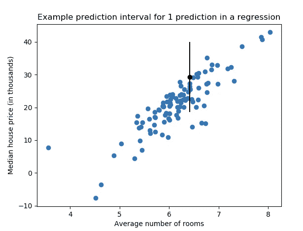

# 线性回归中的预测区间

> 原文：<https://towardsdatascience.com/prediction-intervals-in-linear-regression-2ea14d419981?source=collection_archive---------7----------------------->



这篇文章讲述了如何计算线性回归的预测区间。通常在建模时，我们从回归模型中得到一个单一的值。但是如果这个价值被用来计划或做重要的决定呢？

那么，当我们想知道我们的不确定性或误差幅度时，一个单一的值可能会夸大我们的信心。当然，你可以像 RMSE 一样查看所有预测的总体误差分数，但是对于单个预测呢？预测间隔为您提供了一个预测范围，该范围考虑了对您至关重要的任何建模误差阈值。类似于置信区间，您可以选择一个阈值，如 95%，其中您希望实际值在 95%的时间内处于某个范围内。这在计划时非常好，因为您可以在评估过程中使用上限和下限。

我已经创建了一个小方法(使用来自[这里](https://machinelearningmastery.com/prediction-intervals-for-machine-learning/)的一些输入)来预测对你或你的项目很重要的某个置信阈值的范围。我将用波士顿住房数据集来说明一个预测区间，预测不同地区住房的中值。如果你喜欢阅读 [GitHub](https://github.com/NathanMaton/prediction_intervals) 上的代码，这里有完整的笔记本。

否则，以下是数据集的描述:

```
from sklearn import datasets
print(datasets.load_boston()['DESCR'])Boston house prices dataset
---------------------------

**Data Set Characteristics:**  

    :Number of Instances: 506 

    :Number of Attributes: 13 numeric/categorical predictive. Median Value (attribute 14) is usually the target.

    :Attribute Information (in order):
        - CRIM     per capita crime rate by town
        - ZN       proportion of residential land zoned for lots over 25,000 sq.ft.
        - INDUS    proportion of non-retail business acres per town
        - CHAS     Charles River dummy variable (= 1 if tract bounds river; 0 otherwise)
        - NOX      nitric oxides concentration (parts per 10 million)
        - RM       average number of rooms per dwelling
        - AGE      proportion of owner-occupied units built prior to 1940
        - DIS      weighted distances to five Boston employment centres
        - RAD      index of accessibility to radial highways
        - TAX      full-value property-tax rate per $10,000
        - PTRATIO  pupil-teacher ratio by town
        - B        1000(Bk - 0.63)^2 where Bk is the proportion of blacks by town
        - LSTAT    % lower status of the population
        - MEDV     Median value of owner-occupied homes in $1000's
```

我们将对数据进行预处理，使用 sklearn 的线性回归包对其建模。

```
#preprocess data
df = pd.DataFrame(datasets.load_boston()['data'])
df.columns = datasets.load_boston()['feature_names']
df['target'] = datasets.load_boston()['target']

#split data
X_train, X_test, y_train, y_test = train_test_split(
    df.drop('target',axis=1), df.target, test_size=0.2, random_state=42)#do modeling
model = LinearRegression()
fit_model = model.fit(X_train, y_train)
predictions = fit_model.predict(X_test)
```

如果想了解单个预测层面的模型误差呢？这里我构建了一个简单的方法来获得这个区间。

```
def get_prediction_interval(prediction, y_test, test_predictions, pi=.95):
    '''
    Get a prediction interval for a linear regression.

    INPUTS: 
        - Single prediction, 
        - y_test
        - All test set predictions,
        - Prediction interval threshold (default = .95) 
    OUTPUT: 
        - Prediction interval for single prediction
    '''

    #get standard deviation of y_test
    sum_errs = np.sum((y_test - test_predictions)**2)
    stdev = np.sqrt(1 / (len(y_test) - 2) * sum_errs)#get interval from standard deviation
    one_minus_pi = 1 - pi
    ppf_lookup = 1 - (one_minus_pi / 2)
    z_score = stats.norm.ppf(ppf_lookup)
    interval = z_score * stdev#generate prediction interval lower and upper bound
    lower, upper = prediction - interval, prediction + interval return lower, prediction, upperget_prediction_interval(predictions[0], y_test, predictions)
OUTPUT: (19.24072024369257, 28.996723619824934, 38.752726995957296)
```

# 结论

那么你应该从这篇文章中学到什么呢？您可以使用一些工具来计算称为预测区间的不确定性，对于线性回归，您可以在项目中使用上面的代码。这有助于我计算非常关键的业务流程的不确定性，并且是您工具箱中的一项有用技术。

随着您在数据科学职业生涯中的不断进步，您将需要更多量化风险和不确定性的方法，因为这将有助于为关键决策提供信息。希望你喜欢这个简短的教程！