# 多元时间序列和 VAR 模型的预测任务

> 原文：<https://towardsdatascience.com/prediction-task-with-multivariate-timeseries-and-var-model-47003f629f9?source=collection_archive---------1----------------------->

## 基于统计 VAR 模型的天气预报


ime 系列数据可能会令人困惑，但探索起来非常有趣。这类数据引起我注意的原因是，它几乎存在于每一个行业(销售、交付、天气状况等)。).例如:使用谷歌大查询如何探索天气对纽约市的影响[链接](https://cloud.google.com/blog/products/gcp/four-seasons-in-one-post-using-google-bigquery-to-explore-weather-effects-on-nyc)。

任务中的主要步骤:

1.  问题定义
2.  收集信息
3.  探索性分析
4.  选择和拟合模型
5.  使用和评估预测模型

# 公式化问题。

我们希望使用数据集中的当前信息来预测序列的未来值。此信息包含系列的当前值和过去值。有很多项目使用单变量数据集，为了使它更复杂一些，更接近现实生活中的问题，我选择了一个多变量数据集。多元时间序列分析考虑处理相关数据的同步多个时间序列。(数据集包含多个时间相关变量。)

我想做一个天气预报。使用统计模型预测未来某一特定时间和地点的大气状态的任务。

# 收集信息和**下载数据**

我将使用来自以下来源的数据:

1.  国家海洋和大气管理局。气候数据在线(CDO)提供网络服务，通过 API 提供对可用数据的访问。[链接](https://www.ncdc.noaa.gov/cdo-web/webservices/v2)
2.  GoogleCloud BigQuery 公共数据。[链接](https://cloud.google.com/bigquery/public-data/)
3.  卡格尔。你可以从这个页面下载并在你 env 中运行，或者使用 kaggle 提供的 kaggle 帐户并在你的笔记本中使用它。

> **从 NOAA 获取数据**

为了访问 CDO 网络服务，必须首先从[令牌请求页面](https://www.ncdc.noaa.gov/cdo-web/token)获取令牌。文档是直截了当的，不应该花太多时间去理解。

**示例:**要查找缅因州波特兰的天气信息，您需要知道:State_id 和波特兰的坐标。首先，我将获得所有州的列表。

```
def get_states_list(self):
    url = conf.noaa['host']+'locations?locationcategoryid=ST&limit=50'
    headers = dict(token=conf.noaa['token'])
    r = requests.get(url, headers=headers)
    data = json.loads(r.content)
    states_list = json_normalize(data['results'])
    return states_list
```

然后，使用参数“name”:“Maine”查找有关特定州的信息:

```
def state_info(self, state):
    dataset = NoaaApi()
    states_info = dataset.get_states_list()
    df_states = pd.DataFrame(states_info)
    id = df_states[(df_states.name == state)].id
    return id
```

**结果:**其中缅因州的 id 为:“FIPS:23”

```
dataset.state_info('Maine')State id: FIPS:23
```

下一步是在波特兰附近建立站点，波特兰的坐标可以很容易地在谷歌地图上找到(北纬 43.6591，西经 70.2568)。

用下面的 GET 请求可以找到缅因州的电台列表。

```
def get_stations_list(self):
    url = conf.noaa['host']+'stations?locationid=FIPS:23&limit=687'
    headers = dict(token=conf.noaa['token'])
    r = requests.get(url, headers=headers)
    data = json.loads(r.content)
    stations_list = json_normalize(data['results'])
    return stations_list
```

我不需要州内所有的站，我想找波特兰附近的站。为此，我将指定坐标。

```
def station_info(self):
    dataset = NoaaApi()
    stations_list = dataset.get_stations_list()
    df_stations = pd.DataFrame(stations_list)
    portland_st = df_stations[(df_stations.latitude > 43.5)
                           & (df_stations.latitude < 43.7)
                           & (df_stations.longitude > -70.3)
                           & (df_stations.longitude < -70.1)]
    return portland_st
```

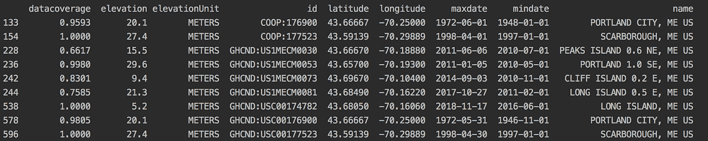

结论:我们得到了波特兰附近的**站的列表，这些站点可用于获取该地区的天气数据。**

> **从 Kaggle 获取数据**

有很多数据集提供了学习和提高技能的机会，也提供了参加比赛挣钱和展示技能的机会。我找到了每日全球历史气候网络(BigQuery Dataset)的完整描述可以在概览页面找到:[链接](https://www.kaggle.com/noaa/ghcn-d/home)。这是练习 BigQuery 技能的绝佳机会。

```
import numpy as np 
import pandas as pd 
import os
import bq_helper
from bq_helper import BigQueryHelpernoaa = bq_helper.BigQueryHelper(active_project="bigquery-public-data", dataset_name="ghcn_d")
```

创建一个查询并估计大小:

```
#43.6591° N, 70.2568° W  Portland/Coordinates Maine 45.2538° N, 69.4455° WqueryStations = """SELECT
  id,
  name,
  state,
  latitude,
  longitude
FROM
  `bigquery-public-data.ghcn_d.ghcnd_stations`
WHERE
  latitude > 43.5
  AND latitude < 44
  AND longitude > -70.4
  AND longitude < -69.4; 
  """

noaa.estimate_query_size(queryStations)
```

Kaggle BigQuery.helper 为查询提供估计，以避免超出限制。

```
0.0065232375636696815
```

现在运行查询:

```
stations_portland = noaa.query_to_pandas_safe(queryStations)
stations_portland.head(20)
```

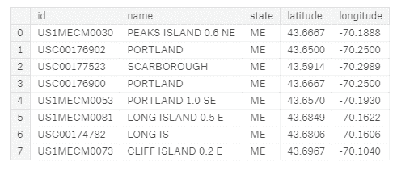

如我们所见，我们得到了几乎相同的电台列表。

> **从谷歌云获取数据**

谷歌提供 30GB 的公共[天气数据](https://cloud.google.com/bigquery/public-data/noaa-gsod)。有可能有一个免费的帐户和实践，以提高您的技能在大查询。还可以选择您需要的数据，并下载数据集进行进一步研究。对私人和公司都非常有用。我不会尝试查找电台列表，但会从找到的电台请求每日温度。

```
SELECT
  TIMESTAMP(CONCAT(year,"-",mo,"-",da)) AS date,
  AVG(IF (temp=9999.9, 0, temp)) AS temperature,
  MIN(IF (temp=9999.9, 0, min)) AS temperature_min,
  MAX(IF (temp=9999.9, 0, max)) AS temperature_max,
  AVG(IF (visib=999.9, 0, visib)) AS visibility,
  AVG(IF (gust=999.9, 0, gust)) AS wind_gust,
  AVG(IF (wdsp="999.9", 0, CAST(wdsp AS Float64))) AS wind_speed,
  AVG(IF (prcp=99.99, 0, prcp)) AS precipitation,
  AVG(IF (sndp=999.9, 0, sndp)) AS snow_depth
FROM
  `bigquery-public-data.noaa_gsod.gsod20*`
WHERE
  CAST(YEAR AS INT64) > 2008
  AND (stn="726060") 
GROUP BY
  date
ORDER BY
  date
```

该查询运行时将处理 5.19 GB。

该查询将返回缅因州波特兰市一个气象站过去 10 年的每日天气。

# 探索性分析

首先，我想把重要的信息可视化，让我们清楚地知道我们有什么样的数据。

## **地理数据**

我将使用来自缅因州波特兰市的数据，通过 GeoPandas 库绘制气象站的位置。第一步是找到并下载一个形状文件(。shp 文件)。我已经展示了如何使用 NOAA API( *portland_st* )获得波特兰附近的站点

```
highway_map = gpd.read_file('./maine_highway/maine_highway.shp')

crs = {'init': 'epsg:4326'}
point = [Point(xy) for xy in zip(portland_st['longitude'], portland_st['latitude'])]
geo_stations = gpd.GeoDataFrame(portland_st, crs=crs, geometry=point)

fig, ax = plt.subplots(figsize=(5, 5))
highway_map.plot(ax=ax, alpha=0.4, color='grey')
geo_stations.plot(ax=ax, color='red', marker='o')
plt.legend(prop={'size': 5})
plt.show()
```

我找到了显示波特兰主要道路的形状文件(“maine_highway.shp”)，并将其与车站位置结合起来。红点是气象站的位置。现在很明显特征模型需要哪个站。这是一种可视化地理空间数据的简单方法。

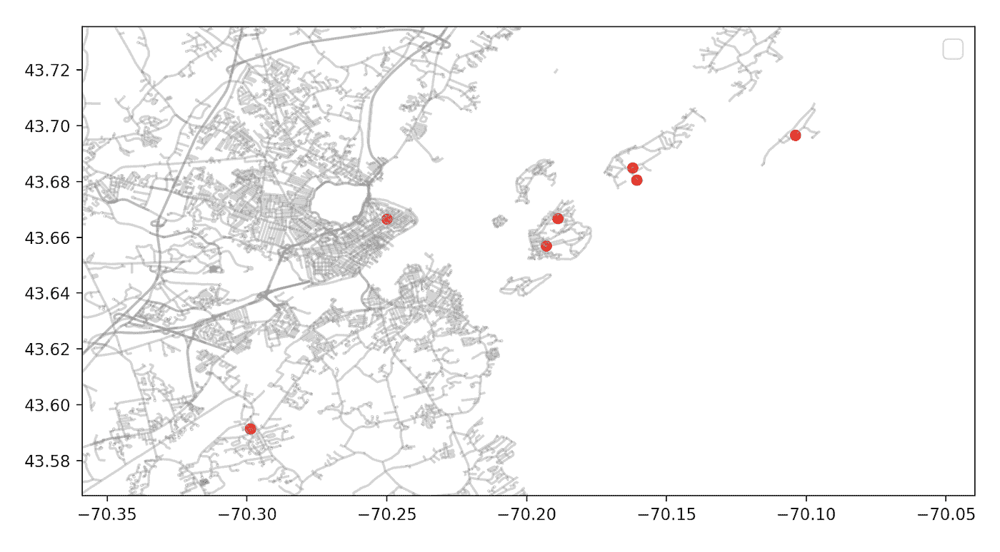

Portland, City in Maine

## **时间序列图形**

时间序列分析的目标是发现数据中的模式，并使用数据进行预测。

探索时间序列之间的关系也很有用。让我们看看 2017 年的所有支线剧情:

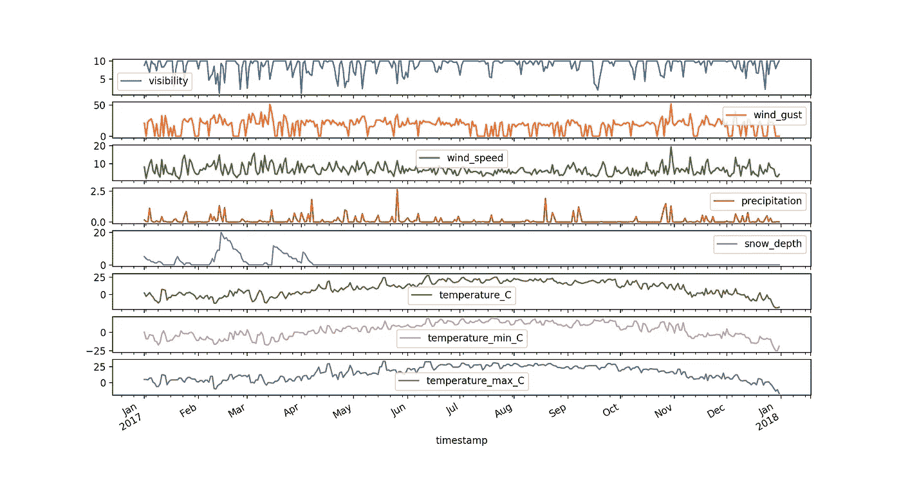

当然，我们想看看将要预测的系列。我是用 iplot 库做的。

```
df[['temperature', 'temperature_min']].iplot(
    mode='lines+markers',
    opacity=0.8,
    size=8,
    symbol=1,
    xTitle='Time',
    yTitle='Temperature',
    title='Temperature over last 10 years')
```

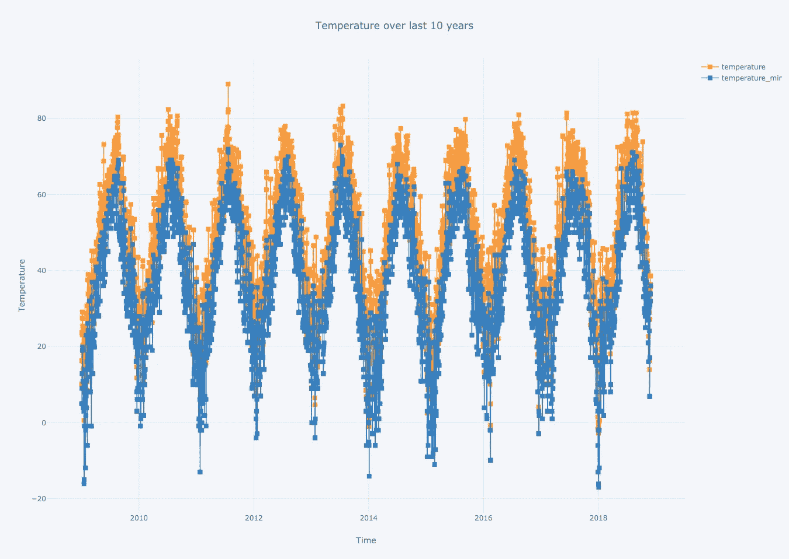

出于好奇，我可以举例说明显示过去 10 年新年平均/最低/最高温度的线图:

```
sns.set(rc={'figure.figsize': (14.7, 8.27)})
g = sns.lineplot(data=newyear.temperature_max, palette="tab10", linewidth=2.5, label="max")
g = sns.lineplot(data=newyear.temperature_min, palette="tab10", linewidth=2.5, label="min")
g = sns.lineplot(data=newyear.temperature, palette="tab10", linewidth=2.5, label="avg")g.tick_params(labelsize=10)
plt.xticks(rotation=45)
plt.show()
```

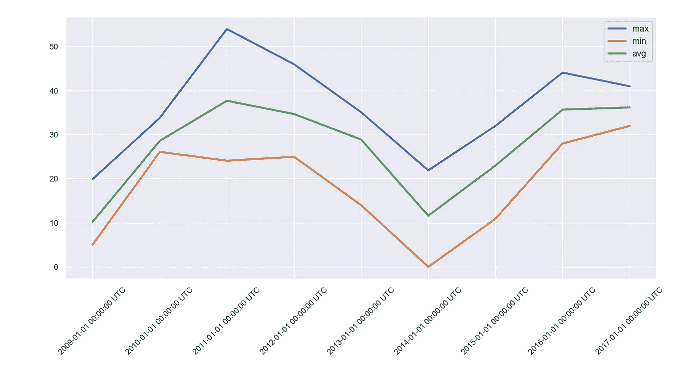

27.12 至 03.01 期间的温度，为期 10 年。如果有人需要过去几年中某个特定时期的历史统计数据，比如说新年的那一周。

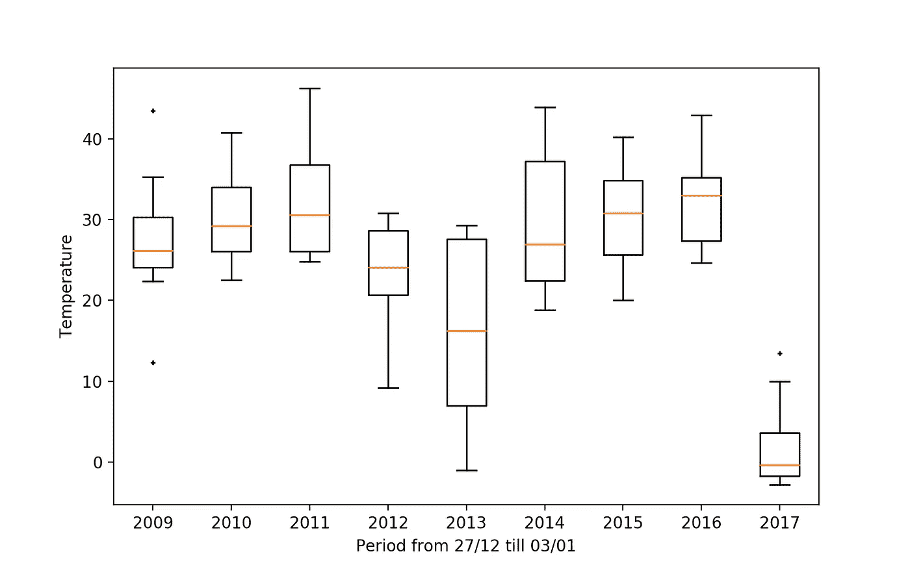

如果主要目的只是准备数据和选择模型。正确的解决方法是在查看特定系列时绘制四个图表。

除了查看数据的时间图，ACF 图对于识别非平稳时间序列也很有用。对于平稳的时间序列，ACF 会相对较快地下降到零，而非平稳数据的 ACF 下降较慢。

```
def tsplot(y, title, lags=None, figsize=(10, 6)):
    fig = plt.figure(figsize=figsize)
    layout = (2, 2)
    ts_ax = plt.subplot2grid(layout, (0, 0))
    hist_ax = plt.subplot2grid(layout, (0, 1))
    acf_ax = plt.subplot2grid(layout, (1, 0))
    pacf_ax = plt.subplot2grid(layout, (1, 1))

    y.plot(ax=ts_ax)
    ts_ax.set_title(title, fontsize=12, fontweight='bold')
    y.plot(ax=hist_ax, kind='hist', bins=25)
    hist_ax.set_title('Histogram')
    sm.tsa.graphics.plot_acf(y, lags=lags, ax=acf_ax)
    sm.tsa.graphics.plot_pacf(y, lags=lags, ax=pacf_ax)
    sns.despine()
    plt.tight_layout()
    plt.show()
    return ts_ax, acf_ax, pacf_ax
```

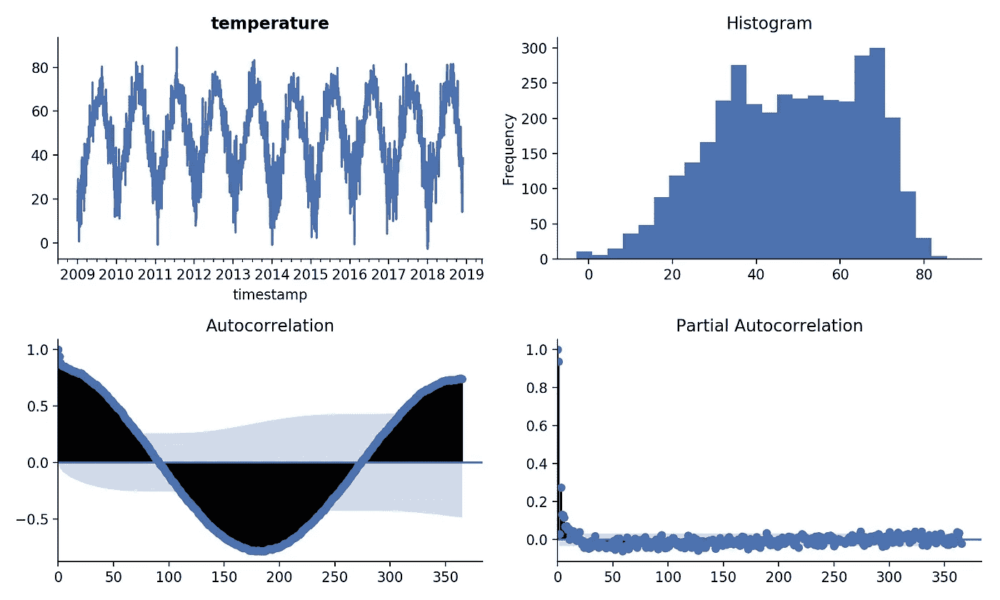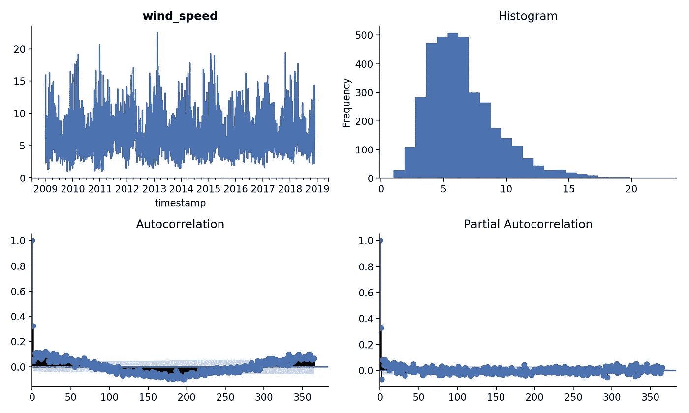

在一系列的每日温度中，平均温度不是恒定的，因为它每天都在变化，但对于不同年份的同一个月，我们可以期望一个恒定的平均值。

季节周期 s 定义了构成一个季节周期的观测次数。例如，每月系列的 s = 12，季度系列的 s = 4，每日系列的 s = 365。

然而，这可能并不完全正确:例如，如果我们有每日数据，并且季节周期是一个月的长度，则 s 将大约为 30，但它会逐月变化。最棘手的是，季节性可能不止一种。例如，对于每日数据，我们可以得到 s = 30 的月度季节性和 s = 365 的年度季节性。

由于另一个原因，每日数据具有挑战性——它们通常涉及**多重** **季节模式**，因此我们需要使用一种方法来处理如此复杂的季节性。

时间序列数据也可能有其他模式，如趋势或周期。所有这些都表明数据不是静止的。

要使用统计模型，如 VAR 模型，我们应该在数据能够适合模型之前关注这些模式。对于风险值模型，你需要执行稳定条件。将足够的结构放入模型中，以识别模型中的一些参数。

对序列的对数应用季节差异应该使上述序列平稳。为气候数据定义参数是相当具有挑战性的，有很多关于这个主题的出版物。我不会深入挖掘，只选择简单的参数 lag=365 和 diff=1。更多关于参数的信息你可以在 T [rend 气候时间序列分析](https://www.sciencedirect.com/science/article/pii/S0012825218303726)出版物中找到。

## **变形**

平稳时间序列的性质不依赖于序列被观察的时间。带有季节性的时间序列不是平稳的，因为季节性会影响时间序列在不同时间的值。

```
transformed = df.copy()
transformed['temperature'] = np.log(df.iloc[:, 0]).diff(1)
transformed['wind_speed'] = np.log(df.iloc[:, 1]).diff(1)
```

变换的目的是使数列平稳。

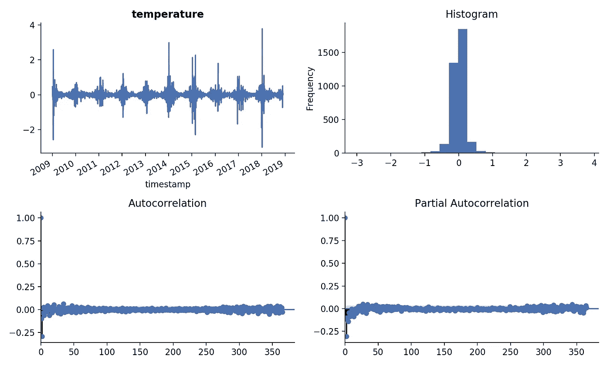

Temperature after transformation

下一步是**分割**数据。

将样本分成训练/测试和验证集。需要根据依赖关系结构对其进行仔细的划分。最适合这种情况的方法是滚动窗口。但是在这个特殊的例子中，我将在最后留下一些观察结果来验证我的模型。我想预测 7 天。稍后，为了检查模型的性能，我将使用这 7 个真值。

# **开发 VAR 模型**

这种模型要求序列是平稳的，如果序列不是平稳的，那么单个序列必须被转换为平稳的。

两个变量的 VAR(p)可以矩阵形式(其中 p=1)写成

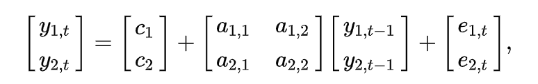

source: wikipedia

```
model = sm.tsa.VARMAX(y_train, order=(5, 0), trend='c')
model_result = model.fit(maxiter=1000, disp=False)
model_result.summary()
```

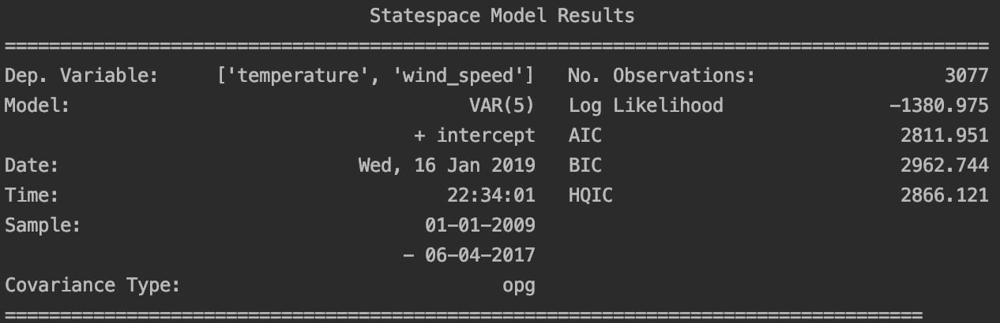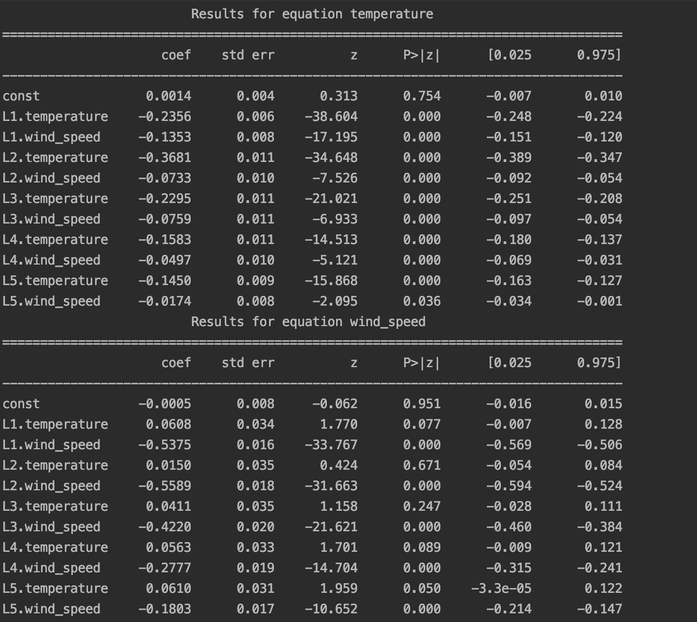

选择订单的方法是使用信息标准 AIC、BIC、HQIC。估计一系列模型，选择最好的一个。模型阶次选择的最常见方法包括最小化在模型阶次范围内评估的一个或多个信息标准。

```
for i in range(5):
    i += 1
    model = sm.tsa.VARMAX(y_train, order=(i,0))
    model_result = model.fit(maxiter=1000, disp=False)
    print('Order = ', i)
    print('AIC: ', model_result.aic)
    print('BIC: ', model_result.bic)
    print('HQIC: ', model_result.hqic)
```

关于如何选择正确顺序的更多细节，你可以在《T4 多时间序列分析新入门》一书中找到，作者是 Lütkepohl，Helmut(第 4 章)。在这个特殊的例子中，我将使用 p = 5，此时 AIC 标准达到最小值。

## **型号诊断**

下一步是模型诊断，并检查基本假设是否正确。Statsmodels 中的 VARMAX 类允许对 VAR、VMA 和 VARMA 模型进行估计(通过 order 参数)。VARMAX 过程是一个完善且强大的多变量时间序列分析工具。

```
model = sm.tsa.VARMAX(y_train, order=(5, 0))
model_result = model.fit(maxiter=1000, disp=False)
model_result.plot_diagnostics()
plt.show()
```

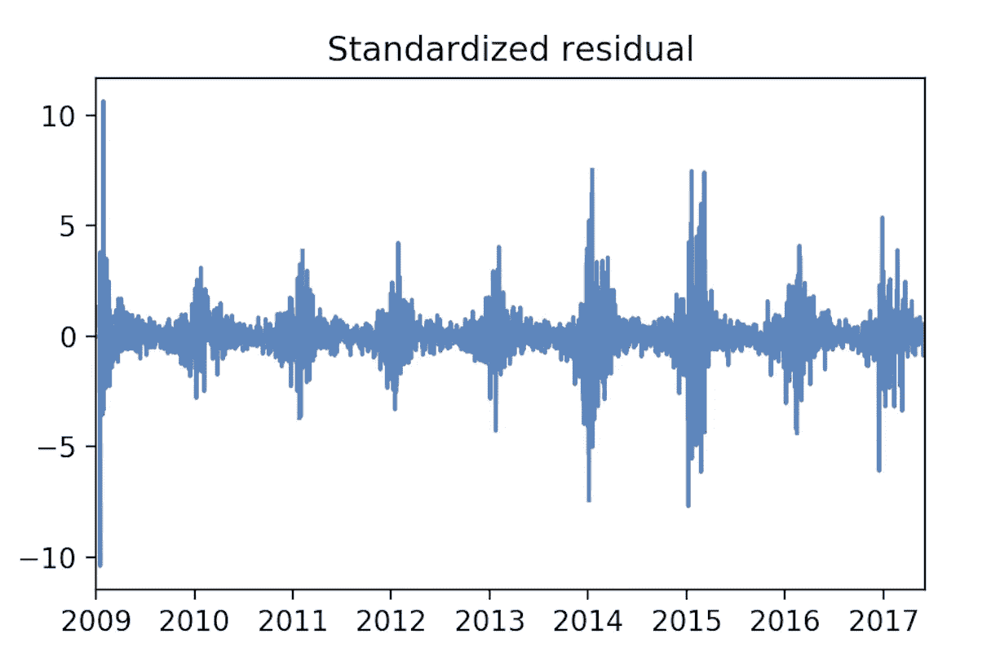

常见的总体诊断是绘制残差图，并查看残差是否符合模型假设。

可以应用测试:

1.  确认正常的测试
2.  缺乏序列相关性
3.  不存在异方差

这两个系列不显示趋势或规律的季节模式。因此，我们假设它们是平稳 VAR(p)过程的实现。

# **预测和估算**

概括一下:我们用下面的等式来转换温度和风速，其中 yt 是原始序列:


这意味着它应该被转换回定义和估计预测的真实结果。为此，我们计算方程并应用于预测值:

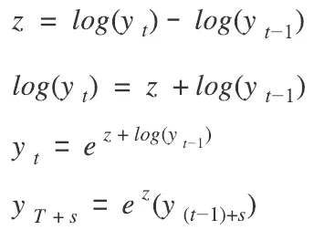

```
z = model_result.forecast(steps=7)
```

转换值并打印结果:

```
pd.concat([df['temperature'][-7:], forecast], axis=1)
```

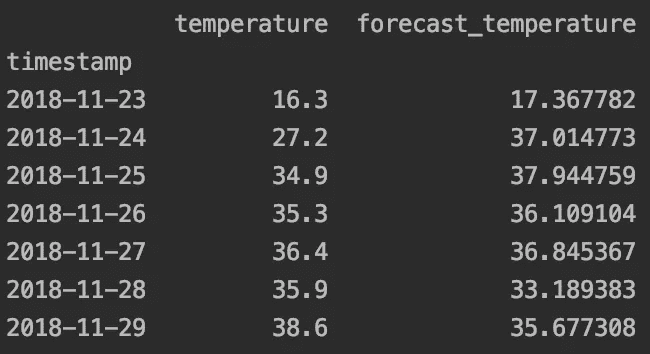

计算均方误差:

```
rmse = sqrt(mean_squared_error(df['temperature'][-7:], forecast))RMSE: 4.200
```

结论:时间序列数据很难正确处理。你需要适当地探索你的数据来理解它，意识到任何季节性或其他模式。不可能总是使用相同的方法。总的来说，最好从简单的模型开始，并在此基础上构建您的分析。

# 参考

1.  [AM207:哈佛大学 pav los Protopapas](http://iacs-courses.seas.harvard.edu/courses/am207/blog/lecture-17.html)
2.  预测:原则与实践
3.  Jeffrey Yau，PyData 大会 2017
4.  多时间序列分析的新介绍
5.  [谷歌 BigQuery 探索天气效应](https://cloud.google.com/blog/products/gcp/four-seasons-in-one-post-using-google-bigquery-to-explore-weather-effects-on-nyc)