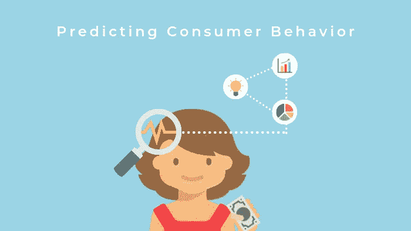
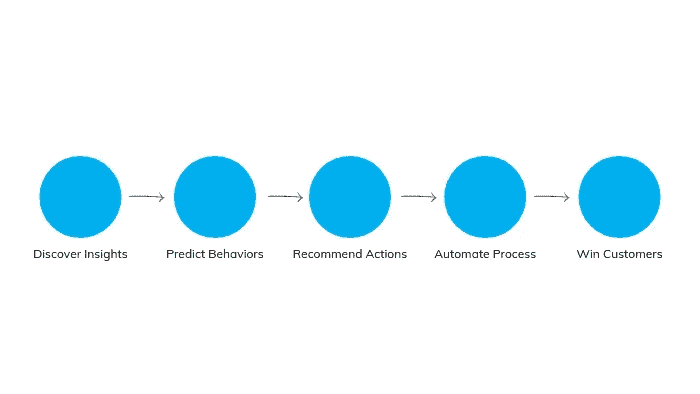

# 预测分析:

> 原文：<https://towardsdatascience.com/predictive-analytics-predicting-consumer-behavior-with-data-analytics-8ca51abb8dc2?source=collection_archive---------16----------------------->

## 通过数据分析预测消费者行为

企业在推出新的服务或产品之前花费数百万美元进行市场调查，这并不奇怪。尽管如此，重要的是要认识到，最终产品不会自我销售，实际上需要正确的营销工具才能让潜在消费者看到自己。用传统的方法做这件事相当于承担了适量的风险——但不幸的是，企业无法承受试错法。这一直是一项具有挑战性的任务，但今天，随着消费者不断接触到新技术、产品和不断变化的“必需品”，赌注甚至更高了在数以百万计的购买选择中，这个时代的消费者的行为一直在闪烁！多亏了移动商务，购买一项简单的服务或产品不再是一项简单的任务；消费者在最终决定购买之前有很多东西要权衡。

然而，这还不是全部。即使一个产品碰巧是最好的，它仍然经常被遗弃在购物车中，因为买家很可能在其他地方找到了更好的交易或更有价值的替代产品。虽然企业失去潜在客户令人沮丧，但并非所有希望都破灭了。这正是数据分析发挥作用的地方。

Using data analytics to predict consumer behavior

如今，精通数字和商业的营销人员更喜欢将资金和信任投入到数据分析中，以更好地了解他们的客户和他们的行为。在一个数字化过度曝光的时代，将一个潜在买家塑造成一个忠诚的客户，需要对用户的偏好、动机、行为和购买习惯进行更深入的研究。因此，聪明的营销策略围绕着在智能工具的帮助下追踪潜在客户的数字足迹，使用数据作为他们的燃料。

今天，我们将快速了解分析世界，为什么我们需要主动而不是被动，以及预测分析如何帮助我们预测这个时代的消费者行为。

# 你说的“分析”是什么意思？

分析是对数据或统计数据进行系统的计算分析，以获得有意义的模式，以及应用这些模式做出有效决策的过程。

有三种类型的分析:

1.  描述的
2.  预言性的
3.  规定的

但是，本次讨论的重点将是预测分析。因此，顾名思义，预测分析是使用数据或统计数据来获得可用于预测未来的有意义模式的过程。而描述性分析描述了过去，说明性分析有助于规划最佳行动方案。

公司仍在努力解释和实施这种新形式的分析，因为分析数据的技能仅限于少数数据科学家，他们通常不知道公司在预测消费者行为时的概念背景。然而，人们不应该对此感到害怕。福布斯进行的一项调查声称:

> “监督预测性营销工作至少两年的绝大多数高管(86%)表示，他们的预测性营销提高了投资回报率(ROI)。”

因此，即使使用这种新的分析形式听起来有点可怕，人们也可以相信福布斯，并考虑投入其中。

# 分析消费者行为的理由

想象一下，如果你在顾客走进你的商店的那一刻就知道他想要什么，而你的库存中没有那件特定的商品。好吧，你可能最终会惹恼并永远失去一个潜在客户。如果你已经知道你的消费者想要什么，什么时候想要，不是更容易吗？要做到这一点，分析消费者行为至关重要

*   洞察:通过细分客户数据库来确定消费者细分。
*   吸引和吸引潜在客户:通过分析过去的购买和个人资料，以相关优惠锁定细分客户。
*   提高客户保留率:它允许企业评估客户价值，并使用主动保留方法来保留客户。

Predict your way to success

# 将预测分析应用于营销

虽然预测分析可以支持一系列其他商业活动，但营销是预测分析的最佳应用之一。因此，以下是预测分析在营销中的几种应用方式:

**1。分段**

细分围绕着将一个市场划分为具有相似特征(如人口统计、地理、行为或态度)的不同子群的过程。这样，企业主可以针对每个群体，更充分地满足他们的需求。

在这里，数据有助于开发您的目标细分市场，并为每个细分市场确定最有效的定位。在预测分析的帮助下，你甚至可以确定最“赚钱”的细分市场，并根据这些细分市场中的历史消费者行为相应地锁定他们。

营销经理使用这些数据将资源分配到真正需要的地方，也就是说，分配到利润最高的部分。

**2。预测**

预测分析的主要用途是开发预测销售和收入的需求模型，这对于制定预算至关重要。

**3。需求定价**

也称为收益管理需求定价，是根据消费者群体需求弹性的差异对产品和服务进行定价的过程。例如，像优步这样的服务在高峰时间收费更高，但每个人的费用并不相同。与临时乘客相比，上班族愿意为舒适的乘坐支付更多的费用，因此这些乘坐可以收取更多的费用，并且可以降低另一组乘客的价格，以满足 ROI(投资回报)目标，而不会在消费者中变得不受欢迎。

使用预测分析，人们可以设计实验，帮助企业找出影响价格对需求影响的因素，这有助于开发最有利的定价策略，最大限度地提高公司的财务增长。

**4。提高客户满意度**

如果你是*向你的顾客销售*，那你就做错了！现在是 2019 年，你的业务应该更多地服务于客户，而不是从他们的口袋里掏钱。

客户满意度对保留率和忠诚度有重大影响。一个满意的顾客等于一笔好生意。统计数据显示，失去一个客户的成本可能是留住一个客户的五倍。预测分析在留住客户方面发挥着至关重要的作用；像联合分析这样的工具使公司能够精确定位哪些产品/服务的改进能更大程度地提高客户满意度。

# 结论

预测分析是一种难以适应的强大技术，如果与正确的营销策略完美结合，可以有效预测消费者行为，帮助公司实现投资回报最大化。