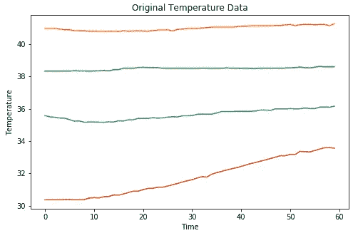
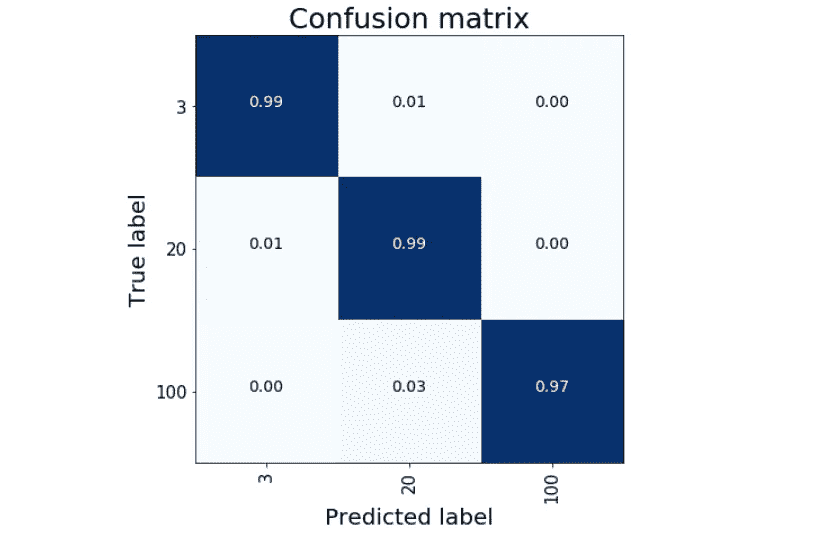
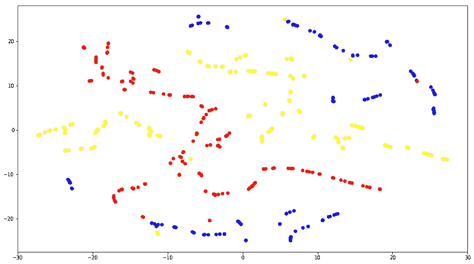

# 预测性维护:使用 CNN 检测传感器故障

> 原文：<https://towardsdatascience.com/predictive-maintenance-detect-faults-from-sensors-with-cnn-6c6172613371?source=collection_archive---------5----------------------->

## 使用 python 代码和图形表示的有趣方法


Photo by [Bruce Warrington](https://unsplash.com/@brucebmax?utm_source=medium&utm_medium=referral) on [Unsplash](https://unsplash.com?utm_source=medium&utm_medium=referral)

在机器学习中，随着时间的推移，预测性维护的主题变得越来越流行。这些挑战并不容易，而且非常多样化:对该领域有很好的了解或者与了解底层系统如何工作的人接触是很有用的。由于这些原因，当数据科学家投身于这个新的战场时，必须遵循线性和理性的方法，记住最简单的解决方案总是更好的。

在本文中，我们将研究一个分类问题。我们将在 Keras 应用一个由 CNN 制作的简单但非常强大的模型，并尝试对我们的结果给出一个直观的解释。

# 数据集

我决定从常青 UCI 仓库([液压系统的状态监控](https://archive.ics.uci.edu/ml/datasets/Condition+monitoring+of+hydraulic+systems#))获取一个数据集。

> 该数据集是用液压试验台通过实验获得的。该试验台由通过油箱连接的一次工作回路和二次冷却过滤回路组成。当四个液压部件(冷却器、阀门、泵和蓄能器)的状态定量变化时，系统周期性地重复恒定负载循环(持续时间 60 秒)并测量过程值，如压力、体积流量和温度。

我们可以设想有一个液压管道系统，该系统周期性地接收由于例如管道中特定类型液体的转移而产生的脉冲。这种现象持续 60 秒，由不同的传感器(*传感器物理量单位采样率、PS1 压力棒、PS2 压力棒、PS3 压力棒、PS4 压力棒、PS5 压力棒、PS6 压力棒、EPS1 电机功率、FS1 体积流量、FS2 体积流量、TS1 温度、TS2 温度、TS3 温度、TS4 温度、VS1 振动、CE 冷却效率、CP 冷却功率、SE 效率因子*)以不同的 Hz 频率测量。

我们的目的是预测组成管道的四个液压元件的状态。这些目标条件值以整数值的形式进行注释(易于编码)，如果某个特定组件在每个周期都接近失效，则称之为 us **。**

# 读取数据

每个传感器测量的值可在特定的 *txt* 文件中获得，其中每一行以时间序列的形式表示一个周期。

我决定考虑来自温度传感器(TS1、TS2、TS3、TS4)的数据，这些传感器以 1 Hz 的频率测量(每个周期 60 次观察)。

```
label = pd.read_csv(path+'profile.txt', sep='\t', header=None)
label.columns = ['Cooler','Valve','Pump','Accumulator','Flag']data = ['TS1.txt','TS2.txt','TS3.txt','TS4.txt']
df = pd.DataFrame()for txt in data:
    read_df = pd.read_csv(path+txt, sep='\t', header=None)
    df = df.append(read_df)
```

对于第一个周期，我们从温度传感器获得这些时间序列:



Temperature Series for cycle 1 from TS1 TS2 TS3 TS4

# 模型

为了捕捉有趣的特征和不明显的相关性，我们决定采用 1D CNN。这种模型非常适合于传感器时间序列的分析，并且要求在短的固定长度段中对数据进行整形。

在开发这个工作流程时，我从[这篇文章](https://blog.goodaudience.com/introduction-to-1d-convolutional-neural-networks-in-keras-for-time-sequences-3a7ff801a2cf)中获得了灵感，这篇文章采用了一种非常有用的方法。我选择了在 [Keras 网站](https://keras.io/getting-started/sequential-model-guide/)上描述的 CNN，并刷新了参数。建立该模型是为了对冷却器组件的状态进行分类，只给定数组格式的温度时间序列作为输入(每个周期的 t_periods x n_sensor)。

```
num_sensors = 4
TIME_PERIODS = 60
BATCH_SIZE = 16
EPOCHS = 10model_m = Sequential()
model_m.add(Conv1D(100, 6, activation='relu', input_shape=(TIME_PERIODS, num_sensors)))
model_m.add(Conv1D(100, 6, activation='relu'))
model_m.add(MaxPooling1D(3))
model_m.add(Conv1D(160, 6, activation='relu'))
model_m.add(Conv1D(160, 6, activation='relu'))
model_m.add(GlobalAveragePooling1D(name='G_A_P_1D'))
model_m.add(Dropout(0.5))
model_m.add(Dense(3, activation='softmax'))
print(model_m.summary())model_m.compile(loss='categorical_crossentropy', optimizer='adam', metrics=['accuracy'])history = model_m.fit(X_train, y_train, batch_size=BATCH_SIZE, epochs=EPOCHS, validation_split=0.2, verbose=2)
```

在这种情况下，仅用 10 个纪元，我们就能取得令人难以置信的结果！

```
Train on 1411 samples, validate on 353 samples
Epoch 1/10
1411/1411 [==============================] - 2s 2ms/step - loss: 0.2581 - acc: 0.9391 - val_loss: 0.0867 - val_acc: 0.9830
Epoch 2/10
1411/1411 [==============================] - 2s 1ms/step - loss: 0.1111 - acc: 0.9731 - val_loss: 0.0686 - val_acc: 0.9830
Epoch 3/10
1411/1411 [==============================] - 2s 1ms/step - loss: 0.0925 - acc: 0.9759 - val_loss: 0.0674 - val_acc: 0.9802
Epoch 4/10
1411/1411 [==============================] - 2s 1ms/step - loss: 0.1093 - acc: 0.9731 - val_loss: 0.0769 - val_acc: 0.9830
Epoch 5/10
1411/1411 [==============================] - 2s 1ms/step - loss: 0.1022 - acc: 0.9731 - val_loss: 0.0666 - val_acc: 0.9802
Epoch 6/10
1411/1411 [==============================] - 2s 1ms/step - loss: 0.0947 - acc: 0.9773 - val_loss: 0.0792 - val_acc: 0.9830
Epoch 7/10
1411/1411 [==============================] - 2s 1ms/step - loss: 0.0984 - acc: 0.9794 - val_loss: 0.0935 - val_acc: 0.9830
Epoch 8/10
1411/1411 [==============================] - 2s 1ms/step - loss: 0.0976 - acc: 0.9738 - val_loss: 0.0756 - val_acc: 0.9802
Epoch 9/10
1411/1411 [==============================] - 2s 1ms/step - loss: 0.0957 - acc: 0.9780 - val_loss: 0.0752 - val_acc: 0.9830
Epoch 10/10
1411/1411 [==============================] - 2s 1ms/step - loss: 0.1114 - acc: 0.9738 - val_loss: 0.0673 - val_acc: 0.9802
```

对试验数据进行预测，模型的准确率达到 0.9909%。



每个班的 KPI 都很牛逼！这一结果对于 3 级(部件冷却器“接近完全失效”)尤为重要，因为通过这种方式，我们能够检测并防止系统中可能出现的故障。

# 将结果可视化

如果我们想对系统状态有一个总体的了解，并看到我们的模型的不可思议的优点，看一个图形表示可能是有用的。为了达到这个目标，我们重新利用我们在上面建立的 CNN 来制作解码器，并从每个周期的时间序列中提取巧妙的特征。使用 Keras，这在一行代码中就可以实现:

```
emb_model = Model(inputs=model_m.input, outputs=model_m.get_layer('G_A_P_1D').output)
```

新模型是一个解码器，它以与我们用于分类任务的 NN 相同的格式接收输入数据(每个周期的 t_periods x n_sensor ),并以嵌入的形式返回“预测”,该嵌入来自具有相对维度的 GlobalAveragePooling1D 层(每个周期的一行 160 个嵌入变量)。

使用我们的编码器对测试数据进行预测计算，采用一种降维技术(如 PCA 或 T-SNE ),并绘制结果，我们可以看到这种魔力:

```
serie_features = emb_model.predict(X_test)
tsne = TSNE(n_components=2, random_state=42, n_iter=300, perplexity=5)
T = tsne.fit_transform(serie_features)plt.figure(figsize=(16,9))
colors = {0:'red', 1:'blue', 2:'yellow'}
plt.scatter(T.T[0], T.T[1], c=[colors[i] for i in np.argmax(y_test, axis=1)]) 
plt.show()
```



TSNE on cycle embeddings for test data

哇哦！！！这个图讲的是事实！每个点代表测试集中的一个循环，相对颜色是较冷条件的目标类别。可以看出冷却器组件的目标值之间的区别是如何定义的。这种方法是我们模型性能的关键指标。

# 摘要

在这篇文章中，我们试图解决一个预测性维护的问题，用 CNN 对时间序列进行分类。开发了一个具有令人印象深刻的性能的强大模型。我们还试图给出结果的可视化表示。重要的是要强调 CNN 的力量，不仅是在预测方面，而且是作为一种工具来检测数据之间的无形关系。

**如果你对题目感兴趣，我建议:**

*   [**预见性维护同 LSTM**](/predictive-maintenance-with-lstm-siamese-network-51ee7df29767)
*   [**预测维护:用 CRNN 和光谱图检测传感器故障**](/predictive-maintenance-detect-faults-from-sensors-with-crnn-and-spectrograms-e1e4f8c2385d)
*   [**用 ResNet 进行预测性维护**](https://medium.com/towards-data-science/predictive-maintenance-with-resnet-ebb4f4a0be3d)

[**查看我的 GITHUB 回购**](https://github.com/cerlymarco/MEDIUM_NoteBook)

保持联系: [Linkedin](https://www.linkedin.com/in/marco-cerliani-b0bba714b/)