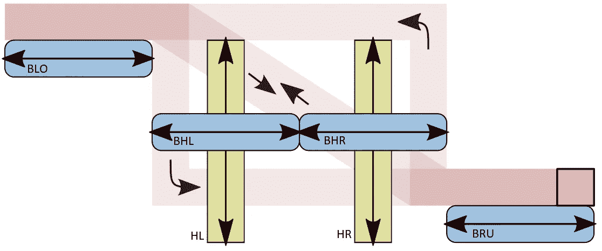
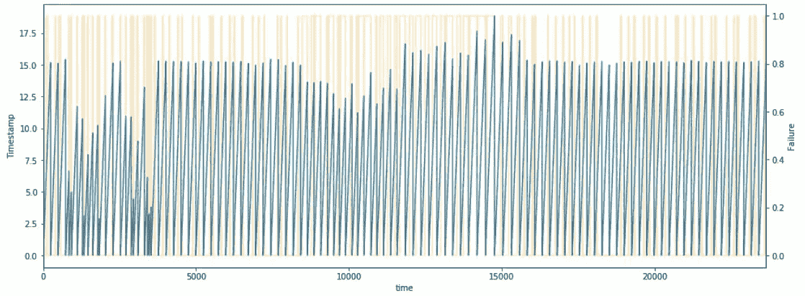
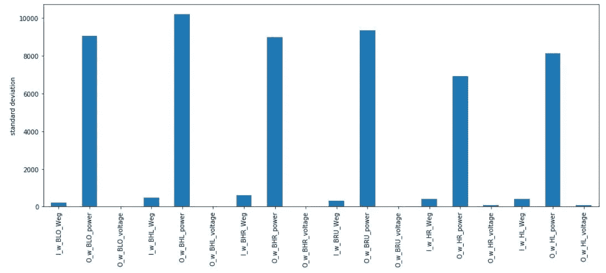
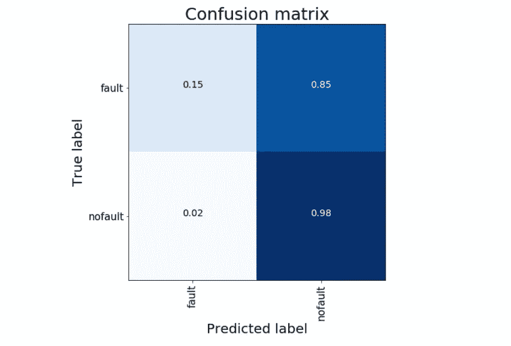

# LSTM 暹罗网络的预测性维护

> 原文：<https://towardsdatascience.com/predictive-maintenance-with-lstm-siamese-network-51ee7df29767?source=collection_archive---------17----------------------->

## 从传感器时间序列中检测故障


Photo by [sol](https://unsplash.com/@solimonster?utm_source=medium&utm_medium=referral) on [Unsplash](https://unsplash.com?utm_source=medium&utm_medium=referral)

如今，预测性维护是一个活跃的领域，其中人工智能解决方案被引入以提高各种制造系统的生产率。典型的请求包括开发一个解决方案，当观察到的组件的特定部分接近失败时，该解决方案产生警告。可以猜到，这些是典型的“不平衡情况”,我们有来自各种传感器的大量数据，但缺少阳性标记样本，阳性样本表示存在故障。

在以前的一篇文章中，我介绍了一个解决方案，该方案对液压管道系统中特定组件的退化状态进行分类；结果很酷！现在，**我尝试开发一种管道来检测存储系统是否接近故障。我们希望利用神经网络对来自传感器的连续时间序列进行分类。**特别是，我使用适合时间序列的暹罗网络和 LSTM 架构，避免了缺乏故障样本的问题。

# 数据集

和往常一样，我更喜欢用真实的数据工作。我在 Kaggle 上发现了一个奇妙的数据集:[能源优化的高存储系统数据](https://www.kaggle.com/inIT-OWL/high-storage-system-data-for-energy-optimization)，由[智能工厂](https://www.smartfactory-owl.de/index.php/en/)发布。数据集存储 4 条短传送带(BLO、BHL、BHR、布鲁)和 2 条轨道(HR、HL)的信号。



How the storage system works ([source](https://www.kaggle.com/inIT-OWL/high-storage-system-data-for-energy-optimization))

高位存储系统是为了在两个地点之间运输一个包裹而建造的。中间的两条传送带在不水平移动包裹的情况下只能垂直移动。中间的两条传送带可以水平移动包裹，也可以垂直移动。提供了整个系统的两次运行:优化和未优化。我使用了*HRSS _ 异常 _ 优化. csv* ，它包含了失败的优化运行。

我们有 19634 个时间观察结果，分成 111 个周期和 4517 个记录的故障。每次循环开始时，时间戳被设置为 0。这些周期不一定是一个接一个地记录下来的。他们之间可能有更大的时差。



Failure occurrences (orange) in cycles (blue)

对于每个周期，我们在 4 条传送带和 2 条轨道上放置了 18 个传感器，用于监控它们的活动。



standard deviations of sensor features in all the cycles

在开始考虑模型之前，我们必须花相当多的时间来考虑清理和预处理。在这种情况下，数据总是非常嘈杂，充分的初步处理对于获得良好的结果至关重要。我们没有缺失值，但是我们的传感器系列具有巨大的幅度差异，如 std 条形图所示。为了减少这种差异，我采用了**三步预处理工作流**:

*   将我们的数据分成不同的周期；
*   将每个传感器值作为相对循环开始时间的增量来处理；
*   使用标准缩放方法缩放增量。

所有这些程序都必须小心进行！我们不想污染我们的数据和损害我们的结果。由于这些原因，一开始就建立一个最佳的验证策略是很重要的。在我们的例子中，我们必须处理时间序列，所以最常见的验证方法是通过保留时间相关性来验证我们的结果。我想在最新的部分数据(最新的 10%)上测试我的模型；鉴于'*'最新部分【T3]'我打算每个周期的最后 10%。因此，有了这个概念，操作特定的预处理就更容易了。*

# 模型

正如开头所介绍的，我们试图通过一个连体网络提前一步对系统中可能出现的故障进行建模。理解暹罗系统如何工作是非常简单和直观的。它接收一个双输入，并在此基础上计算嵌入距离。模型的范围是验证两个样本在空间上是相似还是相距较远。所有的过程可以作为一个二元分类任务来处理，其中阳性样本属于同一类(因此它们是相似的)。

暹罗原理经常应用于图像识别，我们尝试转换应用领域来处理预测维护领域中的一个时间序列分类问题。这一程序的好处是避免缺乏重要类别的未标记样本，即在预测性维护中，它等同于缺乏故障证据。

前提听起来不错！因此，要完成这项惊人的任务，最完美的工具就是强大的 LSTM。我们将建立我们的暹罗网络，采用由 LSTM 层组成的顺序编码器。

```
def SiamesNet(): left_input = Input((sequence_length, len(features)))
    right_input = Input((sequence_length, len(features))) lstmnet = Sequential([
        BatchNormalization(),
        LSTM(128, activation='relu', return_sequences=True,
             input_shape=(sequence_length, len(features))),
        LSTM(32, activation='relu')
    ]) encoded_l = lstmnet(left_input)
    encoded_r = lstmnet(right_input) L1_layer = Lambda(lambda tensor: K.abs(tensor[0] - tensor[1]))
    L1_distance = L1_layer([encoded_l, encoded_r]) drop = Dropout(0.2)(L1_distance)
    prediction = Dense(1,activation='sigmoid')(drop) model = Model(inputs=[left_input,right_input],
                  outputs=prediction) return model
```

选择 LSTM 结构意味着以顺序样本的形式管理数据。我们将初始时间序列分成一系列 8 个时间步骤，注意避免与循环开始重叠(在代码中，这个过程与预处理工作流一起计算)。


example of standardized sequence sample

我们从序列的训练群体中随机选择生成训练对。通过这种方式，我们能够大幅增加可供我们使用的样本数量。有了生成的线对，我们就准备好去适应暹罗网络了。在这个阶段的最后，我们必须进行验证。检查这种系统的性能并不总是立竿见影的。网络适合接收双输入，所以我们必须一次给它传递两个序列。其中一个肯定是我们的测试序列，另一个来自火车。首先，我们将测试与从故障类别中随机选择的训练序列相结合。其次，我们将它与非故障样本配对。因此，我们同时计算两个预测，以验证测试样本所属的最接近的类。最大相似性分数定义了我们的测试序列属于哪个类。

对于(特定类别的)成对测试序列/训练序列重复 N 次随机选择和预测的过程，可以获得结果的稳定性。假设通过进行上述 N 次比较，我们得到了单个类的 N 个相似性分数。我们可以通过取最大值或平均值(我选择最大值)等其他统计数据来总结它们。所以在这个程序之后，我们可以用一个经典的方法来检查性能。



我们能够以一种有价值的方式提前一步识别一些故障序列。我们可以预测大约 15%的限制误报数量的中断(高精度)，这可以被认为是存储系统的良好起点。

# 摘要

在这篇文章中，我提出了一个提前检测故障的解决方案。我想在这个特殊而臭名昭著的任务中运用 LSTM 层的暹罗网络的力量。这种结构，结合适当和巧妙的预处理工作流程，允许我们“忽略”缺少阳性标记样本，并训练一个模型，该模型在特定时刻对我们系统的状态进行分类。

**如果你对题目感兴趣，我建议:**

*   [**预测性维护:用 CNN**T5 检测传感器故障](/predictive-maintenance-detect-faultsfrom-sensors-with-cnn-6c6172613371)
*   [**预测维护:用 CRNN 和光谱图检测传感器故障**](/predictive-maintenance-detect-faults-from-sensors-with-crnn-and-spectrograms-e1e4f8c2385d)
*   [**用 ResNet 进行预测性维护**](https://medium.com/towards-data-science/predictive-maintenance-with-resnet-ebb4f4a0be3d)

[**查看我的 GITHUB 回购**](https://github.com/cerlymarco/MEDIUM_NoteBook)

保持联系: [Linkedin](https://www.linkedin.com/in/marco-cerliani-b0bba714b/)