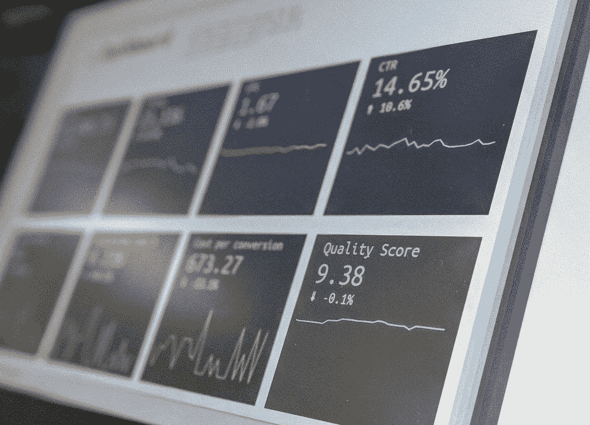

# 预测营销:以下是大数据如何重新定义我们的营销策略

> 原文：<https://towardsdatascience.com/predictive-marketing-here-is-how-big-data-redefined-our-marketing-strategy-e4a99494122?source=collection_archive---------14----------------------->

数据已经并将永远是每个产品营销活动的关键，今天营销空间的性质使数据成为无可争议的王者。

我有超过 10 年的媒体、产品和营销经验。在决定下一步做什么之前，我总是使用数据。但直到几年前，它还只是基于市场上的分析工具。然后，随着数据科学的繁荣，我们遇到了预测营销，使我们不仅可以利用过去的数据，还可以预测未来。

Photo Credit: [Unsplash](https://unsplash.com/photos/n6B49lTx7NM), by @ pietrozj

# **预测营销的权威指南**

我也在传统媒体工作过，但数字化已经接管了大量的营销，现在决定了我们如何看待品牌，并最终决定我们使用的新工具或购买的决定，这已经不是新闻了。预计全球将有 1.9 万亿人在网上购物。而在美国，79%的人已经进行了网上购物，而 2002 年只有 22%。然而，令人兴奋的是数字营销过程中的复杂程度，以控制更好的线索并增加销售机会。

随着技术的几次飞跃，市场营销变得越来越复杂。随着新兴公司完全基于网络，数字营销——在互联网和电子设备上为产品和服务做广告——已成为企业超越传统营销的关键。

正如数字营销已经成为我们业务的核心一样，市场数据已经成为营销过程中成功的重要决定因素。不用说，数据已经并将永远是我们每一次营销活动的关键，今天的数字营销空间的性质使数据成为无可争议的王者。

我们使用从多个市场来源获得的数据来做出明智的营销决策，例如如何最好地定位广告和理想的营销预算。为了改进营销决策，我们引入了更复杂的方法来更好地利用数据、分析数据，并在营销中利用数据来实现更好的结果。我们可以用预测营销这个术语来描述这些进步中的一个。

# **什么是预测营销？**

预测营销，顾名思义，是一种决定不同营销策略成功概率的营销技术。除了流行词，这是 MarTech 的一个子集，其前提是营销和销售是由数据驱动的。

因此，在预测营销中，我们使用数据科学(或数据分析)来预测哪些营销行动更有可能成功，哪些更有可能失败。我们可以将所涉及的数据分析部分称为预测分析。

# 预测分析与预测营销

虽然这两个术语可以互换使用，但预测营销将商业营销的预测分析向前推进了一步，具有更广泛的含义。预测分析使用预测模型来提供对未来的洞察，而预测营销使用预测技术来测试企业的营销策略，在连续(有时是迭代)的过程中提供洞察并做出更好的营销决策。

在一个简单的场景中，预测营销专家(通常是数据科学家、数据分析师或分析公司)从多个来源收集关于企业的数据，并与公司的营销和客户数据一起进行分析。有了这些信息，数据科学家应用适合业务的预测模型，并以一定的准确度预测其营销工作的成功。

# **预测营销的工作原理**

预测营销的一个经典案例是电子商务网站，它根据用户过去的行为向用户推荐产品和服务。从产品搜索页面到结账台，这些网站确保每一个回头客都受到这些产品推荐的狂轰滥炸。这些推荐是该网站“协同过滤”的产品，基于对客户行为的研究，如客户购物车中的商品或客户或其他客户过去互动或购买的商品。该算法的实际内容通常更加复杂，可能会将数据与时间、位置、人口分布以及包括打开率、点击率和选择退出率在内的大量其他指标相关联。

但不再是只有大公司才能负担得起昂贵的内部数据科学家，他们可以从预测营销技术中受益。我们的内部预测营销专家还从多个来源收集数据，并为我们的业务建立预测营销模型。他们已经获得了该公司的营销和客户数据，以及关于营销工作的信息。然后，数据分析师可以预测公司营销工作的成功。

Photo Credit: [Unsplash](https://unsplash.com/photos/y3FkHW1cyBE), by @ arifrw

# **预测营销的好处**

预测营销的相关性与数字营销中的数据科学非常相似。

首先，预测技术让营销人员更好地了解客户行为。与常规营销数据分析略有不同的是，预测营销工具直接提供决策，而数据科学家不必单独解释数据和提出建议。换句话说，预测营销模型准确地说明了什么样的营销策略可能有效，什么样的营销策略无效，从而使决策更容易做出。预测营销模型可以告诉客户是否会购买，何时以及如何购买，以及其他特定业务的预测，所有这些都基于从客户那里获得的数据。

通过分析客户以前的行为，数据供应商还可以帮助公司在营销预算管理、市场活动规划、线索挖掘和转化策略等方面做出决定。因为它基于对来自客户的大量不同数据的分析(而不是直觉和猜测)，预测营销的决策更有针对性，并产生更好的结果。

此外，预测分析使我们的公司更接近自动化营销系统或专家所说的规范营销。在这个层面上，营销系统自动分析数据并实时做出决策。模型生成、销售线索评分和更新客户洞察等活动将即时发生。在这种熟练程度下，我们能够显著提高客户参与度，因为我们可以轻松细分客户，并部署量身定制的营销活动。这样的结果是显而易见的；必须优化我们的营销预算，提高销售线索得分，增加销售收入。

预测分析是数据驱动营销的支柱，根据 Jas Saran， [Forbes](https://www.forbes.com/sites/theyec/2018/09/25/how-can-predictive-analytics-make-marketing-more-effective/#51a4fe82e9d6) 的说法，它可以改善公司在至少六个领域的营销工作，包括营销组合建模、向上销售和交叉销售、网络优化、客户获取、特征分析和保留。

以下是预测营销让我们的创业环境受益的一些具体方式:

# **我们如何通过**预测营销为客户特征分析、客户获取和客户保持提供支持

复杂的预测营销模型有助于企业根据客户过去的行为和对未来行为的洞察，创建特定和独特的客户身份。因为用于形成预测营销模型的数据通常非常详细，围绕这些数据构建的营销工作往往具有更高的转化率。

当营销工作精确且只针对正确的客户时，客户获取工作变得更加有效和高效。再次，由于预测营销模型，营销人员可以定制营销活动和客户获取策略，以适当细分的潜在客户群的不同部分，具有高转换概率。

同样，对客户未来行为的洞察有助于企业规划其客户维系战略。当公司知道可能离开的客户群、他们可能离开的时间以及使他们离开的条件时，公司可以为每个客户群设计定制的保留计划，并根据一般假设消除一揽子努力。当企业了解这一点时，它就可以向现有客户进行追加销售和交叉销售，从而获得更高的成功概率。

# **以下是我们如何利用**预测营销改进电子邮件营销和网站参与度

根据[预测智能基准报告](https://www.marketingcloud.com/sites/exacttarget/files/deliverables/etmc-predictiveintelligencebenchmarkreport.pdf)，使用预测智能的电子邮件营销活动产生最高的影响收入。在预测营销之前，营销人员不得不依靠广泛的概括(有时称为人物角色)来创建电子邮件，其中很多都不会被打开。但预测营销改变了游戏规则，它赋予营销人员特定的信息来创建个性化的电子邮件，从而提高了打开率和参与度。

这里有一个有趣的统计数据:“备货电子邮件”和废弃产品电子邮件活动——可以通过预测营销模型实现——的点击率最高，分别为 19%和 14%。

类似地，使用预测营销模型的网站可以通过研究网站访问者的行为来提高参与度和销售额，尤其是围绕广告横幅、产品页面和动作按钮等网络资产。他们可以利用从访问者和客户那里收集到的信息来优化网络体验。

总之，预测营销旨在预测促使客户购买产品的条件，并帮助企业优化定价和影响客户行为的其他因素。以亚马逊为例，据报道，当引入基于其预测分析模型的推荐时，该公司实现了约 30%的销售额增长。

Photo Credit: [Unsplash](https://unsplash.com/photos/qwtCeJ5cLYs), by @ srd844

# **预测营销如何削减 B2B 营销成本**

企业对企业(B2B)营销是预测分析非常重要的领域，尤其是在降低营销成本和提高效率方面。一个 B2B 的成本可能从 35 美元到 100 美元或更多，视情况而定。这种高成本使得低转化率真的成本很高。在每条线索 50 美元的情况下，1%的转换率将使 B2B 营销人员仅在线索生成方面就花费 5000 美元。

因此，这并不令人惊讶，许多企业正致力于预测营销解决方案，以更好地瞄准他们的营销努力，以获得更好的投资回报。

这里有一个有趣的数据:在 Eversrting 的预测营销调查中，98%的营销人员至少拥有 CRM、营销自动化和一些营销工具，要么完全致力于或已经实施预测营销。

## **B2B 预测营销:使用案例和最佳实践**

对于 B2B 营销人员来说，预测营销或多或少正在成为一种不可或缺的方法。正如我们所见，这种方法为营销人员节省了一些营销成本，这对于 B2B 业务来说是相当可观的。除此之外，根据预测营销的使用案例，预测营销为营销人员提供了一些优势。这里有几个。

## **B2B 客户拓展**

首先，B2B 营销人员可以通过整合预测营销获得高质量的新线索。为此，营销人员通过公司信息和特殊信号应用预测营销模型，以较高的准确度识别潜在客户。

公司规模、产品和收入等信息在预测营销模型中与业务扩张、管理层变动等信号和成千上万的其他公司数据一起分析时，可以确定有资格成为潜在客户的公司行为。使用预测分析模型，营销人员可以生成具有这种行为的类似企业的长列表，作为 B2B 机会的数据库。

Photo Credit: [Unsplash](https://unsplash.com/photos/cYUMaCqMYvI), oowgnuj

## **B2B 销售线索评分(销售线索优先排序)**

获得潜在客户名单后，B2B 营销人员需要决定哪个潜在客户值得首先出手；这是更有可能成为客户的潜在客户。为了做到这一点，营销人员再次使用预测营销模型来对线索进行优先排序。

线索评分至关重要，因为它告知营销人员如何进行营销工作；应该追求哪些前景，何时追求，如何追求。通过使用预测模型，B2B 营销人员提高了手动建立线索评分公式的效率。所使用的预测模型可以基于购买的可能性或终身收入、盈利能力、促销响应、销售接受度或各种因素的组合。这取决于业务目标和优先级。

## **B2B 销售线索细分**

接下来，B2B 营销人员可以再次借助预测营销技术将潜在客户划分为不同的细分市场。一个理想的模型将创建客户的人物角色，并根据他们的特征和行为将潜在的客户分组。

这些细分基于个人兴趣、公司特征，有趣的是，还有过去的行为。由于过去的客户行为是预测未来行动的可靠而准确的基础，基于预测营销模型的潜在客户群往往会提供更个性化的营销方法，从而产生更高的转化率。

线索细分对整个 B2B 营销过程至关重要，因为它有助于确定每个细分市场的确切方法，而不是一般的营销驱动。除了很大程度上是静态的人物角色，预测营销模型允许营销人员生成动态的细分市场，如“参与度”,这些细分市场经常变化，并且每次都定制营销方法。

## **主动销售整合**

由于预测营销模型创建了动态的客户细分，它使销售团队能够及时获得有关其前景的信息(比如预测)。结合质量线索优先排序，预测模型有助于使销售工作更加主动、及时和高效。例如，一个模型可以预测某个客户群最有可能购买的时间段，并提示销售团队在该时间段内加强对该客户群的努力。

来自预测分析的其他信息，如基于过去决策的决策层次结构，可以帮助销售团队更好地协调他们的工作，并个性化他们的销售宣传。同样，销售团队可以更好地了解何时进行追加销售和交叉销售。

## **管理 B2B 客户的整个生命周期**

除了产生和优先考虑高质量的线索，预测营销技术还帮助营销人员在客户生命周期中产生更大的影响。这些模型支持营销人员通过在销售过程的每个阶段提供关于客户的及时信息来吸引客户。

## **一些常见的 B2B 预测营销模式**

实际的预测营销模型通常分为三类[即:侧重于对潜在客户进行分组的细分模型，跟踪获得或搅动客户的可能性的倾向模型，以及预测哪些客户可能需要更多营销努力的智能推荐——通常是追加销售或交叉销售。](https://blog.reachforce.com/blog/5-predictive-modeling-techniques-for-better-marketing)

细分模型根据产品(基于产品的聚类)和行为(行为聚类)对潜在客户或客户进行分组，而倾向模型则根据客户钱包、竞争、其他客户的模式等因素，通过指出危险信号和机会，寻求保持和扩大客户群的方法。智能模型——规范营销的先驱——确定更好地吸引现有客户的领域。

## **预测营销的数据供应商和 SaaS 提供商**

虽然与数据科学相关的服务似乎很昂贵，但它们更容易被常规企业接受，不像早期那样只有大公司才能负担得起聘请数据科学家团队的费用。由于越来越多的数据供应商和软件即服务(SaaS)系统提供基于云的预测分析。

以下是预测营销领域的一些领先数据供应商:

**Everstring** 拥有强大的预测营销引擎和全功能数据管理平台。自 2012 年上线以来，它已经为包括康卡斯特在内的许多知名客户提供了服务

**Infer** 专门从事契合度评分，预测哪个未来潜在客户准备购买，然后创建一个潜在客户数据库。销售和营销软件公司 HubSpot 使用 Infer 的 fit 建模。

**6sense，**服务于戴尔和联想，是预测市场领域的后来者之一。它强调预测客户意图和决策的能力，也称为意图评分。

**LeadSpace** 是一家社交媒体数据供应商，整合了预测性营销见解，以提高净新线索的质量。微软和 Adobe 使用 LeadSpace。

Photo Credit: [Unsplash](https://unsplash.com/photos/1K6IQsQbizI), franki

# **预测营销是 B2B 营销的未来**

从活动中获得高质量的结果后，任何人都可以很容易地认为营销的未来是自动化，而自动化的核心是预测营销。

根据 Everstring & Forrester 报告，B2B 营销人员越来越多地采用预测营销。以下是一些重要的发现:

预测营销人员(41%)报告的收入增长是行业平均水平的 2.9 倍，相比之下，14%的回顾营销人员报告了积极的业务成果。

一半的预测营销人员声称在他们的产品和服务类别中处于领导地位，相比之下，只有 24%的回顾营销人员这样认为

49%的预测营销人员表示，他们的组织一直超过公司基准，相比之下，只有 28%的回顾营销人员能够有效地为他们的业务提供类似的价值。

在这三个方面，预测营销——以及一般的数据分析驱动的营销——正在为 B2B 营销人员设定节奏。据 Salesforce 称，91%的顶级营销人员已经在实施预测营销。它也吸引了商业金融家的注意。仅在几年内，风险资本家和行业参与者就在预测营销和类似的数据驱动营销上投入了超过 50 亿美元。

预测智能基准报告还显示，预测智能建议影响了总订单的 26.34%。经过 36 个月的分析，受影响的订单总数从 11.47%增加到 34.71%。

# **预测营销的挑战**

我非常担心预测营销会取代人类的贡献。预测营销技术的一个主要挑战在于，随着系统走向全自动营销分析，如何去除“人”的贡献。一些专家同意，人类仍然有一些优势，通过自动预测系统增加人类贡献的限制可能会对销售产生负面影响。

作为一项新兴技术，采用方面的担忧将一直存在，尤其是在数据分析非常昂贵的情况下。然而，随着企业可以轻松插入的可扩展 SaaS 解决方案的增长，它正在帮助 B2B 营销人员从预测性营销洞察中受益，而不会破产。最后，对数据质量、数据量、数据相关性和隐私问题等数据科学的关注也会影响预测分析。

Photo Credit: [Unsplash](https://unsplash.com/photos/LqKhnDzSF-8), sortino

# **结论**

在采用预测营销后，我们在 Smartereum 和 WhatsAround 的业务都在增加流量、销售线索和收入方面获益。我们能够通过自动对销售线索进行分级来支持我们的销售团队，并将我们的重点放在最佳业绩上。