# 预测建模和多类分类:应对 Taarifa 挑战

> 原文：<https://towardsdatascience.com/predictive-modeling-and-multiclass-classification-a4d2c428a2eb?source=collection_archive---------9----------------------->

## 对于多类预测任务，我们如何使用最近邻分类模型、决策树和支持向量机？

# **简介**

**分类预测问题**是数据科学中最常遇到的问题之一。在本文中，我们将使用三个主要的分类家族来解决一个**多类分类问题**:最近邻、**决策树**和**支持向量机(SVMs)。**

数据集和原始代码可以通过[这个 GitHub 链接](https://github.com/AntonioStark/Taarifa-Water-Pumps)访问。

# 挑战

本文解决了与本文中[介绍的相同的挑战。虽然这篇文章是关于预测建模和多类分类的独立文章，但是如果您想知道我是如何清理数据集以用于建模的，您也可以查看那篇文章](https://medium.com/@antoniostark/50ba6ea65c0a)！(另外，如果您直接从那篇文章而来，请随意跳过这一部分！)

我在这篇文章中使用的挑战来自 Drivendata.org。你可以把它想象成一场挑战社会影响的游戏。你仍然可以获得同样的奖金和格式良好的数据集，额外的好处是你将对世界产生积极的影响！

我们在这篇文章中使用的特殊挑战叫做“ [**向上泵:数据挖掘地下水位**](https://www.drivendata.org/competitions/7/pump-it-up-data-mining-the-water-table) ”面临的挑战是**创建一个模型，该模型将预测特定水泵(“water point”)**的状况，因为它有许多属性。

数据由 [**Taarifa**](http://taarifa.org/) 提供，这是一个开源 API，收集这些数据并呈现给世界。如果你对他们的工作和他们的数据点代表什么感到好奇，一定要去看看他们的网站(和 [GitHub](https://github.com/taarifa/TaarifaAPI) ！)

# 数据

我们的原始数据集(由挑战赛提供)有 42 个特征的 74，000 个数据点。在[上一篇关于数据预处理和探索性数据分析的文章](https://medium.com/@antoniostark/50ba6ea65c0a)中，我们将其转换为包含 114 个特征的 74，000 个数据点的数据集。特征数量的增加主要来自于**的一键编码**，我们将分类特征扩展为每个类别的多个特征。实际上，我们**在一次性编码之前已经删除了超过一半的特性**，从 42 个特性减少到仅仅 20 个。剩下的 20 个特性的一键编码引导我们找到了这里的 114 个特性。

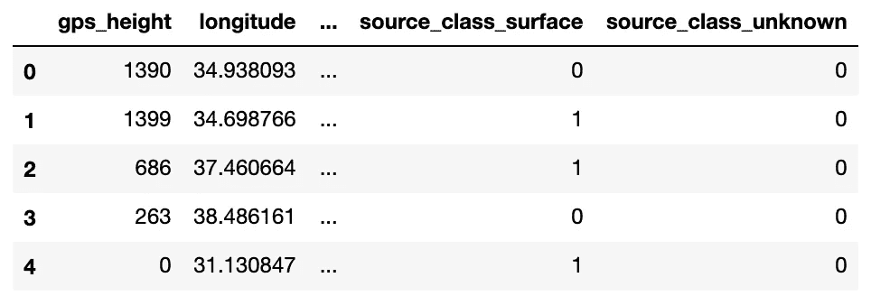

You can see that all of our “new” features are the results of one-hot encoding. The feature title is “original_feature_name” and “class” combined together, with 0 or 1 for whether a data point belongs to that class.

# 数据准备

目前，我们的测试数据集没有与之相关联的标签。为了查看模型的准确性，我们还需要测试数据集的标签。尽管很痛苦，我们现在还是要放弃测试数据集。我们可以在训练完所有模型并决定最终提交时使用哪个模型后重复使用。

```
train = df[df.train==True].drop(columns=['train'])
X = train.drop(columns=['status_group'])
y = train.status_group
```

## 数据分割

我们将从我们的训练数据中创建一个人工测试数据集，因为训练数据都有标签。让我们从训练数据集中随机抽取三分之一的样本，并将其指定为模型的测试集。我们可以使用 scikit-learn 的 **train_test_split** 包(或者“sklearn”)。

```
X_train, X_test, y_train, y_test = train_test_split(X,y,test_size=0.33, random_state=1)
```

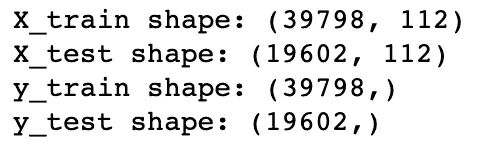

Our training dataset now has about 40,000 data points while our testing dataset has about 20,000\. That’s a good 2:1 split!

## 数据输出不平衡

让我们在这里快速复查一下我们的标签余额。

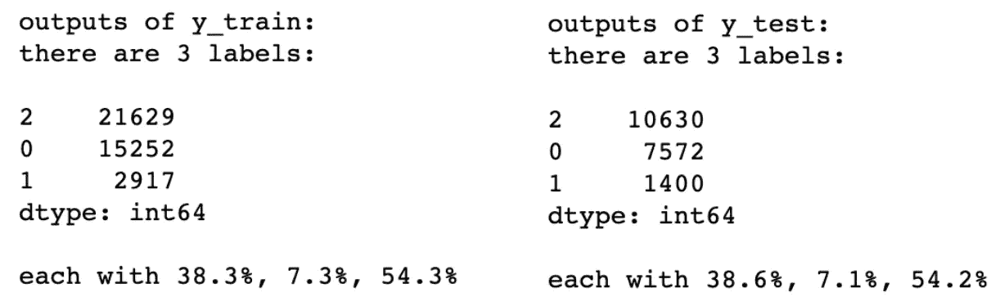

The percentages of outputs per our training and testing datasets.

看起来我们的随机分裂做得很好！我们的输出平衡与我们的训练和测试数据集非常一致。输出类有点不平衡，我们稍后会谈到。

# 建模

虽然我们可以使用许多类型的分类器，但它们通常分为这三类:**最近邻居、决策树**和**支持向量机**。我们将从每个模型系列中挑选一个示例模型。

请注意，我们的任务是一个**多类**分类问题。虽然有很多方法可以进行**多类逻辑回归**，但我们在这里不做。

我们的特征之间也有很多关系。这或者是因为它们对应于相似的方面(例如纬度和经度)，或者是一次性编码的结果。这就是为什么我们在这里也不做**朴素贝叶斯模型**的原因。

Taarifa 采用的指标是**“分类率”** —模型正确分类的百分比。我们来看看每个模型的分类率和运行时间。

```
# packages required for metrics
import time, math
from sklearn.metrics import accuracy_scorecols_results=['family','model','classification_rate','runtime']
results = pd.DataFrame(columns=cols_results)results
```

## k-最近邻

对于我们的最近邻分类器，我们将采用 K-最近邻(KNN)模型。KNN 是一个"**懒惰分类器**"-它不构建任何内部模型，而只是"**存储**训练数据集中的所有实例。

所以，**一个 KNN 没有“训练时间”**——反而在预测上花了很多时间。当我们有一个大的数据集，并且 KNN 必须评估新数据点和现有数据点之间的距离时，这尤其糟糕。

让我们看看 k = 1 到 9 时，KNN 在精度和时间上的表现。(记住 k=1 的 KNN 只是最近邻分类器)

```
from sklearn.neighbors import KNeighborsClassifierkVals = range(1,10)
knn_names = ['KNN-'+str(k) for k in kVals]for k in kVals:
    knn = KNeighborsClassifier(n_neighbors=k)
    knn.fit(X_train, y_train)

    time_start = time.time()
    y_pred = knn.predict(X_test)
    time_run = time.time()-time_start

    results = results.append(pd.DataFrame([['KNN',knn_names[k-1],accuracy_score(y_test,y_pred),time_run]],columns=cols_results),ignore_index=True)results[results.family=='KNN']
```

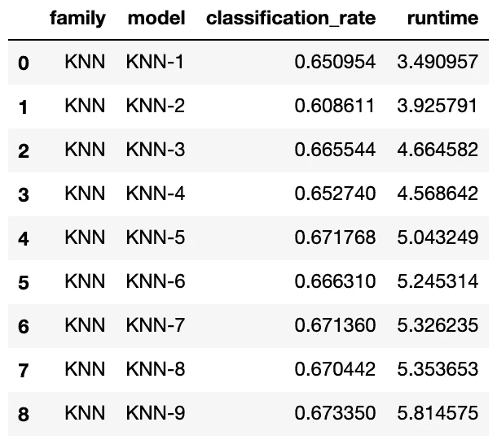

The results of our KNN models! Runtime is in seconds.

好了，我们知道答案了。让我们想象一下他们做得有多好，花了多少时间

```
fig, ax = plt.subplots()
ax.plot(kVals,results[results.family=='KNN'].classification_rate,color='blue',marker='o')
ax.set_xlabel('k-value for KNN models')
ax.set_ylabel('classification rate (blue)')
ax2=ax.twinx()
ax2.plot(kVals,results[results.family=='KNN'].runtime,color='red',marker='o')
ax2.set_ylabel('runtime (seconds; red)')
plt.show()
```

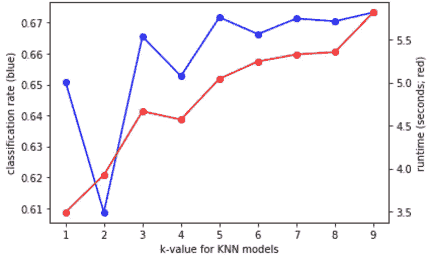

The accuracy (classification rate; in blue) and runtime (seconds, in red) for KNN models of different k-values.

准确度在开始时确实有点波动，但随着我们考虑更多的邻居，逐渐稳定在 67%左右。运行时间通常随 k 值线性增加。

## 随机森林

对于我们基于**决策树**的模型，我们将创建一个**随机森林**。随机森林是一种在训练数据集的子集上创建**多个决策树**并取得一致结果的方法。由于这种随机子集化方法，随机森林对过度拟合具有弹性，但比单一决策树需要更长的训练时间。

让我们看看由 1 棵树(这只是一个决策树)、10 棵树、100 棵树和 1000 棵树组成的随机森林的情况。

```
from sklearn.ensemble import RandomForestClassifier
rVals = range(1,4)
rf_names = ['RF-'+str(int(math.pow(10,r))) for r in rVals]for r in rVals:
    clf = RandomForestClassifier(n_estimators=int(math.pow(10,r)),random_state=0)
    time_start = time.time()
    clf.fit(X_train,y_train)
    time_run = time.time()-time_start
    y_pred=clf.predict(X_test)

    results = results.append(pd.DataFrame([['RF',rf_names[r-1],accuracy_score(y_test,y_pred),time_run]],columns=cols_results),ignore_index=True)

results[results.family=='RF']
```

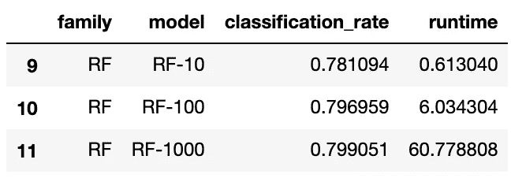

The results of random forest classifiers.

让我们看看他们是如何想象的。

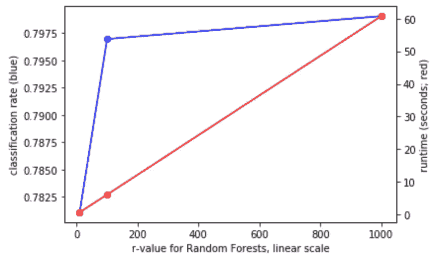

The accuracy and runtime for random forest classifiers.

正如所预料的那样，运行时间几乎与随机森林中决策树的数量成线性增长。然而，精确度并没有增加多少，大约在 80%左右。

## SVM

支持向量机利用所谓的"**内核技巧**为您的数据创建**超平面分隔符**(即**非线性问题的线性分隔符**)。虽然支持向量机在理论上“可能”过拟合，但是核的可推广性通常使它能够抵抗小的过拟合。

支持向量机确实倾向于花费大量的时间，并且它的成功高度依赖于它的内核。在这个数据集(100 个特征的 40k 个数据点)上运行一个纯 SVM 将花费很长时间，因此我们将使用 sklearn 提供的 **BaggingClassifier** 库创建一个“**袋装分类器**”。BaggingClassifier 将采用一个基础模型(对于我们来说，是 SVM)，并在数据集的多个随机子集上训练多个基础模型。对于我们来说，让我们每次在 1%的数据(大约 400 个数据点)上为每个内核训练 10 个 SVM 模型。

让我们来看看我们的模型对于三种不同的内核的效果如何:**线性、RBF、**和 **sigmoid** 。 [Sklearn SVC 库](https://scikit-learn.org/stable/modules/generated/sklearn.svm.SVC.html)也给了我们 poly 内核，但是即使在缩减的数据集上也要花很长时间来训练，所以我们在这里不做了。


The accuracy and run time for SVM models on three different kernel types

让我们也想象一下这些 SVM 模型的准确性和运行时间。


Accuracy for SVM models

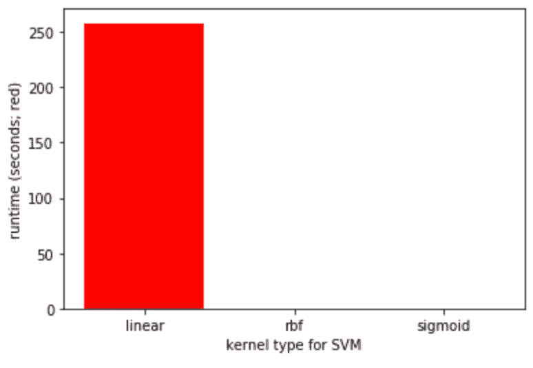

Run time for SVM models. Compared to the linear kernel, RBF’s and sigmoid’s <1 second runtime is not visible.

线性核确实表现出最高的准确性，但是它有一个可怕的训练时间。考虑到我们采用了最多取 10%数据的 bagging 方法(=10 个支持向量机，每个支持向量机占数据集的 1%)，准确性实际上非常令人印象深刻。

# 结果

让我们比较一下我们所有模型的准确性和运行时间！

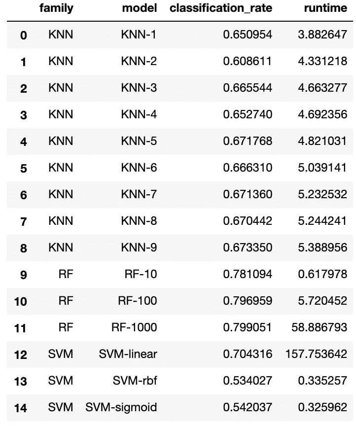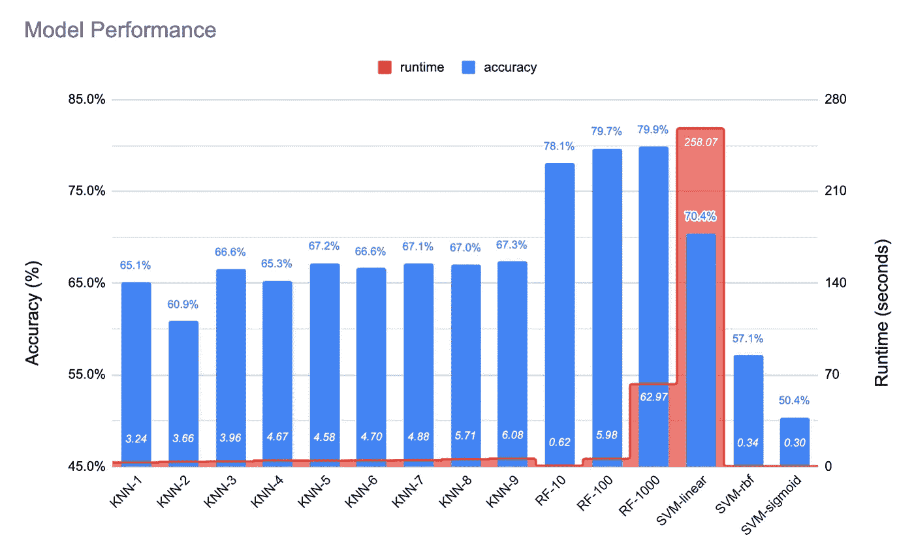

The accuracy and runtime of the many classifiers we have tried out in this article.

似乎**随机森林给出了最好的结果**——接近 80%的准确率！一个只有 100 棵树的随机森林只需要很少的训练时间就可以达到最好的结果之一。线性支持向量机和 KNN 模型给出了下一个最好的结果。但是除了将模型相互比较之外，我们如何“客观地”知道我们的模型做得有多好？

## 基本情况:随机分类器

对于任何分类任务，**基础案例**是一个**随机分类**方案。一种方法是创建随机分类器，对输入进行随机分类并比较结果。标签的随机分配将遵循培训时分配给它的标签的**【基础】比例**。

```
from sklearn.dummy import DummyClassifierclf = DummyClassifier(strategy='stratified',random_state=0)
clf.fit(X_train,y_train)
y_pred = clf.predict(X_test)
print('Accuracy of a random classifier is: %.2f%%'%(accuracy_score(y_test,y_pred)*100))
```

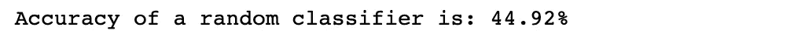

对于 45%的基本精度，我们所有的模型在精度方面都做得很好。

## 类别不平衡——采样不足

最后，我们回到我们在开始提到的**阶级不平衡问题**。标签的不平衡导致分类器偏向**多数标签**。对我们来说，它是朝向“功能性”标签的。

我们已经看到，在一半时间内预测“功能”标签的分类器(“功能”标签占数据集的 54.3%)已经达到 45%的准确度。这已经远远好于**均匀随机猜测**的 33% (1/3)。

如果类彼此明显分离，类不平衡可能不会影响分类器，但在大多数情况下，它们不会。为了看看阶级不平衡是否影响了我们的模型，我们可以**欠采样**数据。

**平衡欠采样**意味着我们从数据中随机抽取样本，其中类别是“平衡的”这可以通过使用 **imblearn** 库的 **RandomUnderSampler** 类来完成。可以把 imblearn 想象成一个不平衡数据集的 sklearn 库。

```
from imblearn.under_sampling import RandomUnderSampler
rus = RandomUnderSampler(random_state=0)
X_rus_train,y_rus_train = rus.fit_resample(X_train,y_train)
X_rus_test,y_rus_test = rus.fit_resample(X_test,y_test)
```

虽然我们的原始 X_train 有将近 40，000 个数据点，但我们的欠采样数据集只有大约 8，700 个数据点。让我们通过我们最成功的模型——随机森林——运行它，看看欠采样是否会影响我们的模型准确性。

让我们在这个欠采样数据集上重新训练我们最成功的模型——我们的随机森林。

```
rf_rus_names = ['RF_rus-'+str(int(math.pow(10,r))) for r in rVals]for r in rVals:
    clf = RandomForestClassifier(n_estimators=int(math.pow(10,r)),random_state=0)
    time_start = time.time()
    clf.fit(X_rus_train,y_rus_train)
    time_run = time.time()-time_start
    y_rus_pred=clf.predict(X_rus_test)

    results = results.append(pd.DataFrame([['RF',rf_rus_names[r-1],accuracy_score(y_rus_test,y_rus_pred),time_run]],columns=cols_results),ignore_index=True)

results[results.family=='RF']
```

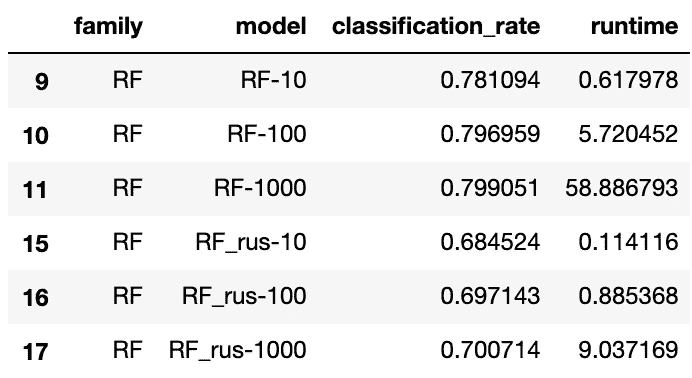

The model results of randomly undersampled data, compared with the results from the original random forest models.

因此，我们的模型精度**从接近 80%下降到 70%以下。这部分是因为该模型有一个**精简数据集**来处理。但另一个因素是，由于多数类偏差，我们最初的随机森林模型得到了**错误地“夸大”的准确性**，这在类不平衡后现在已经消失了。与此同时，平衡类确实会导致一个客观上更准确的模型，尽管不是更有效的模型。最终的决定是由您做出的——您会关心“夸大”的准确性，还是这些“假阳性”会阻止您使用原始模型？**

由于我们的**“假阳性”**可能会导致我们宣布非功能性或需要维修的供水点未得到解决，我们可能希望以其他方式出错，但这取决于您的选择。