# 预测建模:选择最佳模型

> 原文：<https://towardsdatascience.com/predictive-modeling-picking-the-best-model-69ad407e1ee7?source=collection_archive---------5----------------------->

## 在相同的数据上测试不同类型的模型


无论您是在办公室环境中预测数据，还是只是在 Kaggle 比赛中竞争，测试不同的模型以找到最适合您正在处理的数据都是非常重要的。

最近，我有机会在一个私人的 Kaggle 比赛中与一些非常聪明的同事竞争，预测坦桑尼亚有问题的水泵。在做了一些数据清理后，我运行了以下模型，我将向您展示结果。

*   逻辑回归
*   随机森林
*   里脊回归
*   k-最近邻
*   XGBoost

## 加载数据

首先，我们需要看看我们正在处理的数据。在这个特定的数据集中，要素与标注位于不同的文件中。

```
import pandas as pd
pd.set_option('display.max_columns', None)X_df = pd.read_csv('./train_features.csv')
X_df.head()
```

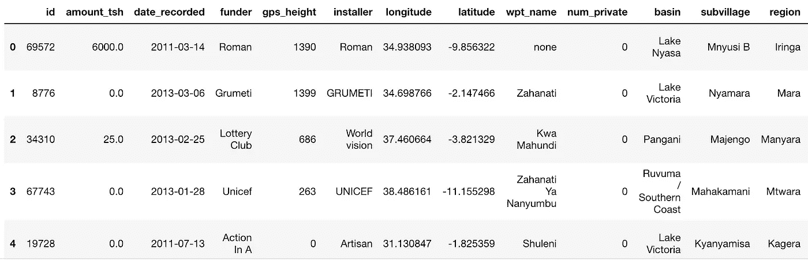

```
y_df = pd.read_csv('./train_labels.csv')
y_df.head()
```

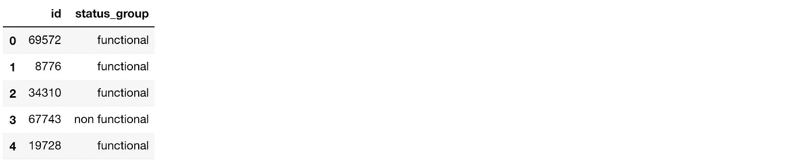

我们可以看到 status_group 或 target 标签是一个字符串，有些模型不需要修改就可以工作，但有些模型不需要。稍后我们会做些什么。让我们来看看我们的目标标签的分布。

```
y_df['status_group'].value_counts(normalize=True)
```

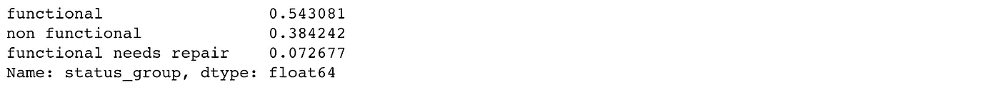

这种分离表明我们在标签中正好有 3 个类，因此我们有一个多类分类。大多数类是“functional ”,所以如果我们只是将 functional 分配给所有的实例，我们的模型在这个训练集上将是. 54。这被称为多数类基线，是我们运行的模型要达到的目标。

## 数据清理和特征工程

这个数据集中有许多功能，所以我不会详细介绍我所做的每一件事，但我会一步一步地从高层次进行介绍。

首先，我们希望通过查看所有的特性和数据类型来检查事物。

```
X_df.info()
```

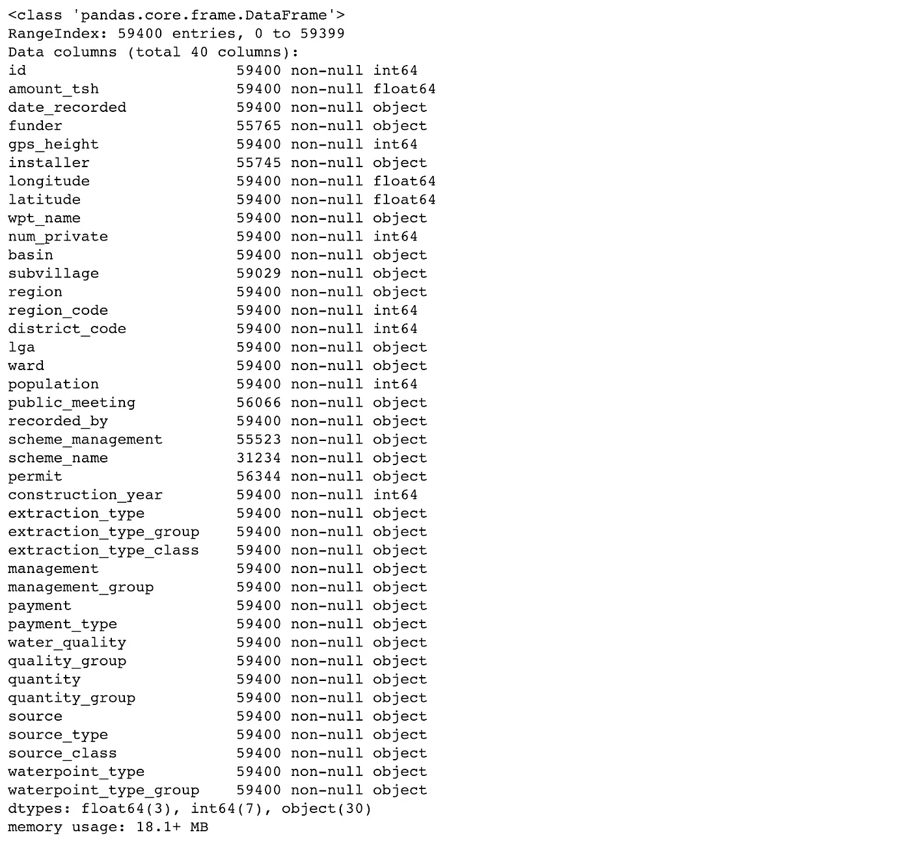

为了能够在模型中使用它们，我们需要使用 30 个对象特征。int 和 float 对象可以直接使用。

另一个需要关注的是高基数特性。如果我们对这些特性的每一个都有超过 100 个类别，那么使用它们就没什么用了。这会给我们的数据集增加维度，我们不想这么做。

在我们删除这些高基数列之前，我看到 date_recorded 是一个对象，它肯定会随着我们的高基数特性而被删除，所以我在此基础上创建了一些特性。

```
#So date doesn't get dropped in next stepX_df['date_recorded'] = pd.to_datetime(X_df['date_recorded'])X_df['YearMonth'] = X_df['date_recorded'].map(lambda x: 100*x.year + x.month)X_df['Year'] = X_df['date_recorded'].map(lambda x: x.year)X_df['Month'] = X_df['date_recorded'].map(lambda x: x.month)
```

既然我们已经对日期进行了分类，我们可以检查高基数并删除那些特性。

```
max_cardinality = 100high_cardinality = [col for col in X_df.select_dtypes(exclude=np.number)
                   if X_df[col].nunique() > max_cardinality]X_df = X_df.drop(columns=high_cardinality)X_df.info()
```

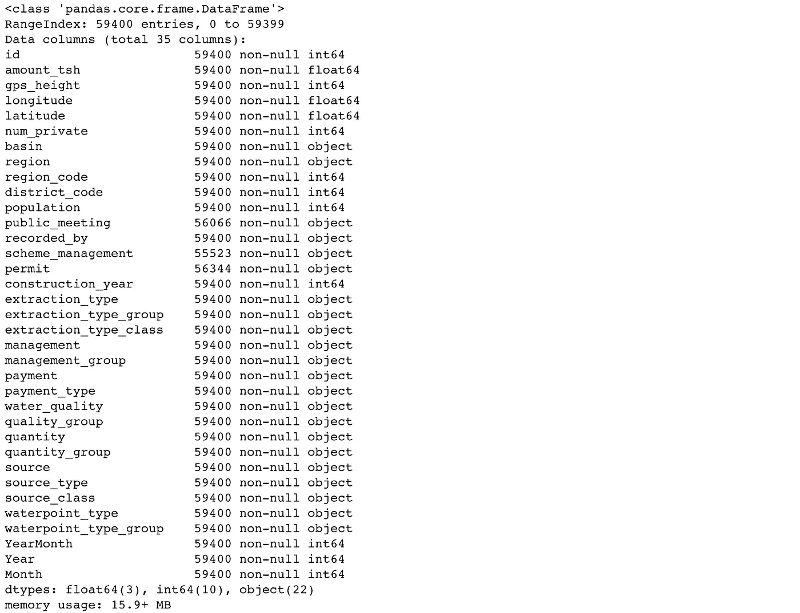

所以，我们放弃了 8 个高基数的特性。现在我们可以使用 OneHotEncoder 或 Pandas get_dummies()将这些对象更改为 int。

现在我们所有的特征都是数字的，让我们进入模型吧！

## 逻辑回归

逻辑回归对于多类分类非常有用，因为如果目标标签是字符串，Scikit-learn 会自动对其进行编码。

首先，我们需要将数据分为训练和测试。

```
from sklearn.preprocessing import scale
from sklearn.model_selection import train_test_splitX = X.drop(columns='id') #id is our index and won't help our model
X = scale(X) X_train, X_test, y_train, y_test = train_test_split(
        X, y, train_size=0.75, test_size=0.25, random_state=42, shuffle=True)
```

当你使用一个学习模型时，重要的是**缩放**特征到一个以零为中心的范围。缩放将确保特征的方差在相同的范围内。

现在，我们将在训练和测试中运行该模型，并查看我们的准确度得分。

```
from sklearn.linear_model import LogisticRegression
from sklearn.metrics import accuracy_scorelogreg = LogisticRegression()
logreg.fit(X_train,y_train)
y_pred = logreg.predict(X_train)
print('Train accuracy score:',accuracy_score(y_train,y_pred))
print('Test accuracy score:', accuracy_score(y_test,logreg.predict(X_test)))
```

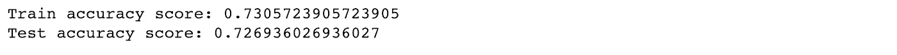

在训练和测试中，我们以 0.73 的成绩打破了大多数班级 0.54 的基线。让我们看看另一种模式是否能做得更好。

## 随机森林

随机森林也可以将字符串作为我们的目标标签，因此我们可以使用相同的训练测试分割来运行模型。

```
from sklearn.ensemble import RandomForestClassifier as RFCrfc_b = RFC()rfc_b.fit(X_train,y_train)
y_pred = rfc_b.predict(X_train)
print('Train accuracy score:',accuracy_score(y_train,y_pred))
print('Test accuracy score:', accuracy_score(y_test,rfc_b.predict(X_test)))
```

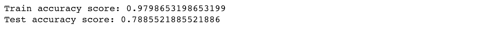

随机森林在训练和测试中击败了逻辑回归，训练中为 0.97，测试中为 0.79。

## 里脊回归

对于岭回归，我们需要在运行模型之前对目标标签进行编码。

```
X = X_df.drop(columns=['id'])
X = scale(X)y = y_df.drop(columns='id')
y = y.replace({'functional':0, 'non functional':2,'functional needs repair':1 })X_train, X_test, y_train, y_test = train_test_split(
        X, y, train_size=0.75, test_size=0.25, random_state=42, shuffle=True)
```

现在我们运行这个模型。Ridge 在其 predict()方法中输出一个概率，所以我们必须用 numpy 更新它，以便得到实际的预测。

```
from sklearn.linear_model import Ridge
import numpy as npridge = Ridge()ridge.fit(X_train,y_train)
y_prob = ridge.predict(X_train)
y_pred = np.asarray([np.argmax(line) for line in y_prob])
yp_test = ridge.predict(X_test)
test_preds = np.asarray([np.argmax(line) for line in yp_test])
print(accuracy_score(y_train,y_pred))
print(accuracy_score(y_test,test_preds))
```

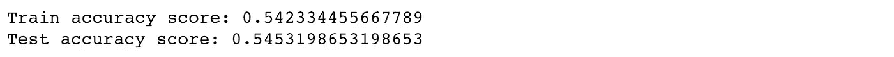

所以，岭回归对于这些数据来说不是一个好的模型。

## k-最近邻

对于 K-最近邻，我们将使用与岭相同的训练测试分割。

```
from sklearn.neighbors import KNeighborsClassifierknn = KNeighborsClassifier()knn.fit(X_train,y_train)
y_pred = knn.predict(X_train)
print('Train accuracy score:',accuracy_score(y_train,y_pred))
print('Test accuracy score:',accuracy_score(y_test,knn.predict(X_test)))
```

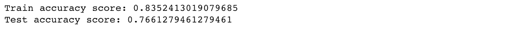

这些分数看起来比 Ridge 好很多，但仍然不是我们最好的分数。

## XGBoost

XGBoost 是一种算法，在应用机器学习和针对结构化或表格数据的 Kaggle 竞赛中非常流行。

这是一个梯度增强决策树的实现，旨在提高速度和性能。

如果你想了解更多，请查看这里的文档。当运行这个模型时，我对这些参数进行了一些调整，这些参数是我运行的数据中最好的。

```
xg_train = xgb.DMatrix(X_train, label=y_train)
xg_test = xgb.DMatrix(X_test, label=y_test)xg_train.save_binary('train.buffer')
xg_test.save_binary('train.buffer')# setup parameters for xgboost
param = {}
# use softmax multi-class classification
param['objective'] = 'multi:softmax'
param['silent'] = 1 # cleans up the output
param['num_class'] = 3 # number of classes in target label watchlist = [(xg_train, 'train'), (xg_test, 'test')]
num_round = 30
bst = xgb.train(param, xg_train, num_round, watchlist)
```

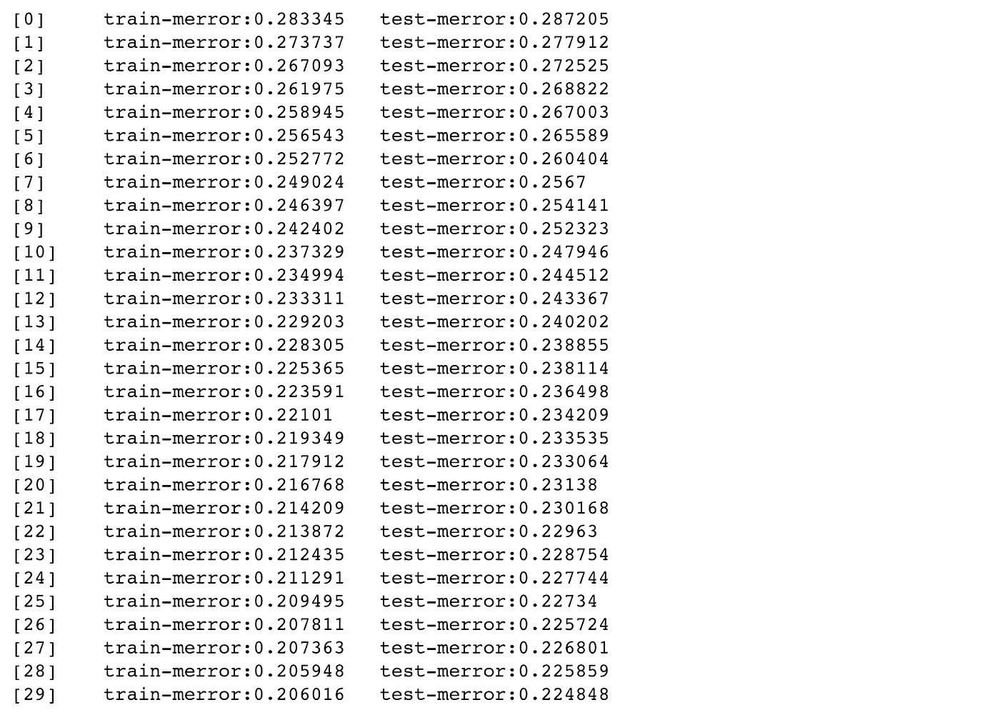

XGBoost 分类器的输出输出一个错误，该错误被定义为

> `merror`:多类分类错误率。它被计算为`#(wrong cases)/#(all cases)`

```
# get prediction
y_pred1 = bst.predict(xg_train)
y_pred2 = bst.predict(xg_test)
print('Train accuracy score:',accuracy_score(y_train,y_pred1))
print('Test accuracy score:',accuracy_score(y_test,bst.predict(xg_test)))
```

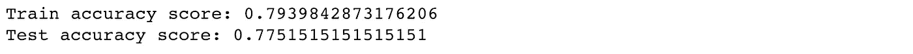

我们在训练中得到 0.79 分，在测试中得到 0.78 分，这也不是我们最好的成绩，但和随机森林差不多。

## 结论

出于我的目的，我选择使用 XGBoost 并修改了参数。我在上面使用的训练测试分割数据中的分数在训练中是. 97，在测试中是. 81。在给出的测试数据上，我的 Kaggle 分数以. 795 结束。

一旦您找到了最适合您所拥有的数据的模型，您就可以使用模型接受的参数，看看您是否可以获得更好的分数。

我希望这有助于您的预测建模工作！