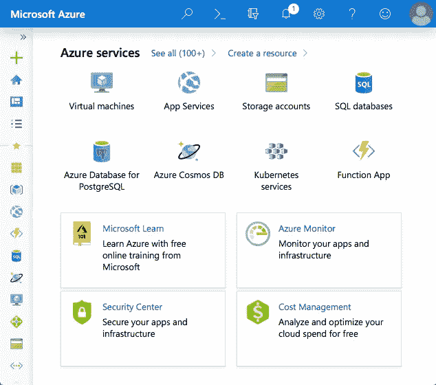
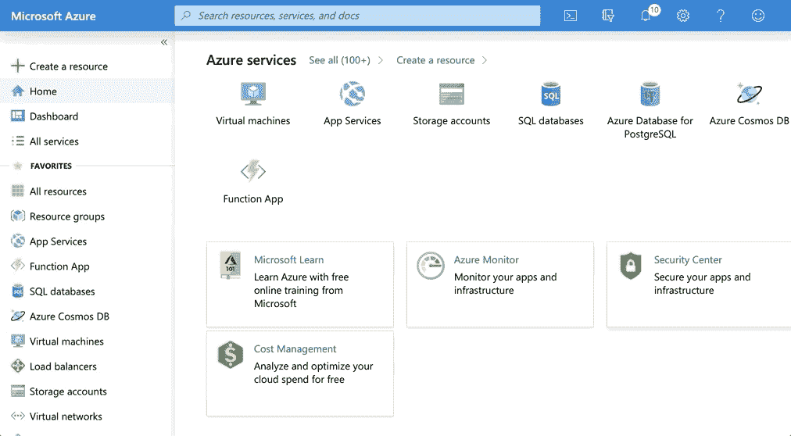
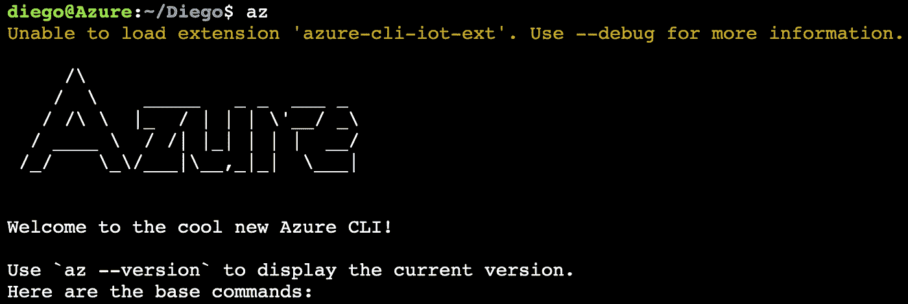
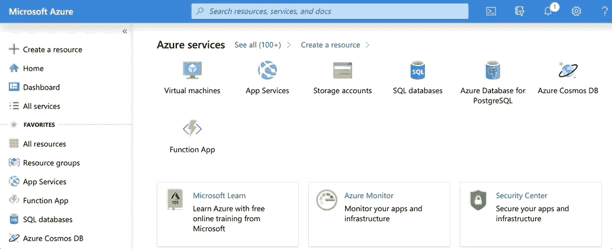
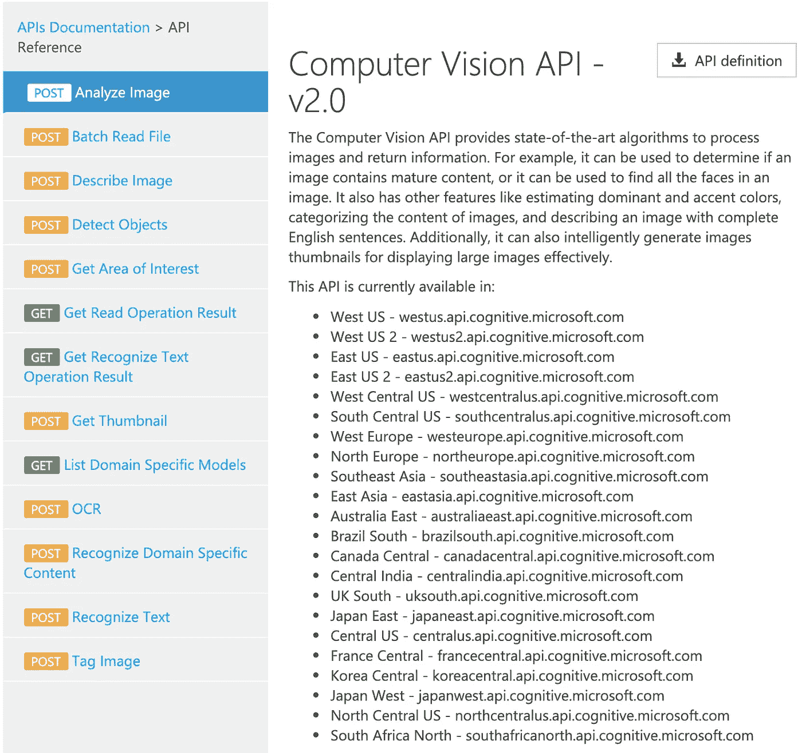
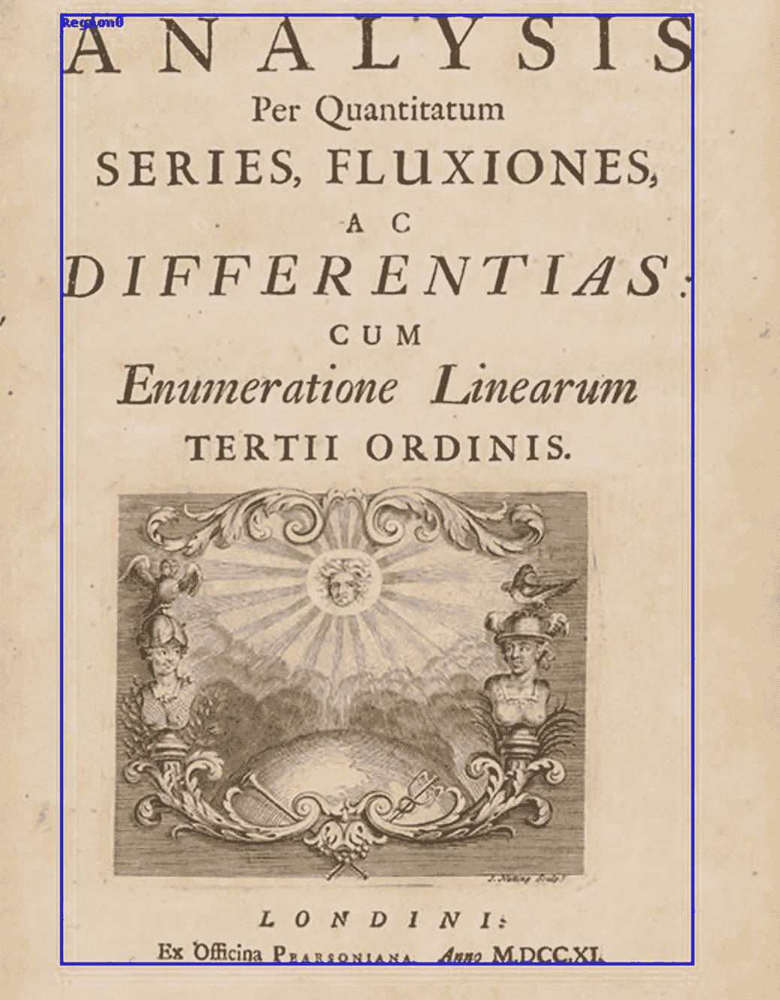
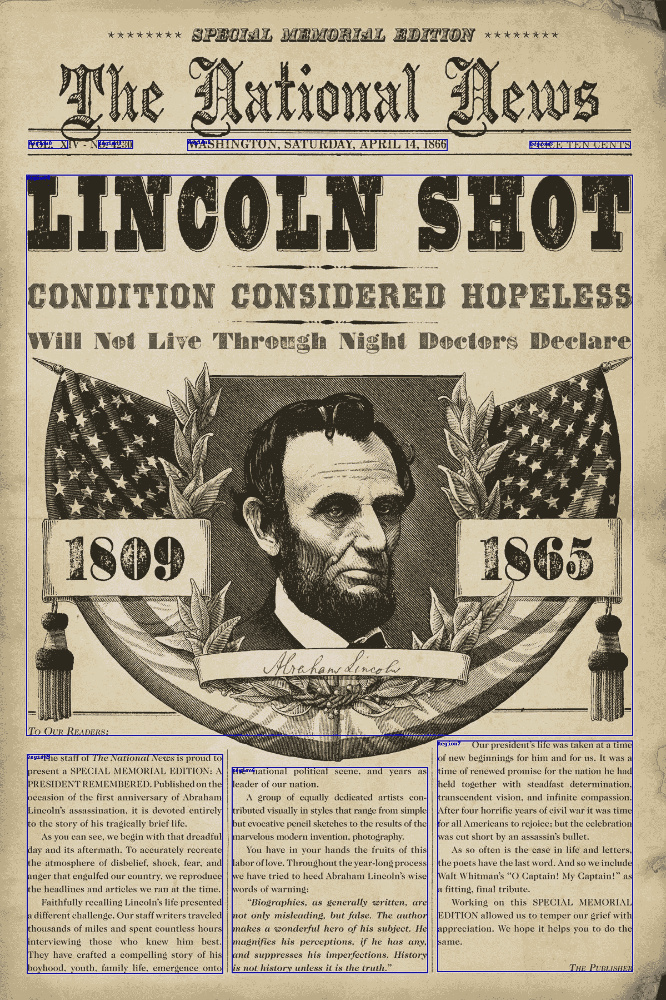
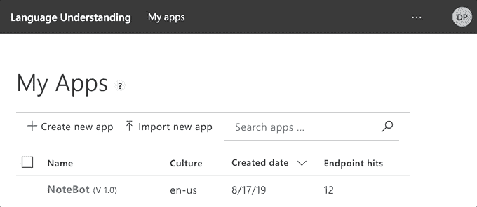

# 用 Python 在云中预制人工智能

> 原文：<https://towardsdatascience.com/premade-ai-in-the-cloud-with-python-6e02d87054b6?source=collection_archive---------18----------------------->


Photo by E[berhard Großgasteiger](https://unsplash.com/@eberhardgross?utm_source=medium&utm_medium=referral) on [Unsplash](https://unsplash.com?utm_source=medium&utm_medium=referral)

## 使用 Azure 和 Colab 笔记本创建一个具有视觉、听觉和语音的简单机器人

这里有一队[云](https://en.wikipedia.org/wiki/Cloud_computing)带着他们自己的思想漂浮在互联网上，试图控制风。他们一直在非常积极地向世界推出各种服务，并从每一个可能的来源吸收数据。在这个巨大的服务泡沫中，越来越多的公司和应用程序依赖预制的人工智能资源来提取见解，预测结果，并从未探索的信息中获得价值。如果您想知道如何试用它们，我想给你一个非正式的概述，告诉你通过向这些服务发送不同类型的数据可以得到什么。简而言之，我们将把图像、文本和音频文件发送到高高的云端，并探索我们得到的回报。

虽然这种使用人工智能的方式不能让你直接、完全控制正在发生的事情(就像你使用机器学习框架一样)，但这是一种快速的方法，让你可以尝试几种模型，并在你的应用程序中使用它们。这也是了解已经存在的东西的好方法。


Photo by [Franck V.](https://unsplash.com/@franckinjapan?utm_source=medium&utm_medium=referral) on [Unsplash](https://unsplash.com?utm_source=medium&utm_medium=referral)

一般来说，在我们可以使用任何种类的云服务之前，我们必须首先:

*   **向特定的云提供商订购**。
*   创建一个资源:注册我们将要使用的特定服务
*   **检索凭证:**到授权我们的应用程序访问服务。

虽然有许多云提供商可能能够满足您的需求，但我们将关注微软的[**Azure Cloud**](https://azure.microsoft.com/en-us/overview/)**。**如果你不知道从哪里开始，有大量的选项和教程可能会让你感到困惑，所以在这篇文章的第一部分，我们将从头开始，了解我们需要什么来使用以下服务:

*   [计算机视觉](https://azure.microsoft.com/en-in/services/cognitive-services/computer-vision/)
*   [脸](https://azure.microsoft.com/en-us/services/cognitive-services/face/)
*   [文本分析](https://azure.microsoft.com/en-in/services/cognitive-services/text-analytics/)
*   [语音服务](https://azure.microsoft.com/en-in/services/cognitive-services/speech-services/)
*   路易斯

所有资源来自 Azure 的**认知服务**平台，这是一个很好的服务集合，包含视觉、语音、语言、网络搜索和决策领域的用例。[用他们的话说:](https://docs.microsoft.com/en-us/azure/cognitive-services/welcome)

> Azure Cognitive Services 的目标是帮助开发人员创建可以看、听、说、理解甚至开始推理的应用程序。

我们将使用 Colab [笔记本](https://colab.research.google.com/drive/1BIq7Ll7lFwnEH5Dwd2_KUlKTyqBvLdxY)将它们付诸实施:我们将在 Azure 中设置我们需要的一切，实现调用这些服务的代码并探索结果。为了让它更有趣，我们还将利用摄像头、麦克风和扬声器来说话，看到和听到来自云的响应！

# 设置

你只需要订阅 Azure 就可以让[笔记本](https://colab.research.google.com/drive/1BIq7Ll7lFwnEH5Dwd2_KUlKTyqBvLdxY)焕发生机。之后，你应该可以毫无困难地运行本文中的例子了。

## 创建订阅

按照此[链接](https://azure.microsoft.com/en-gb/free/)创建 Azure 订阅。(如果你目前就读于一所大学，使用[此链接](https://azure.microsoft.com/en-gb/free/students/))。如果这是你的第一个账户，你应该有一些试用资金，但要确保你在使用任何东西之前总是检查价格。对于本教程，我们将只使用**免费服务**，但这仍然是一件好事！

在您创建帐户后，您将可以访问 [*门户*](https://login.microsoftonline.com/common/oauth2/authorize?resource=https%3a%2f%2fmanagement.core.windows.net%2f&response_mode=form_post&response_type=code+id_token&scope=user_impersonation+openid&state=OpenIdConnect.AuthenticationProperties%3dZwrh8EviglOQR-BvS5E_n0RT39uTYrhziWQMEbMM1EZ7eR5_yg6_kYS_KRmGWFCZi7mKerhTAbATOVvRh6bRMY2VrKHIcjDjnkVGegFNB4JV0-cKosNokuU4MQEcvzAiWIsfY0Ek53aq1nOvsmJfH3R7KznMkVvo0jC_VkU6m5uAoPPIqPU_m39yGCk5f3zeJITqmI6WQv9o3tHhiydRmVl1l_FIeC_vZfd9ygtPlh9s20bPvBzKhloOtleYxW8yo6QKFtvE_lUylrIcrwkjK5ml1RQWDqIcAkH9DDm7-7YPdB5kcV2a2QcS1dKncM3q&nonce=636929500862103248.YmI2YThlYjUtZDcwOS00OTljLWIwZjQtZmJmZDI3NjA0ZmM0YmQ0OGI2M2ItYmI5Ny00MDc2LTk0M2EtNGYyZjAwYmI5MWEz&client_id=c44b4083-3bb0-49c1-b47d-974e53cbdf3c&redirect_uri=https%3a%2f%2fportal.azure.com%2fsignin%2findex%2f%3ffeature.tenantscoperedirect%3dfalse&site_id=501430&client-request-id=e339411d-ac9a-4e19-baf6-d30b33e4e775&x-client-SKU=ID_NET&x-client-ver=1.0.40306.1554) *。在这里，您可以管理有关您的订阅的一切，并配置大量的内容。*



[The Azure Portal](https://azure.microsoft.com/en-us/resources/videos/get-started-with-azure-portal/)

门户是一个非常有趣的地方，整个公司都使用这个大的[工具包](https://azure.microsoft.com/en-us/solutions/)进行管理。为了不在森林里迷路，我在[笔记本](https://colab.research.google.com/drive/1BIq7Ll7lFwnEH5Dwd2_KUlKTyqBvLdxY)中实现了设置这篇文章所需的所有代码。但是我将在这里花点时间解释一下基本原理，并给你一个自己如何做的想法。

但是如果你已经知道如何创建组和资源，请完全跳过下面的“在 Azure 中设置”部分，直接进入[笔记本](https://colab.research.google.com/drive/1BIq7Ll7lFwnEH5Dwd2_KUlKTyqBvLdxY)。

# 在 Azure 中设置

这些都是在[笔记本](https://colab.research.google.com/drive/1BIq7Ll7lFwnEH5Dwd2_KUlKTyqBvLdxY)中自动完成的，但是如果你想知道如何自己做，请通读一遍。

## 创建资源组

在创建特定资源(如计算机视觉或文本翻译)之前，您需要创建一个 **group** 来保存多个资源。换句话说，我们创建的每个资源必须属于一个组。这允许您将所有这些作为一个实体来管理，并更容易地跟踪事情。

一般来说，在云中完成工作有两种主要方式:你可以使用云提供商的图形用户界面(GUI )(例如 Azure 的门户网站),或者在命令行界面(CLI)中键入代码行。为了说明这一点，让我们看看如何以两种方式创建资源组:

*   要使用门户创建资源组:



Making a resource group

在左侧菜单中，转到“资源组”，单击“添加”并在“资源组”和“区域”字段中填写名称和位置。

**注意:**在整个教程中，我们将使用`MyGroup`作为我们的资源组名称，西欧作为我们的地区。位置参数指定您希望数据中心/服务位于哪个*区域*。如果你不在西欧，除了一点延迟，对你来说应该不会有太大变化。虽然更改到另一个地区可能很简单，但是在使用资源时，参数**会一遍又一遍地出现****(通常以不同的名称出现)，所以如果您自己设置，请使用`MyGroup`和`WestEurope`到*来保持简单，并允许您稍后运行代码示例而无需更改。***

*   **为了实现完全相同的目的，并且在不使用门户中的 GUI 的情况下创建`myGroup`，我们也可以使用命令行界面。点击门户网站顶部菜单中的`>_`:**

****

**在弹出的窗口中输入:**

```
az group create -l westeurope -n MyGroup
```

**和前面一样，这将在位置`westeurope`中创建一个名为`MyGroup`的资源组。**

**点击门户中的`>_`图标，您看到的是他们为您提供的虚拟机的命令行。它真的很强大，并附带了非常方便的工具:它自己的 go、python 和其他语言的环境，docker、git 等。准备出发。但最重要的是，它附带了一个来自 Azure 的命令行工具`[az](https://docs.microsoft.com/en-us/cli/azure/get-started-with-azure-cli?view=azure-cli-latest)`,它提供了一些选项，可以完成你在门户网站上看到的所有功能，甚至更多。**这是我们在** [**笔记本**](https://colab.research.google.com/drive/1BIq7Ll7lFwnEH5Dwd2_KUlKTyqBvLdxY) **里面用来设置一切的工具。****

**`az`工具太多了，无法在这里一一介绍，但是您可以键入`az`并开始探索！**

****

## **创建资源**

**现在让我们创建单独的资源，并将它们分配给我们创建的组`MyGroup`。和以前一样，我们可以使用 GUI 或 CLI。出于直觉；这是使用 GUI 的整个过程:**

*   **在门户中创建资源的步骤:**

****

**Creating a resource**

*   **在左侧菜单中，单击“创建资源”，搜索您想要的资源(如计算机视觉)，并填写项目详细信息。**
*   **在“位置”中，指定您希望数据中心/服务位于哪个地区。(*我们将使用“西欧”*)。**
*   **每个资源的“定价层”定义了其成本。对于每个资源和层级，将有不同的价格和条件。*对于本教程，我们总是选择自由层****F0****以避免任何费用。***
*   ***最后，我们将我们的资源分配给一个现有的资源组(`MyGroup`)。***

***在资源被创建之后，我们需要**检索它的密钥以便能够使用它**。密钥是授权我们的应用程序使用服务的凭证。这是您在门户中检索密钥的方式:***

******

***Finding the authentication key for some resource in the portal***

*   ***在左侧菜单中，转到“所有资源”并单击您的目标资源顶部。在“资源管理”下，转到“密钥”并记下凭据。***

***简单解释一下，但这就是您在门户中手动创建资源和检索密钥的方式。我希望这能给你一个如何做的直觉。但是对于我们需要的所有资源来说，遵循这个过程需要一段时间。所以为了减轻的痛苦，防止读者感到厌烦。我制作了一个代码片段，使用 CLI 中的`az`工具一次性设置好一切。该代码片段将为以下资源创建和检索密钥，(指定 **free** tier F0):***

*   ***[计算机视觉](https://azure.microsoft.com/en-in/services/cognitive-services/computer-vision/)***
*   ***[脸](https://azure.microsoft.com/en-us/services/cognitive-services/face/)***
*   ***路易斯:语言理解***
*   ***[文本分析](https://azure.microsoft.com/en-in/services/cognitive-services/text-analytics/)***
*   ***[演讲服务](https://azure.microsoft.com/en-in/services/cognitive-services/speech-services/)***

***进入门户中的命令行([或在您的机器中安装](https://docs.microsoft.com/en-us/cli/azure/install-azure-cli?view=azure-cli-latest)`[az](https://docs.microsoft.com/en-us/cli/azure/install-azure-cli?view=azure-cli-latest)`):***

******

***然后复制、粘贴并运行以下代码片段:***

***To be pasted in the command line.***

*   ***我们用我们想要的参数的具体名称创建一个数组`resources`。***
*   ***我们迭代`resources`并应用命令`az cognitive services account create`来单独创建每个服务。(在这里，我们指定位置`WestEurope`、空闲层`F0`和我们创建的资源组`MyGroup`)。***
*   ***我们再次在`resources`上循环，并应用命令`[az cognitiveservices account keys](https://docs.microsoft.com/de-de/cli/azure/cognitiveservices/account/keys?view=azure-cli-latest)`来检索每个资源的键，并将它们附加到名为`keys.py`的文件中。***
*   ***当它运行完毕后。`keys.py`应包含带有资源及其凭证的标准字典:***

```
*# sample keys.py with fake credentialssubscriptions = {
  'TextAnalytics': 'ec96608413easdfe4ad681',
  'LUIS': '5d77e2d0eeef4bef8basd9985',
  'Face': '78987cff4316462sdfa8af',
  'SpeechServices': 'f1692bb6desae84d84af40',
  'ComputerVision': 'a28c6ee267884sdff889be3'
  }*
```

***我们需要给我们的笔记本赋予生命。您可以通过键入以下命令来验证和查看我们做了什么:***

```
*az resource list* 
```

***好吧！如果您已经做到了，我将奖励您一组代码片段，您可以调用这些代码片段并向这些资源发送内容。***

# ***获取认知服务***

***既然我们已经完成了枯燥的工作，我们就准备利用这些资源，看看它们能做些什么。创建资源让我们可以使用它们各自的 REST-API。我们可以用刚刚做的东西做很多事情。***

***[Source](https://gfycat.com/reasonablesparseenglishpointer)***

***简而言之，为了访问这些服务，我们将向特定的 URL 发送带有特定参数和我们内容的请求，在服务器上触发一个动作，然后得到一个*响应。为了知道如何组织我们将要使用的每个服务的请求，我们需要参考 API 文档(在这里你可以真正体会到 API 的用处)。****

***每个 API 都有一组现成可用的函数。例如，通过[计算机视觉 API，](https://westus.dev.cognitive.microsoft.com/docs/services/5adf991815e1060e6355ad44/operations/56f91f2e778daf14a499e1fa)我们可以执行 OCR(光学字符识别)并从图像中提取文本，用文字描述图像，检测物体、地标等等。***

******

***A glimpse into the Computer Vision API.***

***在**文档**中查找我们可以访问的所有 API 可能会让人感到不知所措:***

*   ***[计算机视觉 API](https://westus.dev.cognitive.microsoft.com/docs/services/5adf991815e1060e6355ad44/operations/56f91f2e778daf14a499e1fc)***
*   ***[Face API](https://westus.dev.cognitive.microsoft.com/docs/services/563879b61984550e40cbbe8d/operations/563879b61984550f30395236)***
*   ***[文本分析 API](https://westus.dev.cognitive.microsoft.com/docs/services/TextAnalytics-V2-1/operations/5ac4251d5b4ccd1554da7634)***
*   ***[路易斯 API](https://westus.dev.cognitive.microsoft.com/docs/services/5890b47c39e2bb17b84a55ff/operations/5890b47c39e2bb052c5b9c2f)***
*   ***[语音服务 API](https://docs.microsoft.com/en-gb/azure/cognitive-services/speech-service/rest-speech-to-text)***

***所以让我们来看一个例子，给你一个直觉，让你知道如何开始一件事。假设您正在查找计算机视觉 API 的“分析图像”方法。***

*   ***转到 API [docs](https://westus.dev.cognitive.microsoft.com/docs/services/5adf991815e1060e6355ad44/operations/56f91f2e778daf14a499e1fc) ，选择您想要的方法(“分析图像”)并向下滚动:O！***
*   ***您会看到一个 URL，其中包含发送请求的地址和参数。***
*   ***请求的报头和正文由什么组成。***
*   ***来自服务器的示例响应。***
*   ***错误响应和解释。***
*   ***以及包括 Python 在内的多种语言的**代码样本**。您只需要替换资源的键和要发送的数据。一旦你看到它被执行，这将变得清晰。***

## ***发送请求***

***来自不同认知服务的 API 彼此非常相似！如果你仔细阅读代码样本，你会注意到它们都共享同一个主干，*，但只是指向不同的 URL。这就是我们请求的基本框架:****

***简而言之，我们定义`headers`、`body`和`params`(请求参数)，将它们发送到某个 URL 并接收响应。***

*   ***在`headers`中，我们指定我们想要发送的数据的**类型和访问 API 的**资源键**。*****
*   ***在`body`中，我们包含(或指向)要发送给的**数据。主体本身可以有多种形式，取决于 API。*****
*   ***在`params`中，我们指定(通常是可选的)参数来更具体地告诉 API 我们想要什么。***
*   ***然后，我们将这些变量作为标准请求发送给特定的端点，例如:`westeurope.api.cognitive.microsoft.com/computervision/v2.0/describe`***

***在[笔记本](https://colab.research.google.com/drive/1BIq7Ll7lFwnEH5Dwd2_KUlKTyqBvLdxY)中，我们利用这些公共元素来实现两个实用函数:`get_headers_body`和`send_request`，以帮助我们更快地构造请求并避免重复太多代码。***

***现在让我们把手弄脏吧！ [**跳进 Colab 笔记本**](https://colab.research.google.com/drive/1BIq7Ll7lFwnEH5Dwd2_KUlKTyqBvLdxY) 。我在这里添加了额外的代码`take_picture`、`show_picture`、`record_audio`、`play_audio`等等。这些将是我们笔记本中的效应器和致动器，并允许我们与云进行交互。***

***我们不会涵盖每个 API 的所有可能，而只是简单地看几个方法以及如何调用它们。***

***对于每个 API，我们将定义几个函数，并查看如何使用它们的实际示例。来自 API 的响应通常包含大量信息！我们将**解析这些响应**并只返回其中的一小部分(我们不会查看完整的响应)。***

## ***计算机视觉 API***

> ***处理图像并返回各种信息。***

******

***Photo by [Arseny Togulev](https://unsplash.com/@tetrakiss?utm_source=medium&utm_medium=referral) on [Unsplash](https://unsplash.com?utm_source=medium&utm_medium=referral)***

***让我们定义一组返回图像视觉信息的函数。这些函数将根据我们想要分析的图像组成我们的请求，并将它们发送到计算机视觉 API 的特定 URL(端点)。***

***在这里，我们将利用函数`get_headers_body` 和`send_request`来加快速度(查看这些函数的定义和笔记本上的更多信息)。***

*   ***`[describe](https://westus.dev.cognitive.microsoft.com/docs/services/5adf991815e1060e6355ad44/operations/56f91f2e778daf14a499e1fe)`:返回图像的视觉描述。***

***让我们来看看它的实际应用:***

```
*describe([source](https://images.unsplash.com/photo-1508175800969-525c72a047dd?ixlib=rb-1.2.1&ixid=eyJhcHBfaWQiOjEyMDd9&auto=format&fit=crop&w=800&q=60), number_of_descriptions=3)*
```

******

***[Source](https://images.unsplash.com/photo-1508175800969-525c72a047dd?ixlib=rb-1.2.1&ixid=eyJhcHBfaWQiOjEyMDd9&auto=format&fit=crop&w=800&q=60): URL of the image given as an argument.***

```
*A yellow toy car 
A close up of a toy car 
A yellow and black toy car*
```

***还不错！***

*   ***`classify`:给图像分配一个类别，并对其进行标记。***

```
*classify([source](https://images.unsplash.com/photo-1541673504494-8bcc1a340180?ixlib=rb-1.2.1&ixid=eyJhcHBfaWQiOjEyMDd9&auto=format&fit=crop&w=800&q=60))*
```

******

***[Source](https://images.unsplash.com/photo-1541673504494-8bcc1a340180?ixlib=rb-1.2.1&ixid=eyJhcHBfaWQiOjEyMDd9&auto=format&fit=crop&w=800&q=60)***

```
*Categories in Image: outdoor_stonerock Tags found in the image:['outdoor', 'nature', 'mountain', 'man', 'water', 'waterfall', 'riding', 'going', 'hill', 'snow', 'covered', 'skiing', 'forest', 'large', 'lake', 'traveling', 'river', 'slope', 'standing', 'white', 'wave']*
```

***`[read](https://westus.dev.cognitive.microsoft.com/docs/services/5adf991815e1060e6355ad44/operations/56f91f2e778daf14a499e1fc)`:执行光学字符识别并提取图像中的文本。绘制文本所在的区域并显示结果。***

***除了检索响应和打印提取的文本，在`read` 内部，我们使用额外的 OCR 信息来绘制和标记图像中检测到的文本*区域*的边界框。让我们来看看它的实际应用:***

```
*text = read([source](https://www.maa.org/sites/default/files/images/upload_library/46/Swetz_2012_Math_Treasures/ColumbiaU/1502210097.png))
for line in text:
    print(line)*
```

******

```
*ANALYSIS 
Per Quantitatum 
SERIES, FLUXIONES5 
DIFFERENTIAS. 
c UM 
Enumeratione Linearum 
TERTII ORDINIS. 
LONDI,VIS 
Ex Offcina M.DCC.XL*
```

***`[see](https://westus.dev.cognitive.microsoft.com/docs/services/5adf991815e1060e6355ad44/operations/5e0cdeda77a84fcd9a6d3d0a)`:返回图像中识别的对象，并在图像中显示它们的边界框。***

```
*see([source](https://images.unsplash.com/photo-1511317559916-56d5ddb62563?ixlib=rb-1.2.1&ixid=eyJhcHBfaWQiOjEyMDd9&auto=format&fit=crop&w=800&q=60))*
```

******

```
*In the image of size 800 by 1181 pixels, 2 objects were detected 
person detected at region {'x': 354, 'y': 535, 'w': 106, 'h': 280} 
Toy detected at region {'x': 214, 'y': 887, 'w': 186, 'h': 207}*
```

## ***Face API***

> ***检测、识别和分析图像中的人脸。***

***为了简洁起见，我们将只看一个 API 方法:***

***`[detect_face](https://westus.dev.cognitive.microsoft.com/docs/services/563879b61984550e40cbbe8d/operations/563879b61984550f30395236)`:显示图像中识别的人脸的包围盒和一些相关信息(年龄、性别和情感)。***

***在`see`和`read`中，我们使用一个内部函数`draw_show_boxes`在检测到的人脸周围绘制边界框。这是结果:***

```
*detect_face([source](https://static.artfido.com/2013/09/Danielle.jpg))*
```

******

***S[ource](https://static.artfido.com/2013/09/Danielle.jpg)***

> ***酷吧？***

***这些都是我们将尝试的关于图像的功能。但是，让我们通过使用功能`take_picture`用我们的设备拍摄一张照片来进一步试验它们(参见[笔记本](https://colab.research.google.com/drive/1BIq7Ll7lFwnEH5Dwd2_KUlKTyqBvLdxY))。***

## ***捕捉并发送图片***

***我们来拍张照，看看云是怎么看的。在我们所有的函数中，我们可以指定参数`localfile=True`来允许我们以二进制图像的形式发送本地文件。***

```
*# turns on the camera and shows button to take a picture
img = take_picture('photo.jpg')*
```

***现在让我们通过应用`describe`和`classify`函数来看看云对它的“想法”:***

```
*print(describe(img, localfile=True, number_of_descriptions=3))>> A man sitting in a dark room 
>> A man in a dark room 
>> A man standing in a dark roomprint(classify(img, localfile=True))>> Categories in Image:   dark_fire 
>> Tags found in the image    ['person', 'indoor', 'man', 'dark', 'sitting', 'looking', 'lit', 'laptop', 'front', 'room', 'light', 'standing', 'dog', 'watching', 'computer', 'wearing', 'mirror', 'black', 'living', 'night', 'screen', 'table', 'door', 'holding', 'television', 'red', 'cat', 'phone', 'white']*
```

## ***文本分析***

> ***用于为情感分析、关键短语提取和语言检测等任务分析非结构化文本***

******

***Photo by [Patrick Tomasso](https://unsplash.com/@impatrickt?utm_source=medium&utm_medium=referral) on [Unsplash](https://unsplash.com?utm_source=medium&utm_medium=referral)***

*   ***`detect_language`:返回为每个给定字符串检测到的语言。***

```
*detect_language('Was soll das?', 'No tengo ni idea', "Don't look at me!", 'ごめんなさい', 'Sacré bleu!')>> ['German', 'Spanish', 'English', 'Japanese', 'French']*
```

***`key_phrases`:返回每个给定字符串的关键字列表(重要的、相关的文本点)。如果没有找到，则返回一个空列表。***

```
*keys = key_phrases('I just spoke with the supreme leader of the galactic federation', 'I was dismissed', 'But I managed to steal the key', 'It was in his coat')for key in keys:
    print(key)>> ['supreme leader', 'galactic federation'] 
>> [] 
>> ['key'] 
>> ['coat']*
```

***`check_sentiment:`对给定的字符串赋予积极、消极或中性的情感。***

```
*print(check_sentiment('Not bad', "Not good", 'Good to know', 'Not bad to know', "I didn't eat the hot dog", 'Kill all the aliens'))>> ['positive', 'negative', 'positive', 'positive', 'negative', 'negative']*
```

***`find_entities`:返回一个已识别的实体列表，分配给一个类别。如果可能的话，还有一个指向该实体的维基百科链接。***

```
*find_entities('Lisa attended the lecture of Richard Feynmann at Cornell')>> [['Entity: Lisa, Type: Person', 
     'Entity: Richard Feynman, Type: Person,
       Link:[https://en.wikipedia.org/wiki/Richard_Feynman](https://en.wikipedia.org/wiki/Richard_Feynman)',   
     'Entity: Cornell University, Type: Organization, 
       Link [https://en.wikipedia.org/wiki/Cornell_University](https://en.wikipedia.org/wiki/Cornell_University)']]*
```

## ***OCR +文本分析***

***让我们看看如何将一些东西组合在一起。在图像上应用`read`可以有效地为您生成文本数据。因此，它是应用我们的文本分析的完美匹配。让我们创建一个`report`函数，它提取单个文本区域，分析它们，并用我们的结果创建一个报告:***

```
*report([source](https://i.pinimg.com/originals/5d/0c/90/5d0c90add4024dae1020e4e7fb545f7e.jpg))*
```

******

***[Source](https://i.pinimg.com/originals/5d/0c/90/5d0c90add4024dae1020e4e7fb545f7e.jpg) of image analyzed***

```
*# Report ## Region 1 
> "o. 4230..." 
- Language: English 
- Sentiment: positive 
- Entities:  
    - 4230, Type: Quantity,  
- Keys: ## Region 2 
> "WASHINGTON, SATURDAY, APRIL 14, 1866..." 
- Language: English 
- Sentiment: positive 
- Entities:  
    - WASHINGTON, Type: Location,   
    - SATURDAY, APRIL 14, 1866, Type: DateTime,   
    - April 14, Type: Other, Wiki [Link]([https://en.wikipedia.org/wiki/April_14](https://en.wikipedia.org/wiki/April_14)) 
- Keys:  
    - WASHINGTON ## Region 3 
> "PRICE TEN CENTS..." 
- Language: English 
- Sentiment: positive
- Entities:  
    - Tencent, Type: Organization, Wiki [Link]([https://en.wikipedia.org/wiki/Tencent](https://en.wikipedia.org/wiki/Tencent))  
    - TEN CENTS, Type: Quantity,  
- Keys:  
    - PRICE  
    - CENTS...*
```

## ***语音服务***

> ***将音频转换为文本和文本到语音***

******

***Photo by [David Laws](https://unsplash.com/@davidlaws?utm_source=medium&utm_medium=referral) on [Unsplash](https://unsplash.com?utm_source=medium&utm_medium=referral)***

***我们将使用语音服务将声音转换成文本，反之亦然。与`record_audio`和`play_audio`(在[笔记本](https://colab.research.google.com/drive/1BIq7Ll7lFwnEH5Dwd2_KUlKTyqBvLdxY)中定义)一起，我们有一种方法来听到和与我们的笔记本交谈。但是在使用语音服务之前，我们需要获得一个 10 分钟内有效的令牌(一个秘密字符串)。我们将使用如下所示的函数`get_token`来实现这一点:***

***我们将使用它来定义我们函数内部的请求的`headers`,并授权它们使用我们的语音服务资源。***

***`speech_to_text`:接收音频文件的文件路径，并将识别出的给定语言的语音转换成文本。支持大量的语言。***

***`text_to_speech`:反其道而行之，将给定的文本转换成语音(一个音频文件),带有*近乎人类的声音。*这将为我们的笔记本提供声音。***

***因为`speech_to_text`接收音频文件并返回单词，而`text_to_speech`接收单词并返回音频文件，所以我们可以这样做:***

```
*# transform words to speech
audio = text_to_speech("Hi, I'm your virtual assistant")# transcribe speech back to words
words = speech_to_text(audio)print(words)
>> Hi I am your virtual assistant*
```

***好酷！但这似乎完全没有意义。让我们做一些更有趣的事情。我们将使用`record_audio`记录我们的声音，使用`speech_to_text`将其转换为文字，对文字做一些事情，并大声说出结果。***

***让我们用`check_sentiment`来检验一下你所说的感觉:***

```
*# speak into the mic
my_voice = record_audio('audio.wav')# transform it into words 
text = speech_to_text(my_voice)# analyze its feeling
sentiment = check_sentiment(text)[0]# convert analysis into speech
diagnosis = text_to_speech(sentiment)# hear the results
play_audio(diagnosis)*
```

***让我们在函数中实现这个想法，使它更有用:***

***试试吧！***

```
*motivational_bot()*
```

***把你的声音转换成语音意味着你可以把你的声音**作为你功能的输入。**像这样的东西，你可以尝试很多。例如，你可以把它们翻译成一堆不同的语言(参见[文本翻译 API](https://azure.microsoft.com/en-us/services/cognitive-services/translator-text-api/) )，在网上查找一些东西(参见 Bing 搜索)或者(超越 Azure)问一些复杂的问题来回答像 [Wolfram Alpha](https://products.wolframalpha.com/simple-api/documentation/) 等引擎。***

# *****路易斯—语言理解*****

> ***基于机器学习的服务，将自然语言理解构建到应用程序、机器人和物联网设备中。***

******

***Photo by G[ustavo Centurion](https://unsplash.com/@guustimutant?utm_source=medium&utm_medium=referral) on [Unsplash](https://unsplash.com?utm_source=medium&utm_medium=referral)***

***让我们让我们的[笔记本](https://colab.research.google.com/drive/1BIq7Ll7lFwnEH5Dwd2_KUlKTyqBvLdxY)更加智能，让它能够理解使用 [LUIS API](https://westus.dev.cognitive.microsoft.com/docs/services/5890b47c39e2bb17b84a55ff/operations/5890b47c39e2bb052c5b9c2f) 的语言中的某些意图。简而言之，我们将训练一个识别语言中某些意图的语言模型。***

***例如，假设我们有**意图**到`take_picture`。在训练我们的模型后，如果我们的笔记本“听到”类似以下的句子:***

*   ***拍照***
*   ***用相机拍个截图***
*   ***拍张照***

***它会知道我们的意图是`take_picture`。我们称这些短语为**话语。并且是我们需要提供来教语言模型如何识别我们的意图——我们想要执行的任务或动作。*****

***通过使用不同的和非冗余的语句，以及添加额外的语言组件，如实体、角色和模式，您可以创建灵活和健壮的模型来满足您的需求。良好实现的语言模型(由适当的软件支持)使得回答引擎能够回答诸如“旧金山的天气如何？”，“从华沙到普拉格有多少公里？”，“太阳有多远？”等等。***

***在这篇文章中，我们将保持事情的简单性，并为少数意图分配 5 种表达方式。正如您可能会想到的，这些意图将与我们已经实现的一些功能相匹配。***

## ***激活路易斯***

***与我们见过的所有服务相比，LUIS 是一个复杂的工具，它有自己的“门户”，在那里您可以管理 LUIS 应用程序，并创建、培训、测试和迭代改进您的模型。但是在我们使用它之前，我们需要激活一个 LUIS 账户。一旦你做到了这一点:***

*   ***进入 LUIS dashboard，检索您帐户的**创作密钥**，如下所示，并将其粘贴到笔记本中。***

******

```
*AuthoringKey = '36bd10b73b144a5ba9cb4126ksdfs82ad2'*
```

***这对我来说是一个困惑的话题。但是您的 LUIS 帐户的**创作密钥**与我们制作的 LUIS 资源的密钥不同。但是你可以将 Azure 资源分配给 LUIS 应用程序(例如，在不同地区开放接入点),但是更多详细信息请参考此处。***

## ***创建 LUIS 应用程序***

***LUIS 门户网站使创建、删除和改进您的 LUIS 模型变得非常容易[。但是在这篇文章中，我们将使用](https://docs.microsoft.com/en-gb/azure/cognitive-services/luis/get-started-portal-build-app) [LUIS 编程 API](https://westus.dev.cognitive.microsoft.com/docs/services/5890b47c39e2bb17b84a55ff/operations/5890b47c39e2bb052c5b9c2f) 来使用`authoring_key`在笔记本中设置东西。***

***让我们从[创建应用](https://westus.dev.cognitive.microsoft.com/docs/services/5890b47c39e2bb17b84a55ff/operations/5890b47c39e2bb052c5b9c2f)开始:***

```
*app_id, luis_config = create_luis_app('Notebot' )*
```

***在这个实现中，我们跟踪应用 ID(由服务器返回)和我们在`app_id`和`luis_config`中指定的参数，作为以后使用的全局变量。***

## ***添加意图和话语***

***现在让我们定义一个函数来添加**意图**和一个函数来添加它们各自的**话语**。***

*   ***`[create_intent](https://westus.dev.cognitive.microsoft.com/docs/services/5890b47c39e2bb17b84a55ff/operations/5890b47c39e2bb052c5b9c0c)`:向 LUIS 应用程序添加一个意向。哪个应用程序由变量`app_id`和`luis_config`指定。***

*   ***`[add_utterances](https://westus.dev.cognitive.microsoft.com/docs/services/5890b47c39e2bb17b84a55ff/operations/5890b47c39e2bb052c5b9c09)` [](https://westus.dev.cognitive.microsoft.com/docs/services/5890b47c39e2bb17b84a55ff/operations/5890b47c39e2bb052c5b9c09):向 LUIS 应用程序中的现有意图添加一批示例/话语。***

***有了这些函数，让我们在字典中定义我们的语言模型，如下所示，并将其应用于字典。这个阶段有很大的实验空间。***

***这本字典的关键字将是我们应用程序的意图。让我们遍历它们并创建它们:***

```
*intents = intentions.keys()
for intent in intents:
    create_intent(intent)*
```

***每个意图有 4 个例子/话语，现在让我们把它们添加到各自的意图中。***

```
*for intent, utterances in intentions.items():
    add_utterances(intent=intent, utterances=utterances)*
```

******

***Photo by [Lenin Estrada](https://unsplash.com/@lenin33?utm_source=medium&utm_medium=referral) on [Unsplash](https://unsplash.com?utm_source=medium&utm_medium=referral)***

## ***训练模型***

***现在让我们用我们用`[train_luis_app](https://westus.dev.cognitive.microsoft.com/docs/services/5890b47c39e2bb17b84a55ff/operations/5890b47c39e2bb052c5b9c45)`指定的信息来训练模型。***

```
*train_luis_app(app_id, luis_config)*
```

## ***发布应用程序***

***我们现在准备用`[publish_app](https://westus.dev.cognitive.microsoft.com/docs/services/5890b47c39e2bb17b84a55ff/operations/5890b47c39e2bb052c5b9c3b)`发布应用程序。***

```
*publish_app(app_id)*
```

## ***做一个预测***

***让我们通过预测我们的意图来看看我们的模型是否有用。注意 LUIS 有一个单独的 API 来进行预测，即 LUIS endpoint AP。***

*   ***`[understand](https://westus.dev.cognitive.microsoft.com/docs/services/5819c76f40a6350ce09de1ac/operations/5819c77140a63516d81aee78)`:使用给定文本预测意图***

```
*understand('Can you give me some descriptions about what you are seeing?')# predicted intent is:
>> `describe`understand('Any homo sapiens in the picture?')>> `detect_faces`*
```

***酷！现在我们的笔记本可以从简单的语言中大致理解我们的意图。但是必须自己输入文本似乎没什么帮助。笔记本应该能听到我们说的话，理解我们的意图。让我们写一个使用`predict`和`record_audio`以及`speech_to_text`的函数`hear`来解决这个问题。***

***我们现在可以呼叫`hear`对着麦克风说话，将我们的讲话转换成文字，并使用我们的 LUIS 应用程序预测我们的意图。***

```
*intent = hear()# see the prediction
print(intent)*
```

## ***使用应用程序***

***让我们编写一个函数，基于预测或识别的意图触发一组动作，然后映射以执行一些代码。***

***简而言之:当预测到某种意图时，执行所发生的事情的功能。这里有**大房间**做实验。***

***最后，让我们召唤 *Notebot* 来实现我们的愿望:***

***[Source](https://giphy.com/gifs/robot-portal-2-W0bINkb9yYoYU)***

***根据你说的话，“*note bot”*可以拍照并:***

*   ***大声说出描述***
*   ***显示任何检测到的对象***
*   ***显示任何检测到的面孔。***
*   ***应用 OCR 并大声读出结果。***

```
*# summon your creation
Notebot()*
```

***`Notebot`将根据您所说的运行一系列动作。***

***让我们总结一下当你调用它时会发生什么。开始时，您会听到一条问候语。之后，`Notebot`将应用`hear`并开始记录你说的任何话，你的讲话(*感知器*)将被转录成单词并发送到 LUIS 应用程序以预测你的意图。基于这一预测，将执行一组不同的动作。如果从您的讲话中没有识别出明确的意图，则意图“无”将被预测，并且`Notebot`将再次调用自身。***

***从上面看，`Notebot`最终充当了一个简单的基于反射的代理，它只是找到一个条件匹配当前情况的规则并执行它。(在这种情况下，如果你说*这个*或*别的*，那么`Notebot`会做什么)。***

***在这一点上，你可能想用额外的概念升级你的代理人，例如增加感知的记忆。但是我将把这个任务留给勤奋的读者。***

## ***清理***

***这篇文章比我预想的要长得多。在我们结束之前，让我们清理一下东西。要清理我们在云中创建的一切:在命令行`>_`中运行以下命令，删除整个资源组(以及所有资源)和`keys.py`文件(包含您的凭证):***

```
*az group delete --name MyGroup 
rm keys.py*
```

***好吧，我希望这篇教程至少给了你一些在你的项目中实现的想法。***

> *****那都是我送的！谢谢你看完整个:)*****