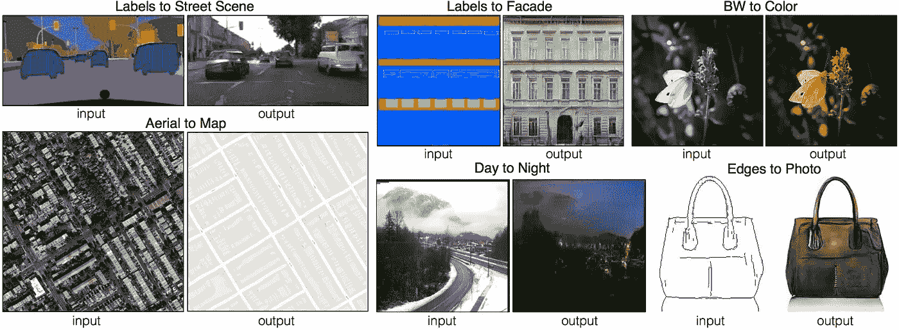

# 使用 Pix2Pix 为图像翻译准备 TIFF 图像

> 原文：<https://towardsdatascience.com/preparing-tiff-images-for-image-translation-with-pix2pix-f56fa1e937cb?source=collection_archive---------19----------------------->

## 使用 tiff 图像的 pix2pix 入门指南

近年来，生成对抗网络(GANs)因其在图像生成、图像翻译、风格转换、图像着色等方面取得的令人印象深刻的成就而受到广泛关注。特别地，由 Isola 等人开发的 pix2pix 作为条件生成对抗网络(CGAN)已经变得非常流行，其允许用户基于输入图像生成图像。一些例子包括从语义标记的图像翻译成街道场景，从白天的照片翻译成夜晚的照片，从草图翻译成照片等等。

Image taken from [https://github.com/junyanz/pytorch-CycleGAN-and-pix2pix](https://github.com/junyanz/pytorch-CycleGAN-and-pix2pix)

所有这些都非常令人印象深刻，但目前，pix2pix 主要是迎合巴布亚新几内亚和 JPG 的图像。这是不幸的，因为一些任务，例如医学成像，使用无损的 TIFF 图像，而标准 JPEG 文件是无损的，因此捕捉更准确的细节。TIFF 图像具有浮点值，而 PNG 和 JPG 图像具有整数值，因此在实现 pix2pix 时保持这种精度非常重要。

此外，CGANs 需要将图像缩放到[-1，1]的范围，以便进行更稳定的训练。但是，标准化并不是简单地使用现成的函数就能实现的，因为 TIFF 图像与像素值为 0-255 的标准 PNG 和 JPG 图像不同，它们的值可能会有所不同。在我的例子中，我的 TIFF 图像的值范围是从 0 到 1200！

记住这几点，我将详细说明如何成功地将 pix2pix 应用于 TIFF 图像。

## 了解您的数据

首先，找到你的图像有多少通道。RGB 图像有 3 个通道，而灰度图像只有 1 个通道。对于 TIFF 图像，它们可以出现在不同数量的通道中，因此在使用 pix2pix 之前理解您的图像数据非常重要，因为您在对架构进行编码时做出的后续决定将取决于此。使用以下代码片段来查找您的图像拥有的通道数:

Find the number of channels in your image

## 准备数据集

现在您对数据集有了更好的理解，您必须准备数据集。Pix2pix 是独一无二的，因为它需要两个域中完全相同的成对图像。因此，在官方的 [PyTorch 实现](https://github.com/junyanz/pytorch-CycleGAN-and-pix2pix)中，图像必须并排组合在一起，以产生宽度* 2 x 高度的合成图像。记住需要保持 TIFF 文件值的精度，我使用 PIL 库打开图像，然后使用 numpy 将两个图像连接在一起。

首先，按以下格式准备数据集:folderA 应包含包含域 A 中所有图像的子文件夹 train、validation(如果有)和 test(如果有),而 folderB 应包含包含域 b 中所有图像的子文件夹 train、validation(如果有)和 test(如果有),注意确保 folderA 和 folderB 中的图像具有相同的尺寸和名称。然后，使用下面的代码来生成连接的图像。目标路径(dest_path)是您希望保存串联图像的目录。结果名称将与 folderA 和 folderB 中的原始名称相同。

Concatenate 2 images from domain A and domain B to form a single image

## 规范化您的数据

Pix2pix 对生成器模型的输出层使用 tanh 激活函数，生成像素值在[-1，1]范围内的图像。因此，重要的是鉴别器也接收与发生器模型产生的范围相同的真实图像。但是，开箱即用的解决方案不起作用，因为它们假设像素值在 0-255 的范围内，就像普通的 PNG 和 JPG 图像一样。这不适用于 TIFF 图像，因为每个图像的像素值范围都不相同，所以在分割之前先找到图像的最小值和最大值非常重要。下面的代码片段允许您根据原始像素值缩放图像:

Scale any image to the pixel values of [-1, 1]

## 包扎

原来如此！你已经准备好了你的 tiff 数据集，并准备好实现 pix2pix 代码，无论是官方的 [Torch 实现](https://github.com/phillipi/pix2pix)、 [PyTorch](https://github.com/junyanz/pytorch-CycleGAN-and-pix2pix) 、 [Tensorflow](https://www.tensorflow.org/tutorials/generative/pix2pix) 等等。如果你面临任何问题，请在评论中告诉我，我会尽力帮助你。

这篇文章也发表在我的博客里。