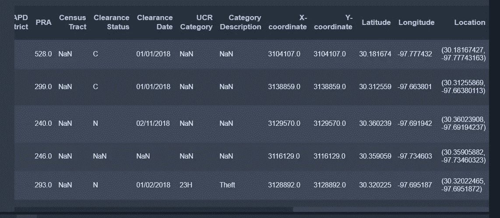

# 预处理:用函数计算经纬度点之间的距离

> 原文：<https://towardsdatascience.com/preprocessing-calculate-the-distance-between-longitude-and-latitude-points-with-a-function-8f748a2eab88?source=collection_archive---------34----------------------->


作为关注一些独特的预处理技术的系列文章的一部分，本系列的第一篇文章将关注处理纬度/经度信息。这种类型的数据对于绘制可视化地图和其他地理定位目的非常重要。


纬度是指定地球表面南北点的地理位置。经度提供了东西点。写出来的时候，先写纬度，后写逗号，再写经度。赤道代表纬度的零点，本初子午线代表经度的零点。

有时，当您有几个点的地理位置时，计算距离可能有助于要素工程数据。我将使用 2018 年奥斯汀犯罪数据集，该数据集可在[https://data . Austin Texas . gov/Public-Safety/Crime-Reports-2018/vmn 9-3bvu](https://data.austintexas.gov/Public-Safety/Crime-Reports-2018/vmn9-3bvu)找到。关于地理位置数据，该数据集包含纬度、经度的独立特征和名为 location 的组合纬度/经度特征。



这些地理位置确定了犯罪发生的地点。大多数代表地址，有些是小巷，停车场等。所以使用地理定位很重要，可以参考。

奥斯汀有四个警察局。总指挥部和三个分站(北、东、西)。奥斯汀警察局还提供了一个以这些车站的位置为特征的数据集。在该数据集中，站的名称，以及单独的经度和纬度点(分别标记为 X 和 Y)。


该计划旨在描绘出每个犯罪现场到每个警察局的距离。幸运的是，地理位置数据是分离的，因为它节省了分离数据的几个步骤。如果您遇到这种情况，且您有一个类似于上面位置特性的组合地理位置(例如:(30.1876534，-97.475630))，您可以很容易地分离这些数据，首先使用 python strip()方法删除括号，然后使用 split()方法分离值，因为如果列中有任何字符，它们将被视为对象。

```
df[‘Location] = df.Location.strip(‘()’) #will remove the parentheses (can use regex if necessary to remove additional text,etc)df[[‘Longitude’,’Latitude’]] = df.str.strip(‘,’, expand = True)
```

本文将不讨论计算这种转换的公式的细节，但是在运行函数时，下面的函数将以纬度和经度为起点，将距离(以英里为单位)转换为 DataFrame 列。

```
‘’’Distance equation for long,lat data used via stackoverflow from user Michael0x2a. Updated to a function that converts to mileage’’’# constant values, if need to change end lat, long points, change the lat2, lon2 informationlat2 = np.array(clean.Latitude) #identifies iterable latitude column
lon2 = np.array(clean.Longitude) #identifies iterable longitude columnlatr = np.array(list(map(lambda x: np.radians(x), lat2)))
lonr = np.array(list(map(lambda x: np.radians(x), lon2)))def distance(lat1,lon1):
    lat1 = np.radians(lat1)
    lon1 = np.radians(lon1)
    dlon = np.array(list(map(lambda x: (x — lon1), lonr)))
    dlat = np.array(list(map(lambda x: (x — lat1), latr)))
    a = np.sin(dlat/2)**2 + np.cos(lat1) * np.cos(lat2) * np.sin(dlon/2)**2
    c = 2 * np.arctan2(np.sqrt(a), np.sqrt(1 — a))
    # 6373.0 represents earth radius in kilometers
    kilo = 6373.0 * c
    miles = kilo * 0.62137119
    return miles
```

要运行该函数，请确保将新功能设置为变量:

```
clean[‘Main Distance’] = distance(30.267574,-97.735070)
```

如果你需要以公里为单位的距离，只需删除英里转换线，并确保返回千。