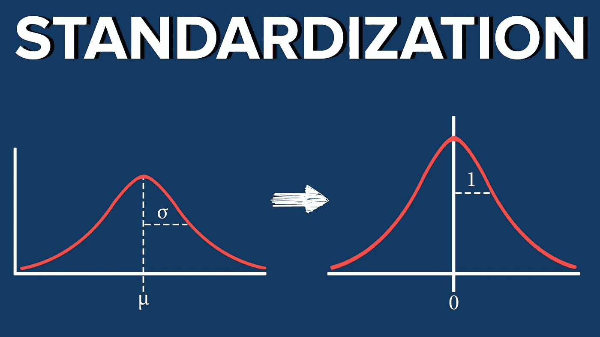
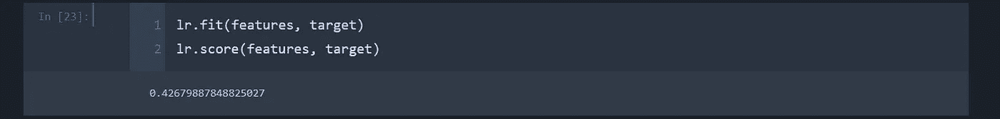
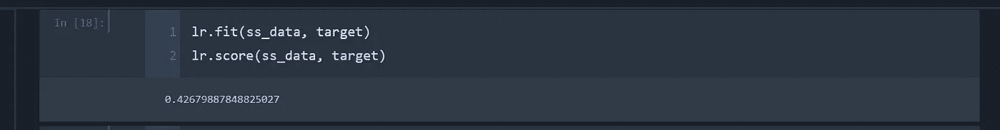
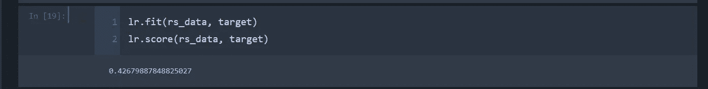
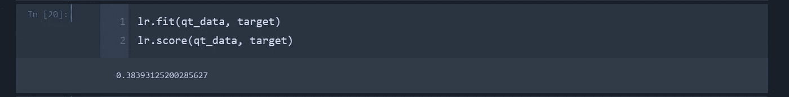
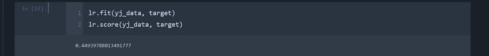

# 预处理:标准化方法的差异

> 原文：<https://towardsdatascience.com/preprocessing-differences-in-standardization-methods-de53d2525a87?source=collection_archive---------28----------------------->



如果您一直在关注预处理系列，我们已经介绍了通过插补处理缺失的连续和分类数据。除此之外，我们还包括编码分类值。

接下来是拟合模型之前的下一个最重要的预处理方法:标准化。让我们来看看这在数据中代表了什么，以及为什么它如此重要。

数据集的***‘标准化*** *是 scikit-learn 中实现的许多机器学习估值器* *的一个* ***共同要求；如果单个特征或多或少看起来不像标准的正态分布数据:具有* ***零均值和单位方差*** *的高斯数据，则它们可能表现不佳。***

*在实践中，我们经常忽略分布的形状，只是通过移除每个特征的平均值来转换数据以使其居中，然后通过将非恒定特征除以其标准偏差来缩放数据。*

*例如，学习算法的目标函数中使用的许多元素(如支持向量机的 RBF 核或线性模型的 l1 和 l2 正则化子)假设所有特征都以零为中心，并且具有相同顺序的方差。如果某个特征的方差比其他特征的方差大几个数量级，那么它可能会主导目标函数，使估计器无法像预期的那样正确地从其他特征中学习。【https://scikit-learn.org/stable/modules/preprocessing.html】()*

本质上，这意味着将数据集中到相同的平均值，并将数据缩放到相同的范围。再次学会拯救。在这里，我们将涵盖一个特定的例子，与'泰坦尼克号'数据集，我们以前已经编码和估算。这篇文章的链接在下面。

[](/preprocessing-encode-and-knn-impute-all-categorical-features-fast-b05f50b4dfaa) [## 预处理:编码和 KNN 快速估算所有分类特征

### 在将我们的数据放入模型之前，需要对分类数据执行的两个步骤是编码和处理…

towardsdatascience.com](/preprocessing-encode-and-knn-impute-all-categorical-features-fast-b05f50b4dfaa) 

为了展示使用标准标量和 PowerTransformer 之间的比较，我们将使用不同的 scikit-learn 包对每个标准化数据集运行一个线性回归模型。我们将把票价作为我们的目标。

所以首先，我们需要设置我们的目标和特性变量。

```
target = encode_data.fare
features = encode_data.drop(‘fare’, axis=1)
```

接下来，我们将导入我们要比较的包…所有这些包都在同一个 scikit-learn 预处理类中。

```
from sklearn.preprocessing import StandardScaler, RobustScaler, QuantileTransformer, PowerTransformer
```

接下来，我们将实例化每个转换包。

```
ss = StandardScaler()
rs = RobustScaler()
qt = QuantileTransformer(output_distribution='normal',n_quantiles=891)
yj = PowerTransformer(method = 'yeo-johnson')
bc = PowerTransformer(method = 'box-cox')
```

如果你注意到，有两种 PowerTransformer 方法，“yeo-johnson”和“box-cox”。Yeo-Johnson 可用于阳性和阴性数据，而 box-cox 只能用于阳性数据。如果存在任何否定数据，将会引发错误。现在，我们将用几行代码通过每种标准化技术运行我们的数据。

```
ss_data = ss.fit_transform(features)
rs_data = rs.fit_transform(features)
qt_data = qt.fit_transform(features)
yj_data = yj.fit_transform(features)
#bc_data = pd.DataFrame(bc.fit_transform(encode_data), columns = encode_data.columns)
```

box-cox 技术被注释掉，因为在集合中识别出了负面数据。现在，我们可以通过 scikit-learn 的现成线性回归模型对每个结果进行评分。

```
from sklearn.linear_model import LinearRegression
lr = LinearRegression()
```

以下是不同软件包的结果:



Original Data without standardization

我们未经标准化的原始数据得出的 r 平方值约为. 427。



Data with StandardScaler



Data with RobustScaler

如果你注意到，standardscaler 和 robustscaler 产生的 r 平方分数与我们的原始数据相同。这是因为大部分数据是分类的，使用这些标量实际上对数据的分布没有影响。鲁棒定标器被设计成对异常值更加友好。这个数据集没有异常值，所以结果是一样的。



Data with QuantileTransformer

quantiletransformer 实际上比原始数据得分更低(～0 . 384)。虽然 quantiletransformer 在规范化双模态和统一数据方面表现很好，但对于这个特定的数据集却不是这样。



Data with PowerTransformer (Yeo-Johnson)

采用 Yeo-Johnson 方法的 powertransformer 软件包将分数提高到了~.449。这比原始数据提高了 2%,仅仅是因为使用了不同的标准化包！

这个故事的寓意是，确保在清理后的数据上测试不同的规范化技术。它真的不会占用太多时间，并且当处理时间证明它是正确的时候，每一点准确性都很重要。这个过程是从上一篇文章添加到 Github 的。可从以下网址获得:

[](https://github.com/Jason-M-Richards/Imputation-Techniques) [## 贾森·M·理查兹/插补技术

### 此时您不能执行该操作。您已使用另一个标签页或窗口登录。您已在另一个选项卡中注销，或者…

github.com](https://github.com/Jason-M-Richards/Imputation-Techniques) 

一如既往的感谢。下周再聊！