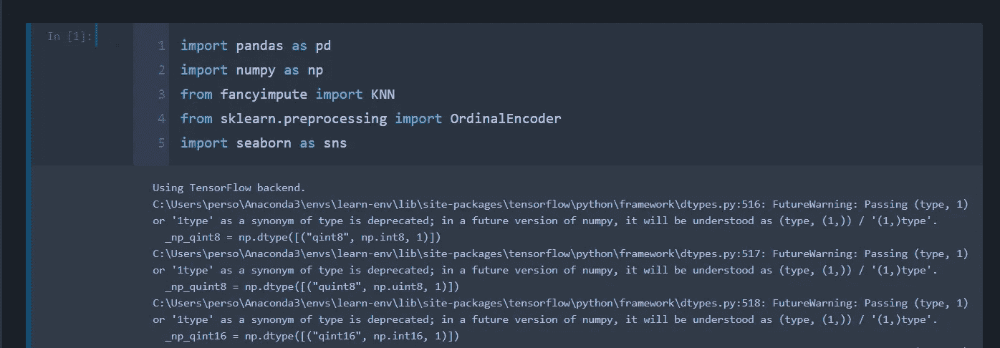
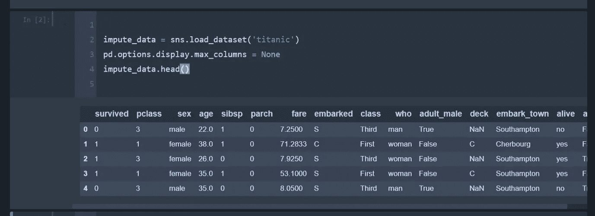
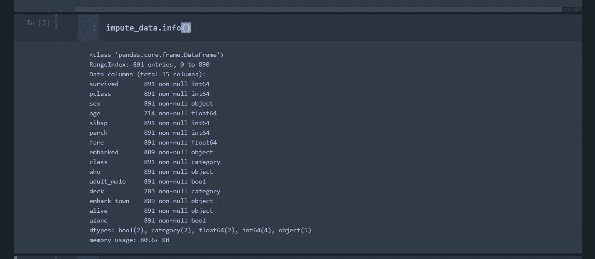
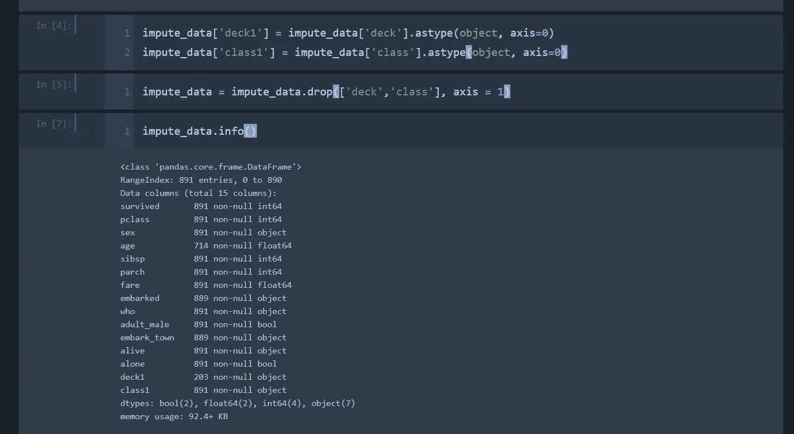
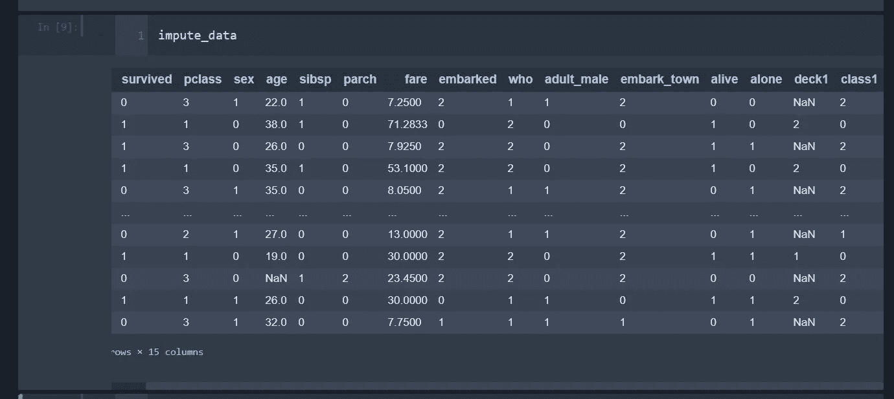
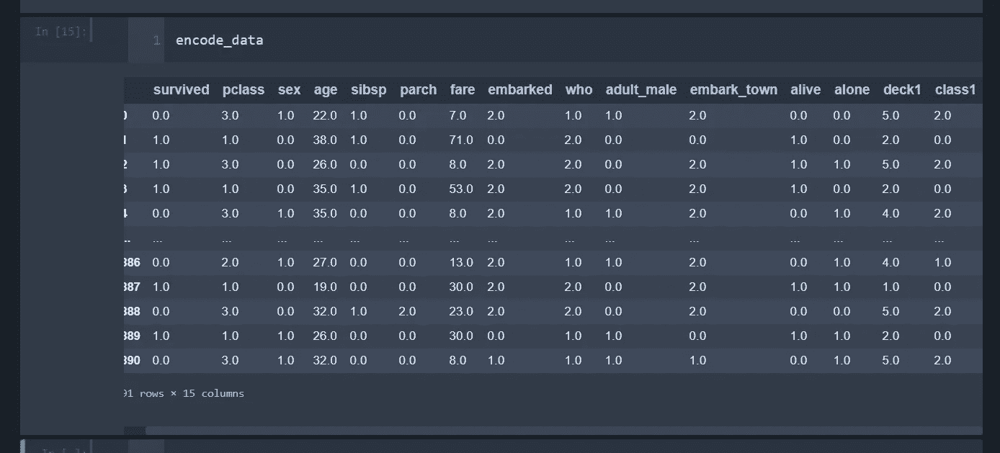

# 预处理:编码和 KNN 快速估算所有分类特征

> 原文：<https://towardsdatascience.com/preprocessing-encode-and-knn-impute-all-categorical-features-fast-b05f50b4dfaa?source=collection_archive---------6----------------------->


在将我们的数据放入模型之前，需要对分类数据执行的两个步骤是编码和处理缺失的空值。编码是将文本或布尔值转换为数字值进行处理的过程。至于丢失的数据，有三种方法可以用来处理数据集中的空值。第一种是将它们留在数据是分类的情况下，可以被视为“缺失”或“非”类别。第二种是通过行或列删除数据。删除数据是一个危险的过程，您不希望从数据集中删除太多的数据。如果缺少值的特性与另一个特性不相关或高度相关，则可以删除该列。另一方面，行是基于具体情况的。第三种，我们将在这里讨论，是估算，或者用占位符值替换。

从 Python 3.6 开始，FancyImpute 就已推出，它是将替代插补方法应用于数据集的绝佳方式。fancyimpute 可以执行多种方法(文档在此:[https://pypi.org/project/fancyimpute/](https://pypi.org/project/fancyimpute/)，但是我们将专门针对分类特征讨论 KNN 估算器。

在我们开始之前，先简要概述一下我们将在这种特殊的预处理技术中使用的数据…非常有用的泰坦尼克号数据集，因为它可以通过 seaborn 数据集轻松获得。 ***我们将构建一个处理数据集中所有分类变量的流程。*** 这个过程将被一步一步地概述，所以除了少数例外，应该与数据集中标识的任何列列表一起工作。

首先，我们将加载我们的库。因为我们要遍历列，所以我们要对数据进行普通编码，而不是一次性编码。如果你注意到，KNN 软件包确实需要一个 tensorflow 后端，并使用 tensorflow KNN 流程。KNN 方法是一种多指数方法，这意味着数据需要全部处理，然后进行估算。



接下来，我们将加载并查看我们的数据。这一区有几个项目需要解决。首先，我们将最大列数设置为 none，这样我们就可以查看数据集中的每一列。其次，这个数据是直接从 seaborn 加载的，所以使用了 sns.load_dataset()。



接下来，看看我们在丢失值和数据类型方面正在处理什么是很好的。很快。info()将完成这个任务。



如您所见，有两个特性被列为类别 dtype。这会导致插补出现问题，因此我们需要将这些数据复制到新的要素中作为对象，并丢弃原始数据。如果你没有任何数据被识别为类别，你应该没事。



根据我们掌握的信息，我们的情况如下:

1.  带有需要编码的文本的分类数据:性别、上船、阶级、谁、成人 _ 男性、上船 _ 城镇、活着、独自、甲板 1 和阶级 1。
2.  具有空值的分类数据:年龄、登船、登船 _ 城镇、甲板 1

我们将确定将要编码的列，但不会涉及太多细节(因为有注释)，提取非空数据、对其进行编码并将其返回到数据集的过程如下。

```
*#instantiate both packages to use*
encoder = OrdinalEncoder()
imputer = KNN()
*# create a list of categorical columns to iterate over*
cat_cols = ['embarked','class1','deck1','who','embark_town','sex','adult_male','alive','alone']

**def** encode(data):
    *'''function to encode non-null data and replace it in the original data'''*
    *#retains only non-null values*
    nonulls = np.array(data.dropna())
    *#reshapes the data for encoding*
    impute_reshape = nonulls.reshape(-1,1)
    *#encode date*
    impute_ordinal = encoder.fit_transform(impute_reshape)
    *#Assign back encoded values to non-null values*
    data.loc[data.notnull()] = np.squeeze(impute_ordinal)
    **return** data

*#create a for loop to iterate through each column in the data*
**for** columns **in** cat_cols:
    encode(impute_data[columns])
```

你可能已经注意到了，我们没有对“年龄”进行编码？我们不想给年龄重新赋值。处理相关当前数据为空的分类数据的最佳方法是将这些数据与该方法分开处理。让我们来看看我们的编码数据:



如您所见，我们的数据仍然是有序的，所有的文本值都已被编码。既然我们有了估算器可以计算的值，我们就可以估算空值了。我们可以输入数据，将数据转换回数据帧，并在一行代码中添加回列名。如果您喜欢使用剩余的数据作为数组，只需省去 pd。DataFrame()调用。

```
*# impute data and convert* 
encode_data = pd.DataFrame(np.round(imputer.fit_transform(impute_data)),columns = impute_data.columns)
```

有了 tensorflow 后端，这个过程很快，每迭代 100 行就会打印出结果。我们需要对值进行舍入，因为 KNN 将产生 floats。这意味着我们的 fare 列也将被四舍五入，所以请确保将您不希望四舍五入的任何功能排除在数据之外。



该过程确实估算所有数据(包括连续数据)，因此要预先处理任何连续的空值。幸运的是，我们所有的估算数据都是分类的。嗯，也许下次再发吧。查看 GitHub 上的笔记本:[https://GitHub . com/Jason-M-Richards/Encode-and-Impute-categorial-Variables](https://github.com/Jason-M-Richards/Encode-and-Impute-Categorical-Variables)。

每周都会发布一个新的预处理技术(直到我再也想不出来了)，所以请关注并留意！