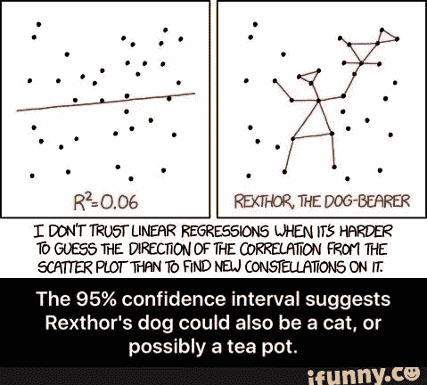

# 预处理:缺失连续值的回归插补

> 原文：<https://towardsdatascience.com/preprocessing-regression-imputation-of-missing-continuous-values-f612179bafb4?source=collection_archive---------15----------------------->



作为编码和输入分类值的后续，本文将介绍使用回归技术来输入连续变量的缺失值。

在决定如何处理数据中的缺失值时，有三种选择:移除带有缺失数据的观测值、将缺失值保留在原位或估算(使用占位符)值。如果决定使用占位符值，实际选择是平均值、中间值或众数。如果缺失值很少和/或数据的变化不显著，这就足够了。

如果有一个特性非常重要，需要保留，但却缺少大量的变量值，该怎么办？Sci-kit Learn 和他们的迭代输入包。

我们将使用一个随机生成的数据集，其中包含有目的地放置的空值。首先，让我们来谈谈我们将要加载的包，并深入了解一下 IterativeImputer。

```
import pandas as pd
import numpy as np
# explicitly require this experimental feature
from sklearn.experimental import enable_iterative_imputer
# now you can import normally from sklearn.impute
from sklearn.impute import IterativeImputer
from sklearn.ensemble import ExtraTreesRegressor
from sklearn.linear_model import BayesianRidge
import random
```

如您所见，迭代输入在 sci-kit learn 库中仍处于实验阶段。在某些情况下，使用这种插补技术会牺牲模型的准确性，因此一定要比较没有使用插补技术的数据集的验证结果。如果你也注意到了，我们已经加载了几个回归模型。IterativeImputer 包允许灵活地选择预加载的 sci-kit 学习模型来迭代数据以估算缺失值。这里重点介绍了三种型号，文档中提供了型号列表和更详细的说明:

[](https://scikit-learn.org/stable/modules/generated/sklearn.impute.IterativeImputer.html#sklearn.impute.IterativeImputer) [## sk learn . input . iterativeinputr-sci kit-learn 0 . 21 . 3 文档

### sk learn . impute . iterative imputr(estimator = None，missing_values=nan，sample_posterior=False，max_iter=10…

scikit-learn.org](https://scikit-learn.org/stable/modules/generated/sklearn.impute.IterativeImputer.html#sklearn.impute.IterativeImputer) 

还要注意，我们使用的方法都是回归模型。这是基于数据的偏好。检查数据并寻找最适合估算值的模型的线索是一种很好的做法。

现在，我们可以生成一个随机数据集，添加 10%的缺失数据，然后将它们混在一起。

```
data = np.random.random([1000,20])
null_data = np.empty([1000,2])
null_data[:] = np.nan
full_data = np.concatenate((data,null_data), axis=1)
full_data = np.random.permutation(full_data.flat)
full_data = full_data.reshape([1000,22])
```

这就是 IterativeImputer 的美妙之处，两行代码处理了所有的空值。BayesianRidge 是用于估算的默认方法，但是我们将调用它来展示一个例子，说明将所选模型实例化到代码中是多么简单。

```
imputer = IterativeImputer(BayesianRidge())
impute_data = pd.DataFrame(imputer.fit_transform(full_data))
```

我对你的挑战是创建一个目标值集，并比较可用的回归和分类模型的结果以及带有缺失值的原始数据。该笔记本包含在上周预处理文章的分类插补笔记本中([https://github . com/Jason-M-Richards/Encode-and-Impute-categorial-Variables](https://github.com/Jason-M-Richards/Encode-and-Impute-Categorical-Variables))。感谢所有的支持，我真心希望你的感恩节过得愉快！下周见。