# NLP 第 2 部分|使用 Python 预处理文本数据

> 原文：<https://towardsdatascience.com/preprocessing-text-data-using-python-576206753c28?source=collection_archive---------5----------------------->

## 让我们为分析准备/清理数据，不要忘记这是一个迭代过程。

卡米尔·米西亚克


Photo by [Dmitry Ratushny](https://unsplash.com/@ratushny?utm_source=medium&utm_medium=referral) on [Unsplash](https://unsplash.com?utm_source=medium&utm_medium=referral)

我以前的 [**文章**](https://medium.com/@kamilmysiak/scraping-the-web-using-beautifulsoup-and-python-5df8e63d9de3) 探讨了使用名为 BeautifulSoup 的 python 库从网站上抓取文本信息的概念。我们很快就能从 Indeed.com 获取员工公司评级，并将数据导出到本地 CSV 文件中。抓取数据仅仅是从我们新获得的文本数据中收集有用见解的第一步。本文的目的是采取下一个步骤，应用一些标准的预处理步骤，以便为分析准备数据。

您选择执行哪种预处理方法将取决于您的数据、预期结果和/或您选择的数据分析方式。也就是说，下面列出的预处理方法是一些最常用的方法。

1.  将库与我们的数据一起导入
2.  扩张收缩
3.  语言检测
4.  标记化
5.  将所有字符转换为小写
6.  删除标点符号
7.  删除停用词
8.  词性标注
9.  词汇化

# **导入必要的库**

```
import pandas as pd
import numpy as np
import nltk
import string
import fasttext
import contractions
from nltk.tokenize import word_tokenize
from nltk.corpus import stopwords, wordnet
from nltk.stem import WordNetLemmatizerplt.xticks(rotation=70)
pd.options.mode.chained_assignment = None
pd.set_option('display.max_colwidth', 100)
%matplotlib inline
```

# 导入我们的数据

我们将导入在之前的 [**教程**](https://medium.com/@kamilmysiak/scraping-the-web-using-beautifulsoup-and-python-5df8e63d9de3) 中获得的粗略员工评估评级，并快速检查数据。

```
with open('indeed_scrape.csv') as f:
    df = pd.read_csv(f)
f.close()
```

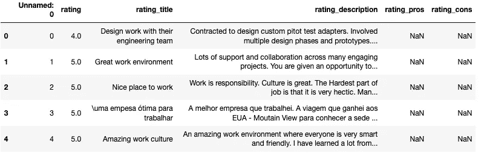

我们将重点关注“评级”和“评级 _ 描述”列，因为它们包含最有价值的定性信息。尽管我们不会对“rating”列应用任何预处理步骤。

首先，让我们删除“Unnamed: 0”列，因为它只是复制了索引。

```
df.drop('Unnamed: 0', axis=1, inplace=True)
```

接下来，让我们检查是否有任何缺失的值。“评级”和“评级 _ 描述”似乎都不包含任何缺失值。

```
for col in df.columns:
    print(col, df[col].isnull().sum())
```

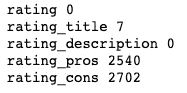

```
rws = df.loc[:, ['rating', 'rating_description']]
```

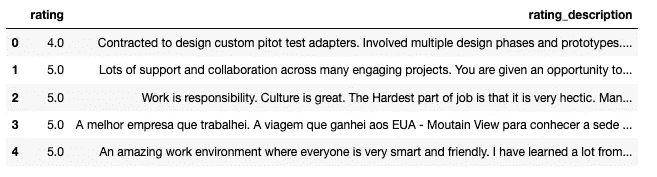

# 文本预处理

## 扩张收缩

缩写是我们采取的文学上的小捷径，我们更喜欢“应该”而不是“应该”,或者“不”很快变成了“不”。我们将向我们的数据框架添加一个名为“no_contract”的新列，并对“rating_description”字段应用一个 lambda 函数，这将扩展任何收缩。请注意，扩展的收缩将被有效地标记在一起。换句话说，“我有”=“我有”而不是“我”，“有”。

```
rws['no_contract'] = rws['rating_description'].apply(lambda x: [contractions.fix(word) for word in x.split()])
rws.head()
```

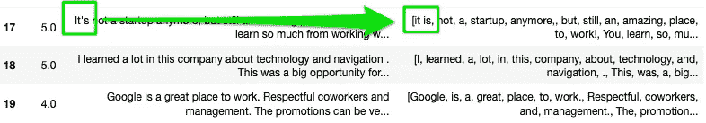

我们最终希望将扩展的缩写分别标记为“I”、“have”，因此，让我们将“no_contract”列下的列表转换回字符串。

```
rws['rating_description_str'] = [' '.join(map(str, l)) for l in rws['no_contract']]
rws.head()
```

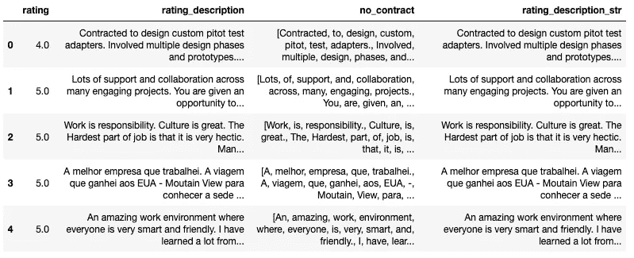

## 英语语言检测

下一步是确定每篇评论使用的语言，然后删除任何非英语的评论。我们首先必须为我们的快速文本库下载预先训练好的语言模型(*每个人都需要感谢 facebook 的这个*)。TextBlob 是一个用于检测字符串语言的常用库，但是当您解析大量文本时，它会很快抛出一个错误。一旦我们下载了模型，我们将使用 for 循环来遍历我们的评论。结果是预测语言和预测概率的元组。在我们的例子中，我们只需要第一个(即。语言预测)部分。最后，我们只选择最后两个字符。

```
pretrained_model = "lid.176.bin" 
model = fasttext.load_model(pretrained_model)langs = []
for sent in rws['rating_description_str']:
    lang = model.predict(sent)[0]
    langs.append(str(lang)[11:13])rws['langs'] = langs
```

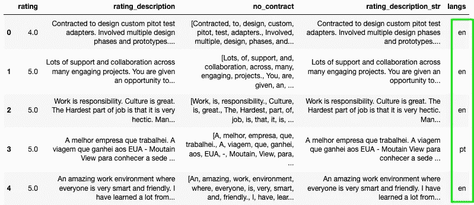

现在我们要做的就是删除所有非英语评论。


## 标记化

现在，我们已经删除了所有非英语评论，让我们应用我们的分词器，将每个单词拆分成一个单词。我们将对“rating_description_str”列应用 NLTK.word_tokenize()函数，并创建一个名为“tokenized”的新列。

```
rws['tokenized'] = rws['rating_description_str'].apply(word_tokenize)
rws.head()
```

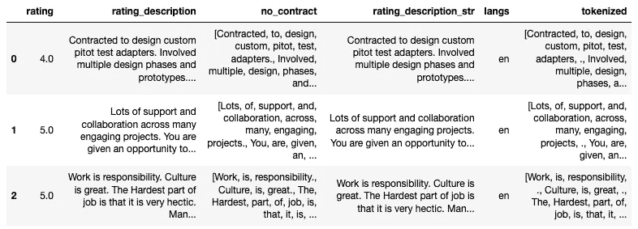

## 将所有字符转换为小写

将所有单词转换成小写也是非常常见的预处理步骤。在这种情况下，我们将再次向 dataframe 追加一个名为“lower”的新列，这将把所有标记化的单词转换为小写。然而，因为我们必须迭代多个单词，所以我们将在 lambda 函数中使用一个简单的 for 循环来对每个单词应用“lower”函数。

```
rws['lower'] = rws['tokenized'].apply(lambda x: [word.lower() for word in x])
rws.head()
```

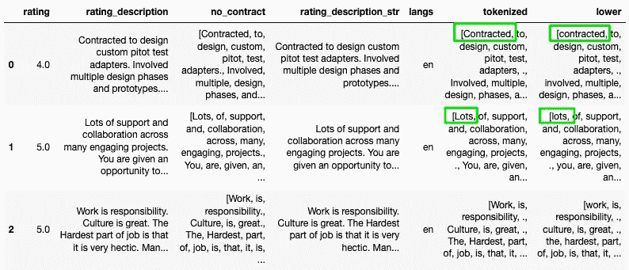

## 删除标点符号

标点符号经常从我们的语料库中删除，因为一旦我们开始分析我们的数据，它们就没有什么价值了。继续前面的模式，我们将创建一个删除了标点符号的新列。我们将再次在 lambda 函数中使用 for 循环来迭代令牌，但这次使用 IF 条件来仅输出 alpha 字符。可能看起来有点困难，但“下方”列中的符号化“句点”已被删除。

```
punc = string.punctuation
rws['no_punc'] = rws['lower'].apply(lambda x: [word for word in x if word not in punc])
rws.head()
```

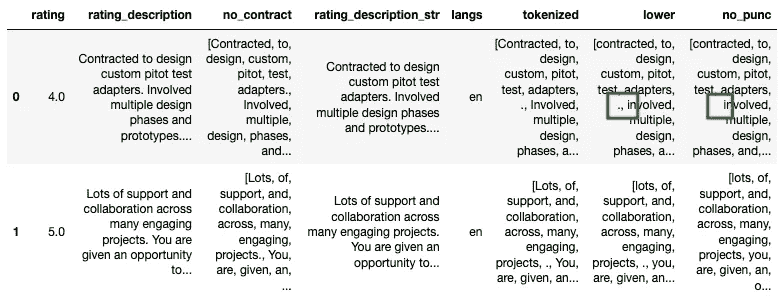

## 删除停用词

停用词通常是无用的词，对句子没有多大意义。英语中常见的停用词包括“你、他、她、在、一个、有、是”等。。首先，我们需要导入 NLTK 停用词库，并将停用词设置为“english”。我们将添加一个新列“no_stopwords ”,该列将从“no_punc”列中删除停用词，因为它已被标记化，已被转换为小写，并且标点符号已被删除。lambda 函数中的 for 循环将再次遍历“no_punc”中的标记，并且只返回“stop_words”变量中不存在的标记。

```
stop_words = set(stopwords.words('english'))
rws['stopwords_removed'] = rws['no_punc'].apply(lambda x: [word for word in x if word not in stop_words])
rws.head()
```

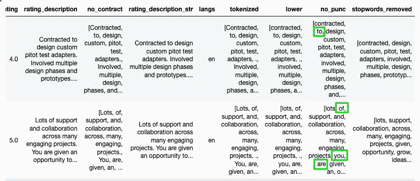

# 词干化与词汇化

词干化的想法是将不同形式的单词用法减少到它的词根。例如，“驱动”、“被驱动”、“驾驶”、“被驱动”、“驱动者”是“驱动”一词的派生词，研究人员经常想从他们的语料库中去除这种可变性。与词干化相比，词干化当然是不太复杂的方法，但它通常不会产生特定于词典的词根。换句话说，对单词“pies”进行词干化通常会产生“pi”的词根，而词汇化会找到“pie”的词根。

让我们对我们的数据应用词汇化，而不是简单地使用词干化，但是与词干化相比，这需要一些额外的步骤。

首先，我们要应用词性标签，换句话说，确定词性(即。名词、动词、副词等。)每个单词。

```
rws['pos_tags'] = rws['stopwords_removed'].apply(nltk.tag.pos_tag)
rws.head()
```

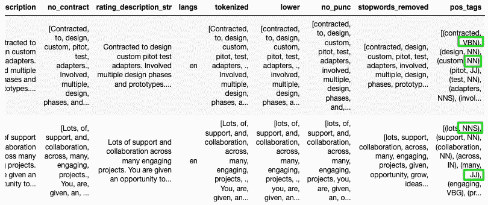

我们将使用 NLTK 的 word lemmatizer，它需要将词性标签转换成 wordnet 的格式。我们将编写一个进行适当转换的函数，然后在 list comprehension 中使用该函数来应用转换。最后，我们应用 NLTK 的单词 lemmatizer。

```
def get_wordnet_pos(tag):
    if tag.startswith('J'):
        return wordnet.ADJ
    elif tag.startswith('V'):
        return wordnet.VERB
    elif tag.startswith('N'):
        return wordnet.NOUN
    elif tag.startswith('R'):
        return wordnet.ADV
    else:
        return wordnet.NOUNrws['wordnet_pos'] = rws['pos_tags'].apply(lambda x: [(word, get_wordnet_pos(pos_tag)) for (word, pos_tag) in x])
rws.head()
```

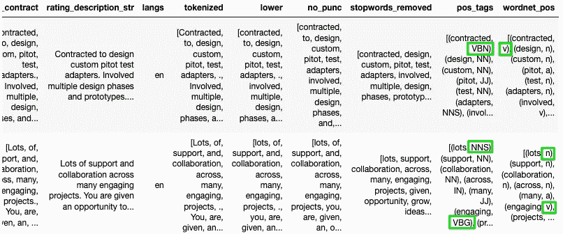

现在，我们可以在可靠的列表理解中应用 NLTK 的单词 lemmatizer。注意，lemmatizer 函数需要两个参数单词及其标签(以 wordnet 的形式)。

```
wnl = WordNetLemmatizer()
rws['lemmatized'] = rws['wordnet_pos'].apply(lambda x: [wnl.lemmatize(word, tag) for word, tag in x])
rws.head()
```

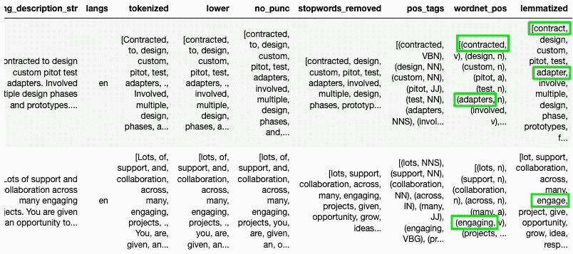

最后，我们将把这项工作保存到一个 csv 文件中，用于进一步的探索性数据分析，您可以在我的下一篇 [**博客**](https://medium.com/@kamilmysiak/nlp-part-3-exploratory-data-analysis-of-text-data-1caa8ab3f79d) **中读到所有相关内容。**

```
rws.to_csv('indeed_scrape_clean.csv')
```

文本预处理可能很快成为编辑和进一步技术的兔子洞，但我们必须在某处划清界限。随着分析过程的深入，我经常会回到数据预处理阶段，因为我发现了一些需要解决的数据问题。也就是说，要学会在某处划清界限。