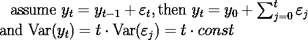
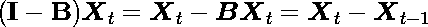
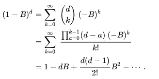
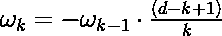
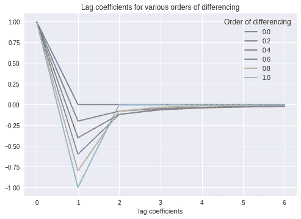
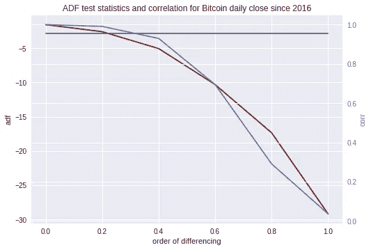
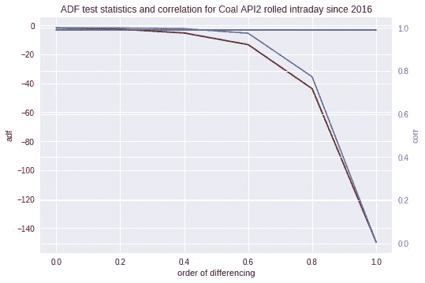
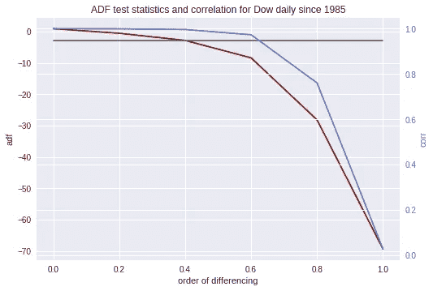
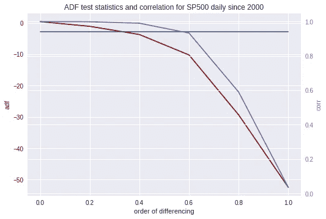

# 平稳时间序列中的记忆保持

> 原文：<https://towardsdatascience.com/preserving-memory-in-stationary-time-series-6842f7581800?source=collection_archive---------3----------------------->

Songkran festivities along the Ping river in Chiang Mai, Thailand. Extracting seasonality, the water level of a river is a stationary time series

许多预测模型要求时间序列具有一定的一致性，称为*平稳性*。通常的转换，即整数阶差分(在金融中，例如对回报率而不是绝对价格建模)，消除了数据中的记忆，因此影响了建模的预测能力。这篇文章概述了分数微积分如何允许保留更多的信息，并更好地平衡平稳性和有意义的记忆。

一般来说，我们将一个给定的时间序列理解为一个随机过程产生的*样本*，我们试图为预测模型推断其分布和统计数据。

建立随机过程的预测模型是为了在样本的特异性和普遍性之间找到平衡:模型在一般模式的背景下解释给定的序列。

比一般的预测回归更具体的是，时间序列由于其时间结构而具有内在的顺序——任何给定的实例都反映了过去遍历的值的历史，即其过去跟踪记录的特定*记忆*。

# 平稳性

为了识别生成过程的一般模式并绘制给定的星座图，在实际建模之前，作为预处理步骤的一部分，这种系列特定的记忆通常被消除。

在监督学习的机器学习术语中，这用于发现通用结构，并将给定实例与带标签的训练集中的更多样本进行匹配。

在数学术语中，过程的统计属性以及序列的集合(如平均值、方差和协方差)应相对于时间顺序保持不变，这意味着序列不应显示出随时间变化的趋势。这个概念被称为*平稳性*(参见例如【1】以获得全面的解释)*。*

有多种方法可以检查序列的平稳性:

1.  目视检查一段时间内的线图是否有明显的趋势，参见[6]中的一些示例。
2.  比较序列的各种(随机)分割的基本汇总统计数据(均值、方差、协方差)。
3.  检查自相关图:随着滞后时间的增加，曲线下降得越快，序列中非平稳性的顺序就越少。
4.  最常见的平稳性统计测试是单位根的扩展 Dickey Fuller (ADF)测试。

直观地说，*单位根*(形式上是位于单位圆上的过程的特征方程的解(见【2】)的含义是，初始条件或外部冲击不会随时间消散，而是通过系列传播并通知所有后续值。

对于一个给定的置信水平，ADF 测试零假设“某个顺序的单位根的存在”(意味着时间序列的非平稳性)相对于平稳性(或者，严格地说，趋势平稳性)的替代。使自己相信单位根的存在确实意味着级数的非平稳性是很直接的:

所以方差是依赖于时间的。

由于许多经典模型方法的一个必要假设是时间序列的平稳性:当您的数据中有明确的趋势或季节性时，您将删除它并对剩余部分进行建模。对于预测，然后将(确定性)趋势和模型输出结合起来。

使序列平稳的常用变换是某一阶的差分:一阶差分就是从每个值中减去前一个值(提取变化率)。二阶差分对结果序列重复这一过程，对高阶序列也是如此。例如，在金融时间序列中，您会考虑(对数)回报而不是绝对价格，以使模型对特定价格水平不可知(事实上，对于大多数金融序列，一阶差分足以确保平稳性——我仍然不知道为什么)。

在基于自相关的 Arima(p，d，q) 类型的模型中，差分实际上是算法的一部分:参数 *p，d* 和 *q* 是非负的 ***整数*** ，其中 *p* 表示自回归模型的阶(即时滞的数量)，而 *d* 表示差分的阶，而 *q* 表示阶

这个过程通过外科手术消除了数列中的单位根。

然而，另一方面，它清除了*内存*，而内存是模型预测能力的基础:*差异限制了过去的信息如何通过序列*传播。

例如，对于金融序列，人们面临着一个没有记忆的稳定回报序列(一阶差分)和一个有记忆但不稳定的绝对价格序列(零阶差分)之间的两难选择。

但也许根本不需要这种极性？如果我们能在这两个极端之间进行插值会怎么样？

> “……这将导致一个悖论，总有一天会从中得出有益的结论。”莱布尼茨，1695 年

# 分数微积分

其实我们可以:17 世纪牛顿和莱布尼茨发明微积分后不久，数学家们就探索了分数导数的使用，其中微分或积分的阶从自然数扩展到实数。然而，分数微积分在 20 世纪的工作应该找到它的第一个自然应用，并在 20 世纪 80 年代通过 Hosking 和 Granger 的 *Arfima* 模型进入金融领域(全面的历史记录见[4])。

在历史上，这种推广的第一个试探法似乎是由欧拉在 1730 年左右通过伽马函数将二项式系数推广到实数阶而给出的。这后来通过用于重复微分的柯西公式以及在黎曼和刘维尔的积分理论中变得更加严格(例如参见[3])。

这里我们只是给出我们应用于时间序列差分的形式启发:
设 **B** 表示滞后算子，即**B X**_*t*=**X**_*{ t-1 }*对于 *t > 1* 和某个时间序列 **X** ={X_ *1* ，…}。然后，一阶元素差分可以用恒等运算符 **I** 表示为

该算子的多项式理解为重复应用，如**B X**_*{ t }*=**X**_*{ t-2 }。*我们可以用二项式系数来展开这个数列:

Formal power series expansion of the differencing operator (see Arfima models [5]).

虽然对于 *d* ∈ ℜ，情况可以变得更加严格，但是在这里，由于我们将在下面的应用中仅使用这种展开的截断版本，我们实际上不必担心这种形式推导的收敛性。

从这个推导中，我们可以读出滞后权重的迭代公式

其中ω_ *k* 是滞后算子 **B** ^k **的系数。**
比如退货，ω_ *0* = 1，ω_ *1* = -1，ω_ *k* =0 对于 *k* > 1(一阶差分)。

让我们看看不同阶差分的系数(代码如下)。

我们注意到分数差分的两个重要细节:

*   对于任何整数 *d* ∈ 𝒩且 *d < k:* 的滞后权重等于零，这意味着我们恢复了整数订单的通常推导。
*   对于实数阶 *d* 和大滞后，滞后权重逐渐变小。这种现象被称为'*长记忆*'(或微积分语境中的'*非定域性*')，通常需要边界条件。这里，我们简单地选择切断超过某个窗口大小的(小)权重。

# 金融时间序列建模的应用

时间序列起主导作用的一个领域是金融。为了更直观地了解分数差分的特性，让我们将其应用于一些典型的金融时间序列。

我们通过将差分算子的上述形式级数展开应用于指定实数阶 *d* ∈ℜ和固定窗口大小的时间序列来获得变换后的序列——使用下面的代码，简单地将熊猫时间*序列*输入到函数*ts _ difference*中，带有参数 *order* 和 *lag_cutoff* 。

Bitcoin prices 2016–18 (in red, right axis) along with some fractional derivatives (shades of blue).

你可能已经注意到，比特币的价格在 2017 年和 2018 年经历了明显的炒作(上图中的红色曲线)。事实上，看一下一阶差异，我们会发现价格在某些日子里上涨了 2500 多美元(例如 12 月 17 日)。该图展示了一些分数阶差分的平滑函数插值。令人惊讶的是，即使对于如此强劲的趋势，大约 0.4 阶的微弱差异实际上也足以使序列平稳:给定样本的 ADF 统计量-5 已经低于 DF t 分布的临界值-2.86，因此在 95%的置信度下，可以假定序列平稳。事实上，随着财富的来来去去，很快就出现了均值回归。

对于许多其他金融时间序列来说,*低阶差分足以满足平稳性*的发现是相似的。

为了说明平稳性和记忆性之间的权衡，我们可以遵循[7]中的适当可视化，并绘制 ADF 测试统计数据以及与原始序列的(线性)相关性，用于以各种差分顺序转换的序列。(请注意，较低的 ADF 检验统计表明替代检验的可能性较高，即值越负，我们越有可能拒绝零假设并假设平稳性)。

对于各种典型的金融序列，如(滚动)商品期货、汇率和指数，这种比较清楚地表明,(低)分数阶差分满足金融建模的平稳性条件，同时保持特定的记忆结构，从而保持原始序列的统计动态。

ADF test statistics (left axis, curve in red) and linear correlation (right axis, curve in cornflower blue) with the original series for various fractional orders of differencing, applied to various Financial time series. The constant line in slate grey marks the 95% significance level of the ADF test.

# 结论

非常令人惊讶的是，在引入 Arfima 模型大约一代人之后，分数差分的概念似乎还没有在金融领域获得广泛的关注。在某种程度上，许多人可能归因于“市场效率”的东西可能只不过是通过不适当的数据预处理而自愿取消信息的人工制品。

我希望这篇文章能提出一个令人信服的观点，将这种有效的技术包含到您的建模工具包中。

**作者:**作为一名热情的数据科学家，我在过去四年里一直担任全球初创公司的技术主管，并实施现实生活中的人工智能解决方案。请发邮件到 simon'at'deepprojects.de 联系我。

**参考文献:**

[1]维基百科，[平稳过程](https://en.wikipedia.org/wiki/Stationary_process)。

[2]维基百科，[单位根](https://en.wikipedia.org/wiki/Unit_root)。

[3]维基百科，[分数微积分](https://en.wikipedia.org/wiki/Fractional_calculus)。

[4] Grave，Gramacy，Watkins and Franzke，[《长记忆简史:赫斯特、曼德尔布罗和通往阿尔菲玛之路》，1951–1980](https://www.mdpi.com/1099-4300/19/9/437)。

[5]维基百科，[阿尔菲玛](https://en.wikipedia.org/wiki/Autoregressive_fractionally_integrated_moving_average)。

[6]分析 Vidhya，[非平稳时间序列](https://www.analyticsvidhya.com/blog/2018/09/non-stationary-time-series-python/)。

[7]德普拉多，金融机器学习进展，威利 2018。

**数据:**

*   以美元计价的比特币，每日收盘价，来源:公共
*   煤炭 API 2 月期货滚动链，每日结算价格，来源:专有
*   道琼斯指数，每日结算价格，来源:雅虎
*   SP500 指数，每日结算价格，来源:雅虎

**代码:**

[https://gist . github . com/skuttruf/FB 82807 ab 0400 FBA 51 c 344313 EB 43466](https://gist.github.com/skuttruf/fb82807ab0400fba51c344313eb43466)