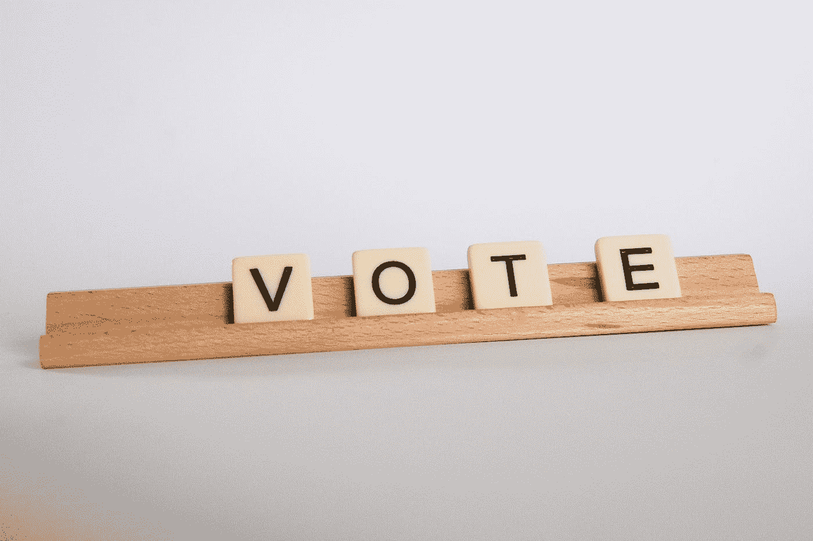
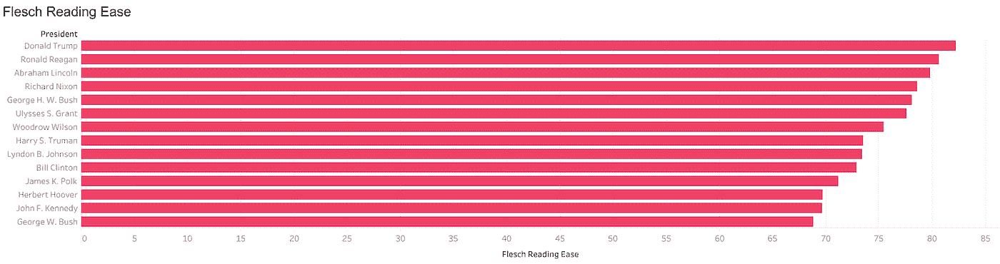
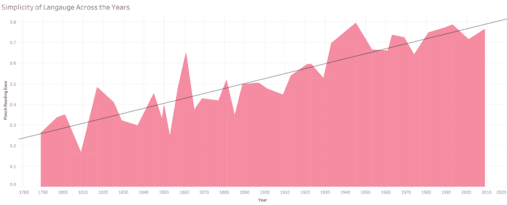
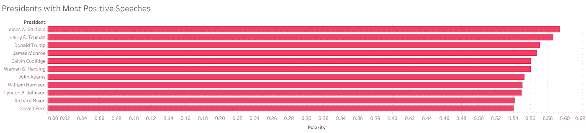
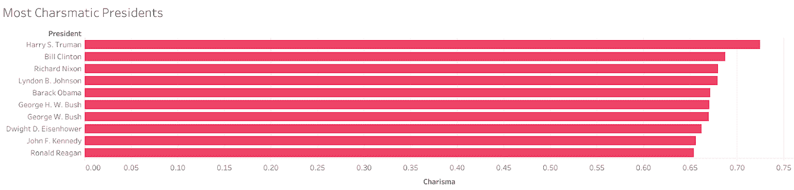
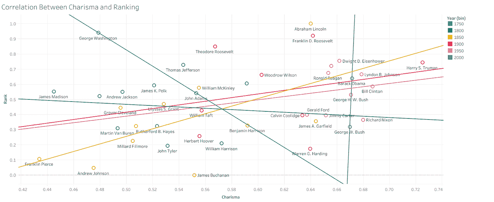

# 总统魅力:你应该投票给谁？

> 原文：<https://towardsdatascience.com/presidential-charisma-who-should-you-vote-for-2c5aabd71d8?source=collection_archive---------19----------------------->

Photo by [Glen Carrie](https://unsplash.com/@glencarrie?utm_source=medium&utm_medium=referral) on [Unsplash](https://unsplash.com?utm_source=medium&utm_medium=referral)

无论是总统候选人还是电视节目主持人，有魅力的人都能传达他们的信息，更好地与他人沟通，并获得他们的信任。但是对于一个总统来说，魅力能透露出他们有可能成为多好的总统吗？

当你决定投票给一位候选人时，你是投票给体现你的政党价值观的领导人还是偏向于健谈者？

魅力型领导者迎合观众的情绪，但不仅仅如此，根据康奈尔纪事报的研究，如果人们还没有决定，投票给候选人不再是政策或经验，而是魅力。

**魅力**被定义为在深层情感层面影响他人、与他人有效沟通、建立强大人际关系的力量。对我们人类来说，魅力很容易被发现，但这是一种机器很难识别的特征。为了让机器理解魅力，它应该被量化。为了继续测量魅力，我将转向自然语言处理(NLP)，这是人工智能与语言打交道的一部分。

总统演讲提供了一个理想的文本收集来检测模式，量化一些特征并回答我们的问题:魅力与总统在办公室的表现有任何联系吗？我们将看看数据对此有何说明。

# 所有数据科学发生的地方

# 数据收集和清理:

没有数据就无法分析，所以我开始通过寻找我能找到的所有总统演讲的文字记录来回答我的问题。幸运的是，[米勒中心组织](https://millercenter.org/the-presidency/presidential-speeches)拥有美国历史上每一次总统演讲的记录，这些脚本的内容是使用 Selenium 和 BeautifulSoup 库从他们的网站上刮下来的。

现在这部分对我来说是最具挑战性的，在没有 HTML 和 CSS 经验的情况下使用 BeautifulSoup(最终我得到了一个 web-scraper 和一些 HTML 知识)。这些文字记录随后被保存到一本字典中，上面有总统的名字和相应的讲话。代码可以在这里找到[，除了可视化在 Tableau 上可以在](https://github.com/hajir-almahdi/the-data-behind-presidental-charisma)[这里找到](https://public.tableau.com/profile/hajir.almahdi#!/vizhome/who_should_you_vote_for/Story1)。

# 量化魅力:

魅力是很难衡量的，但我还是打算回答如何量化它。在现代，那些利用故事和隐喻来调动情感、构建愿景并描绘愿景的领导人被认为是有魅力的。所以魅力型演讲简单地说，包含三个重要特质:

*   使用个人观点、情感、故事和隐喻。
*   表达情感，展示自信，传递积极的信息。
*   简单的语言让不同的人产生共鸣。

通过使用 [NLTK 库](https://www.nltk.org/)、 [TextBlob](https://textblob.readthedocs.io/en/dev/) 和 [Textstat](https://pypi.org/project/textstat/) ，这三个组件通过以下方式进行测量:

*   可读性:Flesch 阅读难易程度基于两个因素来衡量文本难度:平均而言，一个句子中的单词更多，单词更长，或者有更多的音节。其中较高的分数表示材料更容易阅读和理解；数字越小，段落越难阅读。
*   文本的主观性:主观句一般指个人观点、情感、故事或判断，而客观句指事实信息。主观性是一个位于[0，1]范围内的浮点数。
*   文本的极性:这衡量文本的整体信息，它被衡量为一个位于[-1，1]范围内的浮点数，其中 1 表示肯定的陈述，而-1 表示否定的陈述。

我将魅力定义为每位总统在所有收集到的演讲中的轻松度、极性和主观性得分的平均值。

# 特朗普在六年级水平演讲:

Flesch Reading Ease Measure

从 Flesch 阅读容易度的图表来看，特朗普的阅读容易度最高，大约是六年级的水平，易于阅读(消费者的英语会话),这意味着容易被 12 岁的普通学生理解。

我们还可以看到，40 年前的大多数总统平均水平在 7 年级左右，阅读英语相当容易，除了吉米·卡特，他的英语水平在 8 到 9 年级。

对大量听众讲话意味着用我们都能理解的方式讲话，知道哪种语言能引起特定人群的共鸣能让你走得更远。我更进一步，想象了英语多年来的变化。

Simplicity of Language Across the Years

从上面的情节中，我们可以注意到多年来语言简化的趋势，从大学水平-难以阅读-到容易被高中生理解或在今天的政治中，被六年级学生理解。

# 演讲最积极的总统:

Presidents with Most Positive Speeches

我们可以看到，詹姆斯·a·加菲尔德、哈里·S·杜鲁门和唐纳德·川普在极性测量中得分最高。从其余的结果来看，演讲的积极性与语言的简单性不同，它更多地取决于总统的性格而不是总统任期的长短。在本分析的其余部分，我们将关注那些在办公室完成时间导致唐纳德·特朗普从最终结果中排除的总统。

# 谁最有魅力？

Charisma Measure

请记住，魅力的衡量标准取决于阅读的难易程度，也就是说，阅读的难易程度越高，你就越有魅力。很自然，杜鲁门和比尔·克林顿领先，其次是理查德·尼克松、林登·约翰逊、巴拉克·奥巴马和乔治·h·w·布什。

政治学家兼博客作者乔纳森·伯恩斯坦在《福布斯》的文章中指出，虽然像克林顿和奥巴马这样的总统仍然被认为是有魅力的，但是像尼克松、约翰逊和老布什这样的总统已经失去了他们的魅力。

## 办公室表现:总统历史学家调查

为了完成所需的数据，美国总统排名数据来自[总统历史学家调查](https://www.c-span.org/presidentsurvey2017/?page=overall)，该调查根据十个不同的因素对总统进行排名，如危机领导力、道德权威、与国会的关系和经济管理。

# 魅力和排名的相关性:

Correlation Between Charisma and Ranking

绩效排名和魅力是两个独立变量，我们可以在图中看到两者的散点图。它们之间的相关性等于 0.168，表明这两个变量之间的关系非常轻微。然而，假设任何一种关系都需要更全面的方法来衡量魅力，但目前我们可以得出结论，两者之间没有相关性。

## “言行一致”的总统:

现在在下图中，在添加了每半个世纪的相关线后，我们可以看到一些有趣的结果；从 20 世纪 50 年代开始，总统们的得分非常接近，而之前的总统们的得分更加分散。在 20 世纪 50 年代，随着电视在美国的广泛普及，使其成为影响公众舆论的主要媒体，总统们开始更加关注他们如何向公众发表演讲。

Correlation Between Charisma and Ranking

看看 1850 年、1900 年和 1950 年的数据，我们可以看到魅力和排名之间的正相关，所以那个时期的总统更有可能言行一致。进入 21 世纪，我们可以看到魅力和排名之间没有相关性，几乎是一条直线。因此，在我们这个时代，总统更有可能言出必行，但这并不一定意味着他们的表现会反映出他们是多么优秀的演说家。

魅力型领导者知道什么是最好的，在某些方面表现突出，在某种意义上是当天的救星，但真正的魅力是让你能够影响别人，让你的信息被传达，不管这个信息有多有效或理智。这并不一定能让你更善于做出决定，引导一个国家朝着正确的方向前进。

这给了我们一个结论性的答案，无论一位总统或总统候选人在选举、辩论或演讲时多么有魅力，都不能说明他们当选后会有多好。所以，当你下次投票时，请记住，魅力并不能让总统成为更有效的领导者。

这个项目是作为[数据艺术与科学奖学金](http://theartandscienceofdata.herokuapp.com/fellowship/)的一部分完成的。

## 使用的来源:

[Flesch 可读性缓解](https://datawarrior.wordpress.com/2016/03/29/flesch-kincaid-readability-measure/)

[总统历史学家调查](https://www.c-span.org/presidentsurvey2017/?page=overall)

[选民想要什么](https://www.nytimes.com/2016/01/26/opinion/campaign-stops/what-voters-want.html)

[研究人员发现，投票给候选人与政策或经验无关，而是关乎个人魅力](http://news.cornell.edu/stories/2008/10/voters-make-snap-judgments-based-candidates-charisma)

[投票行为](https://www.icpsr.umich.edu/icpsrweb/instructors/setups/voting.jsp)