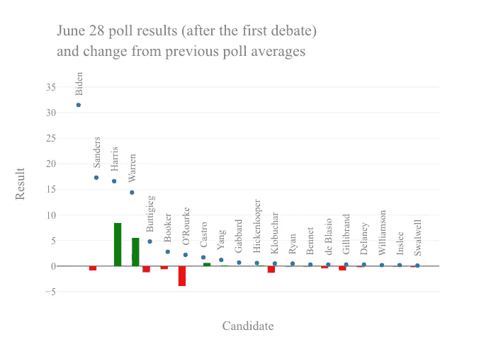
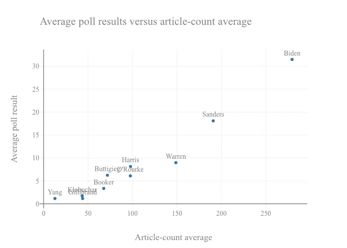
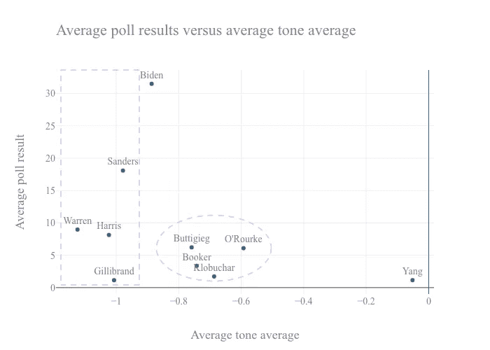
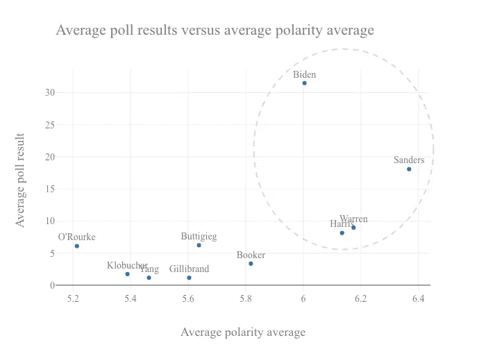

# 2020 年初初选的新闻报道

> 原文：<https://towardsdatascience.com/press-coverage-of-the-early-2020-primary-65695f104633?source=collection_archive---------40----------------------->

## 2020 年民主党总统初选早期媒体报道观察

诚然，我们仍处于 2019 年，下一届美国总统选举是在 2020 年，距离撰写本文大约 17 个月。然而，选举进程已经开始，有 20 多名个人已经宣布参选，正在争取民主党的提名。事实上，该党已经举行了第一次辩论，竞选正在进行中。

这是探究候选人投票和媒体报道之间关系的好时机。获得洞察力和建立选举状况的全面概览的一个方法是分析参与竞选活动的民调和新闻指标数据，以寻找相似性、差异和模式。通过结合这两个数据维度，我们能够更好地评估单个候选人的相对表现和定位。

# 以前的工作和数据

这项分析更新了之前的工作，该工作检查了 2016 年共和党总统初选的类似数据([后](/polls-and-press-ef340199e425))。此外，更多信息和 2016 年和 2020 年分析的底层代码可以在我的 GitHub [网站](https://github.com/sgodfrey66)找到。

民意调查数据来自 [FiveThirtyEight](https://fivethirtyeight.com/) ，这是一家分析服务公司，拥有一个广受欢迎的网站，提供政治、体育、科学和健康、经济和文化的定量和统计分析。新闻数据来自全球事件、语言和语调数据或 [GDELT](https://www.gdeltproject.org/) 项目。GDELT 是一个监控、存储和提供“来自几乎每个国家每个角落的世界广播、印刷和网络新闻”的项目。

# 辩论结果

首先要看的是上周辩论后候选人的民调表现。下图包含辩论后第一次民意调查(2019 年 6 月 28 日发布)的排名快照，以及每位候选人相对于之前民意调查平均值的变化。从这一点上，我们注意到乔·拜登领先，他的民调结果在辩论后没有太大变化，尽管人们普遍认为他在舞台上表现不佳。许多人认为卡玛拉·哈里斯和伊丽莎白·沃伦表现出色，两个国家的民调都大幅上升。其他几名候选人，特别是贝托·奥罗克，从相对较低的水平下降。

# 新闻报道

绘制民意测验排名与媒体报道量的对比图是很有帮助的。下面的图表包含平均投票表现与平均投票周期之间出现的文章的平均数量，10 个候选人具有最高的平均投票。正如所料，两者之间存在积极的关系，领先的候选人获得了最多的报道。

在这张图表中，拜登似乎是一个明显的领先者，在民意调查中大幅领先，比任何其他候选人都有更多的媒体报道。伯尼·桑德斯的新闻报道与他在民调中的第二名一致，但鉴于他 2016 年的总统竞选和长期的公共存在，人们可能会认为新闻报道的数字更接近拜登。沃伦和哈里斯的民调数字相似，但沃伦吸引了更多的媒体报道。有趣的是，奥洛克和哈里斯的文章数量相似，但在民意调查中似乎朝着相反的方向发展，看看他们各自的新闻报道指标是否有所不同将是一件有趣的事情。

# 音调

GDELT 项目追踪的一个属性是文章语气的度量。关于声调的更多信息可以在 GDELT [文档](http://data.gdeltproject.org/documentation/GDELT-Global_Knowledge_Graph_Codebook-V2.1.pdf)中找到，但是，总而言之，它测量的是正负词频之间的差异。虽然它的范围可以从-100 到+100，但这里检查的文档的分数集中在零附近，对于这些数据，相对较小的差异是显著的(例如，涵盖 Warren 的文章的平均色调平均值在统计上不同于 0 和-0.5)。

绘制民意测验表现与这一指标的关系图很有帮助，这些指标是引用每个候选人的文章的平均值。即使平均色调较小，也会出现明显的模式。从下图中可以看出，候选人可以分为两组，分别用矩形和椭圆形表示。与奥罗克、皮特·布蒂吉格、科里·布克和艾米·克洛布查尔相比，沃伦、哈里斯、桑德斯、柯尔斯顿·吉利布兰德和拜登在报道中都看到了更多负面论调。

# 极性

GDELT 项目还测量文档极性，并绘制候选人之间的投票结果与该值的关系图，这也产生了有趣的结果。较高的值与文档中极化语言的较高流行度相关联。

在这种情况下，我们看到一组四个领先的候选人，拜登，桑德斯，沃伦和哈里斯，都比其余的前 10 名领域获得更高的极性覆盖。在这个群体中，桑德斯的报道具有最高的极性平均值。鉴于人们认为他的政策立场偏左，这可能是意料之中的。同样有趣的是，拜登的报道没有哈里斯、沃伦和桑德斯那么两极化。

# 概括起来

虽然现在显然还处于 2020 年民主党总统初选的早期，但潜在选民已经被要求开始形成观点，并在一个大型候选人中选择领导人。收集和分析这些候选人的数据是获得这些观点的本质的一种方法。

从这项工作中，我们看到领先的候选人享有最多的新闻文件。然而，与观察到的中层参与者相比，这种报道具有更消极的基调和更高的极性。此外，在领先的种族中，这些指标明显不同，其中一些具有特别负面和两极化的报道。