# Python 中柱状数据的漂亮展示技巧

> 原文：<https://towardsdatascience.com/pretty-displaying-tricks-for-columnar-data-in-python-2fe3b3ed9b83?source=collection_archive---------2----------------------->

## 改进 Python 及其库显示数据的方式，并使其可读

对于以前使用 lists、Pandas 或 NumPy 广泛争论过数据的每个人来说，您可能都遇到过以正确的方式打印数据的问题。特别是如果有很多列，显示数据就变得很麻烦。本文向您展示了如何以可读的方式用 python 打印大型列数据。

为了解释清楚，我使用的是 **NYC 房产销售数据**，总共有 21 列。

如果您有一个包含许多列的 Pandas 数据帧，并试图用常规的 print 语句将其打印出来，就会发生这种情况:

```
**import** pandas **as** pdnycdata=pd.read_csv(**'nyc-rolling-sales.csv'**,index_col=0)print(nycdata.head())
```

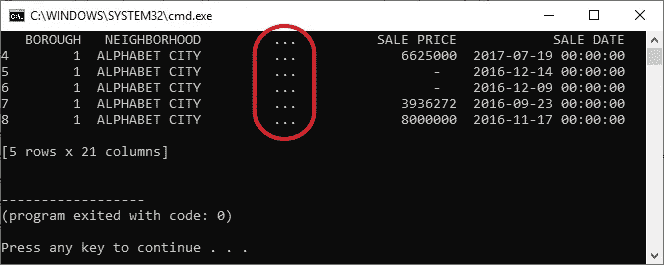

Data is omitted from printing

发生这种情况是因为 Pandas 将检测它可以在终端窗口空间中容纳的列数，这将不会准确显示我们需要的内容。为了节省屏幕上的终端空间，打印时会忽略大部分数据。

要解决这个问题，这里有一些方法。

## **好的**绝招

您可以增加 Pandas 允许您显示的最大列数，方法是在代码中添加以下代码行:

```
pd.options.display.max_columns = **None**
```

这将取消屏幕上显示的最大列数限制。以下是打印时的样子(现在只打印前 11 列..)

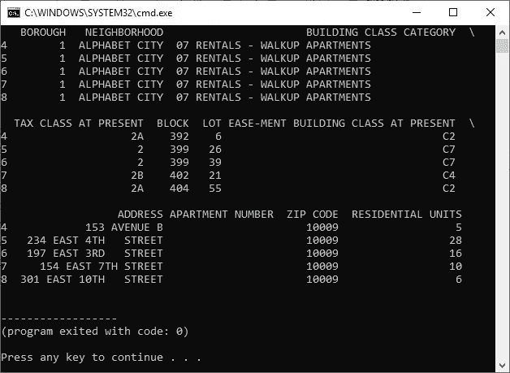

Print result after removing max column limit

但是，嘿，这并不完全是我们所需要的。数据被分成多行，标题由反斜杠分隔。这是可读和有用的，但仍不完美。

要克服这一点，只需在代码中使用这一行，就可以在一行中获得所有数据:

```
pd.options.display.width=None
```

这是它现在的样子(只打印了 7 列):

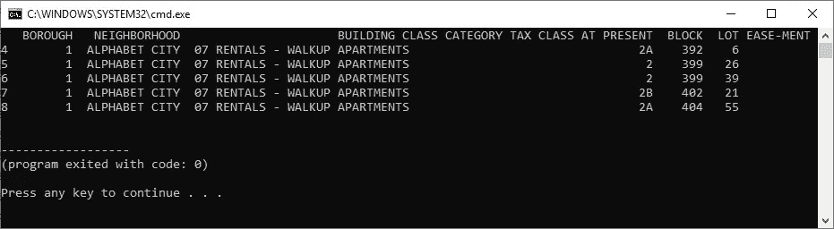

Print result after removing max width limit

注意——大多数代码编辑器不会以一种好的方式显示大块的列数据。您的输出将以一种完全不可读的方式变得混乱，并且您需要最大化您的输出窗口以便很好地查看所有的数据。PyCharm 在这种情况下做得非常好——它向您显示了一个水平滚动条，您可以在这里滚动浏览您打印的数据。标准终端或编辑器(如 VSCode)不会出现这种情况。

如果您使用终端或 VSCode，请将窗口最大化并减小字体大小，以便您可以在有限的空间中容纳最多的列，并且可以很好地查看您的数据。

这是完整数据在终端输出中的显示方式(VSCode 以同样的方式打印):

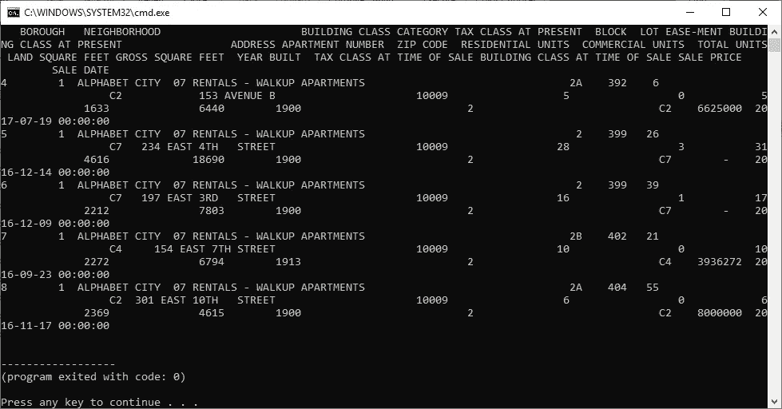

All columns in Terminal

这是 PyCharm 展示相同数据的方式:

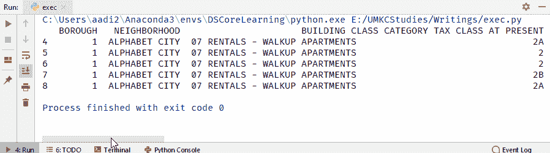

PyCharm’s scrollbar print

如果您正在使用 PyCharm，并且希望显示与上述类似的数据，或者如果您认为最大化和缩小字体大小是可以接受的，这里有一个更好的方法来显示您的数据。

## **更好的**绝招:

您可以使用名为“制表”的库来轻松显示列中的数据。这就像将一个简单的函数封装到数据帧上使用的打印函数中一样简单。

```
**from** tabulate **import** tabulate
.
.
.
print(tabulate(df,headers=**'firstrow'**))
```

这就是制表显示数据的方式:

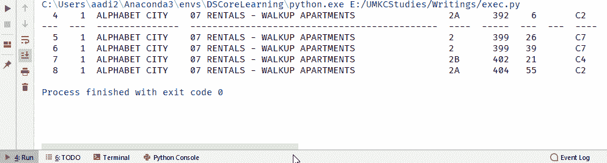

Tabulate’s print

为了去掉 print 语句中多余的代码行，可以这样编写一个简单的 lambda 函数:

```
**from** tabulate **import** tabulate
pdtabulate=**lambda** df:tabulate(df,headers=**'keys'**)
.
.
.
print(pdtabulate(df))
```

更神奇的是，你可以从多种格式中选择打印格式。你所需要做的就是将' **tablefmt** '参数添加到制表函数中，并为其分配你选择的打印格式。我最喜欢的是“ **psql** ，它使用 PostgreSQL 的格式来显示表格数据。

```
**from** tabulate **import** tabulate
pdtabulate=**lambda** df:tabulate(df,headers=**'keys'**,tablefmt=**'psql'**)
.
.
.
print(pdtabulate(df))
```

这是它看起来的样子:

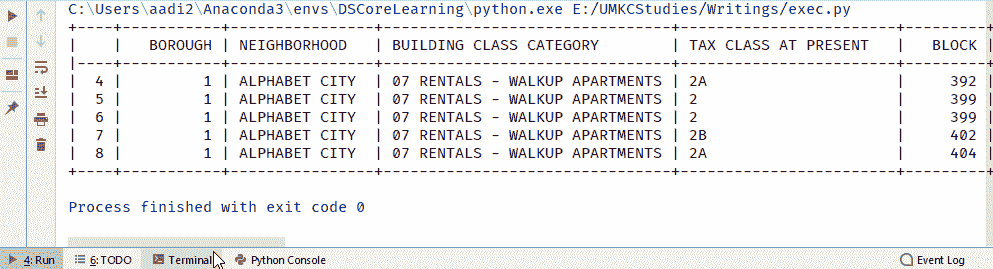

Feels like SQL!

如果您有必要将数据转换成 HTML 表格，制表很容易为您做到这一点。

```
**from** tabulate **import** tabulate
pdtabulate=**lambda** df:tabulate(df,headers=**'keys'**,tablefmt=**'html'**)
.
.
.
print(pdtabulate(df))
```

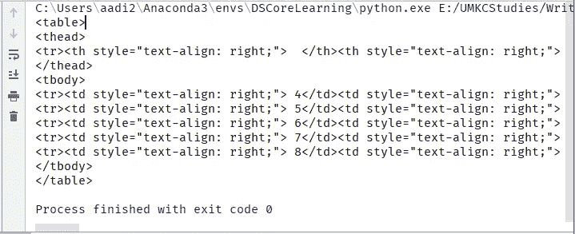

Data printed to HTML Tables

即使对于大型列表和巨大的 NumPy 数组，制表也非常有效。

```
**from** tabulate **import** tabulate

pdtabulate=**lambda** df:tabulate(df,headers=**'keys'**,tablefmt=**'psql'**)#Creating a list using garbage values
list = [['a', 'b', 'c','d'], ['aaaaaaaaaa', 'b', 'c'], ['a', 'bbbbbbbbbb', 'c'], ['aaaaaaaaaa', 'b', 'c'], ['a', 'bbbbbbbbbb', 'c'], ['aaaaaaaaaa', 'b', 'c'], ['a', 'bbbbbbbbbb', 'c'], ['aaaaaaaaaa', 'b', 'c'], ['a', 'bbbbbbbbbb', 'c']]print(pdtabulate(list))
```

这是它看起来的样子:

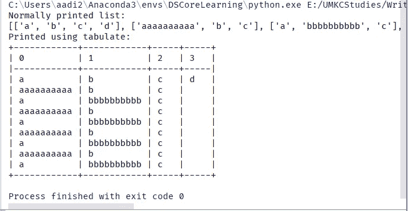

Normal vs tabulated prints of 2D lists

下面是一个使用制表可视化的示例 NumPy 数组:

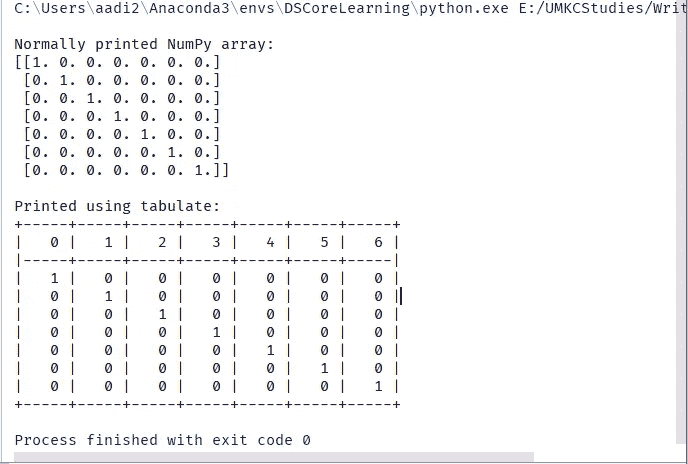

Normal vs tabulated prints of a simple NumPy array

更多关于这个令人惊叹的图书馆的信息和更多关于不同印刷格式的知识，请访问[本页](https://pypi.org/project/tabulate/)。

虽然这些技巧会很有帮助，但下面的技巧尽可能以最好的方式展示了我们的数据。

## **最好的**绝招:

忘掉 PyCharm、终端和制表软件吧——用 Jupyter 笔记本来显示你的数据。

Jupyter 笔记本显示您的数据类似于第一种开箱即用的情况——它们在显示中省略了几列。

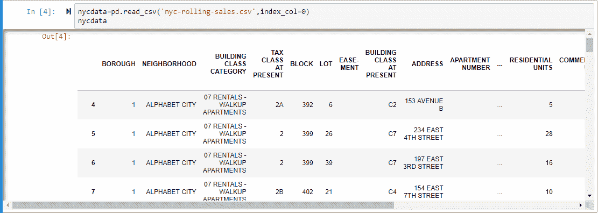

Data displayed in a Jupyter Notebook — few columns are omitted

为了解决这个问题，使用打印示例中使用的同一行来显示数据的所有列:

```
pd.options.display.max_columns = **None**
```

Jupyter 向您展示了一个完美格式化的 HTML 表格:

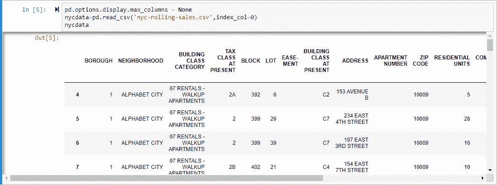

Data after removing max column limit

## **一天的结束..**

如果你习惯经常使用 Jupyter 笔记本，只需将最大列数设置为无，就可以一次显示所有数据。但是如果你是一个喜欢在编辑器中编写代码，而不是使用 Jupyter 笔记本来理解数据的人，那么使用制表库是最好的选择。