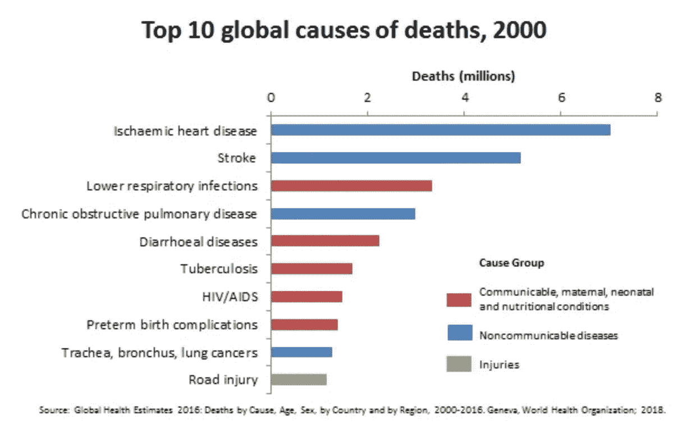
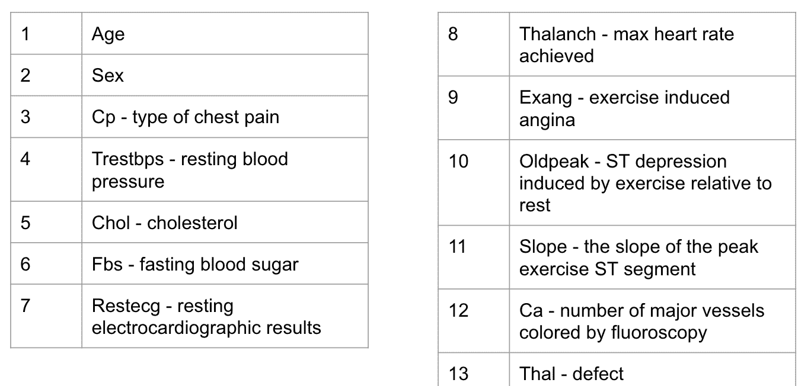
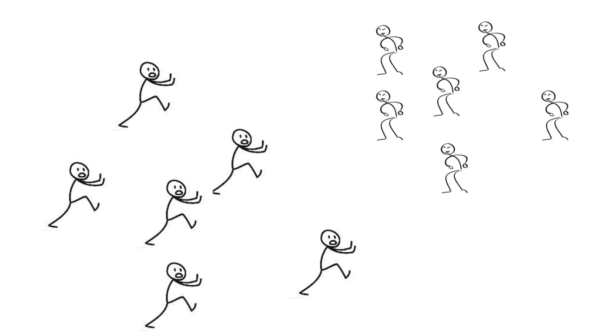
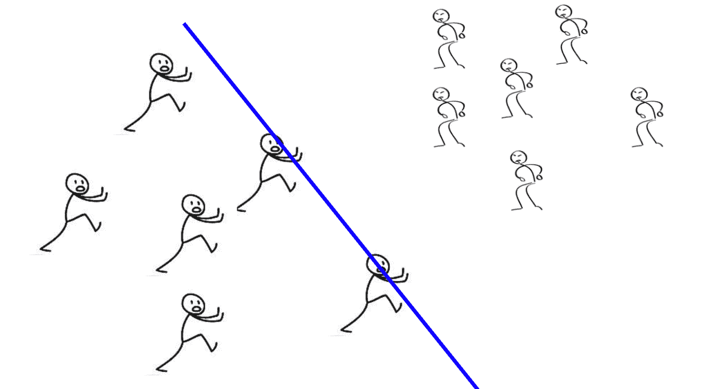
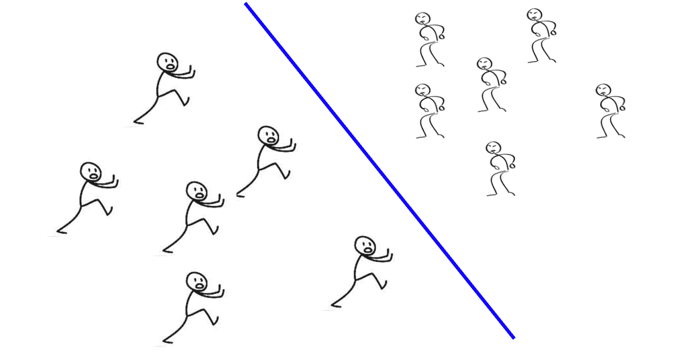

# 使用机器学习预防心脏病死亡

> 原文：<https://towardsdatascience.com/preventing-deaths-from-heart-disease-using-machine-learning-c4f8dba250c6?source=collection_archive---------8----------------------->

## 心脏病正在夺去全世界数百万人的生命。而机器学习或许可以帮助解决这个问题。

## 世界上最主要的死亡原因是什么？

癌症？

号码

伤害/事故？

不。继续努力。

呼吸道疾病，糖尿病，老年痴呆症？

不，不，不。

> ***导致死亡的主要原因是心脏病。***
> 
> 自 2000 年以来，它一直是导致死亡的主要原因。

Source: [WHO](https://www.who.int/news-room/fact-sheets/detail/the-top-10-causes-of-death)

每年有 50 多万美国人死于心脏病，如冠状动脉疾病、心血管疾病和心绞痛。(精确到 61.3 万)。医疗保健服务和心脏病药物每年花费美国近 2000 亿美元。

因此，50 万人失去了生命，2000 亿美元花掉了

*每，*

*单个，*

*年*，

**用于心脏病。(仅在美国)**

## 嗯，现在很糟糕，但是未来会是什么样子呢？

2030 年，美国心脏协会预计治疗心脏病的费用将上升到 8180 亿美元。美国将有 1.16 亿人患有某种形式的心血管疾病。

## 人们患心脏病有两个主要原因

问题的一半是遗传。人们生来就有基因突变，这增加了他们患心脏病的可能性。不幸的是，我们现在无法控制这一点，但通过像 CRISPR 这样的基因编辑技术，我们也许可以在未来防止这一点。

问题的另一半是糟糕的生活方式。人们每天都会做出导致心脏病的糟糕决定。

我们可以将这些因素分为四类。

1.  缺乏运动——35%心脏病的原因。
2.  肥胖——2700 万美国人患有由肥胖引起的心脏病
3.  吸烟——20%的心脏病死亡与吸烟直接相关
4.  不良饮食美国有 50 万人因为高脂肪饮食而患心脏病。高胆固醇占心脏病患者的 15%。糖尿病占心脏病患者的 11%。

所有这些因素都有一个共同点。他们都在我们的控制之下。我们可以决定是否要锻炼、吸烟和保持健康的饮食。这是一个选择。因此，如果这些人做出更明智的决定，这些因素导致的死亡是可以避免的。

*为了做出明智的决定，人们需要信息。*

## 让我们预防心脏病造成的死亡。

首先，快速回顾一下。我们知道很多人死于心脏病，如果人们选择更好的生活方式，一半的死亡是可以避免的。那么我们如何做到这一点呢？

> 使用一种叫做机器学习的人工智能子集，我们可以在某人死于心脏病之前预测他患心脏病的可能性。如果人们知道他们患致命疾病的可能性，这将鼓励他们做出更明智的生活方式选择。从而减少死于心脏病的人数。

## 这将如何工作？

我们可以使用机器学习算法来获取信息，并对一个人是否可能患有心脏病进行分类。

使用 UCI 机器学习知识库中的 Cleveland 数据集，我自己进行了试验。

该模型接受了每个人的 13 个不同的数据点。

13 different attributes in Cleveland Heart Disease Dataset

## 我实现了一个支持向量机(SVM)

下面是外行人对支持向量机的解释。

**SVM 是一种执行分类任务的监督学习算法。**简单地说，它使用带标签的数据来区分输入的类别。

这是一个关于其工作原理的类比。

你是一所中学的老师。一天，你在中学操场上巡逻，确保每个人都安然无恙。突然，六年级学生和八年级学生之间爆发了一场打斗。作为一名教师，你需要做三件事。

1.  把八年级和六年级的学生分开
2.  不要和任何一方有任何身体接触。
3.  保护你的生命:)

该字段如下所示:

Middle school field

在你的第一次尝试中，你成功地分开了六年级和八年级的学生，但是你和他们发生了身体接触，并且冒着生命危险接触了荷尔蒙分泌旺盛的八年级学生。

所以你再试一次:

Excellent SVM

第二次尝试非常成功。你不仅救了自己的命，还提醒你，你的学校教育终于是值得的。Jk，但是你在 1 号位做得很好。把八年级和六年级的学生和 2。最大化每个中学生与自己的距离。

这是一个非常好的支持向量机算法的例子。

在这个例子中，我们的两个班级是八年级和六年级。我们正试图将这两个阶层区分开来。

老师代表一个超平面。我不打算在本文中解释什么是超平面，但它可以被认为是进行分类的直线。

SVM 的目标是找到一个最优的分离超平面。

在上面的例子中，我们正是这样做的，因为我们对两个类进行了分类，并最大化了从蓝线到每个输入的距离。这也证明了为什么我们当老师的第一次尝试不那么顺利。我们没有找到最优分离超平面。

我们老师(蓝线)可以认为是一个超平面。最佳分离超平面的作用是对班级进行分类，在这种情况下是八年级和六年级，并最大化每个输入和完成的线之间的距离。

概括地说，SVM 是一种机器学习算法，它使用超平面来划分类别。最优分离超平面是它旨在用于类别之间的分类。可以用 1 来区分。准确地分离所有的类和 2。最大化每个输入和超平面之间的距离。

> *使用 scikit-learn，一个机器学习包，我实现了一个 SVM 来对心脏病高概率人群和低概率人群进行分类。*

 [## 布里安纳戈保罗/心脏病

### 使用克里夫兰心脏病数据集，我实现了一个 SVM 来分类某人患心脏病的可能性…

github.com](https://github.com/BriannaGopaul/heartdisease/blob/master/Heart%20Disease%20Notebook.ipynb) 

不幸的是，我得到了大约 62%的准确率，这不足以在现实世界中使用。经过更多的研究，**我了解到三件事。**首先，支持向量机并不擅长多类分类任务。其次，我需要更好地预处理更多的数据。这是我现在正在学习的东西，我重申。第三，在网上找到开源的健康数据真的很难。

尽管机器学习是一个非常新颖的领域，但如果数据科学家和机器学习专家能够获得开源的健康数据，我们将有望解决我们目前在医疗保健领域面临的许多问题。我们现在还没有达到预防心脏病死亡的阶段，但这是做类似事情的起点。

**我接下来要做的:**

为了继续开发人工智能知识库，我将在吴恩达的机器学习课程上取得更多进展，并致力于更多的项目来应用我的知识。

*如果你想了解更多关于我参与的其他项目，请查看我的作品集* [*这里*](https://tks.life/profile/brianna.gopaul) *和我联系*[*linked ln*](https://www.linkedin.com/in/brianna-gopaul-b7a626150/)*。*