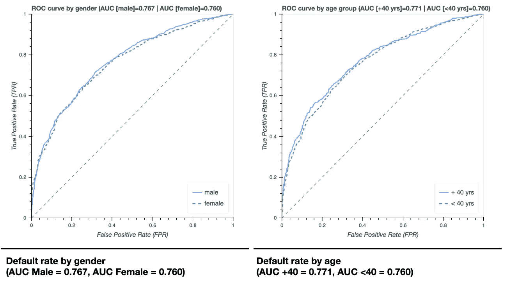
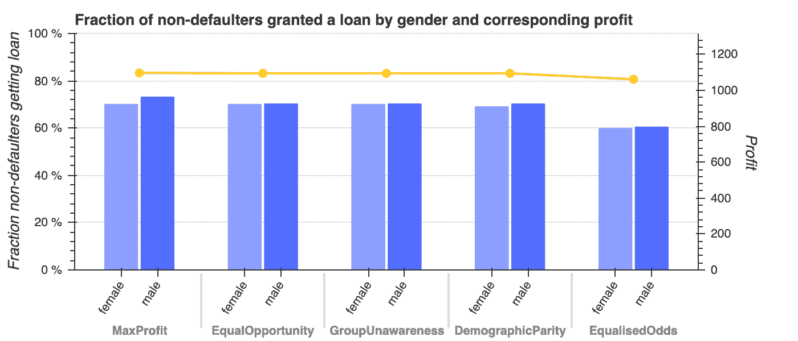
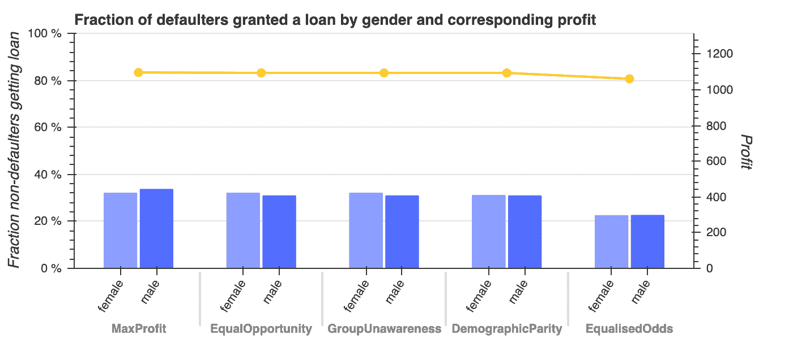
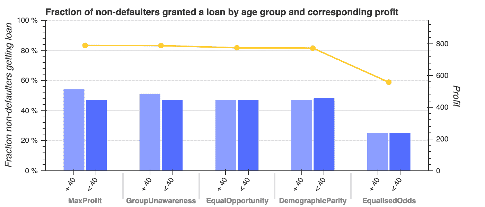
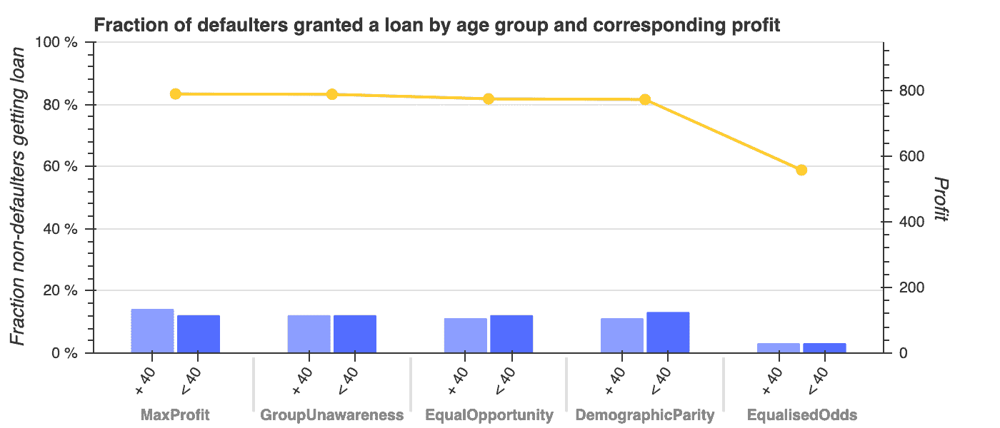

# 防止信贷模型中的歧视性结果

> 原文：<https://towardsdatascience.com/preventing-discriminatory-outcomes-in-credit-models-39e1c6540353?source=collection_archive---------27----------------------->

机器学习正在被部署来进行大规模决策，这可以强烈影响个人的生活。如果不考虑和分析这种情况，我们最终可能会构建出无法平等对待社会、甚至违反反歧视法的模型。

有几种算法干预来识别*不公平待遇*基于什么被认为是*公平。*在本文中，我们将通过一个案例研究来探讨这些方法，并解释它们的优点和局限性。

👩🏻‍💻你可以在这个 [Github 库中找到完整的 python 项目。](https://github.com/valeria-io/bias-in-credit-models)

❗️Warning::这篇文章包含了很多关于[混淆矩阵和相关指标](https://en.wikipedia.org/wiki/Confusion_matrix)的信息。

# 1)歧视的来源

## 尺寸

在机器学习中，我们的世界被测量并存储在数据集中。这种实践的最大挑战是它本质上是主观的。人类需要想出最佳的标签来对我们的世界进行分类，这可能会导致*选择偏差。*不仅目标变量可能对所有群体都不正确，而且收集的描述它的信息也不正确。

在技术方面，数据集也可能有*不正确、不完整的* *和/或* *过时的* *信息(阅读* [*美国各地的警察正在根据伪造的数据*](https://www.technologyreview.com/s/612957/predictive-policing-algorithms-ai-crime-dirty-data/) *)* 。同样重要的是要记住，随着世界的变化，描述世界的标签也在变化。这会导致对我们周围环境的过时描述。

最后，我们还有*宣扬历史偏见，*陈规定型观念和污名被保留为常态。

## 学问

模型从数据中学习，以检测模式并对其进行归纳，这可能包括数据差异、失真和偏差。即使我们没有明确提供敏感信息以避免偏见，也有几个*代理*可以近似它*(阅读* [*性格测试不合格美国工人*](https://www.bloomberg.com/opinion/articles/2018-01-18/personality-tests-are-failing-american-workers) *)。*

与此同时，随着更多相关信息的提供，模型工作得更好。少数群体默认处于劣势，因为他们通常没有多少数据可供模型学习*(阅读* [*亚马逊废弃的秘密人工智能招聘工具，该工具显示出对女性的偏见*](https://www.reuters.com/article/us-amazon-com-jobs-automation-insight/amazon-scraps-secret-ai-recruiting-tool-that-showed-bias-against-women-idUSKCN1MK08G) *)* 。

## *动作*

一个动作是来自一个模型的一个决策，比如批准一笔贷款或者显示一个广告。当一个模型被校准时，很可能会对不同的组产生不同的误差率。在这个群体中缺乏分析会导致不公平的待遇(我们将在后面的案例研究中修改这一点，另外，请阅读 ProPublica 的 [*机器偏见)。*](https://www.propublica.org/article/machine-bias-risk-assessments-in-criminal-sentencing)

## 反馈

一些模型从用户交互中获得“反馈”来改进模型。在这里，我们会遇到以*自我实现预测*形式出现的歧视问题。当数据有偏差时，不公平的预测往往会被证实。在这种情况下，人类将受到影响，以使他们的反应验证不公平的预测*(阅读* [*美国各地的警察正在训练基于伪造数据预测犯罪的人工智能*](https://www.technologyreview.com/s/612957/predictive-policing-algorithms-ai-crime-dirty-data/) *)* 。

# 2)算法干预

在本节中，我们将回顾五种不同的实践，这些实践被认为是在有监督的机器学习中测量不公平性的。

## 无知中的公平

当我们通过简单地排除受保护的类来运行模型时，就是这种情况。这个概念在确保公平性方面非常低效，因为有大量的*代理*可以预测这些属性。

## 人口均等

人口均等要求每个群体都有资格以相同的频率获得贷款。这也意味着决策应该独立于受保护的属性 a。这可以描述为下面的等式。

对于信贷模型，这可以解释为合格贷款的比例在集团的所有类别中都是相同的(正利率相等)。

## 均等机会

机会均等意味着在“有利的”结果中，正确分类的成员的比例，即 Y=1，在所有组中应该是相同的。例如，当一个条目被认为是“没有拖欠贷款”时，我们可以考虑“有利的”结果。对于中的所有受保护类，以下条件必须成立。这可以用下面的等式来表示:

这一概念通常会带来更好的效用，但与人口均等一样，它会用不太准确的假阳性来惩罚某个阶层。

在实践中，这需要两组的真实阳性率 A=1 和 A=0 相同。

## 均等几率

与机会均等一样，均等几率也要求“优势”结果中正确分类的成员比例在组内所有级别中相同。然而，它也要求“优势”结果中错误分类成员的比例在相应组的所有类别中相同。这可以用下面的公式表示:

这意味着不仅每组的真阳性率应该相同，假阳性率也应该相同。

# 3)案例研究

在这个案例研究中，我使用了 Bondora 的一本公共贷款书，这是一个位于爱沙尼亚的 P2P 借贷平台。我观察了两个不同的保护组:*性别*和*年龄*。

Bondora 向信用较差的客户提供贷款，违约率比传统银行高得多。这意味着收集的利息要高得多。该数据集的贷款金额平均约为 2100€，支付期限为 38 个月，利率为 26.30%。

对于传统银行来说，假阳性(对违约贷款进行错误分类)的成本比真阳性(对非违约贷款进行正确分类)的回报高很多倍。鉴于与银行相比，Bondora 收取的利率更高，出于说明的目的，我将假设报酬与成本之比在 1 比 2 时要小得多。这将用于找到最佳阈值，以最大化利润，同时满足每个算法干预的所有要求。

然后，我开发了一个分类模型，使用梯度增强决策树技术预测贷款是否可能被偿还。根据模型预测的结果，我分析了以下场景:

*   *利润最大化*对每一组采用不同的分类阈值，仅追求利润最大化。
*   *无意识公平*在实现利润最大化的同时，对所有群体使用相同的分类阈值。
*   *人口统计学奇偶校验*对每组应用不同的分类阈值，同时保持每组的阳性率相同。
*   *机会均等*对各组使用不同的分类阈值，但各组真实阳性率保持不变。
*   *等概率*对各组适用不同的分类阈值，但保持各组真阳性率和假阳性率相同。

## 简要数据探索

我选择了 Bondora 平台上发放给爱沙尼亚居民的所有贷款。从访问之日起，总共有 21，450 个条目。发放给女性的贷款占所有贷款的 39%，而发放给男性的贷款比例为 61%。40 岁以下的人获得贷款的比例为 63%，而 40 岁以上的人获得贷款的比例为 37%。

整体违约率约为 42%。如果我们按性别调查违约率，我们会发现两组的违约率几乎相同，都在 44%左右。如果我们研究一下年龄，40 岁以下的人违约率略高，约为 45%，而 40 岁以上的人违约率为 42%。

## ROC 和 AUC

我们现在来看看每组班级的 ROC 曲线。我们将在曲线中注意到的差异(例如男性对女性)是由于真阳性率和假阳性率的差异。较低的曲线，因此具有较低的 AUC 值，表明这些类别的预测不太准确。

如果我们观察上图中性别的 ROC 曲线，我们可以注意到女性的曲线在大多数情况下低于男性的曲线。因此，我们可以看到女性的 AUC 值为 0.760，略低于男性的 0.767。

如果我们看同样的图表，但这次是年龄组，我们可以注意到 40 岁以上的人的线通常在 40 岁以下的人的线之上。值得注意的是，在邦多拉的贷款记录中，40 岁以下人口的比例远远高于 40 岁以上人口的比例。这意味着描述 40 岁以下人群的其他特征可能是必要的。

对于每个组中确定的差异，我们可以开始考虑所使用的特征集合可能更能代表男性和/或 40 岁以上的人。该数据集可能偏向于男性，通常是年龄较大的男性，因为从历史上看，这些数据更易于研究和使用。

## 算法干预(性别)

当查看每个性别的真阳性率和假阳性率的细分时，我们可以注意到利润水平变化很小，除了*利润最大化*干预。在这种情况下，我们可以看到该模型对男性(73%)的阳性分类优于女性(70%)。然而，它也向将拖欠男性(33.6%)贷款的人提供了比女性(32%)略高的贷款比例。

当看利润时，这在*均等赔率*算法干预下明显下降。这是因为使用了更严格的阈值。女性和男性组的阈值分别为 0.56 和 0.55，而所有干预措施使用的平均阈值女性为 0.49，男性为 0.48。

## 算法干预(年龄组)

如果我们现在看看年龄组，我们可以看到，当我们为所有群体选择一个共同的阈值时，*群体不知情，*我们倾向于更好地将贷款分类给那些能够偿还 40 岁以上的人，而不是 40 岁以下的人。假阳性率保持不变。

在*人口统计均等*的情况下，40 岁以下的人(13%)比 40 岁以上的人(11%)收到无法偿还的贷款的风险略高。对*来说，利润最大化正好相反。*

另一方面，*均等机会*以及*均等几率*在组中每个类别的真阳性率和假阴性率之间的权衡方面提供了更好的平衡。

然而，由于非常严格的阈值导致较小的假阳性率，利润在*均衡赔率*中显著下降。女性使用的阈值为 0.83，男性为 0.81，而所有干预措施使用的平均阈值为女性 0.69，男性 0.68。

# 4)结论

在这篇文章中，我们修正了在监督机器学习中歧视是如何发生的。然后，我们研究了不同的算法干预，以确定受保护群体中的某些阶层是否受到了不公平的待遇。我们修正了每种干预的陷阱，并用一个具体的例子进行了评估，这个例子使用了 P2P 贷款平台 Bondora 的公共贷款书。

当使用梯度推进决策树分析基于性别和年龄的模型的结果时，我们可以立即注意到，当对每个类别(例如，女性/男性)使用不同的无限制阈值时，利润最大化。然而，各组间真阳性率的比例不同。

*均等机会*和*均等优势*在保护组中每一类的真阳性率和假阴性率之间的权衡方面提供了更好的平衡。然而，在*均等赔率*中，我们可以看到利润受到了重大影响。

这种简单的后处理分析具有不涉及修改复杂模型的好处。它可以用来衡量不公平性，帮助利益相关者在特定阶层受到不公平待遇时采取行动。它还鼓励确保以公平的方式收集信息，并确保用于描述目标变量的特征能够代表群体中的每个类别。

最后，这种分析并没有质疑模型的因果推理。使用的标准是简单的观察性的，只取决于预测因子、保护属性、特征和结果的联合分布。

# 我能看看代码吗？

我已经在 Github 上公开了我的代码。我希望听到您的反馈和改进建议🙌🏼。

# 参考

## 数据

邦多拉的贷款簿。上市时间:[https://www.bondora.com/en/public-reports](https://www.bondora.com/en/public-reports)【2018 年 8 月 18 日上市】

## 主要文献

[巴罗卡斯，s .，哈特，M. &纳拉亚南，a .，2018。公平和机器学习。可用时间:](http://paperpile.com/b/QWtfZD/7uIQ)【http://fairmlbook.org/】[【2018 . 8 . 29 访问】。](http://paperpile.com/b/QWtfZD/7uIQ)

[Dwork，c .等人，2012 年。通过意识实现公平。在*第三届理论计算机科学创新会议论文集*中。12 年的 ITCS。美国纽约州纽约市:美国计算机学会，第 214-226 页。](http://paperpile.com/b/QWtfZD/Qo5a)

[Hardt，m .等人，2016 年。监督学习中的机会均等。在*神经信息处理系统的进展*。第 3315-3323 页。](http://paperpile.com/b/QWtfZD/TmX3)

[彼得雷希博士，鲁杰里，南 T21【图里尼，女，2008 年。歧视感知数据挖掘。第 14 届 ACM SIGKDD 知识发现和数据挖掘国际会议论文集*。08 年的 KDD。美国纽约州纽约市:美国计算机学会，第 560-568 页。*](http://paperpile.com/b/QWtfZD/Pgwy)