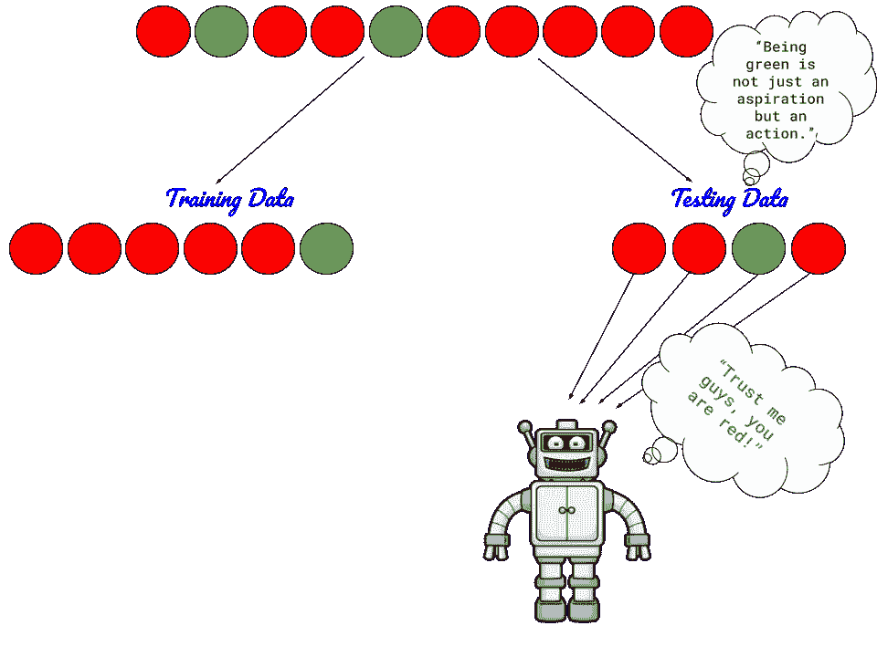
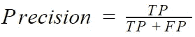
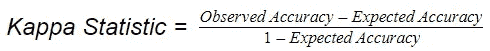

# 防止不平衡数据导致恶劣分类:卫星图像说明

> 原文：<https://towardsdatascience.com/preventing-imbalanced-data-from-leading-to-abominable-classification-a-satellite-imagery-d2fecdac7d93?source=collection_archive---------35----------------------->

## 使用卫星图像识别城市区域

## 不平衡的数据如何在分类中造成破坏，以及用于解决这一问题的技术的发展。

Photo by [Matthew Henry](https://unsplash.com/@matthewhenry?utm_source=unsplash&utm_medium=referral&utm_content=creditCopyText) on [Unsplash](https://unsplash.com/s/photos/data?utm_source=unsplash&utm_medium=referral&utm_content=creditCopyText)

# 不平衡数据:意味着什么？

当属于数据集的一个类的实例的出现是*海量*而属于其他类的实例是*百万分之一*的时候，我们称之为不平衡数据集。

> "一个好的榜样远胜于一句好的箴言."― [德怀特·l·穆迪](http://www.brainyquote.com/quotes/authors/d/dwight_l_moody.html)

话虽如此，不平衡数据的典型例子是将电子邮件分类为垃圾邮件或垃圾邮件、欺诈检测等。你也可以在 [Kaggle](https://www.kaggle.com/datasets) 上找到与之相关的数据集。

# 究竟是什么让我选择了卫星图像？

嗯，答案就藏在问题本身！让我引用一段话来解释一下:

> “当你看到卫星的数量、它们在做什么以及它们代表什么时，这真的是一个试图将世界掌控在你手中的愿景。”
> 
> — [特雷弗·帕格伦](https://www.brainyquote.com/authors/trevor-paglen-quotes)

这听起来一定有些哲学意味。下面是一些实用的例子:

> “卫星记录了我们看不到的光谱不同部分的数据。正是这些信息让卫星在观察植被健康等方面变得如此强大，找到可能表明石油储藏或某种可以开采的矿物储藏的不同地质类型。”
> 
> “科学家利用卫星追踪天气、绘制冰盖融化图、检测疾病、展示生态系统变化……这样的例子不胜枚举。我认为几乎每个科学领域都受益于或可能受益于卫星图像分析。”
> 
> 莎拉·帕尔卡

为了更深入地挖掘这一点，维基百科在此提供帮助。

**注:**如果你是遥感新手，那么[加拿大测绘与地球观测中心(或加拿大遥感中心)的遥感教程](https://www.nrcan.gc.ca/maps-tools-publications/satellite-imagery-air-photos/tutorial-fundamentals-remote-sensing/9309)是你的绝佳资源。

好吧！现在让我们动手对卫星图像进行分类。

# 意图:

这里的意图很简单，但却很有效。我们感兴趣的是从卫星图像中找出城市区域(标记为**建筑**，搁置图像的其余部分(标记为**非建筑**)。通过卫星图像监测城市地区有利于城市规划、可持续发展以及在灾害发生时快速更新城市地区地图。此外，它在研究城市扩张对生态系统和环境的影响方面也很突出。

# 数据:

我使用[2A 哨兵，1C 级数据](https://en.wikipedia.org/wiki/Sentinel-2)从[美国地质调查局(USGS)网站](https://earthexplorer.usgs.gov/)下载**位于印度北方邦西部的城市莫拉达巴德**作为我的**研究区域**。首先，[预处理](https://www.nrcan.gc.ca/maps-tools-publications/satellite-imagery-air-photos/remote-sensing-tutorials/image-interpretation-analysis/digital-image-processing/9279)卫星图像是必须的。然而，1C 级产品是大气顶部反射率数据，在进行正射校正的同时，还进行了辐射测量和几何校正。

**花絮:**预处理卫星图像，为机器学习估值器预处理数据(均值去除和方差缩放等。)就像粉笔和奶酪一样，也就是说，他们不一样。

四个[波段](https://www.nrcan.gc.ca/maps-tools-publications/satellite-imagery-air-photos/remote-sensing-tutorials/introduction/characteristics-images/14641)【2(蓝色)、3(绿色)、4(红色)、8(近红外)】以 10m [空间分辨率](https://www.nrcan.gc.ca/maps-tools-publications/satellite-imagery-air-photos/remote-sensing-tutorials/satellites-sensors/spatial-resolution-pixel-size-and-scale/9407)合成并裁剪到研究区域。使用研究区域的 4 波段-10m 合成和组合掩膜进行分类。

‘Copernicus Sentinel data [2018]’ . 4-Band [False Color Composite (FCC)](https://earthobservatory.nasa.gov/features/FalseColor) of the Study Area. Think of it as the input variable X

Built-up Mask of the Study Area. Think of it as the target variable y.

# 一个在不平衡数据上训练的模型差一张牌就有一副牌了！

考虑二进制分类问题，如果负类的实例数量比正类的实例数量多得多，那么模型将总是试图预测负类，以便达到高精度。但这确实会产生误导。

该场景可能如下所示:

让我们通过数据集深入了解一下这个场景。

我使用 [GDAL](https://pypi.org/project/GDAL/) python 包获取复合图的[栅格](https://en.wikipedia.org/wiki/Digital_image)波段作为数组，并将数据转换为 CSV 文件格式。然而，这不是强制性的，只是为了方便起见。

从条形图中可以明显看出，我们的数据集是高度不平衡的，81.86%的非构建类(负类)和仅 18.14%的构建类(正类)。

如果我们试图在这种数据上训练我们的模型，它将成为所谓的[准确性悖论](https://en.wikipedia.org/wiki/Accuracy_paradox)的牺牲品。更详细地说明这一点，我们的模型将试图揭示隐藏在准确性伪装下的类分布。

# 寻找灵丹妙药:

有几个博客是关于对抗不平衡班级的技术的。但是，我发现这个像一个光滑的迪斯科球一样闪闪发光。

我发现下面的技巧比其他的更有吸引力。

1.  使用流行的决策树算法，随机森林就是其中之一。
2.  通过使用 SMOTE(合成少数过采样技术)生成合成样本，对少数类进行过采样。

这篇博客的重点将是上面列出的两种技术中的第一种。

这个问题被分解为 3 个简单的步骤:

1.  使用 scikit-learn 的 **train_test_split** 辅助函数对数据分割应用随机森林分类器，并决定用于我们数据的性能指标。
2.  通过**分层 K 倍** **交叉验证**更进一步。
3.  使用**网格搜索交叉验证**调整模型的超参数。(将在本博客的后续部分全面讨论)。

## **第一步**

## 随机森林分类器:

对[决策树](https://en.wikipedia.org/wiki/Decision_tree)和[打包](https://en.wikipedia.org/wiki/Bootstrap_aggregating) (Bootstrap Aggregating)有一个概述是继续之前的先决条件。

通俗地说，[随机森林](https://en.wikipedia.org/wiki/Random_forest)是通常用于*【恰当】*对抗决策树的高方差(过拟合)的决策树集合。与 Bagging 不同，随机森林限制了在每次分裂时要评估的特征，即，在每次分裂时使用特征的随机子集，导致决策树高度不相关。由于这个原因，随机森林广泛用于分类和回归任务。

让我们跟上潮流，考虑随机森林分类器的默认参数，检查我们的模型如何执行。

## **等等，我们为什么要分割数据？**

当一个模型在整个输入数据上被训练时，被告知预测同样的输入数据，它表现得像一个天才。但它实际上已经成为一个谎言。当被告知要预测看不见的数据时，它将很难产生预期的结果。这种情况称为“过拟合”。为了防止这种情况，我们将数据分为训练集和测试集，其中模型不包含测试集，而是在训练集上进行训练。然后在测试集上评估模型的性能。

## 将数据分为 80%的训练集和 20%的测试集:

[train_test_split Documentation](https://scikit-learn.org/stable/modules/generated/sklearn.model_selection.train_test_split.html)

## **训练随机森林分类器(默认参数)并在测试集上预测结果:**

在我们在训练集上训练我们的模型之前，我们需要执行特征缩放以将我们的数据带入特定范围内，以便模型不会因其系数或权重的微小变化而偏向特定特征。值得注意的是，我们仅在训练集上安装了定标器，并使用它来转换训练集和测试集，以防止[数据泄漏](https://machinelearningmastery.com/data-leakage-machine-learning/)，即在训练模型时，测试集的信息不应泄漏。

[StandardScaler Documentation](https://scikit-learn.org/stable/modules/generated/sklearn.preprocessing.StandardScaler.html)

[Random Forest Classifier Documentation](https://scikit-learn.org/stable/modules/generated/sklearn.ensemble.RandomForestClassifier.html)

**查看森林的平均节点数和最大深度:**

**对森林中某棵树的外观感到好奇？**

**测试集上的预测:**

为了预测测试集中实例的类，我们使用 ***predict()*** 函数。

给定测试集中的一个实例，它可能落入的每个类的概率是多少，由***predict _ proba()***函数描述。

**注:**我们感兴趣的是预测正类，即累积类，因此我们将只关注先证者[:，1]部分。在博客接下来的部分，我们将用它来绘制精确召回曲线。

## 我们的模型达到预期了吗？

有几种方法可以评估我们的模型。在哪种情况下使用哪种评估指标确实让我们挠头！

**混淆矩阵:**

顾名思义，它描述了模型在预测类时所经历的混乱。

但是理解混乱矩阵本身往往是混乱的！让我们用最简单的方式来理解它。

在二进制分类问题中，混淆矩阵看起来像:

[Confusion Matrix Documentation](https://scikit-learn.org/stable/modules/generated/sklearn.metrics.confusion_matrix.html)

**真阳性(TP):** 其实——造，模特说——造，我说，“牛逼！”

**假阳性(FP):** 其实——非杜撰，模型说——杜撰，我说“你觉得正面的，其实是负面的！”

**假阴性(FN):** 实际上——是捏造的，模型说——不是捏造的，我说:“唉！这是有史以来最糟糕的预测。”

**真否定(TN):** 实际上——非虚构，模型说——非虚构，我说:“最后，你开始知道否定也是现实的事实！”

记住这个的诀窍是:

我们已经知道了 ***的实际值*** ，因此我们将它们归类为*和 ***假*** 。*

*我们评估由我们的模型预测的 的 ***结果，我们通常将“结果”分类为*和 ***负*** 。*****

***性能指标:***

***精度:***

> *“不要专注于错误的预测；只专注于正确的，你就会蓬勃发展。”*

*这就是准确性的含义。因此，对于不平衡的数据集，这是评估模型的最差方式。*

**

*[Accuracy Score Documentation](https://scikit-learn.org/stable/modules/generated/sklearn.metrics.accuracy_score.html)*

*占据重要位置的指标，尤其是在我们的案例中:*

***精度:***

*“精确”是指*非常精确的*。顾名思义，precision 描述了一个模型的*【精确】*。在所有的*预测阳性*中，有多少是我们真正感兴趣的，这就是精度。*

**

***回忆:***

*召回描述了模型的“完整性”。它从*实际阳性值*中计算出真实阳性值。*

**

***F1-得分:***

*f1-得分是精确度和召回率的调和平均值**和**。在评估一个模型时，要注意精度和召回的贡献是平衡的。*

**

*你可能会有问题。为什么只有“调和”的意思而没有“算术”或“几何”的意思？[这里有](https://medium.com/@srinivas.sateesh/have-you-asked-why-f1-score-is-a-harmonic-mean-hm-of-precision-and-recall-febc233ce247)的原因。*

*[Classification Report Documentation](https://scikit-learn.org/stable/modules/generated/sklearn.metrics.classification_report.html)*

**

***科恩的卡帕统计:***

*根据[维基百科](https://en.wikipedia.org/wiki/Cohen's_kappa)，科恩的卡帕测量了两个评分者之间的协议，他们各自将 *N* 个项目分类为 *C* 个互斥的类别。[这里](https://stats.stackexchange.com/questions/82162/cohens-kappa-in-plain-english)是对此的详细解释。它可以是介于-1 和 1 之间的值，其中-1 表示*不一致*，1 表示*完全一致*。Kappa 统计优选地用于不平衡等级分布的情况，因为它没有考虑多数等级的支配效应。*

*[Kappa Statistic Documentation](https://scikit-learn.org/stable/modules/generated/sklearn.metrics.cohen_kappa_score.html)*

*在我们的案例中，kappa 统计值约为 0.74，这意味着测试集和模型预测之间存在*基本一致*。这表明该模型表现非常好。*

****引擎盖下是怎么回事？****

*再次参考[此链接](https://stats.stackexchange.com/questions/82162/cohens-kappa-in-plain-english)。*

*在我们的例子中，混淆矩阵看起来像:*

**

*根据上面的混淆矩阵:*

*总实例数: 379080*

***实际:***

**组合实例总数:* 68373，*非组合实例总数:* 310707*

***预测:***

**组合实例总数:* 61625，*非组合实例总数:* 317455*

***观测精度:***

**

*在我们的例子中，观测精度= (51241 + 10384) / 379080 = 0.927*

***预期精度:***

**

*在我们的例子中，*

*预期精度(组合)=(68373 * 61625) / 379080 = 11115.03*

*同样的，*

*预期精度(非组合)=(310707 * 317455)/379080 = 260197.03*

****总预期精度:****

**

*在我们的例子中，总的预期精度=(11115.03+260197.03)/379080 = 0.7157*

***卡帕统计:***

**

*在我们的例子中，Kappa 统计量=(0.927–0.7157)/(1–0.7157)= 0.744*

*因此，在评估模型时，Kappa 统计明智地取消了非组合类的优势。*

***精确召回曲线:***

*精度-召回曲线是在 y 轴上具有精度并且在 x 轴上具有不同阈值的召回的图。曲线下面积(AUC)用于总结曲线。AUC 越大，我们的模型表现越好。这在我们的情况下非常有用，通常比 ROC 曲线更可取。在我关注的这个博客中，一切都解释得非常清楚。*

*[PR Curve Documentation](https://scikit-learn.org/stable/modules/generated/sklearn.metrics.precision_recall_curve.html)*

**

*AUC 是 0.865。这表明我们的模型在预测正类时表现良好。*

***对精度和召回的深入了解:***

**

*Image Source: [Wikipedia](https://en.wikipedia.org/wiki/Precision_and_recall)*

***精度:***

**

*用 TP 除分子和分母，我们得到:*

**

*我们知道精度的值在范围[0，1]内。*

*当比率(FP / TP)趋于无穷大时，精度将为 0，为此，FP 应该趋于无穷大(实际上，应该具有非常大的值)或者 TP 应该为 0。我们显然不想这样。*

*当比率(FP / TP)为 0 时，精度将为 1，因此 FP 应为 0。因此，这是最好的情况，因为当假阳性的数量减少时会产生高精度值。*

***回忆:***

**

*用 TP 除分子和分母，我们得到:*

**

*我们知道召回值在范围[0，1]内。*

*当比率(FN / TP)趋于无穷大时，召回将为 0，为此 FN 应该趋于无穷大(实际上应该具有非常大的值)或者 TP 应该为 0。我们显然不想这样。*

*当比率(FN / TP)为 0 时，召回将为 1，此时 FN 应为 0。我们知道，FN 是最坏的预测。因此，这是最好的情况，因为当假阴性的数量减少时会产生高召回值。*

***总而言之，***

> *当涉及到不平衡数据分类时，Kappa 统计和精确召回曲线价值连城。*

# ***第二步***

## ***交叉验证:***

*train_test_split 辅助函数不报告模型的概化能力，因为结果仅取决于一个特定的随机分割。*

*此外，当我们调整参数设置(超参数)直到得到好的结果时，会出现一个问题。这可能给模型一个关于测试数据的提示，并且模型可能再次过拟合。为了防止这种情况，我们需要一个“验证集”，在其上对训练好的模型进行验证，然后最终在测试数据上进行测试，以防止它被泄露。但是这将大大减少训练样本的数量。这就是交叉验证帮助我们的地方。它避免了对验证集的需要。参见 [scikit-learn 文档](https://scikit-learn.org/stable/modules/cross_validation.html)了解这一事实。*

*有几种交叉验证技术，可以应用于自己的数据。*

*我使用了[分层 K-fold](https://scikit-learn.org/stable/modules/generated/sklearn.model_selection.StratifiedKFold.html#sklearn.model_selection.StratifiedKFold) 交叉验证技术，以便在每个训练和验证 fold 中近似保留相对类频率。这对于阶级不平衡的情况很重要。*

***分层 K 倍交叉验证是如何工作的？***

*在分层的 K 折叠交叉验证中，数据集被分成 K 个大小大致相等的组(折叠),每个折叠的*保持原始数据集中的类别比例。*在这 K 个折叠中，K-1 个折叠用于训练模型，剩余的折叠用于验证模型。*

**

*Image source: [scikit-learn](https://scikit-learn.org/stable/modules/cross_validation.html#stratified-k-fold)*

***分层五重交叉验证:***

*[Stratified K-Fold Documentation](https://scikit-learn.org/stable/modules/generated/sklearn.model_selection.StratifiedKFold.html)*

***注意:**StratifiedKFold()中的参数“shuffle”被设置为“True ”,因为我们的数据不是任意的，因此，在我们分割数据之前，有必要对数据进行洗牌。当 *shuffle=True 时，*我们必须将“random_state”参数设置为一个随机数，这样可以防止代码执行多次时结果发生变化。*

***卡帕统计:***

*低标准偏差表明模型没有过度拟合。此外，Kappa 统计值(此处为 0.746)比之前的情况(0.744)有所改善，尽管幅度很小。*

***精确召回曲线:***

**

*在每一个折叠中，几乎相似的 kappa 统计值和几乎相似的 AUC 值证明我们的模型具有良好的泛化能力。*

# ***步骤 3(概述)***

## ***调节超参数:***

*超参数是其值在学习过程开始之前设置的参数，并且不由模型直接学习。*

*调整超参数有助于我们努力为特定模型找到理想的参数套件，从而获得最佳分数。*

*[GridSearchCV 和 RandomizedSearchCV](https://scikit-learn.org/stable/modules/grid_search.html#grid-search) 最常用于调整超参数。*

*在接下来的部分中，我们将尝试使用 GridSearchCV 来揭示有助于进一步提高所讨论的评估指标值的最佳超参数。*

*在我的 [GitHub 库](https://github.com/MitaliBhurani/Scouting-out-urban-areas-from-satellite-imagery)中找到完整的代码。*

*希望热心的读者喜欢它，并有他们的发言权！敬请关注即将到来的部分！*

# ***参考文献:***

*[1] [遥感教程——加拿大自然资源部加拿大测绘和地球观测中心(或加拿大遥感中心)。](https://www.nrcan.gc.ca/maps-tools-publications/satellite-imagery-air-photos/tutorial-fundamentals-remote-sensing/9309)*

*[2]'哥白尼哨兵数据[2018]' ( [从 USGS 网站](https://earthexplorer.usgs.gov/)下载)*

*[3] Thanh Noi，p；使用 Sentinel-2 影像进行土地覆盖分类的随机森林、k-最近邻和支持向量机分类器的比较。*传感器* **2018** ， *18* ，18。*

*[4]博客:[机器学习掌握](https://machinelearningmastery.com/)，[你有没有问过为什么 F1-Score 是精度和召回率的调和均值(HM)？](https://medium.com/@srinivas.sateesh/have-you-asked-why-f1-score-is-a-harmonic-mean-hm-of-precision-and-recall-febc233ce247)*