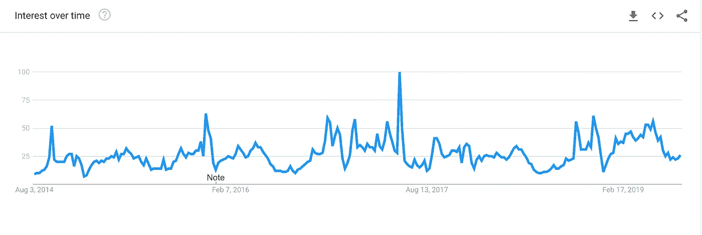
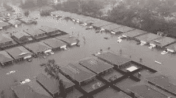

# 利用数据科学防止“气候末日”

> 原文：<https://towardsdatascience.com/preventing-the-climapocalypse-using-data-science-fe6ece4d349a?source=collection_archive---------25----------------------->

The “Climapocalypse” consuming the world in its hellacious fires. Image rights are with Shutterstock.

在最近的媒体报道中，气候变化的威胁据说已经变得如此之大，以至于据说它能够毁灭全人类，成为“气候末日”——数据并不支持这种说法。作为一名实践气候学家，我亲自处理和分析了大时间跨度(超过 100 年)和空间范围(全球范围)的数据集，尽管数据中有变化的信号，但一个物种甚至一个国家终结事件的可能性远非现实。气候变化肯定会给人类、我们的基础设施和我们的社会经济现状带来新的负担，但当我们与不熟悉科学的人交流其影响时，我们需要现实一些。当然，传达这一信息的唯一有意义的方式是使用我们现有的数据，即使这样也必须非常谨慎。

为了理解我这篇文章的来源，去谷歌搜索“气候启示录”，然后看看这个查询返回了多少结果。在撰写本文时，返回了超过 900 万个结果，突出显示的文章可能会因当前与天气或气候相关的“热门话题”趋势而异。如果你浏览谷歌[趋势](https://trends.google.com/trends/explore?date=today%205-y&geo=US&q=Climate%20Change)，你会发现每当有极端天气事件发生时，“气候变化”一词就会出现在搜索中。从非政治的角度来看，人们可以说这是自然的。一群龙卷风穿过一个地区，造成了数百万美元的损失——人们想知道它是如何发生的，在哪里发生的，什么时候会再次发生。与“气候启示录”相关的文章数量也在这段时间飙升，媒体机构发布了关于全球变暖的沉闷报告，其中数百万人将遭受此类事件频率增加的影响。

Google trends results for “climate change” over a 5 year time period. Image from Google.

以这种方式呈现信息不仅有歪曲事实的公然的政治动机，而且还忽略了数据及其信息以及围绕这些事件频率的大量科学研究。对于[龙卷风](https://www.sciencedirect.com/science/article/pii/S0169809512000968)、[干旱](https://www.nature.com/articles/nclimate2067)、[洪水引发降水事件](https://www.int-res.com/abstracts/cr/v47/n1-2/p123-138/)和[热带气旋](https://www.nature.com/articles/ngeo779)，研究表明，在全球变暖的情况下，这些事件将变得不那么频繁，但会更加强烈。虽然许多人听到这一点，并回忆起电影*后天*中过度夸张的风暴，但这种事件不太可能发生，即使发生，人类也能幸免于难。这不仅仅是一个过于乐观的科学家一厢情愿的想法，这可以在数据中观察到。1900 年，美国历史上最严重的飓风在德克萨斯州的加尔维斯顿登陆。死亡人数很多，财产损失也很大，但是人类并没有因为这次事件而从地球上完全消失。相对于今天，建筑法规要宽松得多，也不安全，据报道，加尔维斯顿飓风的强度接近哈维飓风。两次都是 4 级飓风。不同的是，加尔维斯顿飓风造成 6000 至 12000 人死亡，而哈维飓风造成 68 人死亡。生命损失无疑是悲剧性的，但这两次事件之间的急剧下降证明，我们对极端天气影响的理解已经改善了基础设施、灾害管理和应急响应。然而，有数百篇文章声称哈维是气候变化导致的天气导致人类灭亡的开始，这与事实相差甚远。

Aftermath of the Galveston Hurricane on the left and Hurricane Harvey on the right. Images from Google.

从数据科学的角度来看，特征工程、人工智能和计算方法的进步为我们提供了分析气候数据的新方法。异常值分析、宁滨、k-均值、相关矩阵甚至线性判别分析等特征工程技术使分析师和研究人员能够了解数据集中的哪些变量对感兴趣的现象贡献最大。这些信息可以用来改进预测未来的推理模型。对于人工智能算法来说，使用数据集的最佳特征至关重要。提供基于简单 sigmoid 函数的分类器温度数据(来自安装在铺砌的城市环境或阴影区域的气象站),可能会导致算法输出不准确和不精确。对于诸如卷积和递归神经网络的其他方法，这个问题将仍然存在，因为这些方法只能基于提供给它的数据来提供结果。水库计算是一项正在兴起的技术，可能会在气候学界得到更广泛的应用。它结合了最好的大数据技术和机器学习，根据提供给它的信息来创建预测产品。所有这些方法都取决于提供给它的数据，而且我们的大多数数据确实支持全球变暖，但不支持气候末日，即使地球继续以目前的速度变暖。

如今从事气候学或任何自然科学都很有趣。我们从该领域的前辈那里得到的大多数指导或建议都支持使用数据和以前的文献来开发关于该领域的新见解。然而，如果你在一个使用大量来自仪器仪表的数据的领域，你也可能发展自己成为一名数据科学家——或者你应该这样。气候学的某些方面将比以往任何时候都需要更多的数据科学技能，而那些不了解这些技术的人可能会制作出糟糕的模型，从而不恰当地告知公众。理解数据以及如何操作数据是创建有用信息、推动该领域发展以及帮助社区建设更可持续、更环保的基础设施的必要组成部分。在不久的将来，也有必要揭穿夸张的事件，如“气候末日”。

参考

[1]哈罗德·布鲁克斯，“严重的雷暴和气候变化。”*大气研究*123(2013):129–138。

[2]川伯斯，凯文·e 等，“全球变暖和干旱的变化。”*自然气候变化* 4.1 (2014): 17。

[3]凯文·e·川伯斯，“随着气候变化的降水变化”气候研究 47.1–2(2011):123–138。

[4] Knutson，Thomas R .等，“热带气旋和气候变化”*自然地球科学* 3.3 (2010): 157。

[5] Mizuta，Ryo 等人，“60 公里全球和 20 公里区域大气模型超过 5000 年的总体未来气候模拟”*美国气象学会公报*98.7(2017):1383–1398。