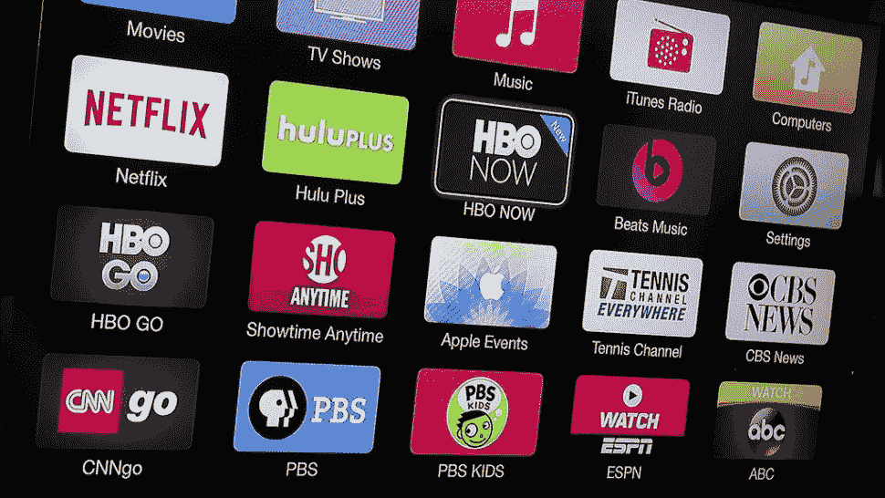
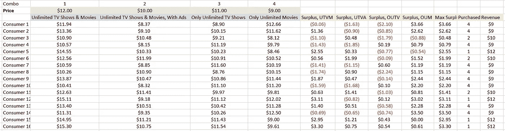
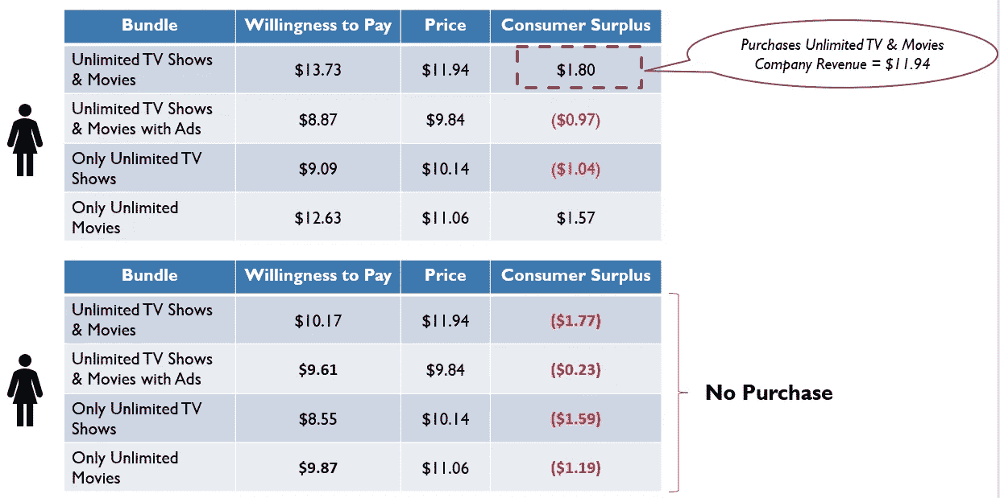
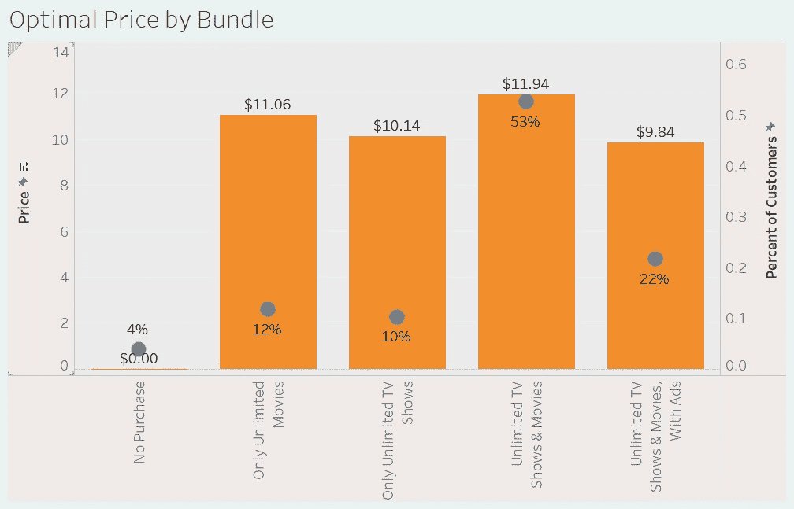

# 在线流媒体服务的价格优化

> 原文：<https://towardsdatascience.com/pricing-optimization-for-online-streaming-services-acbce206afbd?source=collection_archive---------26----------------------->

## 服务是如何选择价格的？

[Photo](https://www.google.com/url?sa=i&source=images&cd=&ved=2ahUKEwjVydPp3_TlAhWySt8KHfqWC4gQjRx6BAgBEAQ&url=https%3A%2F%2Fuccexpress.ie%2Fthe-streaming-wars-who-will-win-who-will-lose-who-even-cares%2F&psig=AOvVaw292PH_8W709Q4Couu1Xg1i&ust=1574200455159372)

最近推出了几种流媒体服务，每一种都有不同的价位和不同的选择。一些网站提供无限制的无广告访问，而其他网站则提供低成本的广告支持版本。一些人可以获得消费者更看重的高质量优质内容，而另一些人拥有高数量但质量较低的内容。

每项服务都设定了一个他们认为能最大化其目标的价格。对于网飞来说，目标可能是收入、利润和/或增长。对于苹果或亚马逊来说，内容是将客户锁定在他们的产品生态系统中的门户。对迪士尼来说，它产生了对商品、公园或其内容套件(ESPN、Hulu、Disney+等)的兴趣。).

定价策略在很大程度上取决于消费者愿意支付的价格、竞争的存在以及组织的目标。本文将关注消费者将支付的第一部分。

你会付多少钱？流媒体案例研究

假设我们为一家公司工作，该公司希望向市场推出一种新的流媒体产品。[最近的一项研究](https://www.hollywoodreporter.com/news/how-are-consumers-willing-pay-streaming-services-1180438)确定了消费者为一系列流媒体服务付费的意愿。4 个捆绑包及其价格范围是:

*   **无限电视节目&电影**:10-16 美元
*   **无限电视节目&带广告的电影**:8-12 美元
*   **仅限无限量电视节目**:8-12 美元
*   **仅限无限量电影**:8-13 美元

我们应该提供哪些捆绑包(如果有)？是否应该给消费者多种选择？我们应该卖广告还是不卖广告？使收益最大化的一组价格是多少？然后呢？

**定价优化:途径和方法**

使用这些数据，我为 1，000 名消费者创建了一个说明性数据集，这些消费者在上述价格范围之间随机均匀分布。

Example fictionalized data with non-optimal pricing

我们首先通过从捆绑包的价格中减去消费者的支付意愿，找到每个选项的消费者剩余。

把这想象成你脑海中有一个产品的最高价格(“我只会为电影票支付 15 美元”)，看着价格，并基于此决定你是否会去看电影。如果价格是 13 美元，你就去。你的“消费者剩余”是 2 美元，公司获得 13 美元的收入。如果价格是 18 美元，你不去，公司从你这里获得的收益是 0 美元。

如果所有四个捆绑包的剩余都是负的，消费者就不会购买。否则，他们将购买其支付意愿与捆绑包价格之间差额最大的捆绑包。

(这假设消费者的选择是理性的，他们可以评估不同的选择——这是许多经济模型中的一个基本假设。丹尼尔·卡内曼和阿莫斯·特沃斯基可能会有不同的看法。)

为每个客户选择产品捆绑包后，公司的收入就是每个捆绑包的相关价格。所有消费者的总收入代表了我们希望最大化的收入机会。

The top consumer purchases bundle 1; the bottom consumer makes no purchase

因此，我们创建了一个定价优化问题，目标是最大化总收入。可以建立并运行优化函数，该函数搜索不同的价格点，计算目标函数(例如，收入)，并选择使该函数最大化的跨服务的价格组合。

在示例数据集上解决这个问题，得出以下最优定价和购买(或不购买)每个捆绑包的消费者百分比:

Optimal Pricing and Percent of Purchases

总而言之，这 1000 名客户的总收入为 10，735 美元，其中超过一半的客户选择了无限制的电视节目和电影。在这四个选项中，只有 4%的潜在客户不会购买这些价格的产品。最常见的购买是无限制的电视节目和电影，消费者希望以近 20%的折扣购买同样的捆绑广告。

这些价格代表了在给定客户支付意愿的情况下，使客户收入最大化的数学上的最优数字。

**那么现在怎么办？**

我们有数字，但我们没有答案。这些价格在数学上是最优的，但不适合商业。你上一次看到 x.14 美元或 x.06 美元的订阅是什么时候？这些价格有利可图吗？我们的目标是收入、利润、增长，还是别的？

这些是将分析转化为行动的业务问题。

下一步是确定这些内容在这些价格下是否可以盈利(无论是立即还是一段时间后)。否则，就缺乏产品与市场的契合度——消费者对产品的重视程度不足以将其推向市场。然后，产品必须缩小规模或增加额外的功能，以达到供需平衡。

如果它通过了盈利能力测试，接下来要考虑的是消费者在内容之外看重什么。一些消费者会为标准高清内容支付更多费用吗(如果会，支付多少费用)？获得多个同步流(即网飞家庭计划)是否有价值？

如果有其他有价值的功能，在无限制的电视和电影下面应该有多个子计划吗？这种“好-更好-最好”的模式在任何订阅计划中都很常见。

**结论**

这些价格应被视为一个基准，基于特定的业务目标，可以围绕该基准进行偏离。在市场上被视为优质产品的愿望可能会导致一些人牺牲收入，通过更高的价格来支持品牌资产。超越利润获取客户的欲望可能会导致更低的价格。

确定支付意愿(并相信人们会按照他们说的去做)是另一篇文章，本身也是一项具有挑战性的工作。然而，有了这些数据，大多数分析程序(Excel、R、Python)可以提供关于定价策略的第一层洞察力，用于推动更明智的决策和数据驱动的结果。

假设支付意愿与上述真实范围没有显著差异，市场上每种值得关注的流媒体服务的定价都说明了他们的战略:

*   苹果和迪士尼正在为客户获取定价
*   亚马逊(有免费的 Prime 视频)完全专注于留住 Prime 会员
*   HBO / Showtime 价格是一个优质产品
*   网飞价格既可接受，但必须平衡盈利能力
*   Hulu 正试图通过其灵活的无广告和有广告支持的版本来吸引各种各样的客户

撇开内容获取和管理费用不谈，服务的纯价格反映了他们在高层次上的业务目标。随着时间的推移，我将有兴趣监控低价格是否仍然存在(表明保留或增加硬件销售的相邻业务目标已经实现)，或者是否存在服务盈利变得至关重要的转折点，如果是，我们将在哪里看到价格。