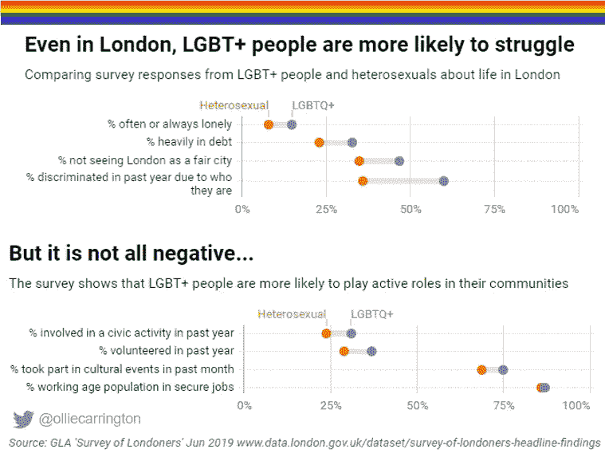
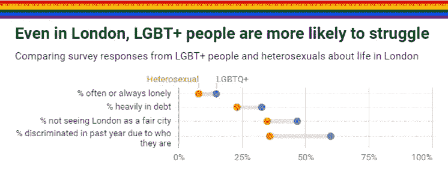
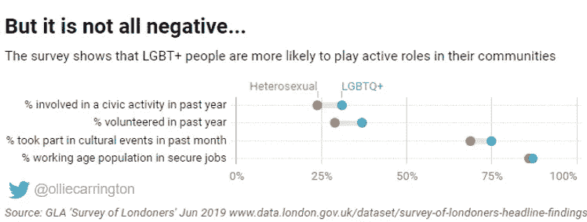

# 骄傲数据特辑:2019 年成为 LGBTQ 伦敦人

> 原文：<https://towardsdatascience.com/pride-data-special-being-an-lgbtq-londoner-in-2019-a886cbbb5645?source=collection_archive---------24----------------------->

## 伦敦刚刚庆祝了骄傲，但数据能告诉我们关于异性恋者和 LGBTQ 伦敦人的不同观点的什么？

英国被评为“同性恋友好”国家，在 ILGA-Europe 的排名中，英国在 49 个欧洲国家中排名第九，在 T2 斯巴达克斯同性恋旅游的世界指数中排名第 16。在英国，伦敦拥有最大的 LGBTQ 社区，并经常被视为比布莱顿和曼彻斯特更先进的城市。

但是 LGBTQ 社区成员的生活经历可以讲述一个不同的故事。仇恨犯罪的报道越来越多，最近的一份[石墙](https://www.stonewall.org.uk/sites/default/files/lgbt_in_britain_hate_crime.pdf)报告发现，伦敦 25%的 LGBT 群体经历过骚扰或攻击。

我使用了 Pride 发布前几天发布的一项调查的结果来创建这个简单的图表。直观的展现了 LGBTQ 和异性恋伦敦人的不同体验和看法。为了更详细地查看结果，我将图表一分为二。

## 首先，坏消息是…

> 如果你是伦敦的 LGBTQ，你更有可能孤独、负债并面临歧视

图表显示，LGBTQ 人群感到经常孤独或总是孤独的可能性几乎是异性恋人群的两倍(15%比 8%)。这一比例在残疾人和长期失业者中更高。

三分之一的 LGBTQ 受访者有沉重的债务负担——甚至高于失业者，但略低于穆斯林和残疾人。几乎一半的 LGBTQ 人群，略少于混血人群，不认为伦敦是一个公平的城市(47%)。

最可悲的是，也是伦敦市需要走多远的一个迹象是，在过去 12 个月中，60%的人受到过歧视，远高于异性恋者(36%)的经历，也远高于特定种族的残疾人。

## 伦敦的 LGBTQ 远不止是负面的

> 伦敦的 LGBTQ 人群更有可能融入他们的社区

对于了解 LGBTQ 问题的人来说，负面的结果并不令人惊讶，但对我来说，结果也有些令人惊讶。

他们是第二个最有可能志愿参加竞选等公民活动或参加文化活动的群体(在这三种情况下，仅次于犹太人，分别为 44%、40%和 87%)。

上图中没有的一个发现是，LGBTQ 群体更有可能一天查看几次社交媒体。最后，在调查中，处于工作年龄的 LGBTQ 伦敦人与异性恋者一样有可能找到稳定的工作，尽管他们有被歧视的经历。

许多曾经抗议镇压的年度骄傲游行现在已经成为庆祝活动，但正如调查结果以及大量其他研究发现所示，伦敦 LGBTQ 人群仍然更有可能挣扎。

## 我如何创建我的数据，即？

我使用 [datawrapper.de](https://www.datawrapper.de/) 创建了我的范围曲线图，创建了两个不同的图表以使信息更清晰，并通过一些额外的设计将它们固定在一起。

我下载了伦敦人的[调查结果，这是伦敦市长委托的一个强大的研究项目，包括许多不同人口统计和群体的数据。](https://data.london.gov.uk/dataset/survey-of-londoners-headline-findings)

该调查的样本量超过 6000 人，其中约 3800 人声明了自己的性取向，其中 9%的人被认定为 LGBT+。没有足够高的样本来单独关注有跨性别经历的人——一群在社会中受到高度歧视的人。

喜欢你看到的吗？在 Twitter 上关注我的骄傲#dataviz:

奥利弗·卡林顿