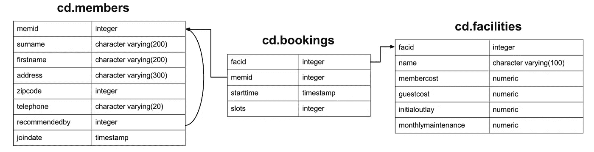
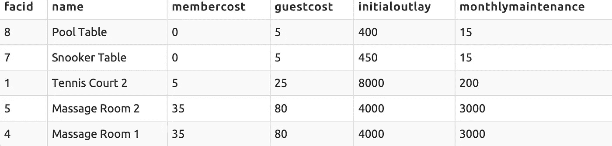

# 主键和分组依据——简单的 SQL 调查

> 原文：<https://towardsdatascience.com/primary-keys-and-group-bys-a-brief-sql-investigation-e0c3a8b20a6e?source=collection_archive---------19----------------------->

## 探索 SQL 主键和“Group By”语句之间交互的复杂性

今天一个熟人问了我一个有趣的 SQL 问题，但不是典型的查询意义上的；他的问题更多地围绕着对 SQL 底层框架的理解。以下是背景:

# 1.问题是

该练习来自此 [PostgreSQL 练习页面](https://pgexercises.com/questions/aggregates/payback.html)，其模式如下:



网站询问的 SQL 问题并不重要，但他们公布的解决方案是这样的:

```
**SELECT**  facs.name **AS** name,
 facs.initialoutlay/((sum(
 **CASE
**  **WHEN** memid = 0 
  **THEN** slots * facs.guestcost
 **ELSE** slots * membercost
 **END**)/3) - facs.monthlymaintenance) **AS** months  
**FROM** cd.bookings bks  
**INNER JOIN** cd.facilities facs   
 **ON** bks.facid = facs.facid  
**GROUP BY** facs.facid 
**ORDER BY** name;
```

我的朋友尝试将线路`**GROUP BY** facs.facid`切换到`**GROUP BY** facs.name`，这中断了查询，并显示消息:

```
column "facs.initialoutlay" must appear in the GROUP BY clause or be used in an aggregate function
```

我朋友问的问题是:

> 为什么上面的查询不适用于交换的行，即使**两列对于每一行都是唯一的？**

如果你知道答案，恭喜你，你应该回答我贴在最后的问题！如果你想跳到答案，请滚动到本文的“答案”部分。不然我们就进入解决这个问题的思维过程吧！

# 2.方法

首先，让我们检查一下显而易见的问题——这些列真的是惟一的吗？我们的查询(`name, facid, initialoutlay, monthlymaintenance`)中使用的列有多种组合吗？为了检查这一点，我们在`facilities` 表中查看这些列的不同组合。

```
**SELECT DISTINCT** facs.name as name, facs.facid, facs.initialoutlay, facs.monthlymaintenance
    **FROM** cd.bookings bks
    **INNER JOIN** cd.facilities facs
        **ON** bks.facid = facs.facid
**ORDER BY** facid;Output:╔═════════════════╦═══════╦═══════════════╦════════════════════╗
║      name       ║ facid ║ initialoutlay ║ monthlymaintenance ║
╠═════════════════╬═══════╬═══════════════╬════════════════════╣
║ Tennis Court 1  ║     0 ║         10000 ║                200 ║
║ Tennis Court 2  ║     1 ║          8000 ║                200 ║
║ Badminton Court ║     2 ║          4000 ║                 50 ║
║ Table Tennis    ║     3 ║           320 ║                 10 ║
║ Massage Room 1  ║     4 ║          4000 ║               3000 ║
║ Massage Room 2  ║     5 ║          4000 ║               3000 ║
║ Squash Court    ║     6 ║          5000 ║                 80 ║
║ Snooker Table   ║     7 ║           450 ║                 15 ║
║ Pool Table      ║     8 ║           400 ║                 15 ║
╚═════════════════╩═══════╩═══════════════╩════════════════════╝
```

`Name`和`facid`对于每一行都是唯一的，并且 1 对 1，每一对只有一个`initialoutlay`和`monthlymaintenance`值。直观地说，按这两列中的任何一列分组在功能上应该等同于按另一列分组。那么为什么按`name`分组对这个查询不起作用呢？

# 3.主键

如果你熟悉 SQL，你可能会有直觉，这是一个**主键**问题。对于那些不知道的人来说，**主键是唯一标识表中每一行的值，**并且对于一行来说它永远不能为“NULL”。但是我们如何找到一个表的指定主键呢？

快速的谷歌搜索会给我们以下来自 [PostgreSQL wiki](https://wiki.postgresql.org/wiki/Retrieve_primary_key_columns) 的代码。在网站的查询部分运行该命令会得到以下结果:

```
**SELECT** a.attname, format_type(a.atttypid, a.atttypmod) **AS** data_type
**FROM**   pg_index i
**JOIN**   pg_attribute a **ON** a.attrelid = i.indrelid
                     **AND** a.attnum = ANY(i.indkey)
**WHERE**  i.indrelid = 'cd.facilities'::regclass
**AND**    i.indisprimary;Output:╔═════════╦═══════════╗
║ attname ║ data_type ║
╠═════════╬═══════════╣
║ facid   ║ integer   ║
╚═════════╩═══════════╝
```

所以`facid`是`facilities`表的主键！现在我们已经确认了可能的原因，但是什么原因使得通过主键分组可以像我们对`facs.initialoutlay`和`facs.monthlymaintenance`所做的那样，加入没有聚合函数的列呢？

```
**SELECT**  facs.name **AS** name,
 facs.initialoutlay/((sum(        /* <=========== */
 **CASE
**  **WHEN** memid = 0 
  **THEN** slots * facs.guestcost
 **ELSE** slots * membercost
 **END**)/3) - facs.monthlymaintenance) **AS** months /* <=========== */
**FROM** cd.bookings bks  
**INNER JOIN** cd.facilities facs   
 **ON** bks.facid = facs.facid  
**GROUP BY** facs.facid 
**ORDER BY** name;/* Shouldn't these two columns be inside of an aggregation? */
```

为了回答这个问题，我们看一下 [PostgreSQL 帮助文档](https://www.postgresql.org/docs/current/sql-select.html#SQL-GROUPBY)，专门针对`GROUP BY`:

> 当`GROUP BY`存在或任何集合函数存在时，`SELECT`列表表达式引用未分组的列是无效的，除非在集合函数内或当未分组的列在功能上依赖于分组的列时，因为否则对于未分组的列将有不止一个可能的值返回。**如果分组列(或其子集)是包含未分组列的表的主键**，则存在函数依赖。

正如[栈溢出用户 Tony L.](https://stackoverflow.com/questions/3913620/get-all-table-names-of-a-particular-database-by-sql-query) 所说:

> 按主键分组会在每个组中产生一条记录，这在逻辑上等同于根本不分组/按所有列分组，因此我们可以选择所有其他列。

本质上，这意味着按表的主键分组不会导致该表的行发生变化，因此**如果我们按表的主键分组，我们可以调用该表的所有列，而不使用聚合函数**。

让我们重申一下:**假设我们正在查看一个表，按其主键分组与按所有内容分组是一样的，这与根本不分组是一样的** —这些方法中的每一种都将导致每行一个组。一旦你明白了这一点，你就明白了这个问题的症结所在。

因此，类似这样的查询可以工作:

```
**1\. Group by everything:****SELECT** *
**FROM** cd.facilities f
**GROUP BY** facid, name, membercost, guestcost, initialoutlay, monthlymaintenance
**LIMIT** 5OUTPUT:
```



其功能上等同于

```
**2\. Don't group by anything****SELECT** * 
**FROM** cd.facilities f
**LIMIT 5**and **3\. Group by primary key but don't aggregate****SELECT** * 
**FROM** cd.facilities f
**GROUP BY** facid
**LIMIT 5**
```

这些都输出相同的值！现在我们有了解决方案。

# 3.答案

第一个查询有效的原因很简单，那就是`facid`是主键，而`name` 不是。尽管它们对于每一行都是唯一的，但是表`facilities` 是用`facid`作为主键创建的，因此当在上面提到的 group by 中使用时，它得到了特殊的处理。

他们发布的一些替代解决方案如下:

```
**1\. Group by name then aggregate everything else****SELECT** facs.name as name,
 **AVG(**facs.initialoutlay)/((sum(case
   when memid = 0 then slots * facs.guestcost
   else slots * membercost
  end)/3) - **AVG**(facs.monthlymaintenance) as months
 **FROM** cd.bookings bks
 **INNER JOIN** cd.facilities facs
  **ON** bks.facid = facs.facid
 **GROUP BY** facs.name
**ORDER BY** name;Why this works:
Because *facs.name* is unique to each row in the *facilities* table just as *facid* was, we group by *facs.name* then add *AVG* calls around previously unaggregated *facilities* columns.**2\. Group by all facility columns used in the select statement****SELECT**  facs.name as name,
 facs.initialoutlay/((sum(case
   when memid = 0 then slots * facs.guestcost
   else slots * membercost
  end)/3) - facs.monthlymaintenance) as months
 from cd.bookings bks
 **INNER JOIN** cd.facilities facs
  **ON** bks.facid = facs.facid
 **GROUP BY** facs.name, facs.initialoutlay, facs.guestcost,     
   facs.monthlymaintenance 
**ORDER BY** name;Why this works:
This includes all the values used in the SELECT statement in the GROUP BY, which is the normal GROUP BY logic and syntax.
```

# 4.附加问题

主要问题到此结束，但是如果您有兴趣探索更多的怪癖，我在解决张贴的问题时遇到了以下问题。如果你们中的任何人知道为什么，请随时联系我或留下评论！

```
/* This works (manually lists all columns in the group by)*/**SELECT** *
**FROM** cd.facilities f
**GROUP BY** facid, name, membercost, guestcost, initialoutlay, monthlymaintenance
**LIMIT** 5/* This does not (selecting all columns using f.*) */**SELECT** *
**FROM** cd.facilities f
**GROUP BY** f.*
**LIMIT** 5
```

感谢阅读，希望这篇文章对你有所帮助！随时查看我的其他教程，并在未来发布新的教程！