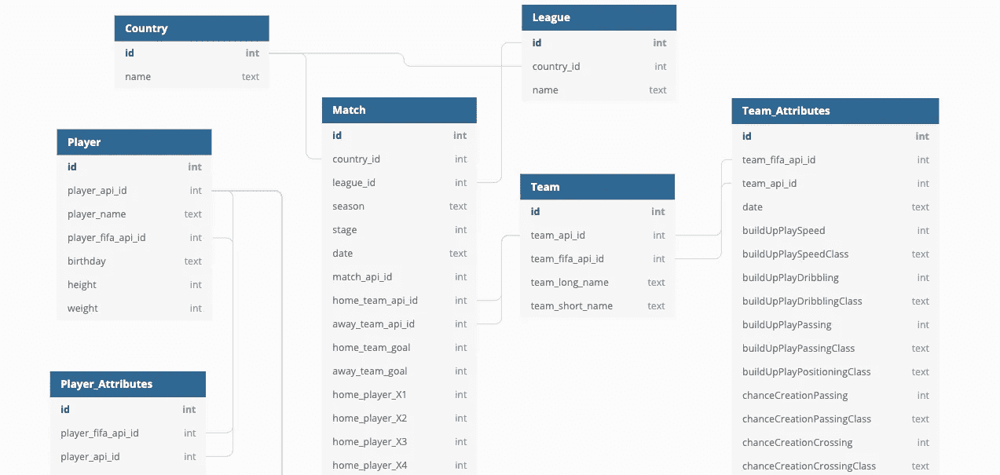

# 使用数据集时的主键、唯一键、外键和分组

> 原文：<https://towardsdatascience.com/primary-unique-and-foreign-keys-and-grouping-when-working-with-data-sets-c4a7db3051a6?source=collection_archive---------25----------------------->

分析任何数据集的一项关键技能是知道如何有效地对数据子集进行分组。在 SQL 数据库的情况下，您经常需要不同的索引来唯一地标识各自表中的各种元素。在最近的一个涉及欧洲足球数据库的项目中，我有机会进一步研究主键、唯一键和外键之间的区别。我可以练习根据外键拆分一些分组，以便进一步分析。接下来是通过我的 [pairwork](https://github.com/harrisonhardin/Project03) 项目的视角对所有类型的数据库键和一些分组技术的教程。

首先，我将谈谈上面提到的三种关键类型的区别。当您需要对数据进行分组以进行某种分析时，记住一些关于数据库键性质的事情是很重要的。在清理数据以使其具有延展性的过程中，首先要做的事情之一是检查缺失的值，并以适当的方式处理这些值。如果您曾经使用过数据集中的主键，重要的是要认识到缺失值(通常以 Null 或 NaN 形式出现，表示不是数字)不是您必须担心的键本身。对于外键来说也是如此，因为外键只是主键，它们在一个表中被引用，而不是它们所在的表。每个表只能有一个主键，但是可以有多个外键和唯一键。唯一键允许有一个缺失值，但不能超过这个值。对于缺失值和其他类型的值来说都是如此:之所以称之为“唯一”正是因为每个值都必须是不同的。所有这些都是为了说明，当您的数据分组需要一个键时，对缺失值的清理可以忽略不计。您最多需要处理一条缺失的数据，而且这只是在您使用的键类型是惟一键的情况下。

在这个项目中，我进行分析的一个方向涉及使用外键对主队和客场队的比赛进行分组，尽管我最终只需要主队的比赛，因为我对查看主场胜利与所有其他比赛结果类型(包括客场胜利、主场失败、主场平局和客场平局)感兴趣。客场比赛的平行分组包含在下面的片段中，只是为了进一步加强这个概念，尽管它没有出现在我的分析中。

```
games_home = df.groupby(df.home_team_api_id) 
games_away = df.groupby(df.away_team_api_id) 
```

数据集的作者 Hugo Mathien 从 Kaggle 页面(链接到上面)的引用中揭示了这里使用的命名约定:

> “当你查看数据库时，你会注意到球员和比赛的外键与原始数据源相同。我已经把那些外键叫做‘API _ id’。”

API 是 Application Program Interface 的首字母缩写，在这种情况下，指的是他首先引用来创建数据集的那一部分的资源。另一个例子是类似于 [Dark Sky](https://darksky.net/dev) 的东西，一个允许你访问历史天气数据和预报的天气 API。在另一个基于团队的项目中，我将它与另一个不同的足球数据集结合使用，以预测比赛的结果，但让我们回到手头的例子。

一旦主队比赛被那个外键切分，我就用下面的代码得到各个队:

```
team_ids = list(games_home.groups.keys()) 
```

从那时起，我确保所提供的关于目标的数据是完整的，并且没有缺失的信息需要处理。然后，它开始计算和存储主场胜率。所有其他游戏结果都可以通过从 1:

```
#This returns 0 values that are missing for either columndf[['home_team_goal', 'away_team_goal']].isna().sum() #So I go on to calculate a new column for victories at homedf['HomeWin']=df.home_team_goal>df.away_team_goal#Loop through to obtain home wins by teamfor team in team_ids:         x=games_home.get_group(team)home_percentage=x.HomeWin.sum()/len(x.HomeWin) 
```

最终，我得出的结论并不令人震惊:在主场比赛在你获胜的机会上提供了统计上的显著优势。真正的价值在于练习使用大型 SQL 数据集、按外键分组以及使用 Python 函数内部的逻辑来获得洞察力。

当不处理键时(在更糟糕的情况下只有一个 NaN ),通常会有许多缺失值需要以最适合手头任务的方式来处理，无论是简单地删除它们，还是用平均值或可能的中值来替换它们。这取决于您正在执行的具体分析类型。如果有几个异常值，最好对空值进行中值替换。这就进入了关于插补水平的更深层次的讨论。有时，思考数据丢失的原因比匆忙替换数据更重要。尽管超出了本文的范围，但还有一种更微妙的方法可以使用，那就是多重插补。



Screenshot from a dbdiagram.io schema crawler of some of the tables in the Data Set and how they connect

我想谈的最后一点数据集知识是，如何通过分类数据进行分组，以便通过统计指标研究每个类别。让我们来看看我的项目中的一些注释代码:

```
#First, set up columns to see who won (same as above), and who lost or drewdf[‘AwayWin’]=df.away_team_goal>df.home_team_goal
df[‘Draw’]=df.home_team_goal==df.away_team_goal#Then, create a new categorydf['GameOutcomes']=df[['HomeWin', 'AwayWin', 'Draw']]#Group dataset by result of gamesgame_groups=df.groupby(df['GameOutcomes'])#Discover insights about the rest of the dataset, for example by looking at the mean:game_groups.mean()
```

这实际上是让你看到三个类别的平均值，主场胜利、主场失败(换句话说就是客场胜利)或平局，分组以显示它们如何影响比赛表中的其他变量。你可以看看你喜欢的球队在赛季中的平均胜率的变化，或者调查他们的控球率在胜场和平局中有什么不同(控球率是我上面截图中 home_player 列下面列出的一个指标)。应该注意的是，在我对主场优势的分析中，我将这段代码又向前推进了一步，将主场胜率及其补码添加到了每个球队的字典中，并转换了该字典，以使其成为自己的数据框架。这些可以在第一段链接的 GitHub 资源库中看到。

我的 [LinkedIn](https://www.linkedin.com/in/harrisonhardin/)

**咨询资源:**

[*https://stats . stack exchange . com/questions/143700/平均替代和中位替代哪个更好*](https://stats.stackexchange.com/questions/143700/which-is-better-replacement-by-mean-and-replacement-by-median)

[*https://coding sight . com/the-difference-before-primary-key-and-unique-key/*](https://codingsight.com/the-difference-between-primary-key-and-unique-key/)

[*https://www.youtube.com/watch?v=u9nftlpCdXQ*](https://www.youtube.com/watch?v=u9nftlpCdXQ)

还要特别感谢我的项目伙伴，乔。