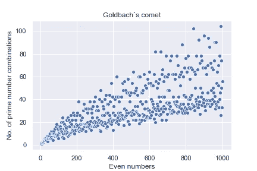

# 素数和哥德巴赫猜想可视化。

> 原文：<https://towardsdatascience.com/prime-numbers-and-goldbach-s-conjecture-visualization-60d1993a1424?source=collection_archive---------17----------------------->

从向日葵叶子上的图案到太阳光线的反射角度，数学无处不在。它仅仅是自然的语言。

不管你同意与否，质数是迄今为止最著名的数学系统中最独特的数字集合。这组数字帮助数学家引入了奇迹般的理论和悖论，显示了自然出现的数字之间的模式。

如果你是谢尔顿·库珀的粉丝，那么你肯定知道最酷的质数 73。正如我们在《生活大爆炸》第 73 集《外星寄生虫假说》中从他那里学到的，谢尔登解释道。“73 是第 21 个质数。它的镜像 37 是第 12 个，它的镜像 21 是 7 和 3 相乘的结果……在二进制中，73 是一个回文，1001001，反过来是 1001001。酷！不是吗？

德国数学家 g . f . b . Riemann(1826–1866)观察到素数的分布与 *Riemann Zeta 函数*的行为密切相关。作为千年问题之一，它在各个领域都有应用，可以揭开许多隐藏的秘密。

数学家们观察到质数能够衍生出数字系统中的模式，由此哥德巴赫的猜想确实能够吸引任何人去研究数学。

**偶数的哥德巴赫猜想:****哥德巴赫猜想**断言每一个大于 4 的偶数都是两个素数之和。猜想已经测试到 40000000000000。虽然每一个偶数都有一种或多种可能的写法，可以写成两个素数之和。

```
2+2=4
3+3=6
3+5=8
3+7=10
5+5=10
....
13+37=50
19+31=50
43+7=50
47+3=50
......
```

虽然看起来很简单，但它的证明一直困扰着一些非常聪明的人，至今已有 250 年了，仍然是个问题。迄今为止，还没有人发现一个不能用两个质数形成的更大的偶数。

这种模式可以用类似箭头的结构来表示。


The ends represent the prime numbers meeting at their respective sums.

有趣的是，随着偶数的增加，它通过质数组合形成的方式也在增加。偶数和用两个素数构成的方式数之间的关系被称为哥德巴赫彗星。



Visualization of Goldbach’s comet using matplotlib-python

从散点图中，我们可以注意到素数组合的数量随着数量的增加而增加，但没有证据表明这种模式是对还是错。许多努力证明这一点的大脑会从一开始就一无所知。你只是不知道从哪里开始。但是希望总是存在的，因为既然我们能够证明奇数的哥德巴赫猜想，我们也能够证明这个猜想。

YESS！！Harald Helfgott 在 2013 年证明了**哥德巴赫弱猜想**或奇数猜想。

**奇数哥德巴赫猜想:**断言*每一个大于 7 的奇数都可以表示为三个素数之和*。

```
1+3+5=9
1+3+7=11
1+5+7=13
5+5+7=17
5+7+7=19
....
```

[费马的房间](https://youtu.be/meE5fqX61KA)是最受欢迎的西班牙惊悚电影之一，讲述了四个数学家的故事，核心情节是证明哥德巴赫猜想。在我看来，如果你是一个数学狂人或益智爱好者，这是一部必看的电影。

听起来很有趣？然后拿起笔和纸，开始尝试..因为价值**百万美元**的解决方案值得一试。