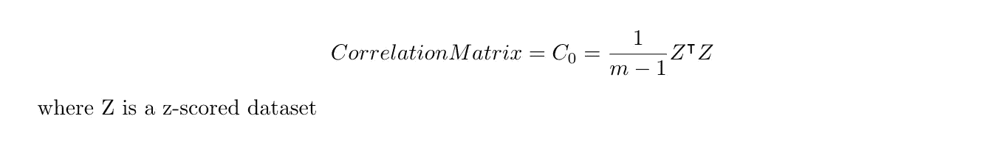

# 统计和机器学习视角下的主成分分析(上)

> 原文：<https://towardsdatascience.com/principal-component-analysis-ceb42ed04d77?source=collection_archive---------4----------------------->

[https://www.jpl.nasa.gov/images/technology/20150522/Iceberg20150522.jpg](https://www.jpl.nasa.gov/images/technology/20150522/Iceberg20150522.jpg)

复杂数据分析中的一个常见问题来自于大量的变量，这需要大量的内存和计算能力。这就是主成分分析(PCA)的用武之地。通过 [**特征提取**](https://en.wikipedia.org/wiki/Feature_extraction) 降低特征空间的维数是一种**技术。例如，如果我们有 10 个变量，在特征提取中，我们通过组合旧的 10 个变量来创建新的自变量。通过创建新的变量，看起来好像引入了更多的维度，但我们只从新创建的变量中按重要性顺序选择了几个变量。那么这些被选择的变量的数量就比我们开始时的少，这就是我们如何降低维数的。**

看待 PCA 有多种方式。在本文中，我将从统计学的角度讨论 PCA，本文的第二部分是机器学习的角度(最小误差公式和最大化特征值)，链接如下:[https://towardsdatascience . com/principal-component-analysis-the-machine-learning-perspective-part-2-a 2630 fa 3b 89e](/principal-component-analysis-the-machine-learning-perspective-part-2-a2630fa3b89e)。为了阅读第一部分和第二部分，熟悉以下一些内容会让本文更容易理解:[线性代数(矩阵、特征向量/特征值、对角化、正交性)和统计学/机器学习(标准化、方差、协方差、独立性、线性回归](https://www.amazon.com/Elementary-Algebra-Classics-Advanced-Mathematics/dp/013468947X))。

# PCA 统计观点

为了理解 PCA，我们可以从这本[线性代数教科书](https://www.amazon.com/Elementary-Algebra-Classics-Advanced-Mathematics/dp/013468947X)中的一个例子开始，其中作者从他的 14 名学生的荣誉微积分班上收集了一组测试数据。下面的四个变量是 ACT(全国测试的分数，范围为 1 到 36)、FinalExam(范围为 0 到 200 的期末考试分数)、QuizAvg(八个测验分数的平均值，每个分数的范围为 0 到 100)和 TestAvg(三个测试分数的平均值，每个分数的范围为 0 到 100)。

我们有所有这些考试分数，但有些分数是多余的，很难想象。但是，不能随便掉一些考试分数。这就是降维发挥作用的地方，在不损失太多信息的情况下，减少变量的数量。

这里的另一个问题是，很难解释这些考试分数，因为它们是基于不同的范围和尺度。变量，如上面的测试分数，在不同的尺度上或在一个共同的尺度上测量，有很大不同的范围，通常是标准化的，以引用相同的标准。

# **标准化**

**Z 评分**是一种用于标准化/规范化数据的常用方法:从每个值中减去数据的平均值，然后除以标准偏差。

***的意思是*** 被定义为

数据集 x 的**方差**为

计算数据方差的平均值和平方根后，即**标准差**:

现在，通过减去平均值并除以标准差(即方差的平方根),最终可以对数据进行 z 评分/归一化。

# 协方差/相关性

为了了解所有这些变量之间的关系，使用了协方差。协方差告诉你两个变量之间的线性关系:两个变量是如何密切相关的。

向量 x 和 y 的 ***样本协方差*** 定义为

然而，使用协方差的一个问题是它受测量单位的影响。例如，如果向量 x 以千克为单位，y 以英尺为单位，那么协方差现在是千克-英尺。为了使单位消失，使用了 ***样本相关性*** (向量)，它被定义为协方差除以标准偏差:

定义样本相关性(矩阵)的另一种方法是使用 z 得分数据，该数据已经除以标准差。

这是数据集的相关矩阵:

我们可以看到第三次考试成绩(小考平均分)和第一次考试成绩(ACT)的相关性最高，为 0.82780343。第二高的相关值显示在第一和第四:ACT 和 Test 平均值之间。因此，我们证实了我们之前亲眼所见，这些测试分数是相互关联的，其中一些是多余的。

现在我们将开始我们的主成分分析。为了提出新的维度，我们将经历两个过程:

1.  **数据集的转换:**定义新的变量替换现有的变量
2.  **数据集的选择:**衡量新变量代表原变量的程度。

以下是每一步的细节。

# ***变换步骤***

我们将从上面计算的相关矩阵开始。重要的是要看到，这个矩阵必须是对称的，因为它是由 Z 和 Z 的转置相乘得到的。也就是说，这里将使用对称矩阵的一个定理。[一个 n×n 矩阵 A 是对称的当且仅当存在一个由 A 的特征向量组成的正交基，在这种情况下，存在一个正交矩阵 P 和一个对角矩阵 D 使得 A = PDP_transpose](https://www.amazon.com/Elementary-Algebra-Classics-Advanced-Mathematics/dp/013468947X) 。

我们可以得到列为 A 的特征向量或特征值的相关矩阵和对角矩阵 D 的正交矩阵 P。

从这里开始，我们将通过执行与 P: **ZP** 的矩阵乘法来转换我们的原始 Z 得分数据

这组新数据的形状与原始数据集的形状没有任何不同。现在，我们已经成功地将原始数据转换为新数据，在下一步中，我们将降低原始数据集的维度。

# ***选择步骤***

现在，我们将从 **ZP** 中选择向量，以实际降低维度，但是我们如何知道哪些要保留，哪些要丢弃呢？将基于特征值做出决定。我们将以一种可读的格式重写 ZP，其中 ZP 的每个列向量表示为 y_i

**y1** 为**第一主成分**，定义为新的向量，其系数为最大特征值为 2.978867 的相关矩阵的特征向量。那么**第二主成分**就是 y2，因为它的系数对应的是第二大特征值 0.762946。

在这种情况下，最后两个特征值无关紧要，因为与前两个相比，它们不够大。因此，我们将选择特征向量为系数的 ZP 向量对应前两个最大的特征值，即 **y1** 和 **y2** 。这两个向量是我们的新向量，我们将把它们作为降维的结果。

现在问题来了，为什么我们要做 ZP 来选择一组新的向量？为什么 ZP 如此重要？这是因为 ZP 的协方差是对角矩阵。

这是为什么的证据(*这是前半段*最重要的部分):

# 为什么我们要把 Z 乘以 P？

这解释了我们将归一化数据 Z 乘以 p 的原因。ZP 的协方差是对角矩阵的事实表明，除了与自身相关的变量之外，变量之间没有线性关系。换句话说，我们创建的新变量之间没有关系，新变量彼此独立。**因此，我们已经成功地提出了一组新的数据集(转换后的数据集),它们之间没有任何相关性，我们可以根据方差选择变量，方差由特征值表示。**

现在让我们更多地讨论特征值/方差。这里重要的是原始数据集的总方差与转换后数据集的总方差相同。也就是说，*对角矩阵 D 的元素之和的元素之和就是 Z 得分的方差之和*。当 ZP 的协方差矩阵为 D 时，ZP 的每个向量代表变换数据的方差，并且通过选择对应于最高特征值的向量，方差被最大化。因此，**通过选择对应于最高特征值的向量，我们选择了新的变量，其具有被原始数据集的总方差分割的变换数据集的方差的高分数**。

# 从统计角度看主成分分析的结论

当用较少的新变量替换原始变量时，试图捕捉尽可能多的方差是统计学中的常见做法"[，以说明原始数据集中方差的高百分比。](https://www.amazon.com/Elementary-Algebra-Classics-Advanced-Mathematics/dp/013468947X)“这在直觉上是有意义的，因为当我们考虑降低数据集的维度时，我们希望丢弃相似的特征，但只保留最大不相似的特征。在这种情况下，我们可以看到，一些测试分数彼此高度相关，因此一些测试分数是冗余的。但是我们想从数学上理解为什么保持尽可能多的方差是有益的。这个问题的答案在机器学习视角的 PCA 中更容易看到，这将是本文的第 2 部分。

**参考文献:** 1。[https://www . stat . CMU . edu/~ cshalizi/uADA/12/lections/ch18 . pdf](https://www.stat.cmu.edu/~cshalizi/uADA/12/lectures/ch18.pdf)2。[https://towards data science . com/a-一站式主成分分析-5582fb7e0a9c](/a-one-stop-shop-for-principal-component-analysis-5582fb7e0a9c) ，3 .[https://www . Amazon . com/Elementary-Algebra-Classics-Advanced-Mathematics/DP/013468947 x](https://www.amazon.com/Elementary-Algebra-Classics-Advanced-Mathematics/dp/013468947X)4 .[http://www.cs.columbia.edu/~verma/teaching.html](http://www.cs.columbia.edu/~verma/teaching.html)