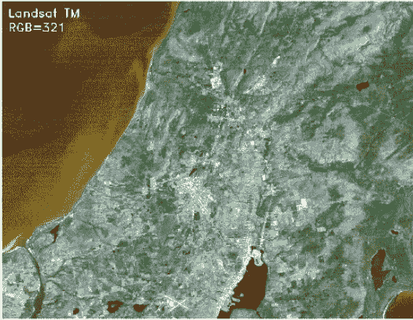
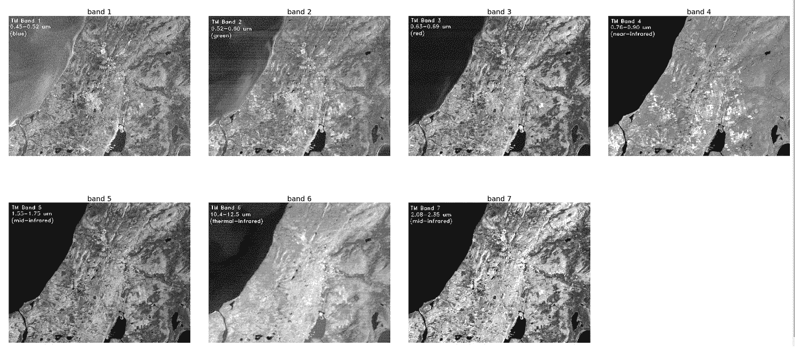
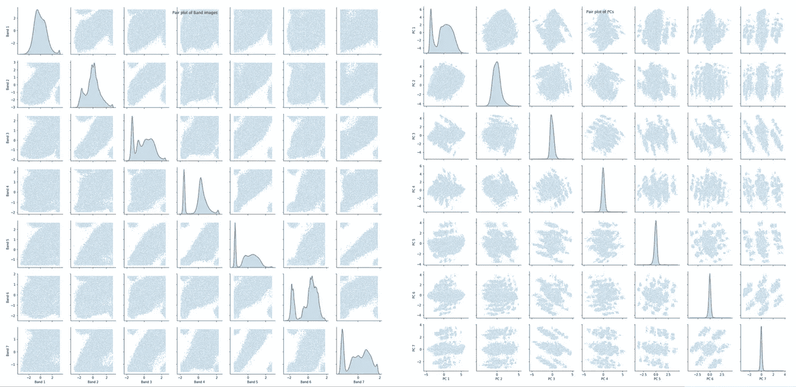
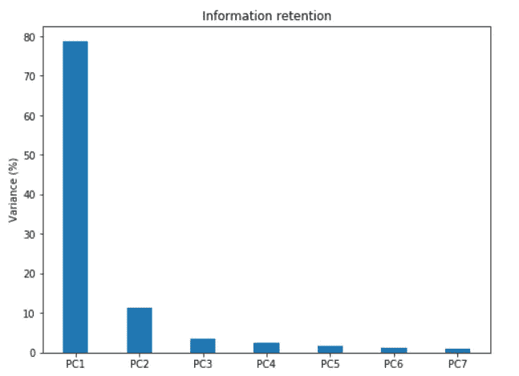

# 主成分分析:通过图像可视化的深入理解

> 原文：<https://towardsdatascience.com/principal-component-analysis-in-depth-understanding-through-image-visualization-892922f77d9f?source=collection_archive---------1----------------------->

## 用 Python 从头开始实现 PCA

Photo by [Ben White](https://unsplash.com/@benwhitephotography?utm_source=medium&utm_medium=referral) on [Unsplash](https://unsplash.com?utm_source=medium&utm_medium=referral)

# 主成分分析导论

主成分分析(PCA)是在机器学习应用中使用的一种流行的降维技术。PCA 通过对大量变量进行某种变换，将它们的信息压缩成较少的变量。转换的应用方式是将线性相关变量转换为不相关变量。相关性告诉我们，信息存在冗余，如果这种冗余可以减少，那么信息就可以被压缩。例如，如果变量集中有两个高度相关的变量，那么，我们保留这两个变量不会获得任何额外的信息，因为一个变量可以近似表示为另一个变量的线性组合。在这种情况下，PCA 通过原始轴的平移和旋转以及将数据投影到新轴上，将第二变量的方差转移到第一变量上。使用特征值和特征向量来确定投影方向。因此，前几个变换特征(称为主成分)富含信息，而最后几个特征主要包含噪声，其中的信息可以忽略不计。这种可转移性允许我们保留最初的几个主成分，从而以最小的信息损失显著减少变量的数量。

本文更侧重于在图像数据上实际的一步一步的 PCA 实现，而不是理论上的解释，因为这方面已经有大量的资料。选择了图像数据而不是表格数据，以便读者可以通过图像可视化更好地理解 PCA 的工作。从技术上讲，图像是像素矩阵，其亮度代表该像素内表面特征的反射率。对于 8 位整数图像，反射系数值的范围是从 0 到 255。因此，反射率为零的像素显示为黑色，值为 255 的像素显示为纯白色，值介于两者之间的像素显示为灰色调。本教程使用了在印度沿海地区拍摄的 Landsat TM 卫星图像。图像被调整到较小的比例，以减少 CPU 的计算负荷。这组图像由 7 个波段的图像组成，涵盖电磁波谱的蓝、绿、红、近红外(NIR)和中红外(MIR)范围。对于有兴趣自己尝试这些步骤的读者，请参考这个包含输入数据集和这里使用的 Ipython 代码的 [Github 存储库](https://github.com/Skumarr53/Principal-Component-Analysis-testing-on-Image-data)。让我们开始吧，不要再废话了。

# 1.加载模块和图像数据

第一步是导入所需的库并加载数据。为了便于访问和处理，波段图像以 850 x 1100 x 7(高 x 宽 x 波段数)的 3d numpy 阵列形式堆叠。下面显示的彩色图像是红色、绿色和蓝色(RGB)波段图像的合成，再现了我们看到的相同视图。瞥一眼现场。

图像场景包含各种表面要素，例如水、建筑区、森林和农田。

# 2.数据探索

让我们看看不同特征的单个波段图像的反射率，并尝试了解波段图像中的特征。

如果我们观察图像，所有波段都捕捉到了一个或多个表面特征，并且每个特征在多个波段中也捕捉得很好。例如，在波段 2(绿色)和波段 4(近红外)图像中，农田很容易与其他地表特征区分开来，但在其他图像中则不然。因此，波段之间存在信息冗余，这意味着波段之间的反射率有些相关。这给了我们在它们身上测试 PCA 的好机会。

# 3.数据标准化

在应用 PCA 之前，我们必须通过标准化将我们的数据转换成一种通用格式。这样做的目的是确保变量在内部彼此一致，而不管它们是什么类型。例如，如果数据集有两个变量，温度以摄氏度为单位，降雨量以厘米为单位。由于变量范围和单位不同，不建议使用不同的变量，否则，数量级不同的变量可能会导致模型偏向某些变量。标准化是通过减去平均值使变量居中，然后通过除以标准偏差使它们达到一个共同的范围。由于我们正在处理的变量(波段图像)是相似的，并且具有相同的范围，标准化是不必要的，但仍然是一个很好的应用实践。

我们的变量是图像二维数组，需要转换成一维向量，以方便矩阵计算。让我们创建一个大小为 935000 X 7(图像像素数 X 波段数)的可变矩阵，并将这些一维向量存储在其中。

# 4.PCA 变换

让我们进一步了解 PCA 内部发生的轴变换。下面的散点图显示了绿色和红色波段数据之间的相关性。然后使用特征向量确定主分量轴(X2，Y2 ),使得沿 X2 方向的方差最大，而与其正交的方向给出具有最小方差的 Y2。原始轴(X1，Y1)现在沿着主分量轴(X2，Y2)旋转，并且投影在这些新轴上的数据是主分量。重要的是要注意，原始数据中存在的相关性在变换到(X2，Y2)空间后被消除，而方差部分地从一个变量转移到另一个变量。

# 5.特征值和向量计算

下一步是计算协方差矩阵的特征向量和相应的特征值

*特征值:
【5.508 0.796 0.249 0.167 0.088 0.064 0.128】*

在这一步中，数据压缩和降维开始起作用。如果你看特征值，你会注意到值是非常不同的。这些值给出了特征向量或方向的重要性顺序，即沿着具有最大特征值的特征向量的轴是最重要的 PC 轴，等等。下一步是按照特征值从高到低排列特征向量，按照重要性的顺序重新排列主成分。我们需要在有序特征向量的方向上转换数据，这又会产生主分量。

# 6.主成分验证

## 依赖性检查

我们能够成功地生产主要部件。现在，让我们验证一下电脑，看看它们是否能够减少冗余，并检查数据压缩的程度。我们将创建散点图来可视化原始波段中的成对关系，并将其与 PCs 的成对关系进行比较，以测试依赖性的存在。

**Pair plot of Bands (left) and PCs (right)**

让我们看一下配对图，注意原始数据中存在的变量之间的相关性在主成分中消失了。因此，主成分分析能够显著降低相关性。沿着对角线的分布图告诉我们，PCA 也成功地传递了与可压缩性相关的方差。

## 压缩性检查

上面绘制的以百分比表示的特征值柱状图为我们提供了每个 PC 中保留的信息。请注意，最后的 PCs 特征值很小且不太重要，这就是降维发挥作用的地方。如果我们选择保留保留 93%信息的前三个相关部分，那么最终数据可以从 7 维减少到 3 维，而不会丢失太多信息。

# 7.将电脑转换回图像

是时候将 1-d PCs 整形回原始图像形状，并在 0 到 255 之间归一化 PCs，这与原始图像范围相同，以使图像可视化成为可能。

让我们直观地确定压缩量。

**Intensities of Principal Components images**

请注意，前几个 PC 具有丰富的信息并且是清晰的，当我们接近尾声时，这些 PC 开始丢失信息，而最后几个 PC 大多包含噪声。我们将保留前三台电脑，并丢弃其余的电脑。这将有助于通过去除噪声来提高数据质量，并且通过在时间和存储器使用方面高效的机器学习算法来进行处理。

# 8.PC 和 RCB 图像比较

**Comparison of RGB image (left) and principal components composite image (right)**

最后，我们使用前三个主成分再现了同一个场景。左边的图像看起来比原始图像 RGB 更丰富多彩，这使得场景中的特征看起来更清晰，彼此之间更容易区分。例如，由于可区分的颜色，农田可以更容易地与城市区分开来。一些特征在电脑图像中显得更突出，而在左侧图像中很难识别。因此，可以得出结论，PCA 在压缩性和信息保留方面对我们的图像数据做了很好的工作。

感谢您的阅读。任何想法将不胜感激。如果你喜欢，请鼓掌。