# 主成分分析—数学和直觉(后 2)

> 原文：<https://towardsdatascience.com/principal-component-analysis-math-and-intuition-post-2-1849090e6b7a?source=collection_archive---------7----------------------->

这是关于**主成分分析——数学和直觉**的三部分系列的第二部分。如果你想通过真实世界的例子阅读 PCA 的直观解释，请前往[帖子 1](/principal-component-analysis-math-and-intuition-post-1-d44bf32844f3) 。PCA 的数学涉及到中级的线性代数概念，我们将在这里讨论。

**线性代数**

线性代数是数学的一个分支，研究数字之间的线性关系。考虑下面的等式，

2x + 3y = 13

5x + 2y = 16

虽然你可能会尝试手动解决它们，这可能不会超过 30 秒；想象一个场景，你有 10 个变量和 10 个方程。这就是向量和矩阵符号出现的地方。上面的等式可以表示为，

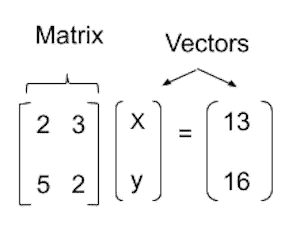

向量和矩阵是简洁表示线性方程的方便符号。如果向量是一个列表，矩阵就是一个列表的列表。一个 **m** x **n** 矩阵是一个由 m**行和 n**列组成的矩形数组。向量也是矩阵，但只有一行或一列。有一些方法可以求解上面的表达式，并确定 x 和 y 的值，我们在这里就不深究了。在上面的例子中要理解的概念是，等式左边的向量被矩阵变换，以给出等式右边的向量。****

**特殊矩阵**

我们已经看到，矩阵是对向量或其他矩阵执行运算的 2D 数列。线性代数中定义了各种具有特殊性质的矩阵，这有助于简化这些运算。当你在机器学习应用中一次又一次地遇到这些特殊矩阵时，你就会意识到它们的重要性。让我们介绍几个与 PCA 相关的应用程序(以及其他几个机器学习应用程序)。

***方阵***

当行数等于列数时，矩阵是正方形的。简单？

Square matrices

***对角矩阵***

矩阵的主对角线是从左上到右下的。如果一个矩阵的所有非对角元素都为 0，则该矩阵是对角矩阵。非零条目只出现在主对角线上。主对角线可以有也可以没有零。

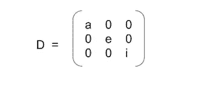

Diagonal matrix

***单位矩阵***

单位矩阵是一种特殊的方阵。当单位矩阵与向量相乘时，它对向量没有任何作用。这相当于将一个标量数乘以 1(例如，5 x 1 = 5)。类似地，将向量乘以单位矩阵没有任何作用。听起来很蹩脚，但它让一些操作变得简单多了。单位矩阵通常表示为 I。

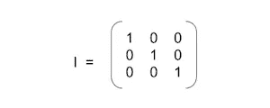

Identity matrix

***逆矩阵***

标量数 5 的倒数是 1/5 或 5^-1.逆矩阵是应用于矩阵的相同概念。将矩阵 a 与其逆矩阵 A^-1 相乘得到单位矩阵(对于矩阵来说类似于 1)，这是线性代数运算中广泛使用的概念。

Inverse Matrix operation

***转置操作***

对矩阵应用转置操作就是将矩阵的所有行都变成列，反之亦然。矩阵 a 的转置由 A^T.表示

Matrix Transpose

***正交和标准正交矩阵***

正交矩阵是一种方阵，其列和行是正交单位向量，即垂直且大小为 1。定理 1: ***若*** ***A 是正交矩阵，其逆矩阵等于转置矩阵即 A^T = A^-1***

***对称矩阵***

对称矩阵是特殊的方阵。矩阵 a 是对称的，如果它等于它的转置 A^T.。对称轴总是对称矩阵的主对角线。定理 2: ***若 a 是任意矩阵，则(A^T)A 和 A(A^T)是对称的。***

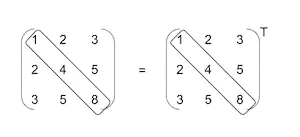

Symmetric matrix

你可能不需要记住不同的矩阵类型或定理。最好将此保存为备忘单，因为您会经常遇到它们。

**基础变更**

考虑二维空间 R 中的向量 ***r*** 。空间 R 可以由任意一组正交的单位长度向量 e1 和 e2 来定义。

Vector ***r*** in R² space

现在来看相对于坐标 e1 和 e2 的矢量 ***r*** ，可以表示如下:

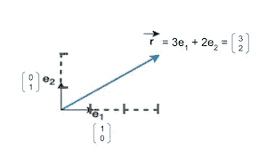

Vector ***r*** defined with basis e

我们最初将矢量 e1 和 e2 表示为一组“任意的”矢量。按照惯例，e1 和 e2 形成标准坐标集，因为它们具有单位长度并且彼此正交。当向量 ***r*** 相对于一组向量 e 或*基* e 来描述时，可以表示为 ***r*** e(用基 e 读向量 r)。然而，相同的向量 ***r*** 仍然可以相对于另一组坐标来描述，例如 b1 和 b2。在这个新的坐标系中，向量 ***r*** b(以 b 为基读取向量 r)的编号会不同；在下图中用[x，y]表示。图中的矢量 b1 和 b2 是相对于标准坐标或*基* e 来描述的。注意，矢量 b1 和 b2 不必彼此正交(在该特定示例中，它们是正交的)。

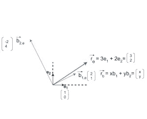

Vector ***r*** with basis e and basis b

我们如何确定 ***r*** b 中的数字？

因为我们知道了新坐标集合 b 相对于基 e 的向量，我们就有了将任意向量从基 b 变换到基 e 的变换矩阵，让我们称这个变换矩阵为 b。

因此，要确定基 B 中向量 ***r*** 的个数，我们现在要做的就是将矩阵 B 的逆乘以基 e 中的向量 ***r***

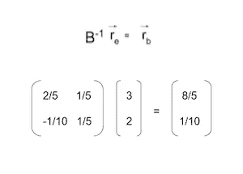

我没有进入计算的细节，因为它是微不足道的。

这里我们需要注意的是，向量并不依赖于最初用来描述它的坐标轴。我们可以用一组新的坐标轴或基向量来重新描述它。这是线性代数中的一个重要概念。它允许我们移动向量或数据项的基础，从而移动向量中的数字。

让我们更进一步。你想在向量 ***r*** b 上应用一个用基 e 描述的变换矩阵 R(向量 R 用基 b)。由于我们不知道基 b 中的变换矩阵 R，我们将首先将其应用于向量 ***r*** e，然后将其变换回基 b

第一步:将矢量 ***r*** b 的基改为 ***r*** e

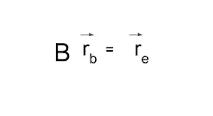

步骤 2:应用变换矩阵 R

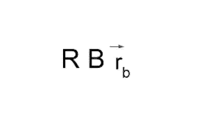

步骤 3:转换回基础 b

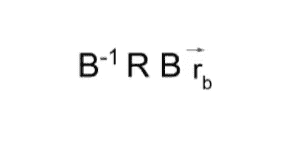

综上所述，如果你想把一组坐标中描述的变换矩阵(e 基中的矩阵 R)应用到另一组坐标中描述的向量(b 基中的向量 ***r*** )上，这是线性代数中你会遇到相当多的情况；可以用 B(逆)和 B 把 R 包起来。

这可能有点难以理解，但它是线性代数中非常重要的概念，值得投入精力。

**特征向量和特征值**

“eigen”这个词来源于德语，意思是“特有的”。它帮助我们识别某样东西的特性。到目前为止，我们一直在研究一个向量在应用变换矩阵时是如何变化的。现在让我们试着想象一个变换矩阵是如何影响整个向量空间的。考虑由正方形突出显示的 R 的示例向量子空间。为了便于理解，我在这个空间中突出了三个向量(红色、绿色和蓝色)。

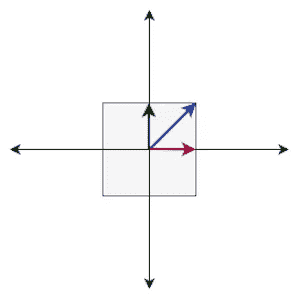

让我们应用变换矩阵 T，将这个正方形子空间放大到矩形。

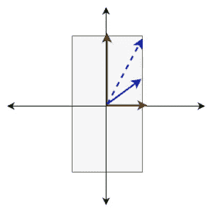

注意一些向量在其跨度内保持不变，而另一些则不然。红色的水平向量指向相同的方向，大小不变。垂直的绿色向量指向相同的方向，但是其大小增加了 2 倍。对角线上的蓝色向量指向其他方向，其大小也有所增加。事实上，除了水平和垂直向量之外。我们子空间中的所有向量都通过应用这种垂直缩放的变换而改变了。

因此，水平和垂直向量是特殊的，并且是该特定变换矩阵 T 的“特征”,并且被称为变换矩阵 T 的“特征向量”。此外，水平向量的幅度保持不变，这意味着它具有 1 的相应“特征值”。垂直向量的特征值是 2，因为它在变换后大小加倍。注意，虽然在这个特定的例子中不适用，但是在变换时方向翻转的向量；但是保持在相同跨度中的向量也称为特征向量。您只需将负号(-)应用到相关的特征值上。

我们通过几何表示看到的特征向量和特征值的概念可以用代数表示如下，

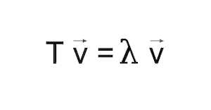

其中，向量 ***v*** 是与变换矩阵 t 相关联的特征向量。它改变标量λ，该标量λ是与向量 ***v*** 相关联的特征值。

所以，我们已经知道，特征向量是在变换后不会改变太多的向量。它们可能被缩放或压缩，指向相同的方向或被颠倒；但是它们总是保持在相同的跨度内。特征向量是特定变换矩阵的特征，它们之所以重要，是因为它们是有趣的基向量或坐标，我们很快就会看到。

**改变到特征基**

考虑这样一个场景，你必须将一个 3×3 的变换矩阵 T 应用到一个向量 x 上，然后反复应用 n 次，其中 n = 1 百万。

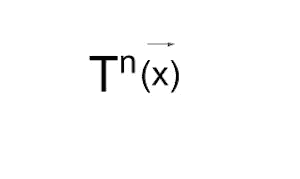

在一些实际应用中，您可能需要执行更大规模的矩阵乘法，这使得这些任务的计算量非常大。然而，这个问题有一个明显的例外，那就是当 T 是一个对角矩阵时。对角矩阵是只在从左上到右下的对角线上有非零元素的矩阵。将一个对角矩阵乘以 n 次等于将对角元素提升 n 倍！

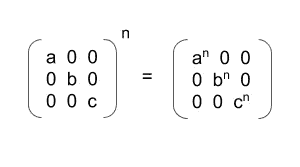

Raising a Diagonal matrix to a power of n

如果矩阵 T 不是对角的呢？这就是我们到目前为止所学的变化基和特征向量的概念可以应用到现实世界场景中的地方。让我们在这里重温一下我们的问题。我们想对一个向量应用一个变换矩阵 T n 次，这需要将 T 乘以自身 n 次或者将 T 提升到 n 次幂，我们这个问题的一个简单而优雅的解决方案是将基改为特征基；使用特征转换矩阵。如果矩阵 C 的列是矩阵 T 的线性无关特征向量，我们可以应用矩阵 C(逆)化为特征基。这将我们带到一个世界，其中矩阵 T 由对角矩阵表示，让我们称之为 D。矩阵 D 中的对角线由与相应的特征向量相关联的特征值组成。现在，应用该变换 n 次只是纯粹的缩放，或者有效地将主对角线上的特征值提升到 n 次幂，从而使计算过程更加高效。我们现在要做的就是把基础变回原来的坐标，瞧！我们有矩阵 T 的 n 次方。

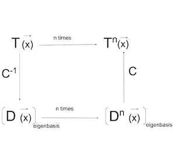

Diagonalization of a matrix

这里的关键信息是，如果一个矩阵可以通过基到特征基的变换而对角化，那么它就是可对角化的矩阵。

**谱定理**

到目前为止，我们所学的一切都带我们到了谱定理。

设 a 是实数的 m×n 矩阵，A^T 是它的转置矩阵。

**定理 3** :若 a 对称(意为 A^T = A)，则 a 正交可对角化，且只有实特征值。换句话说，存在实数λ1，λ2。。。λn(特征值)和正交的非零实向量 ***v*** 1， ***v*** 2，… ***v*** n(特征向量)使得对于每个 i = 1，2，…，n:

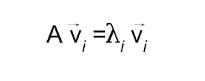

这就是谱定理，线性代数中最重要最有力的定理之一。你可能已经注意到了，它受到一个事实的限制，即它只适用于对称矩阵。

但是，如果你回忆一下定理 2(在对称矩阵一节下陈述): ***如果 a 是任意矩阵，那么(A^T)A 和 A(A^T)是对称的。*** 这暗示着谱定理可以应用于矩阵(A^T)A 和 A(A^T).谱定理是主成分分析的核心；这可能是它最重要的应用之一。

就是这样！你已经在线性代数方面打下了坚实的基础，并且知道足够的数学知识来理解 PCA 的数学。恐怕这是一个令人精疲力尽的帖子，但是你在这里学到的概念不仅会帮助你解开 PCA 但是数据科学中的其他一些应用。

做得好，请继续关注本系列的 [post3](/principal-component-analysis-math-and-intution-post-3-35ea8d2301b3) ，在这里我们将应用到目前为止学到的所有概念，并了解 PCA 是如何工作的。

参考

1.  [机器学习数学——线性代数](https://www.coursera.org/learn/linear-algebra-machine-learning)
2.  [线性代数](https://www.khanacademy.org/math/linear-algebra)
3.  [线性代数主成分分析](http://www.math.union.edu/~jaureguj/PCA.pdf)