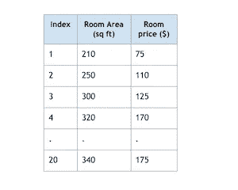
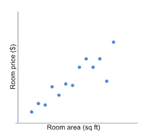
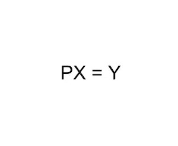
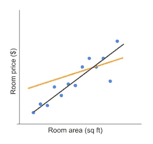
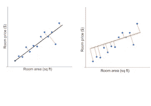
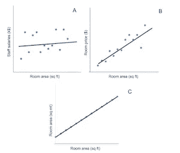
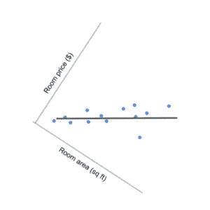
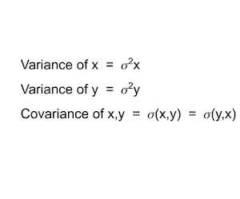
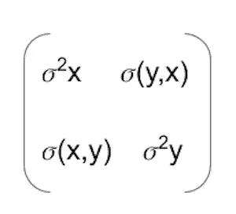
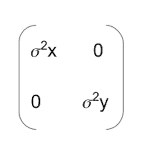

# 主成分分析—数学和直觉(后 3)

> 原文：<https://towardsdatascience.com/principal-component-analysis-math-and-intution-post-3-35ea8d2301b3?source=collection_archive---------16----------------------->

正如所承诺的，这是第三篇也是最后一篇关于主成分分析——数学和直觉的文章。在 [Post 1](/principal-component-analysis-math-and-intuition-post-1-d44bf32844f3) 中，我们用一个真实世界的例子简要介绍了 PCA，并掌握了直觉。在[帖子 2](/principal-component-analysis-math-and-intuition-post-2-1849090e6b7a) 中，我们学习了线性代数中与 PCA 相关的一些最重要的概念，或许还有各种其他数据科学应用。完成所有艰苦的工作后，现在是时候使用我们坚实的数学框架，将这些点连接起来，以真正理解 PCA 是如何以及为什么工作的。

PCA 是一种降维技术。它简化了复杂的数据集，使其在计算上可行。不涉及特征消除；相反，PCA 的工作原理是从原始数据集中的所有要素中提取有效信息，并创建较少数量的新要素。简而言之，如果你有一个 n 维(n 个特征)的数据集，应用主成分分析将它减少到一个 k 维特征空间，其中 k < n.

Let us use an example here. You have a dataset on hotel rooms listing the room areas and respective prices.

The 2-dimensional feature space can be plot as shown below.

The goal is to reduce the 2 dimensions that are represented as x-axis and y-axis respectively, into one.

Note that I have chosen a 2D dataset because it is easy to visualise. In a real world scenario, you may have 1000s or more features and therefore the need for dimensionality reduction. Also, please do not confuse the above plot with linear regression, because although it looks similar it is an entirely different concept. There is no prediction going on here.

Coming back to PCA, we would like to simplify our original dataset which is described on a 2D basis. Recall the concept of *基变化*，这是我们在[帖子 2](/principal-component-analysis-math-and-intuition-post-2-1849090e6b7a) 中遇到的。我们需要问的问题是，

> 有没有一个基是旧基的线性组合，能最好地描述数据？

在数学上，假设 X 和 Y 是通过变换 p 相关的 mxn 个矩阵。矩阵 X 是具有 n 个特征的原始数据集，Y 是具有 n 个*新特征*或*主成分*的新数据集。

*   p 是将 X 转换成 y 的矩阵。
*   X 列为*旧基础*或原始特征。
*   变换矩阵 P 的行是用于表示 x 的列的一组*新基向量*
*   矩阵 Y 是 X 的重新表示，它的列是新特征或*主成分。*

现在我们有了目标的数学表示，我们想知道转换矩阵 P 的理想选择是什么？这取决于我们希望矩阵 Y 的特征表现出什么性质。这个问题将在后面的 ***方差*** 和 ***冗余*** 章节中回答。让我们单独处理它们。

***投影误差和方差***

我们的示例数据集的 2D 特征空间再次显示如下，

我们希望在一维空间中重新表达这些数据，或者将两个特征压缩成一个。因此，我们需要做的就是画一条穿过数据云的线，并将每个数据点投影到这条线上。在我们能画出的所有可能的线中，我用黑色和橙色代表了两条线。

你认为哪条线最能代表数据？我希望您选择黑线，因为它更接近大多数数据点(见下图)。红色记号与黑色/橙色线相交的点是相应蓝色数据点的投影。请注意将每个数据点分别连接到黑线和橙线的投影距离或红色标记的大小。黑线使数据点的累积投影距离最小化。换句话说，当我们将数据从 2D 转移到 1D 时，黑色矢量可以最小化投影误差或信息损失。

应该注意的是，数据的方差或“分布”沿着黑线是最大的。如果这种解释不是很明显，下面的动画可能会有所帮助。它显示了如何同时达到“最大方差”和“最小投影误差”，即沿着数据云两侧的洋红色刻度。

Courtesy : [Making sense of principal component analysis, eigenvectors & eigenvalues](https://stats.stackexchange.com/questions/2691/making-sense-of-principal-component-analysis-eigenvectors-eigenvalues)

因此，矩阵 Y 的期望属性是新特征或其第一主分量应该沿着最小化投影误差的线，同时最大化投影数据的方差。

***冗余***

PCA 利用数据集中固有的冗余来降低维数。考虑以下 2D 特征空间的图，其覆盖了数据冗余的可能范围。

图 A 绘制了 ***员工工资*** 与 ***房间面积(平方英尺)*** 的关系图，两者互不相关。图 A 中的两个维度没有表现出任何冗余，不能通过 PCA 进行降维。在极端情况下，图 C 是以平方米为单位的 ***房间面积*** 对以平方英尺为单位的 ***房间面积*** 的曲线图。这两个特征之间完全相关，因此在这种情况下，消除其中一个是安全的，因为它们本质上提供了相同的信息。

PCA 的作用得到认可的理想场景是图 B，该图与我们之前的示例相同， ***房间价格($)*** 与 ***房间面积(平方英尺)。*** 图 B 显示了两个特征之间的一些相关性，表明数据可以用一个新的特征来重新表达，这个新的特征是旧特征的线性组合。因此，如前所示，当我们通过将每个数据点投影到黑线上来将我们的基础从 2D 改变到 1D 时，我们也消除了特征冗余。如图 B 所示，沿着穿过数据云的黑线，数据点变得不相关。下图显示了同样的情况，

*方差*是一个变量的数据分布，而*协方差*是两个变量如何一起变化的度量。如果我们将房间面积(平方英尺)和房间价格(美元)分别表示为变量 x 和 y，

并且协方差矩阵可以计算如下:

注意，我没有深入方差和协方差的数学计算的细节，因为它是微不足道的。要说明的是，协方差矩阵总是对称的，主对角线上的所有元素都是每个变量的方差。所有其他条目都是每对变量的协方差。

回到我们的房间面积(平方英尺)对房间价格(美元)的例子，一旦我们改变基础，从 2D 到 1D 减少维度；这些特征变得彼此不相关，或者换句话说，协方差为 0。因此，协方差矩阵是对角矩阵。

总的来说，我们希望矩阵 Y 的特征/主成分展现的特性是:

*   主成分应该沿着使投影数据的方差最大化的方向。
*   矩阵 Y 的特征应该彼此不相关，*即*其协方差矩阵应该是对角矩阵。

让我们重温一下我们先前推导出的 PCA 目标的数学表示，

x 是具有 n 个要素的原始数据集。p 是应用于矩阵 x 的变换矩阵。矩阵 Y 是具有 n 个新特征/主成分的新数据集。我们已经建立了矩阵 Y 中特征的性质，目标是减少冗余或者更准确地说矩阵 Y 的协方差矩阵(姑且称之为 S *y* )是对角的。因此，在我们的方程 PX = Y 中，矩阵 P 的选择应该使得 S *y* 对角化。

我们知道一个对称矩阵通过它的标准正交特征向量矩阵对角化。回忆一下我们在[帖子 2](/principal-component-analysis-math-and-intuition-post-2-1849090e6b7a) 中学到的线性代数的谱定理，

> 如果 A 是对称的，那么 A 是正交可对角化的，并且只有实特征值。

这确实是我们拼图的最后一块。理论上，PCA 假设所有的基向量，即矩阵 P 的行是 X 的协方差矩阵的标准正交特征向量。将 P 变换到 X 产生矩阵 Y，使得 S *y* 对角化。其次，它假设方差最大的方向是最重要的或“最主要的”。在这种情况下，矩阵 P 的行根据其相应的方差或特征值进行排序。通过消除矩阵 P 中具有低特征值的行，方差低的方向被忽略。这使得有效地减少维数而不显著损失信息成为可能。

参考

1.  [关于主成分分析的教程](https://arxiv.org/abs/1404.1100) s，对于有兴趣进一步阅读该主题的人来说，这是一个极好的教程。
2.  如果没有这个无可否认的关于栈交换的令人敬畏的答案[理解主成分分析，特征向量&特征值](https://stats.stackexchange.com/questions/2691/making-sense-of-principal-component-analysis-eigenvectors-eigenvalues)，那么参考文献列表可能是不完整的
3.  [主成分分析。](https://www.jeremyjordan.me/principal-components-analysis/)