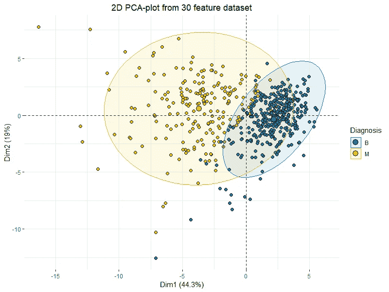
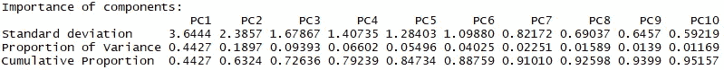
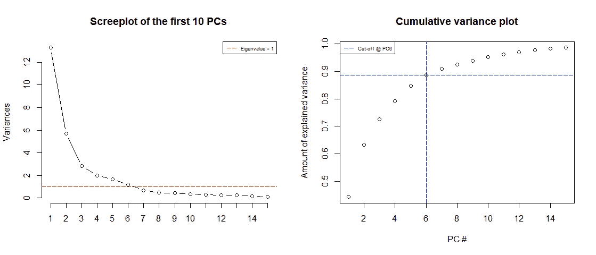
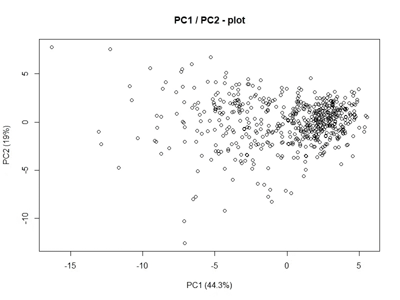

# 主成分分析(PCA) 101，使用 R

> 原文：<https://towardsdatascience.com/principal-component-analysis-pca-101-using-r-361f4c53a9ff?source=collection_archive---------0----------------------->

一次提高一个维度的可预测性和分类能力！使用 2D 图“可视化”30 个维度！



Basic 2D PCA-plot showing clustering of “Benign” and “Malignant” tumors across 30 features.

如果你喜欢这篇文章并想看更多，请务必关注我的简介 ！

# 设置

对于本文，我们将使用来自 [*UCI 机器学习报告*](http://archive.ics.uci.edu/ml/datasets/Breast+Cancer+Wisconsin+%28Diagnostic%29) 的乳腺癌威斯康星州数据集作为我们的数据。如果您想继续学习，请继续为自己加载:

```
**wdbc** <- read.csv("wdbc.csv", header = F)**features** <- c("radius", "texture", "perimeter", "area", "smoothness", "compactness", "concavity", "concave_points", "symmetry", "fractal_dimension")names(**wdbc**) <- c("**id**", "**diagnosis**", paste0(**features**,"**_mean**"), paste0(**features**,"**_se**"), paste0(**features**,"**_worst**"))
```

上面的代码将简单地加载数据并命名所有 32 个变量。 **ID** 、**诊断**和十(30)个不同的特征。来自 UCI:

****表示*** *，* ***标准误差*** *，* ***最差*** *或者最大(三个最大值的平均值)这些特征被计算出来，从而得到* ***30 个特征*** *。例如，字段 3 是平均半径，字段 13 是半径 SE，字段 23 是最差半径。”**

# *为什么是 PCA？*

*对，现在我们已经加载了数据，发现自己有 30 个变量(因此排除了我们的响应“诊断”和不相关的 ID 变量)。*

*现在你们中的一些人可能会说“30 个变量太多了”，一些人可能会说“呸..才 30？我和成千上万的人合作过！!"但是请放心，这同样适用于任何一种场景..！*

**

*使用 PCA 有几个很好的理由。本文开头的图是如何使用 PCA 绘制多维数据的一个很好的例子，我们实际上通过使用那些**两个主成分**捕获了整个数据集中的**63.3%**(dim 1 44.3%+dim 2 19%)的方差，当考虑到原始数据由 **30 个特征**组成，而这些特征不可能以任何有意义的方式绘制时，这是非常好的。*

*一个非常重要的考虑是承认**我们从未在我们的 PCA 图中指定反应变量**或任何其他东西来指示肿瘤是“*良性*还是“*恶性*”。事实证明，当我们试图使用 PCA 的线性组合来描述数据中的差异时，我们发现“*良性*”和“*恶性*”肿瘤之间有一些非常明显的聚类和分离！这为基于我们的特征开发分类模型提供了一个很好的案例！*

*PCA 的另一个主要“特性”(没有双关语的意思)是，它实际上可以直接提高模型的性能，请阅读这篇伟大的文章以了解更多信息:*

*[](/dimensionality-reduction-does-pca-really-improve-classification-outcome-6e9ba21f0a32) [## 降维——主成分分析真的能改善分类结果吗？

### 介绍

towardsdatascience.com](/dimensionality-reduction-does-pca-really-improve-classification-outcome-6e9ba21f0a32)* 

# *什么是 PCA，它是如何工作的？*

*让我们立即解决一些问题，PCA 的主要目的是**而不是**作为一种功能移除的方式！主成分分析可以减少维度，但是**它不会减少数据中的特征/变量的数量。**这意味着您可能会发现，仅使用 3 个主成分就可以解释 1000 个特征数据集中 99%的差异，但您仍然需要这 1000 个特征来构建这 3 个主成分，这也意味着在预测未来数据的情况下，您仍然需要新观测数据中的 1000 个特征来构建相应的主成分。*

## *好了，够了，它是怎么工作的？*

*由于这纯粹是介绍性的，我将跳过数学，给你一个 PCA 工作的快速纲要:*

*   ***标准化数据**(中心和刻度)。*
*   ***从协方差矩阵或相关矩阵**计算特征向量和特征值 **(也可以使用奇异向量分解)。***
*   ***对特征值进行降序排序，选择 *K 个*最大特征向量**(其中 *K* 为新特征子空间 k ≤ d 的期望维数)。*
*   ***从选择的 *K* 个特征向量中构造投影矩阵 W** **。***
*   ***通过 W**变换原始数据集 X，得到一个 *K* 维特征子空间 y*

*如果你没有上过代数课，这听起来可能有点复杂，但它的要点是将我们的数据从它的初始状态 **X** 转换到一个具有*维度的子空间 **Y** ，其中 ***K*** 通常是*——小于 **X** 的原始维度。幸运的是，使用 R 很容易做到这一点！***

# **肿瘤数据的主成分分析**

**现在我们对 PCA 的工作原理有了一点了解，这就足够了。让我们实际尝试一下:**

```
**wdbc.pr <- prcomp(wdbc[c(3:32)], center = TRUE, scale = TRUE)
summary(wdbc.pr)**
```

**这是不言自明的，' *prcomp* '函数对我们提供的数据运行 PCA，在我们的例子中，这是'*wdbc[c(3:32)]【T47]'数据，不包括 ID 和诊断变量，然后我们告诉 R 对我们的数据进行居中和缩放(因此**标准化**数据)。最后我们呼吁总结一下:***

****

**The values of the first 10 principal components**

**回想一下，PCA 的一个特性是，我们的分量根据它们的标准差(**特征值**)从最大到最小排序。所以让我们来理解这些:**

*   *****标准差:*** 在我们的例子中，这只是**特征值**，因为数据已经被居中和缩放(**标准化**)**
*   *****差异比例*** :该组件在数据中所占的差异量，即。 **PC1** 仅在数据中就占 **>总方差**的 44%！**
*   ***累计比例:简单来说就是解释方差的累计量，即。如果我们使用**前 10 个成分**，我们将能够解释数据中总方差的 **> 95%。*****

***好的，那么我们需要多少组件？我们显然希望能够解释尽可能多的差异，但要做到这一点，我们需要所有 30 个组件，同时我们希望减少维度的数量，所以我们肯定希望少于 30 个！***

***由于我们对数据进行了标准化，现在我们有了每台电脑的相应特征值，我们实际上可以用它们来为我们画一个边界。因为一个**特征值< 1** 将意味着该分量实际上解释了少于单个解释变量，所以我们想要丢弃这些。如果我们的数据非常适合 **PCA** ，我们应该能够丢弃这些成分，同时保留至少**70–80%的累积方差**。让我们绘制并观察:***

```
***screeplot(wdbc.pr, type = "l", npcs = 15, main = "Screeplot of the first 10 PCs")
abline(h = 1, col="red", lty=5)
legend("topright", legend=c("Eigenvalue = 1"),
       col=c("red"), lty=5, cex=0.6)cumpro <- cumsum(wdbc.pr$sdev^2 / sum(wdbc.pr$sdev^2))
plot(cumpro[0:15], xlab = "PC #", ylab = "Amount of explained variance", main = "Cumulative variance plot")
abline(v = 6, col="blue", lty=5)
abline(h = 0.88759, col="blue", lty=5)
legend("topleft", legend=c("Cut-off @ PC6"),
       col=c("blue"), lty=5, cex=0.6)***
```

******

*****Screeplot** of the Eigenvalues of the first 15 PCs (*left*) & **Cumulative variance plot** (right)***

***我们注意到**的前 6 个分量**有一个**特征值> 1** 并且解释了几乎 **90%的方差**，这太棒了！我们可以有效地**将维度从 30 个减少到 6 个**，同时只“损失”大约 10%的方差！***

***我们还注意到，仅用前两个成分，我们实际上就可以解释超过 60%的方差。让我们试着画出这些:***

```
***plot(wdbc.pr$x[,1],wdbc.pr$x[,2], xlab="PC1 (44.3%)", ylab = "PC2 (19%)", main = "PC1 / PC2 - plot")***
```

******

***好吧，这真的不太能说明问题，但是考虑一下，这代表了 30 维数据集中 60%以上的方差**。但是我们从中看到了什么？在**的上/中右有一些**群集**正在进行。让我们也考虑一下这个分析的实际目标是什么。我们想解释一下**恶性**和**良性**肿瘤的区别。让我们将**响应变量** ( *诊断*)添加到图表中，看看我们是否能更好地理解它:*******

```
**library("factoextra")
fviz_pca_ind(wdbc.pr, geom.ind = "point", pointshape = 21, 
             pointsize = 2, 
             fill.ind = wdbc$diagnosis, 
             col.ind = "black", 
             palette = "jco", 
             addEllipses = TRUE,
             label = "var",
             col.var = "black",
             repel = TRUE,
             legend.title = "Diagnosis") +
  ggtitle("2D PCA-plot from 30 feature dataset") +
  theme(plot.title = element_text(hjust = 0.5))**
```

****

**这基本上是完全相同的图，带有一些花哨的椭圆和颜色，对应于受试者的诊断，现在我们看到了**PCA**的美妙之处。仅通过前两个组成部分，我们可以清楚地看到良性肿瘤**和恶性肿瘤**之间的一些区别。这清楚地表明数据非常适合某种分类模型**(如**判别分析**)。****

# **下一步是什么？**

**我们的下一个直接目标是使用前 6 个主要成分构建某种模型来预测肿瘤是良性还是恶性，然后将其与使用原始 30 个变量的模型进行比较。**

**我们将在下一篇文章中讨论这个问题:**

**[](/linear-discriminant-analysis-lda-101-using-r-6a97217a55a6) [## 线性判别分析(LDA) 101，使用 R

### 决策边界、分离、分类等等。让我们潜入 LDA！

towardsdatascience.com](/linear-discriminant-analysis-lda-101-using-r-6a97217a55a6)** 

# **结束语**

**如果你想看和了解更多，一定要关注我的 [**媒体**](https://medium.com/@peter.nistrup) 🔍**[**碎碎念**](https://twitter.com/peternistrup) 🐦****

****[](https://medium.com/@peter.nistrup) [## 彼得·尼斯特鲁普-中等

### 阅读彼得·尼斯特拉普在媒介上的作品。数据科学、统计和人工智能...推特:@PeterNistrup，LinkedIn…

medium.com](https://medium.com/@peter.nistrup)**** 

# ****其他资源:****

****[](https://stats.stackexchange.com/questions/2691/making-sense-of-principal-component-analysis-eigenvectors-eigenvalues) [## 理解主成分分析、特征向量和特征值

### 想象一下一次家庭聚餐，每个人都开始问你关于 PCA 的事情。首先你向你的…

stats.stackexchange.com](https://stats.stackexchange.com/questions/2691/making-sense-of-principal-component-analysis-eigenvectors-eigenvalues) [](/dive-into-pca-principal-component-analysis-with-python-43ded13ead21) [## 用 Python 理解 PCA(主成分分析)

### 陷入变量的海洋来分析你的数据？在决定选择哪些功能时感到迷茫，以便…

towardsdatascience.com](/dive-into-pca-principal-component-analysis-with-python-43ded13ead21) [](/a-one-stop-shop-for-principal-component-analysis-5582fb7e0a9c) [## 主成分分析的一站式商店

### 在我用于研究生统计理论课的教科书的开始，作者(乔治·卡塞拉和罗杰…

towardsdatascience.com](/a-one-stop-shop-for-principal-component-analysis-5582fb7e0a9c) [](/https-medium-com-abdullatif-h-dimensionality-reduction-for-dummies-part-1-a8c9ec7b7e79) [## 假人的降维第 1 部分:直觉

### 基于主成分分析和奇异值分解的维数约简。以简单、直观的方式解释。从大局到…

towardsdatascience.com](/https-medium-com-abdullatif-h-dimensionality-reduction-for-dummies-part-1-a8c9ec7b7e79)  [## 在 R | Kaggle 中使用 PCA + LDA 预测乳腺癌

### 编辑描述

www.kaggle.com](https://www.kaggle.com/shravank/predicting-breast-cancer-using-pca-lda-in-r) [](https://stats.stackexchange.com/questions/2592/how-to-project-a-new-vector-onto-pca-space) [## 如何将新向量投影到 PCA 空间？

### 感谢您为交叉验证提供答案！请务必回答问题。提供详细信息并分享…

stats.stackexchange.com](https://stats.stackexchange.com/questions/2592/how-to-project-a-new-vector-onto-pca-space) [](http://www.sthda.com/english/articles/31-principal-component-methods-in-r-practical-guide/112-pca-principal-component-analysis-essentials/) [## PCA -主成分分析要点

### 用于数据分析和可视化的统计工具

www.sthda.com](http://www.sthda.com/english/articles/31-principal-component-methods-in-r-practical-guide/112-pca-principal-component-analysis-essentials/)****